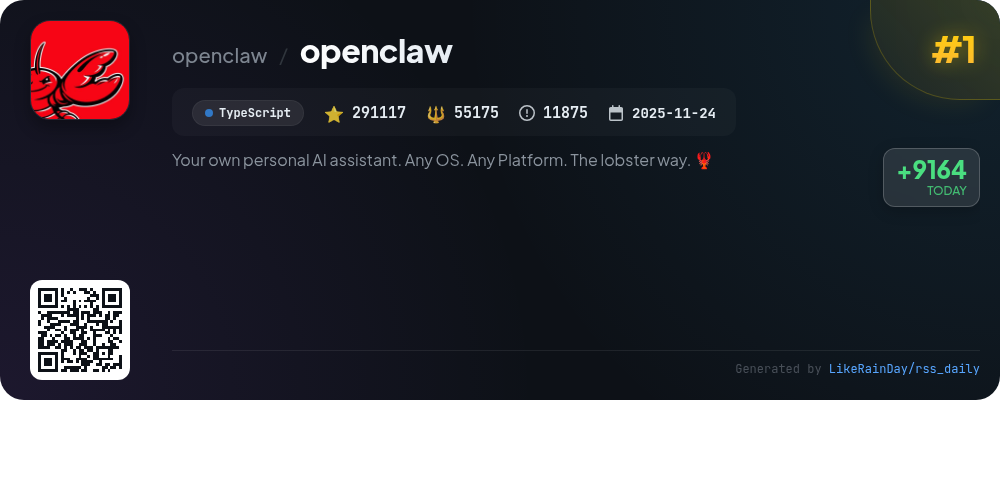
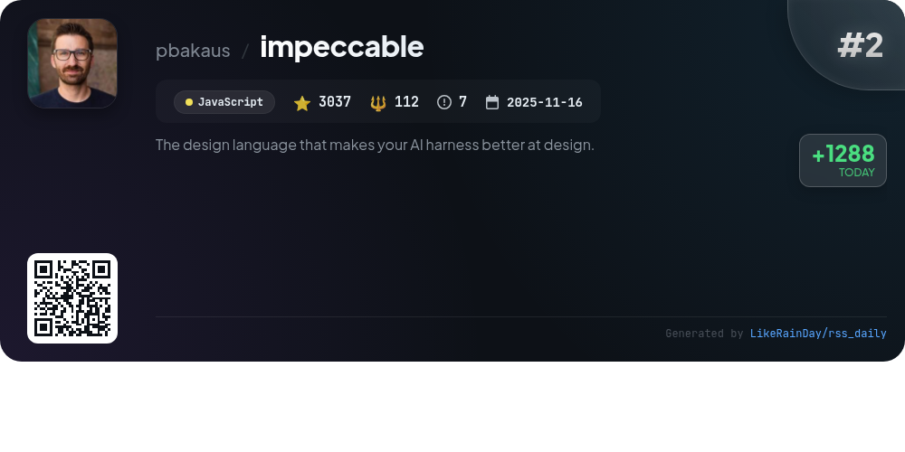
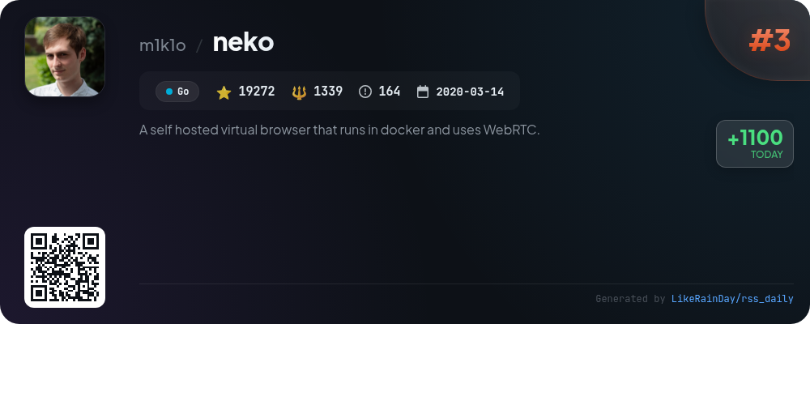
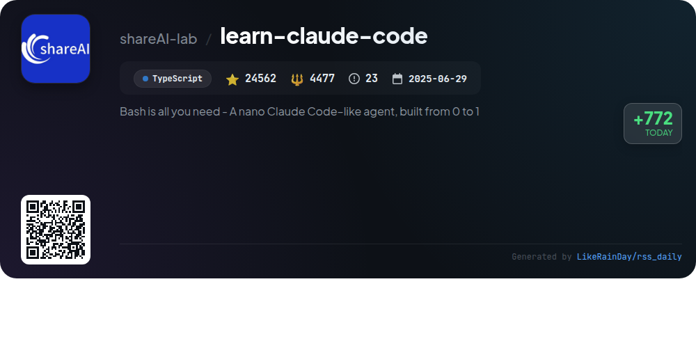
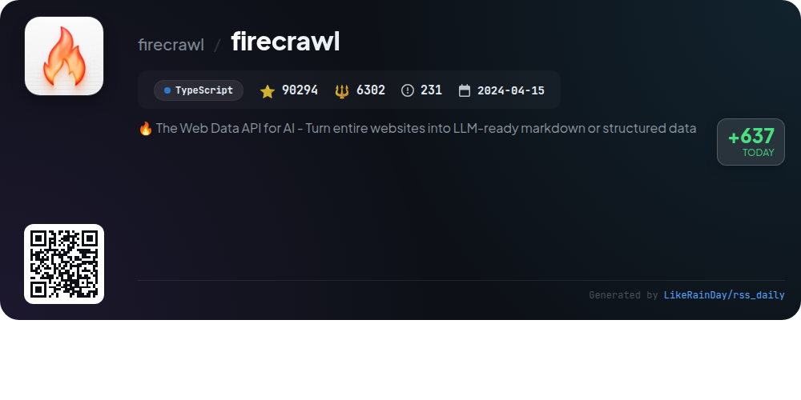
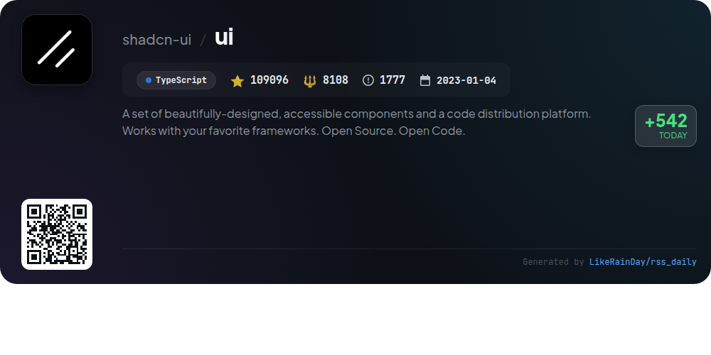
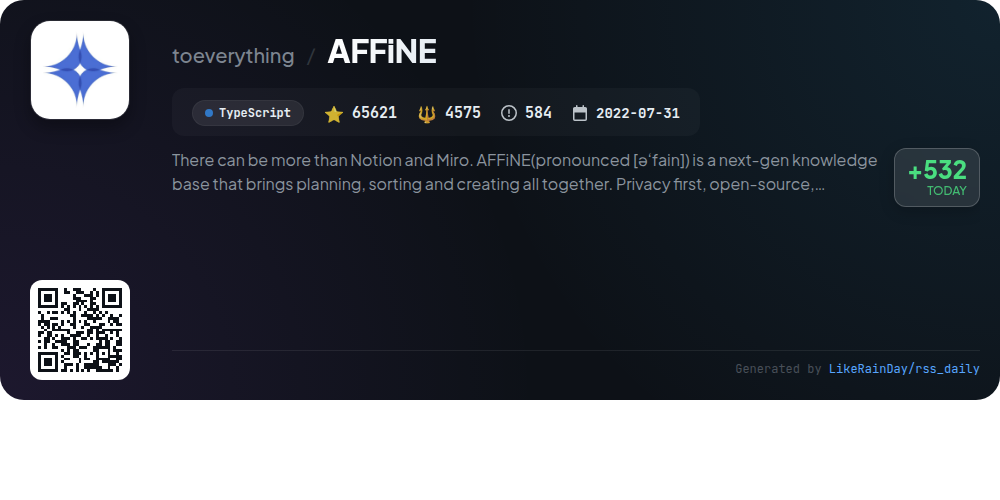
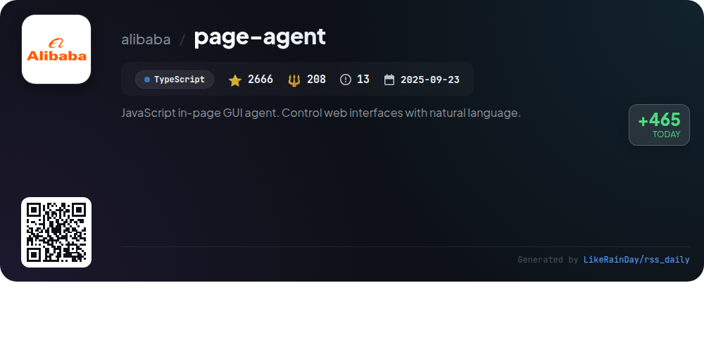

# 📊 🌟 GitHub Trending Daily - 2026-03-10

> > 📅 Daily Picks of GitHub Trending Repositories | Powered by Smart Algorithms

## 📋 Overview

**10** Projects | **636838** ⭐ | **83256** 🍴

**Top Languages:** `TypeScript` (6) · `JavaScript` (2) · `Go` (2)

**Updated:** 2026-03-10 02:37 UTC

**Categories:**

- 🌟 Daily Top 10 (10 items)

---

## 🌟 Daily Top 10

### 1. [openclaw](https://github.com/openclaw/openclaw)

> 🤖 **Why Recommend**  
> *OpenClaw is a personal AI assistant designed to run on any device, offering seamless integration with popular messaging platforms like WhatsApp, Telegram, Slack, and Discord. Key features include a local-first gateway for session control, multi-channel support, voice activation, and a live canvas for agent-driven interactions. The onboarding wizard simplifies setup across macOS, Linux, and Windows, while companion apps enhance functionality on mobile devices. With a focus on user privacy and security, OpenClaw provides a fast, responsive assistant experience tailored to individual needs.*

- ⭐ 291117 stars
- 💻 TypeScript
- 📅 Updated: 2026-03-10

### 2. [impeccable](https://github.com/pbakaus/impeccable)

> 🤖 **Why Recommend**  
> *Impeccable is a JavaScript design language tool that enhances AI-generated UI designs. With 3,037 stars, it features an advanced frontend-design skill comprising 7 domain-specific references and 17 steering commands to audit, critique, and optimize design elements. Impeccable also offers curated anti-patterns to help avoid common design pitfalls. Users can quickly start by downloading bundles from impeccable.style. It's compatible with tools like Cursor, Claude Code, Gemini CLI, and Codex CLI, making it a versatile solution for improving frontend design quality.*

- ⭐ 3037 stars
- 💻 JavaScript
- 📅 Updated: 2026-03-10

### 3. [neko](https://github.com/m1k1o/neko)

> 🤖 **Why Recommend**  
> *Neko is a self-hosted virtual browser that runs in Docker, utilizing WebRTC technology for secure and private internet access. With over 19,000 stars, it enables multiple users to collaborate in real-time, making it ideal for watch parties, interactive presentations, and shared browsing experiences. Neko supports various applications, including popular browsers and desktop environments, allowing for versatile use cases like personal workspaces and automated tasks. Its unique features include smooth video streaming, multi-participant control, and a zero-knowledge installation option, ensuring privacy and ease of use.*

- ⭐ 19272 stars
- 💻 Go
- 📅 Updated: 2026-03-10

### 4. [learn-claude-code](https://github.com/shareAI-lab/learn-claude-code)

> 🤖 **Why Recommend**  
> *Learn Claude Code is a TypeScript project designed to build a nano Claude Code-like agent from scratch. It features a minimal agent loop that integrates tool execution with messaging, progressing through 12 sessions that introduce mechanisms for planning, task management, and team collaboration. Key highlights include background task processing, subagent isolation, and a file-based task dependency system. The repository provides interactive visualizations and documentation in multiple languages, along with a web platform for enhanced learning. The project emphasizes practical implementation and is equipped with CLI and SDK options for embedding agent capabilities into applications.*

- ⭐ 24562 stars
- 💻 TypeScript
- 📅 Updated: 2026-03-10

### 5. [firecrawl](https://github.com/firecrawl/firecrawl)

> 🤖 **Why Recommend**  
> *Firecrawl is a powerful web data API designed to transform entire websites into LLM-ready markdown or structured data. Key features include exceptional reliability with over 80% coverage in benchmark tests, support for scraping dynamic content, batch processing for thousands of URLs, and customizable crawling options. It offers various output formats like markdown, HTML, and JSON, along with advanced actions such as click and scroll before scraping. Firecrawl also provides an AI agent for autonomous data gathering and integrates with popular platforms, making it versatile for developers and businesses.*

- ⭐ 90294 stars
- 💻 TypeScript
- 📅 Updated: 2026-03-10

### 6. [get-shit-done](https://github.com/gsd-build/get-shit-done)

> 🤖 **Why Recommend**  
> *Get Shit Done (GSD) is a lightweight meta-prompting and context engineering system designed for Claude Code, OpenCode, Gemini CLI, and Codex. With over 27,000 stars, GSD addresses context degradation by efficiently managing project workflows. Key features include streamlined project initialization, phase-based discussions, planning, execution in parallel waves, and automated verification. It enables users to build software with precision while ensuring clean Git histories and modular adaptability. GSD is trusted by engineers at major companies like Amazon and Google, simplifying spec-driven development without unnecessary complexities.*

- ⭐ 27106 stars
- 💻 JavaScript
- 📅 Updated: 2026-03-10

### 7. [ui](https://github.com/shadcn-ui/ui)

> 🤖 **Why Recommend**  
> *shadcn/ui is an open-source library offering a collection of beautifully designed, accessible components built with TypeScript. It allows users to customize, extend, and create their own component libraries, making it versatile for various frameworks. With over 109,000 stars, it emphasizes usability and aesthetics. Comprehensive documentation is available at ui.shadcn.com/docs, and contributions are welcomed per the contributing guide. The project is licensed under the MIT license, promoting collaboration and innovation in UI development.*

- ⭐ 109096 stars
- 💻 TypeScript
- 📅 Updated: 2026-03-10

### 8. [AFFiNE](https://github.com/toeverything/AFFiNE)

> 🤖 **Why Recommend**  
> *AFFiNE is an open-source, privacy-focused knowledge base that combines planning, sorting, and creativity into one platform. It offers a unique canvas for diverse content types, including text, sticky notes, and databases, enabling real-time collaboration. Users can leverage its multimodal AI for tasks like report writing and mind mapping, all while maintaining local data ownership. AFFiNE supports self-hosting and customization, making it a versatile alternative to Notion and Miro. With over 65,000 stars, it’s designed for creative minds seeking an innovative workspace.*

- ⭐ 65621 stars
- 💻 TypeScript
- 📅 Updated: 2026-03-10

### 9. [sub2api](https://github.com/Wei-Shaw/sub2api)

> 🤖 **Why Recommend**  
> *Sub2API is an open-source AI API gateway platform that simplifies subscription management for AI services like Claude, OpenAI, and Gemini. Key features include multi-account management, API key distribution, precise billing with token-level tracking, smart scheduling, concurrency control, and configurable rate limiting. The platform offers a user-friendly admin dashboard for monitoring and management. Built with Go, Vue, PostgreSQL, and Redis, Sub2API supports one-click installation and Docker deployment, making it efficient for developers seeking a unified solution for managing AI service quotas.*

- ⭐ 4067 stars
- 💻 Go
- 📅 Updated: 2026-03-10

### 10. [page-agent](https://github.com/alibaba/page-agent)

> 🤖 **Why Recommend**  
> *JavaScript in-page GUI agent. Control web interfaces with natural language.. popular project, actively maintained, recently updated*

- ⭐ 2666 stars
- 🍴 208 forks
- 💻 TypeScript
- 📅 Updated: 2026-03-10

---

## 📡 RSS Subscription

Subscribe via RSS to get daily trending updates:

- 🔔 [RSS XML] (../../daily-top.xml)
- 🔔 [Daily Report] (../../GITHUB_TODAY.md)
- 🔔 [Daily Top 10](../../daily-top.xml)

---

*⚡ Powered by Smart Trending Algorithm | Generated at 2026-03-10 02:37:00 UTC
