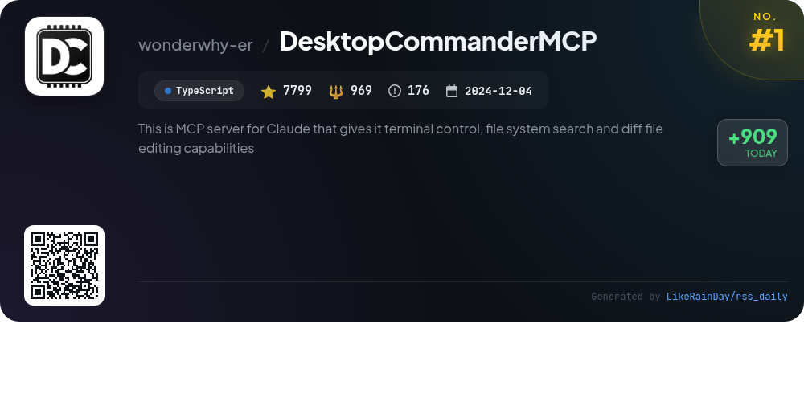
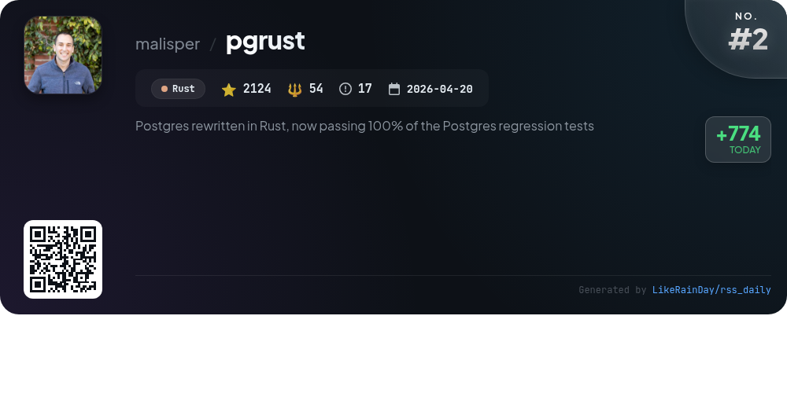
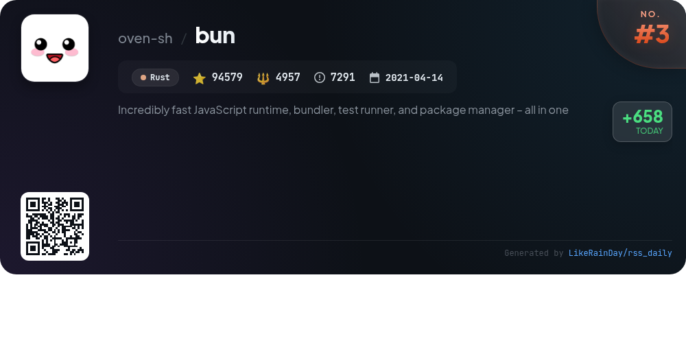
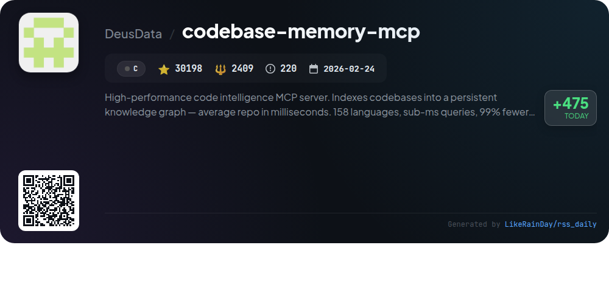
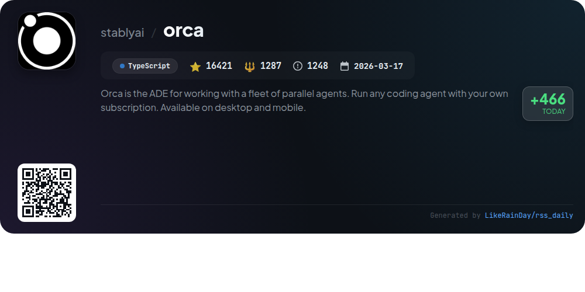
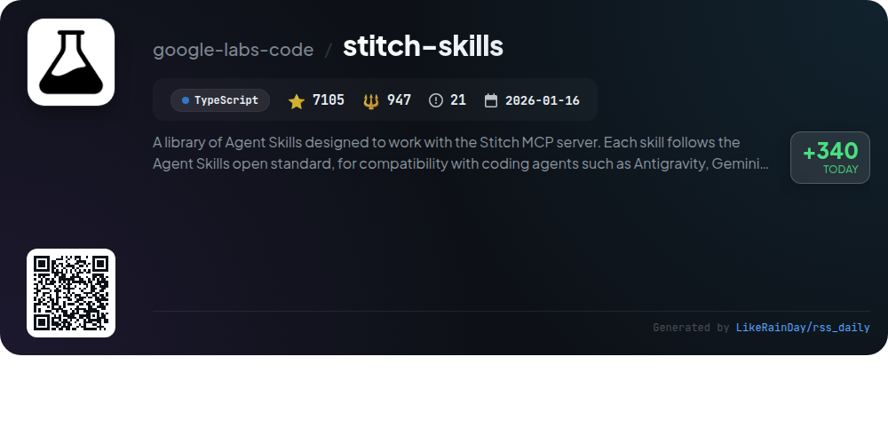
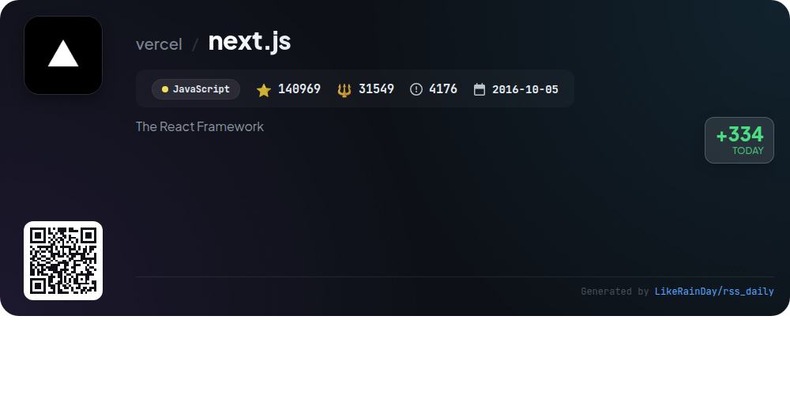

# 📊 🌟 GitHub Trending Daily - 2026-07-12

> > 📅 Daily Picks of GitHub Trending Repositories | Powered by Smart Algorithms

## 📋 Overview

**10** Projects | **607397** ⭐ | **82922** 🍴

**Top Languages:** `TypeScript` (3) · `JavaScript` (3) · `Rust` (2)

**Updated:** 2026-07-12 03:33 UTC

**Categories:**

- 🌟 Daily Top 10 (10 items)

---

## 🌟 Daily Top 10

### 1. [DesktopCommanderMCP](https://github.com/wonderwhy-er/DesktopCommanderMCP)

> 🤖 **Why Recommend**  
> *This is MCP server for Claude that gives it terminal control, file system search and diff file editing capabilities. popular project, actively maintained, recently updated*

- ⭐ 7799 stars
- 🍴 969 forks
- 💻 TypeScript
- 📅 Updated: 2026-07-12

### 2. [pgrust](https://github.com/malisper/pgrust)

> 🤖 **Why Recommend**  
> *Postgres rewritten in Rust, now passing 100% of the Postgres regression tests. popular project, recently updated*

- ⭐ 2124 stars
- 🍴 54 forks
- 💻 Rust
- 📅 Updated: 2026-07-12

### 3. [bun](https://github.com/oven-sh/bun)

> 🤖 **Why Recommend**  
> *Bun is an incredibly fast all-in-one JavaScript runtime, bundler, test runner, and package manager, designed as a drop-in replacement for Node.js. Built in Rust, it leverages JavaScriptCore for reduced startup times and memory usage. Key features include out-of-the-box support for TypeScript and JSX, a single command-line tool for running scripts, tests, and managing packages, and compatibility with existing Node.js projects. With over 94,000 stars on GitHub, Bun streamlines development workflows, ensuring efficiency and speed for JavaScript and TypeScript applications.*

- ⭐ 94579 stars
- 💻 Rust
- 📅 Updated: 2026-07-12

### 4. [codebase-memory-mcp](https://github.com/DeusData/codebase-memory-mcp)

> 🤖 **Why Recommend**  
> *High-performance code intelligence MCP server. Indexes codebases into a persistent knowledge graph — average repo in milliseconds. 158 languages, su. popular project, actively maintained, recently updated*

- ⭐ 30198 stars
- 🍴 2409 forks
- 💻 C
- 📅 Updated: 2026-07-12

### 5. [orca](https://github.com/stablyai/orca)

> 🤖 **Why Recommend**  
> *Orca is an advanced development environment for managing parallel agents, enabling users to run coding agents like Codex and ClaudeCode side-by-side. Key features include mobile monitoring, parallel worktrees for comparing agent outputs, terminal splits, and a design mode for seamless UI interaction. Users can also integrate GitHub and Linear tasks, annotate AI-generated diffs, and utilize a robust CLI for scripting workflows. Available on macOS, Windows, and Linux, Orca empowers developers to optimize their coding processes efficiently. Join the community for support and updates.*

- ⭐ 16421 stars
- 💻 TypeScript
- 📅 Updated: 2026-07-12

### 6. [tailscale](https://github.com/tailscale/tailscale)

> 🤖 **Why Recommend**  
> *Tailscale is an open-source project that simplifies the creation of private WireGuard® networks with built-in two-factor authentication (2FA). It features the `tailscaled` daemon and the `tailscale` CLI tool, compatible with Linux, Windows, macOS, and BSD systems. Tailscale allows seamless networking across devices, offering packages for various platforms. The project encourages contributions and provides detailed build instructions. With over 33,000 stars, Tailscale is recognized for its user-friendly approach to secure networking. For more information, visit tailscale.com.*

- ⭐ 33841 stars
- 💻 Go
- 📅 Updated: 2026-07-12

### 7. [stitch-skills](https://github.com/google-labs-code/stitch-skills)

> 🤖 **Why Recommend**  
> *Stitch Skills is a TypeScript library offering a collection of agent skills and plugins for the Stitch MCP server, compliant with the Agent Skills open standard. With over 7,100 stars on GitHub, it features three main plugins: `stitch-design` for managing and optimizing designs, `stitch-build` for code generation and integration, and `stitch-utilities` for enhancing prompts and generating design specifications. Users can quickly install plugins, selectively add skills, and leverage powerful commands to streamline design workflows, making it an essential tool for developers working with Google Stitch.*

- ⭐ 7105 stars
- 💻 TypeScript
- 📅 Updated: 2026-07-12

### 8. [next.js](https://github.com/vercel/next.js)

> 🤖 **Why Recommend**  
> *Next.js is a powerful React framework enabling developers to build full-stack web applications with ease. It integrates modern React features and Rust-based JavaScript tooling for rapid builds, making it suitable for large-scale projects. Key highlights include server-side rendering, static site generation, and a robust community for support and collaboration. Resources such as the "Learn Next.js" course and documentation are available to help users get started. Contributions are welcome, with a focus on fostering an inclusive community. For security concerns, users are encouraged to report vulnerabilities responsibly.*

- ⭐ 140969 stars
- 💻 JavaScript
- 📅 Updated: 2026-07-12

### 9. [ECC](https://github.com/affaan-m/ECC)

> 🤖 **Why Recommend**  
> *ECC is a performance optimization system for AI agents, designed to enhance workflows across platforms like Claude Code, Codex, and Cursor. Key features include skills, instincts, memory optimization, security scanning, and continuous learning. The system supports over 67 specialized agents, providing extensive command and skill options. ECC emphasizes a research-first development approach, ensuring production-ready tools for diverse coding environments. The project, with over 228,000 stars, promotes community contributions and offers a user-friendly installation process through plugins and manual setups.*

- ⭐ 228643 stars
- 💻 JavaScript
- 📅 Updated: 2026-07-12

### 10. [impeccable](https://github.com/pbakaus/impeccable)

> 🤖 **Why Recommend**  
> *Impeccable is a design language tool for AI coding agents, enhancing frontend design with 23 commands and 46 deterministic detector rules. It offers a streamlined setup with `/impeccable init`, creating essential design documentation. Key features include design critique, technical audits, and live browser iteration for real-time feedback. Impeccable integrates with popular tools like Claude Code and GitHub Copilot, ensuring a cohesive design vocabulary across projects. Install via CLI with `npx impeccable install` for immediate access to its design-enhancing capabilities.*

- ⭐ 45718 stars
- 💻 JavaScript
- 📅 Updated: 2026-07-12

---

## 📡 RSS Subscription

Subscribe via RSS to get daily trending updates:

- 🔔 [RSS XML] (../../daily-top.xml)
- 🔔 [Daily Report] (../../GITHUB_TODAY.md)
- 🔔 [Daily Top 10](../../daily-top.xml)

---

*⚡ Powered by Smart Trending Algorithm | Generated at 2026-07-12 03:33:45 UTC
