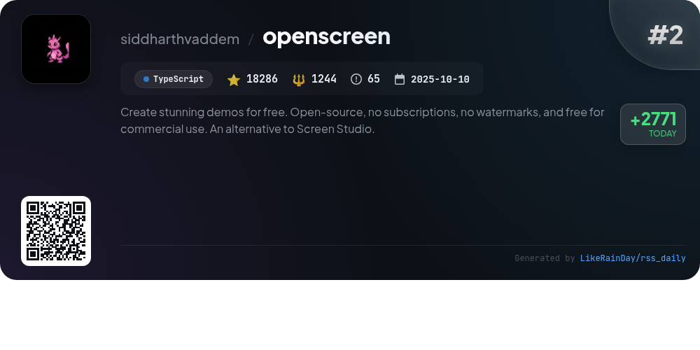
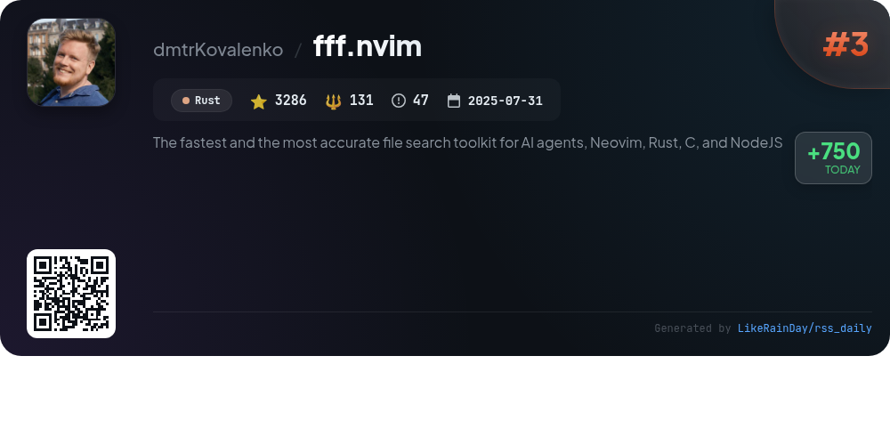
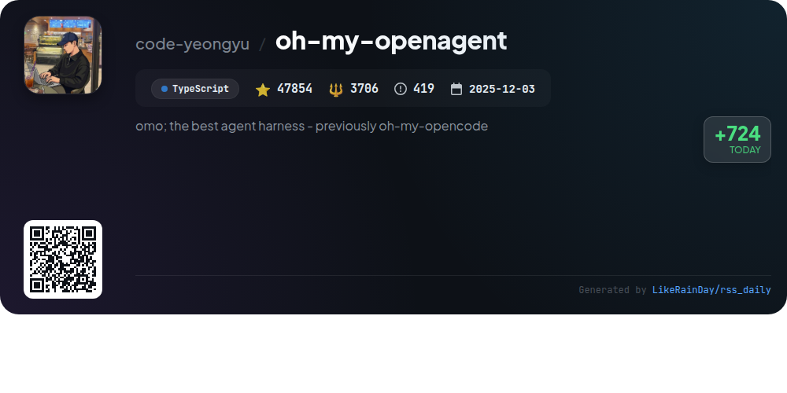
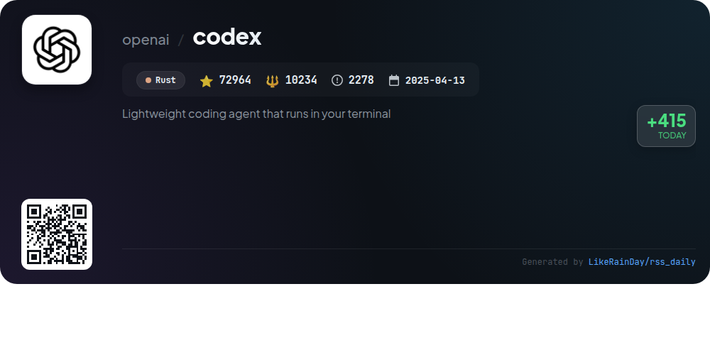
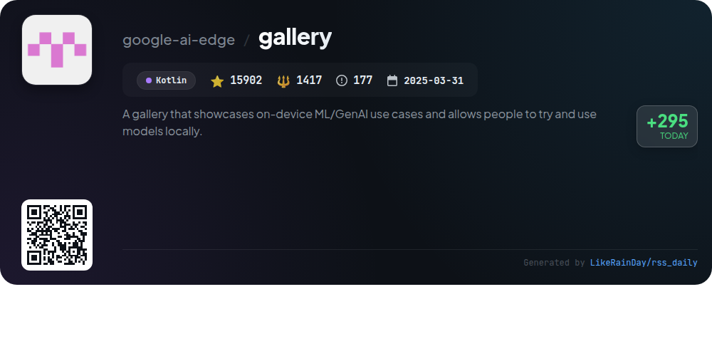
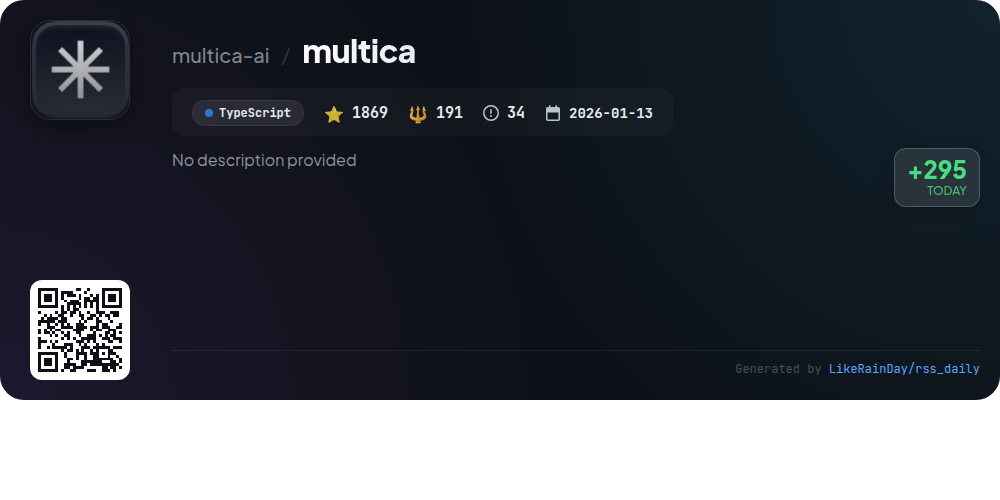
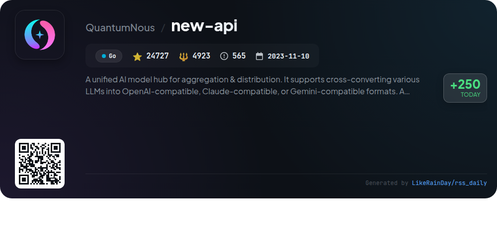

# 📊 🌟 GitHub Trending Daily - 2026-04-04

> > 📅 Daily Picks of GitHub Trending Repositories | Powered by Smart Algorithms

## 📋 Overview

**10** Projects | **338817** ⭐ | **41843** 🍴

**Top Languages:** `TypeScript` (4) · `Rust` (3) · `Go` (1)

**Updated:** 2026-04-04 02:45 UTC

**Categories:**

- 🌟 Daily Top 10 (10 items)

---

## 🌟 Daily Top 10

### 1. [oh-my-codex](https://github.com/Yeachan-Heo/oh-my-codex)

> 🤖 **Why Recommend**  
> *oh-my-codex (OMX) enhances the OpenAI Codex CLI, providing a structured workflow for better task management. With features like `$deep-interview`, `$ralplan`, `$team`, and `$ralph`, users can streamline their coding processes from clarification to execution. OMX maintains project guidance and state in `.omx/`, ensuring efficient collaboration and logging. Designed for those familiar with Codex, it offers reusable roles and skills, making day-to-day coding more effective. Ideal for developers seeking to optimize their Codex experience, OMX has garnered over 14,200 stars on GitHub.*

- ⭐ 14238 stars
- 💻 TypeScript
- 📅 Updated: 2026-04-04

### 2. [openscreen](https://github.com/siddharthvaddem/openscreen)

> 🤖 **Why Recommend**  
> *OpenScreen is a free, open-source alternative to Screen Studio, designed for creating product demos and walkthroughs without any subscriptions or watermarks. Key features include screen recording, customizable zooms, audio capture, video cropping, and the ability to add annotations. Users can choose backgrounds, apply motion blur, and trim clips while exporting in various resolutions. Built with TypeScript and Electron, OpenScreen is suitable for both personal and commercial use, allowing modifications and distribution. Ideal for those seeking a straightforward, no-cost solution for screen recording.*

- ⭐ 18286 stars
- 💻 TypeScript
- 📅 Updated: 2026-04-04

### 3. [fff.nvim](https://github.com/dmtrKovalenko/fff.nvim)

> 🤖 **Why Recommend**  
> *fff.nvim is a high-performance fuzzy file search toolkit for AI agents and Neovim, built in Rust. It offers rapid file searching, grepping, and advanced filtering with a focus on accuracy and efficiency, providing a seamless experience for both users and AI integrations. Key features include multi-select capabilities, live grep with multiple modes (plain, regex, fuzzy), Git status highlighting, and a built-in memory system to optimize search results. Installation is straightforward, and it supports extensive customization through configurable options and key mappings, making it an essential tool for developers.*

- ⭐ 3286 stars
- 💻 Rust
- 📅 Updated: 2026-04-04

### 4. [oh-my-openagent](https://github.com/code-yeongyu/oh-my-openagent)

> 🤖 **Why Recommend**  
> *oh-my-openagent (formerly oh-my-opencode) is a powerful TypeScript-based agent harness with 47,854 stars on GitHub. It enables seamless orchestration of multiple AI models for enhanced coding efficiency. Key features include the `ultrawork` command to activate all agents simultaneously, Discipline Agents for parallel task execution, a Hash-Anchored Edit Tool for error-free modifications, and integrated LSP tools for precise refactoring. With built-in skills and productivity features like the Todo Enforcer, it streamlines workflows, making it ideal for developers seeking an open-source solution without vendor lock-in. Join the community on Discord to witness real-time development!*

- ⭐ 47854 stars
- 💻 TypeScript
- 📅 Updated: 2026-04-04

### 5. [cc-switch](https://github.com/farion1231/cc-switch)

> 🤖 **Why Recommend**  
> *CC Switch is a cross-platform desktop assistant for managing multiple AI coding tools, including Claude Code, Codex, Gemini CLI, OpenCode, and OpenClaw. Key features include a unified interface for switching between 50+ provider presets without manual config editing, a unified management panel for MCP and Skills, and instant provider switching via system tray access. It supports cloud sync across devices, offers built-in utilities, and is built with Tauri in Rust. With over 38,500 stars, it streamlines AI tool management, enhancing productivity for developers.*

- ⭐ 38513 stars
- 💻 Rust
- 📅 Updated: 2026-04-04

### 6. [codex](https://github.com/openai/codex)

> 🤖 **Why Recommend**  
> *Codex is a lightweight coding agent from OpenAI that runs locally in your terminal, designed for seamless coding assistance. With over 72,000 stars on GitHub, it can be easily installed via npm or Homebrew. Key features include integration with popular code editors like VS Code and the option to use a desktop app. Users can also access Codex through their ChatGPT plans or with an API key. The project offers extensive documentation, contributing guidelines, and is licensed under Apache-2.0, making it a valuable tool for developers seeking enhanced coding capabilities.*

- ⭐ 72964 stars
- 💻 Rust
- 📅 Updated: 2026-04-04

### 7. [llama.cpp](https://github.com/ggml-org/llama.cpp)

> 🤖 **Why Recommend**  
> *llama.cpp is a high-performance C/C++ library for large language model (LLM) inference, boasting over 101,000 stars on GitHub. Key features include minimal setup, support for various architectures (Apple Silicon, x86, RISC-V), and advanced quantization options for efficient memory use. It enables both CPU and GPU hybrid inference and comes with a command-line interface (llama-cli) and an OpenAI-compatible API server (llama-server). Integration with Hugging Face allows easy model access, while multimodal support enhances functionality. The project is actively developed, with extensive documentation and community support.*

- ⭐ 101178 stars
- 💻 C++
- 📅 Updated: 2026-04-04

### 8. [gallery](https://github.com/google-ai-edge/gallery)

> 🤖 **Why Recommend**  
> *The Google AI Edge Gallery is a Kotlin-based app that showcases on-device ML/GenAI use cases, enabling users to run powerful open-source Large Language Models (LLMs) offline. Key features include Agent Skills for enhanced model capabilities, AI Chat with a Thinking Mode for insight into reasoning processes, and multimodal tools like Ask Image and Audio Scribe. Users can manage models easily, ensuring 100% on-device privacy. The latest update supports the Gemma 4 family, providing advanced creative and reasoning functionalities. Available on Google Play and App Store.*

- ⭐ 15902 stars
- 💻 Kotlin
- 📅 Updated: 2026-04-04

### 9. [multica](https://github.com/multica-ai/multica)

> 🤖 **Why Recommend**  
> *Multica is an open-source platform designed to integrate coding agents as collaborative teammates, enabling a streamlined task management experience. With features like autonomous execution, reusable skills, and a unified dashboard for local and cloud runtimes, users can efficiently assign tasks, track progress, and manage both human and agent workforces. It supports multi-workspace organization and works with Claude Code and Codex. Users can quickly start with Multica Cloud or self-host using Docker. The platform emphasizes productivity by automating task lifecycles and promoting skill compounding.*

- ⭐ 1869 stars
- 💻 TypeScript
- 📅 Updated: 2026-04-04

### 10. [new-api](https://github.com/QuantumNous/new-api)

> 🤖 **Why Recommend**  
> *New API is a next-generation AI model hub designed for seamless aggregation and distribution of various large language models (LLMs). It facilitates cross-conversion into OpenAI, Claude, and Gemini formats, enabling unified model management for personal and enterprise use. Key features include multi-language support, a modern UI, data compatibility with One API, payment integration (EPay, Stripe), and robust authorization methods (Discord, OIDC). Advanced functionalities include intelligent routing, flexible billing, and comprehensive API support, making it an essential tool for AI asset management.*

- ⭐ 24727 stars
- 💻 Go
- 📅 Updated: 2026-04-04

---

## 📡 RSS Subscription

Subscribe via RSS to get daily trending updates:

- 🔔 [RSS XML] (../../daily-top.xml)
- 🔔 [Daily Report] (../../GITHUB_TODAY.md)
- 🔔 [Daily Top 10](../../daily-top.xml)

---

*⚡ Powered by Smart Trending Algorithm | Generated at 2026-04-04 02:45:35 UTC
