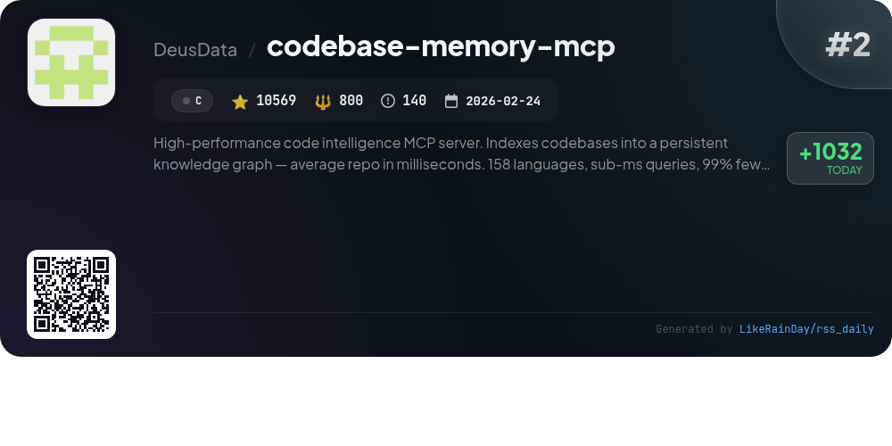
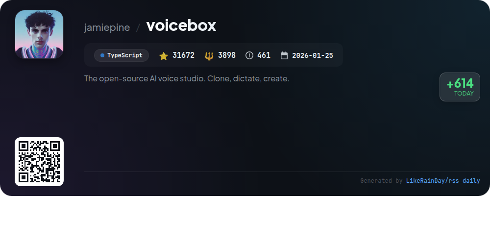
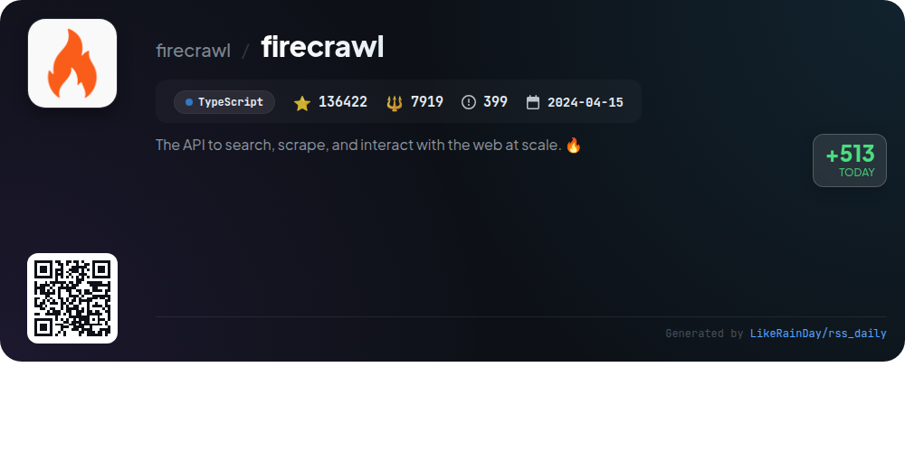
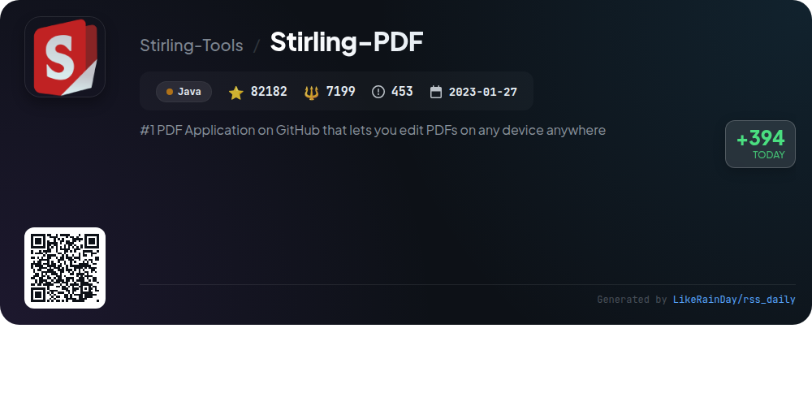
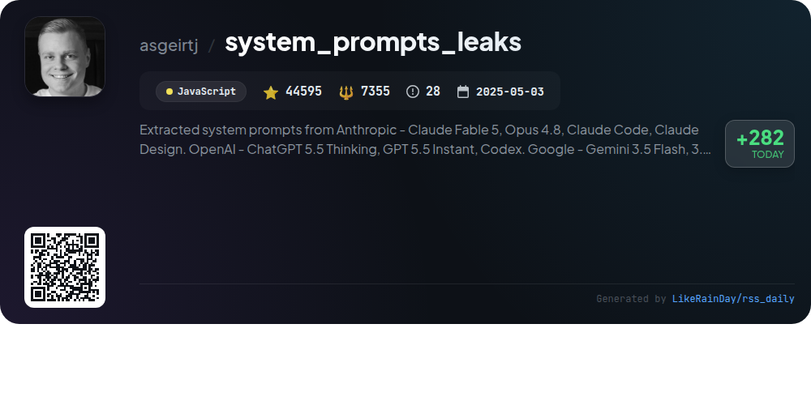

# 📊 🌟 GitHub Trending Daily - 2026-06-22

> > 📅 Daily Picks of GitHub Trending Repositories | Powered by Smart Algorithms

## 📋 Overview

**10** Projects | **712458** ⭐ | **82388** 🍴

**Top Languages:** `JavaScript` (3) · `TypeScript` (3) · `Swift` (1)

**Updated:** 2026-06-22 05:07 UTC

**Categories:**

- 🌟 Daily Top 10 (10 items)

---

## 🌟 Daily Top 10

### 1. [palmier-pro](https://github.com/palmier-io/palmier-pro)

> 🤖 **Why Recommend**  
> *Palmier Pro is an open-source macOS video editor designed for AI integration, boasting over 5,600 stars on GitHub. Built with Swift, it offers a timeline editor for collaborative video creation, enabling users to generate content using advanced models like Seedance and Codex. The app features a built-in MCP server for seamless agent connections. While the core editor is free, generative AI functionalities require a subscription. Palmier Pro supports macOS 26 on Apple Silicon, making it a powerful tool for both casual and professional video editors.*

- ⭐ 5661 stars
- 💻 Swift
- 📅 Updated: 2026-06-22

### 2. [codebase-memory-mcp](https://github.com/DeusData/codebase-memory-mcp)

> 🤖 **Why Recommend**  
> *High-performance code intelligence MCP server. Indexes codebases into a persistent knowledge graph — average repo in milliseconds. 158 languages, su. popular project, actively maintained, recently updated*

- ⭐ 10569 stars
- 🍴 800 forks
- 💻 C
- 📅 Updated: 2026-06-22

### 3. [taste-skill](https://github.com/Leonxlnx/taste-skill)

> 🤖 **Why Recommend**  
> *Taste-Skill is an innovative JavaScript framework designed to enhance AI-generated interfaces by providing portable Agent Skills that promote superior design. With over 48,000 stars, it offers a range of skills for both code generation and image creation, ensuring visually appealing and non-generic outputs. Key features include adjustable parameters for design variance, motion intensity, and visual density, along with specialized skills for redesigns and image-to-code workflows. The framework supports multiple coding agents, making it versatile for various frontend needs.*

- ⭐ 48560 stars
- 💻 JavaScript
- 📅 Updated: 2026-06-22

### 4. [voicebox](https://github.com/jamiepine/voicebox)

> 🤖 **Why Recommend**  
> *Voicebox is an open-source AI voice studio that enables users to clone voices, generate speech, and dictate across applications, all while ensuring complete privacy. Key features include seven TTS engines supporting 23 languages, expressive speech with paralinguistic tags, and a global dictation hotkey. Users can create and manage voice profiles, utilize a multi-track stories editor, and integrate with MCP-aware agents for voice output. Voicebox runs locally on macOS, Windows, and Linux, making it a versatile tool for voice generation and interaction.*

- ⭐ 31672 stars
- 💻 TypeScript
- 📅 Updated: 2026-06-22

### 5. [turso](https://github.com/tursodatabase/turso)

> 🤖 **Why Recommend**  
> *Turso is an in-process SQL database, compatible with SQLite.. popular project, actively maintained, recently updated*

- ⭐ 20922 stars
- 🍴 1069 forks
- 💻 Rust
- 📅 Updated: 2026-06-22

### 6. [firecrawl](https://github.com/firecrawl/firecrawl)

> 🤖 **Why Recommend**  
> *Firecrawl is a powerful API designed for scalable web searching, scraping, and interaction, built in TypeScript. It offers features like full-page content search, data extraction in markdown or JSON formats, and the ability to interact with scraped pages using AI prompts. Key highlights include industry-leading reliability, low latency, and automated data gathering through its Agent feature. Firecrawl simplifies complex tasks such as crawling entire websites, mapping URLs, and batch scraping. It's open source and provides extensive SDK support for various programming languages.*

- ⭐ 136422 stars
- 💻 TypeScript
- 📅 Updated: 2026-06-22

### 7. [ECC](https://github.com/affaan-m/ECC)

> 🤖 **Why Recommend**  
> *ECC is a high-performance optimization system for AI agents, offering skills, instincts, memory management, and security scanning. It supports various platforms, including Codex, Claude Code, and Cursor, and features over 260 reusable skills and agents for diverse workflows. Key highlights include continuous learning capabilities, a robust security audit tool (AgentShield), and a user-friendly GUI dashboard. ECC is designed for both production-ready deployment and developmental flexibility, making it essential for optimizing AI workflows across multiple coding environments.*

- ⭐ 219429 stars
- 💻 JavaScript
- 📅 Updated: 2026-06-22

### 8. [gstack](https://github.com/garrytan/gstack)

> 🤖 **Why Recommend**  
> *gstack is an open-source toolset designed to enhance productivity for tech founders, engineers, and designers by turning Claude Code into a virtual engineering team. It features 23 specialized skills for roles like CEO, designer, and QA, streamlining the software development process from ideation to deployment. Key highlights include automated reviews, real browser testing, and continuous documentation updates. With a focus on collaboration and efficiency, gstack enables users to ship high-quality products rapidly, making it ideal for startups and first-time Claude Code users.*

- ⭐ 112446 stars
- 💻 TypeScript
- 📅 Updated: 2026-06-22

### 9. [Stirling-PDF](https://github.com/Stirling-Tools/Stirling-PDF)

> 🤖 **Why Recommend**  
> *Stirling PDF is the leading open-source PDF editing platform on GitHub, with over 82,000 stars. It offers a versatile solution to edit, sign, redact, convert, and automate PDFs on any device, either as a desktop app, in a browser, or via a self-hosted server with a private API. Key features include over 50 PDF tools, no-code automation workflows, enterprise-grade support with SSO and auditing, and a global UI in 40+ languages. Developers can integrate its REST APIs into existing systems, making Stirling PDF a powerful choice for personal and enterprise use.*

- ⭐ 82182 stars
- 💻 Java
- 📅 Updated: 2026-06-22

### 10. [system_prompts_leaks](https://github.com/asgeirtj/system_prompts_leaks)

> 🤖 **Why Recommend**  
> *The system_prompts_leaks project documents extracted system prompts from various AI chatbots, including Anthropic's Claude, OpenAI's ChatGPT, Google's Gemini, and xAI's Grok. With over 44,000 stars, it serves as a comprehensive resource for understanding AI behavior by providing direct access to prompt instructions for multiple models. Key features include regular updates, version comparisons, and detailed documentation for each AI model, enabling users to explore and analyze the underlying instructions that guide these advanced systems.*

- ⭐ 44595 stars
- 💻 JavaScript
- 📅 Updated: 2026-06-22

---

## 📡 RSS Subscription

Subscribe via RSS to get daily trending updates:

- 🔔 [RSS XML] (../../daily-top.xml)
- 🔔 [Daily Report] (../../GITHUB_TODAY.md)
- 🔔 [Daily Top 10](../../daily-top.xml)

---

*⚡ Powered by Smart Trending Algorithm | Generated at 2026-06-22 05:07:42 UTC
