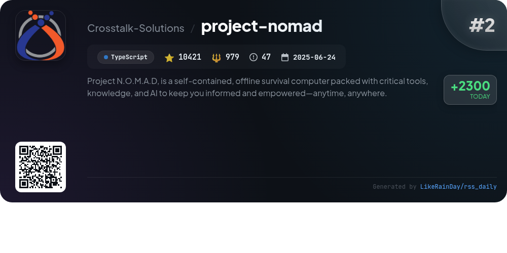
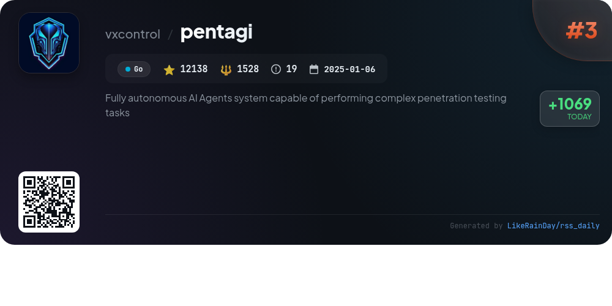
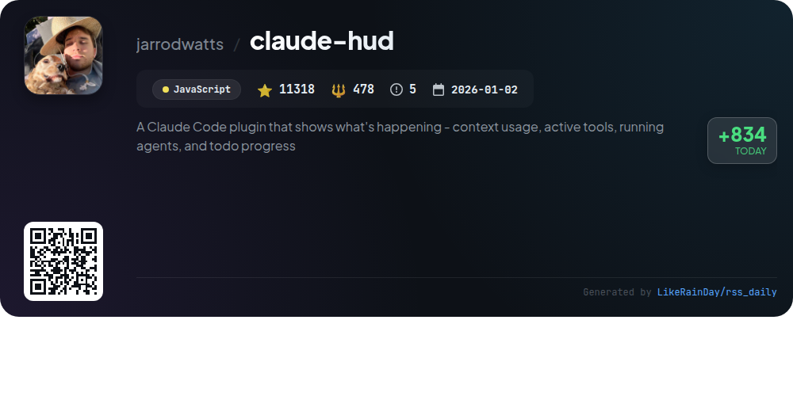
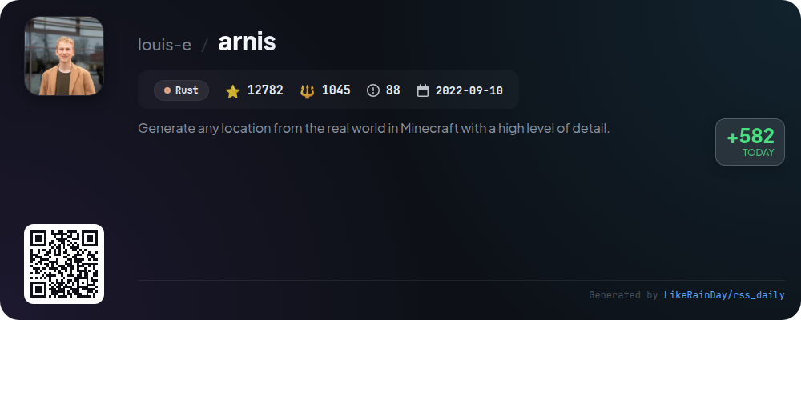
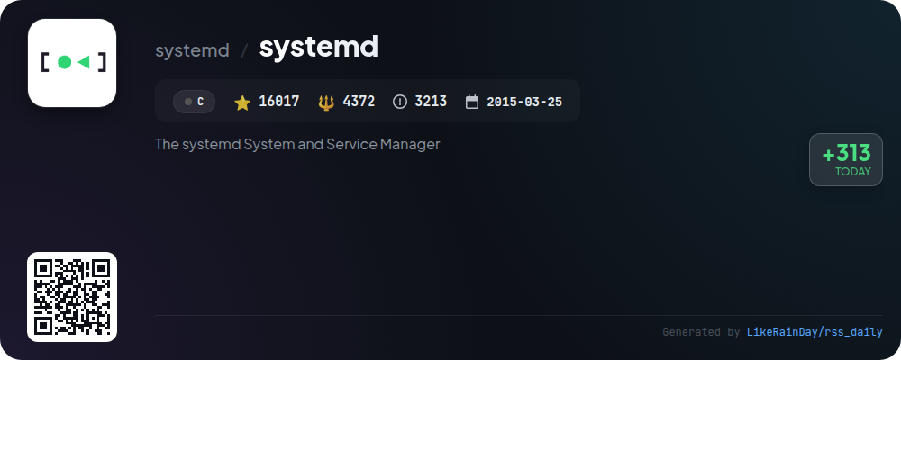
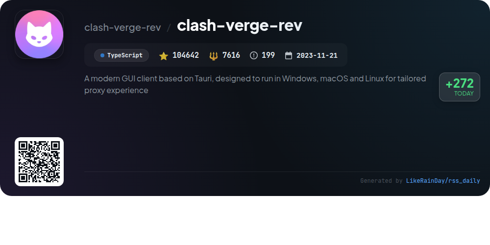

# 📊 🌟 GitHub Trending Daily - 2026-03-23

> > 📅 Daily Picks of GitHub Trending Repositories | Powered by Smart Algorithms

## 📋 Overview

**10** Projects | **414655** ⭐ | **43479** 🍴

**Top Languages:** `TypeScript` (3) · `JavaScript` (3) · `C` (1)

**Updated:** 2026-03-23 02:51 UTC

**Categories:**

- 🌟 Daily Top 10 (10 items)

---

## 🌟 Daily Top 10

### 1. [everything-claude-code](https://github.com/affaan-m/everything-claude-code)

> 🤖 **Why Recommend**  
> *Everything Claude Code is a powerful AI performance optimization system that enhances agent capabilities across Claude Code, Codex, Cursor, and more. With over 98,000 stars, it features a comprehensive suite of 28 agents and 116 skills for tasks such as coding standards enforcement, security scanning, and continuous learning. This plugin supports multi-language projects, offers selective installs, and integrates seamlessly with popular development environments. Key highlights include advanced memory optimization, session management, and a robust security framework, making it ideal for production-ready AI solutions.*

- ⭐ 98448 stars
- 💻 JavaScript
- 📅 Updated: 2026-03-23

### 2. [project-nomad](https://github.com/Crosstalk-Solutions/project-nomad)

> 🤖 **Why Recommend**  
> *Project N.O.M.A.D, is a self-contained, offline survival computer packed with critical tools, knowledge, and AI to keep you informed and empowered—a. popular project, actively maintained, recently updated*

- ⭐ 10421 stars
- 🍴 979 forks
- 💻 TypeScript
- 📅 Updated: 2026-03-23

### 3. [pentagi](https://github.com/vxcontrol/pentagi)

> 🤖 **Why Recommend**  
> *PentAGI is a powerful, fully autonomous AI agent system designed for complex penetration testing tasks, built with Go. Key features include a suite of over 20 professional pentesting tools, smart memory for storing research results, and a knowledge graph for advanced context understanding. It operates in a secure Docker environment and integrates with multiple LLM providers for flexible AI capabilities. With comprehensive REST and GraphQL APIs, detailed reporting, and a modern web interface, PentAGI streamlines the penetration testing process, making it ideal for security professionals and researchers.*

- ⭐ 12138 stars
- 💻 Go
- 📅 Updated: 2026-03-23

### 4. [claude-hud](https://github.com/jarrodwatts/claude-hud)

> 🤖 **Why Recommend**  
> *Claude HUD is a JavaScript plugin for Claude Code that enhances user experience by providing real-time insights into context usage, active tools, running agents, and todo progress directly below your input. Key features include a customizable status line, project path display, context health monitoring, and agent tracking. With support for various layouts and advanced configuration options, users can tailor the HUD to their needs. It updates every 300ms and supports up to 1M-context sessions, making it an essential tool for efficient coding workflows.*

- ⭐ 11318 stars
- 💻 JavaScript
- 📅 Updated: 2026-03-23

### 5. [opencode](https://github.com/anomalyco/opencode)

> 🤖 **Why Recommend**  
> *OpenCode is an open-source AI coding agent designed to assist developers with various tasks. Featuring a dual-agent system, users can switch between a full-access development agent and a read-only exploration agent. The platform supports multiple programming models, ensuring flexibility and provider-agnostic usage. It offers a terminal user interface (TUI) optimized for neovim users and supports installation across various operating systems. With a strong community presence on Discord and comprehensive documentation, OpenCode aims to enhance coding productivity and collaboration.*

- ⭐ 128139 stars
- 💻 TypeScript
- 📅 Updated: 2026-03-23

### 6. [arnis](https://github.com/louis-e/arnis)

> 🤖 **Why Recommend**  
> *Arnis is an open-source tool that generates detailed Minecraft worlds from real-world locations using Rust. It supports both Minecraft Java (1.17+) and Bedrock editions, allowing users to create complex terrains and architectures based on geospatial data from OpenStreetMap and elevation datasets. With a user-friendly interface, Arnis enables customization of world settings and scales. Additionally, users can access MapSmith for browser-based generation. The project emphasizes modularity, performance, and comprehensive documentation, making it a valuable resource for gamers and developers alike.*

- ⭐ 12782 stars
- 💻 Rust
- 📅 Updated: 2026-03-23

### 7. [opendataloader-pdf](https://github.com/opendataloader-project/opendataloader-pdf)

> 🤖 **Why Recommend**  
> *OpenDataLoader PDF is an open-source PDF parser designed for AI-ready data extraction and automated PDF accessibility. It excels in converting PDFs to structured formats like Markdown, JSON, and Tagged PDF, achieving benchmark accuracy of 0.90 overall and 0.93 for table extraction. Key features include a deterministic extraction mode, a hybrid mode for complex layouts, built-in OCR for scanned documents, and auto-tagging to comply with accessibility standards. The tool supports Java, Python, and Node.js, making it versatile for various applications.*

- ⭐ 8335 stars
- 💻 Java
- 📅 Updated: 2026-03-23

### 8. [impeccable](https://github.com/pbakaus/impeccable)

> 🤖 **Why Recommend**  
> *Impeccable is a JavaScript project designed to enhance AI's frontend design capabilities. It builds on Anthropic's frontend-design skill, providing deeper expertise and control. Key features include 20 commands for auditing, critiquing, and polishing UI designs, alongside 7 domain-specific reference files covering typography, color, spatial, motion, interaction, responsive design, and UX writing. Impeccable also offers curated anti-patterns to help avoid common design mistakes. Visit [impeccable.style](https://impeccable.style) for installation and usage details.*

- ⭐ 12415 stars
- 💻 JavaScript
- 📅 Updated: 2026-03-23

### 9. [systemd](https://github.com/systemd/systemd)

> 🤖 **Why Recommend**  
> *systemd is a powerful system and service manager for Linux, designed to enhance boot performance and manage services efficiently. With over 16,000 stars on GitHub, it integrates features like parallel service startup, on-demand service activation, and dependency management. The project emphasizes security, boasting a bug bounty program and extensive testing through CI/CD practices. Comprehensive documentation is available, along with community support via mailing lists and IRC. Stable branches and packages are readily accessible, ensuring robust deployment and maintenance.*

- ⭐ 16017 stars
- 💻 C
- 📅 Updated: 2026-03-23

### 10. [clash-verge-rev](https://github.com/clash-verge-rev/clash-verge-rev)

> 🤖 **Why Recommend**  
> *Clash Verge Rev is a modern GUI client built on Tauri, providing a tailored proxy experience across Windows, macOS, and Linux. It boasts a sleek interface with customizable themes, advanced configuration management, and support for the Clash.Meta kernel. Key features include system proxy settings, visual node editing, and WebDav backup/sync. With robust performance from Rust and Tauri, users benefit from a powerful tool for managing proxy connections. The project has garnered over 104,000 stars, reflecting its popularity and reliability in the community.*

- ⭐ 104642 stars
- 💻 TypeScript
- 📅 Updated: 2026-03-23

---

## 📡 RSS Subscription

Subscribe via RSS to get daily trending updates:

- 🔔 [RSS XML] (../../daily-top.xml)
- 🔔 [Daily Report] (../../GITHUB_TODAY.md)
- 🔔 [Daily Top 10](../../daily-top.xml)

---

*⚡ Powered by Smart Trending Algorithm | Generated at 2026-03-23 02:51:02 UTC
