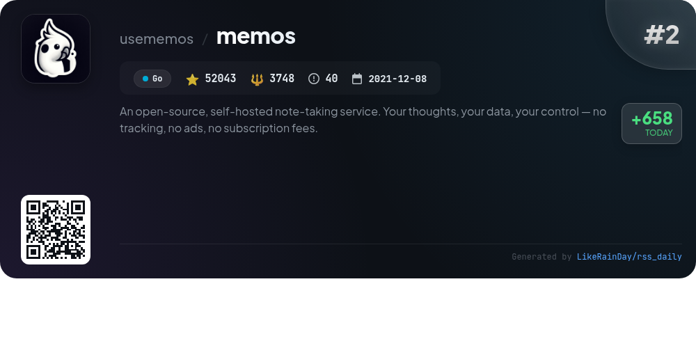
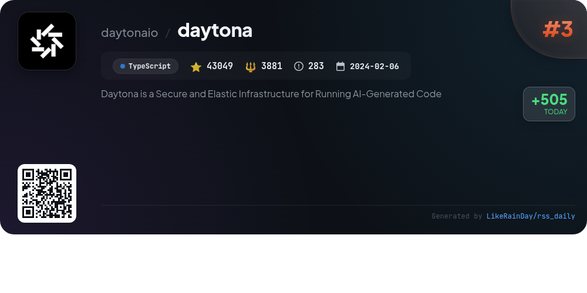
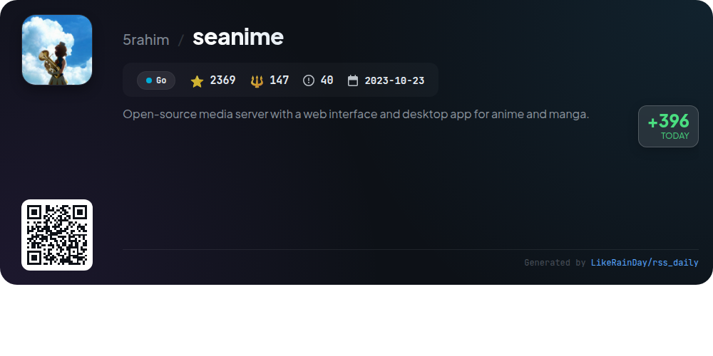
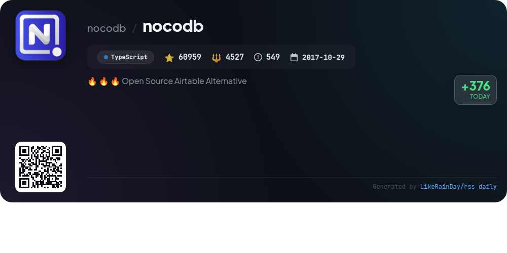
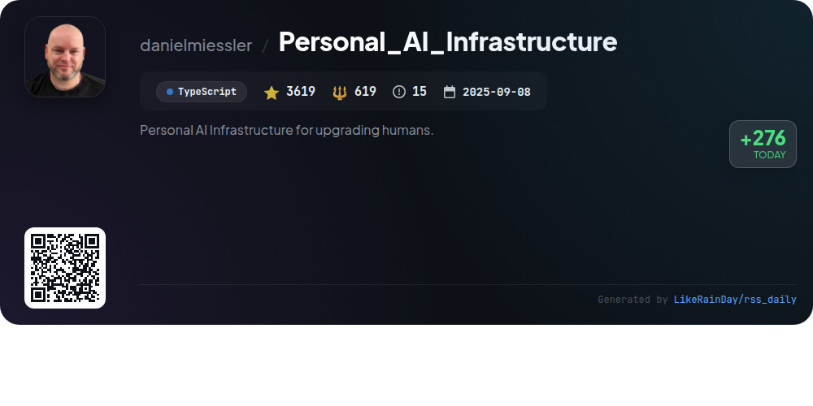
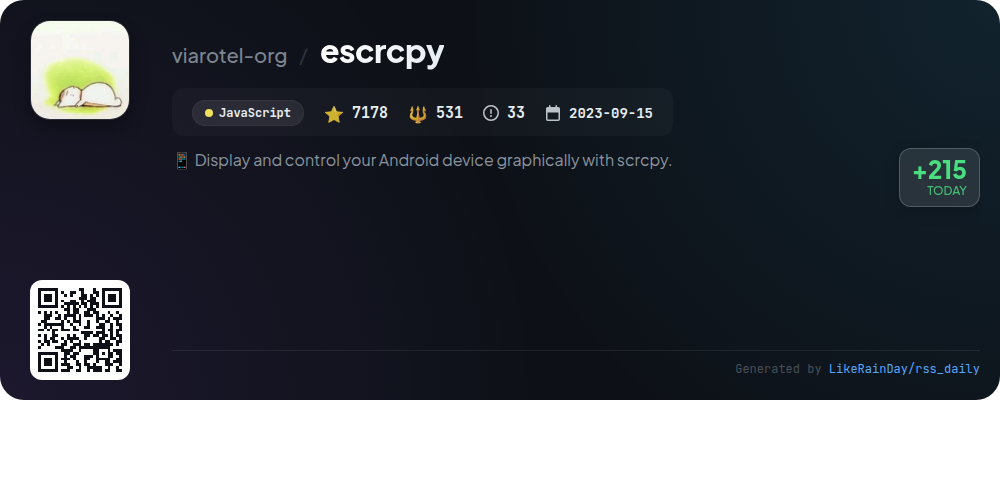
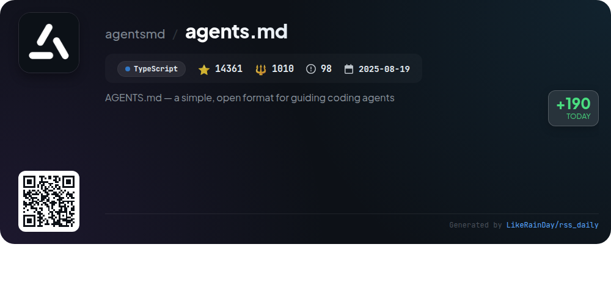

# 📊 🌟 GitHub Trending Daily - 2026-01-06

> > 📅 每日精选 GitHub 热门仓库 | 基于智能算法推荐

## 📋 Overview

**10** 个项目 | **260195** ⭐ | **24228** 🍴

**热门语言:** `TypeScript` (6) · `Go` (2) · `JavaScript` (1)

**更新时间:** 2026-01-06 06:45 UTC

**分类分布:**

- 🌟 每日 Top 10 精选 (10 项)

---

## 🌟 每日 Top 10 精选

### 1. [opencode](https://github.com/anomalyco/opencode)

> 🤖 **推荐理由**  
> *OpenCode is an open-source AI coding agent designed for developers, featuring a terminal user interface (TUI) and support for multiple programming models. It includes two built-in agents: a full-access "build" agent for development and a read-only "plan" agent for code exploration. OpenCode can be installed across various platforms and supports a client/server architecture, enabling remote operation. With a focus on flexibility and customization, it integrates with various AI models and offers a strong community via Discord. Explore more at opencode.ai.*

- ⭐ 50330 stars
- 💻 TypeScript
- 📅 Updated: 2026-01-06

### 2. [memos](https://github.com/usememos/memos)

> 🤖 **推荐理由**  
> *Memos is an open-source, self-hosted note-taking service built with Go and React, emphasizing privacy and data control. Key features include complete data ownership, zero telemetry, full markdown support, and fast performance. Users can easily deploy Memos via Docker and enjoy a developer-friendly environment with REST and gRPC APIs. The platform offers a beautiful, mobile-responsive interface and is free forever under the MIT license. Experience Memos through a live demo or explore comprehensive documentation for installation guidance.*

- ⭐ 52043 stars
- 💻 Go
- 📅 Updated: 2026-01-06

### 3. [daytona](https://github.com/daytonaio/daytona)

> 🤖 **推荐理由**  
> *Daytona is a secure and elastic infrastructure designed for running AI-generated code, boasting over 43,000 stars on GitHub. Key features include lightning-fast sandbox creation (sub-90ms), isolated runtime environments to safeguard infrastructure, and support for massive parallelization of AI workflows. It offers programmatic control through file, Git, LSP, and execute APIs, and ensures unlimited persistence of sandboxes. Compatible with OCI/Docker images, Daytona provides a streamlined SDK for both Python and TypeScript, empowering developers to execute code securely and efficiently.*

- ⭐ 43049 stars
- 💻 TypeScript
- 📅 Updated: 2026-01-06

### 4. [seanime](https://github.com/5rahim/seanime)

> 🤖 **推荐理由**  
> *Seanime is an open-source media server designed for anime and manga, featuring a cross-platform web interface and desktop app. Key features include a built-in video player with advanced subtitle support, AniList integration, custom source support, and offline mode. Users can scan libraries quickly, stream torrents directly, and enjoy transcoding for various devices. The project emphasizes legal content usage and does not host media. With a focus on user customization and accessibility, Seanime is ideal for anime enthusiasts looking to manage and stream their collections efficiently.*

- ⭐ 2369 stars
- 💻 Go
- 📅 Updated: 2026-01-06

### 5. [nocodb](https://github.com/nocodb/nocodb)

> 🤖 **推荐理由**  
> *🔥 🔥 🔥 Open Source Airtable Alternative. popular project, actively maintained, recently updated*

- ⭐ 60959 stars
- 🍴 4527 forks
- 💻 TypeScript
- 📅 Updated: 2026-01-06

### 6. [cc-switch](https://github.com/farion1231/cc-switch)

> 🤖 **推荐理由**  
> *cc-switch is a cross-platform desktop assistant tool for managing Claude Code, Codex, and Gemini CLI, built with Rust and Tauri. Key features include a dual-layer SQLite + JSON architecture for data management, a revamped user interface, and support for multi-language (English, Chinese, Japanese). It offers one-click provider switching, skills and prompts management, and seamless MCP server integration. With 9,424 stars on GitHub, it supports various operating systems (Windows, macOS, Linux) and includes auto-launch and cloud sync capabilities. The project is sponsored by Z.ai, AIGoCode, and DMXAPI, enhancing its functionality with reliable API services.*

- ⭐ 9424 stars
- 💻 Rust
- 📅 Updated: 2026-01-06

### 7. [Personal_AI_Infrastructure](https://github.com/danielmiessler/Personal_AI_Infrastructure)

> 🤖 **推荐理由**  
> *Personal_AI_Infrastructure (PAI) is an open-source framework for creating personalized AI systems that evolve with user goals. Key features include modular "packs" for specific capabilities, a universal progress pattern (current state to desired state), and a scientific method-based workflow for effective task execution. PAI's architecture supports various platforms, enabling customizable AI assistants with persistent memory, specialized skills, and intelligent routing. With over 3,600 stars on GitHub, PAI empowers users to build tailored AI solutions that enhance productivity and personal growth.*

- ⭐ 3619 stars
- 💻 TypeScript
- 📅 Updated: 2026-01-06

### 8. [escrcpy](https://github.com/viarotel-org/escrcpy)

> 🤖 **推荐理由**  
> *escrcpy is an open-source project that allows users to display and control their Android devices graphically via Electron. Key features include intelligent control with natural-language commands, automated workflows supporting parallel operations, and centralized management of multiple devices. It supports wireless connectivity with Gnirehtet reverse tethering and offers high-performance screen mirroring. With over 7,178 stars on GitHub, escrcpy is a valuable tool for developers and users looking to enhance their Android device experience.*

- ⭐ 7178 stars
- 💻 JavaScript
- 📅 Updated: 2026-01-06

### 9. [newsnow](https://github.com/ourongxing/newsnow)

> 🤖 **推荐理由**  
> *newsnow is a TypeScript-based project designed for elegant reading of real-time and trending news, currently supporting Chinese content. Key features include a clean UI, real-time updates, GitHub OAuth login, adaptive scraping intervals, and MCP server support. The project allows for easy deployment on platforms like Cloudflare and Vercel, with options for caching and database integration, particularly with Cloudflare D1. Future plans include multi-language support and enhanced personalization options. Contributions are welcome to expand data sources and enhance functionality.*

- ⭐ 16863 stars
- 💻 TypeScript
- 📅 Updated: 2026-01-06

### 10. [agents.md](https://github.com/agentsmd/agents.md)

> 🤖 **推荐理由**  
> *AGENTS.md is an open format designed to guide coding agents, serving as a README specifically tailored for AI assistance in software projects. Key features include structured sections for development environment tips, testing instructions, and pull request guidelines, ensuring consistency and clarity in project management. The project, built with TypeScript, has garnered over 14,361 stars on GitHub. Additionally, it includes a basic Next.js website for project goals and examples, enhancing accessibility for users. Visit [agents.md](https://agents.md) for more information.*

- ⭐ 14361 stars
- 💻 TypeScript
- 📅 Updated: 2026-01-06

---

## 📡 RSS订阅

通过 RSS 订阅，第一时间获取每日精选项目：

- 🔔 [RSS 订阅源] (../../daily-top.xml)
- 🔔 [每日简报] (../../GITHUB_TODAY_CN.md)
- 🔔 [每日 Top 10 精选](../../daily-top.xml)

---

*⚡ Powered by Smart Trending Algorithm | Generated at 2026-01-06 06:45:00 UTC
