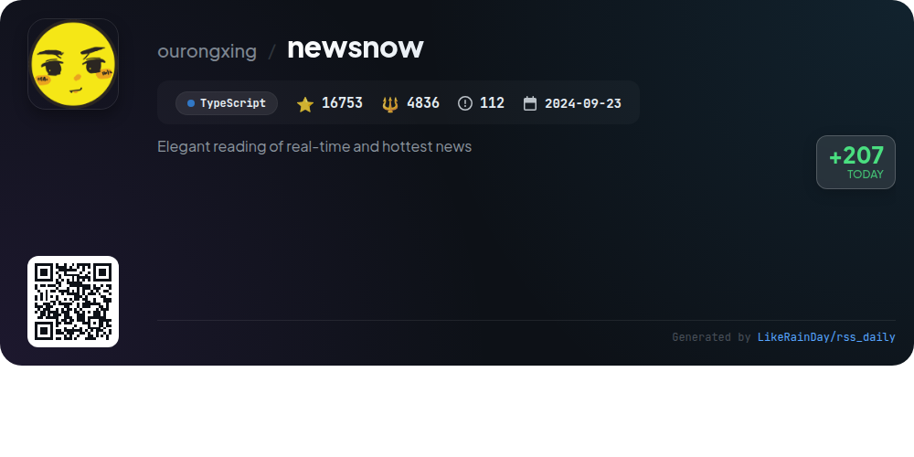
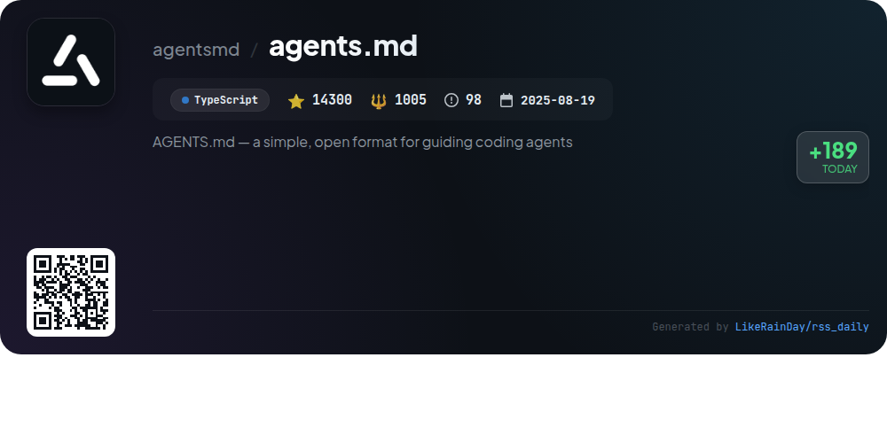

# 📊 🌟 GitHub Trending Daily - 2026-01-05

> > 📅 每日精选 GitHub 热门仓库 | 基于智能算法推荐

## 📋 Overview

**10** 个项目 | **258412** ⭐ | **24070** 🍴

**热门语言:** `TypeScript` (6) · `Go` (2) · `Rust` (1)

**更新时间:** 2026-01-05 18:43 UTC

**分类分布:**

- 🌟 每日 Top 10 精选 (10 项)

---

## 🌟 每日 Top 10 精选

### 1. [opencode](https://github.com/anomalyco/opencode)

> 🤖 **推荐理由**  
> *OpenCode is an open-source AI coding agent built in TypeScript, boasting 49,385 stars on GitHub. It features two main agents: "build" for development tasks and "plan" for code exploration, enhancing user productivity. OpenCode supports installation across multiple platforms and offers a desktop application in beta. It emphasizes a terminal user interface (TUI) and is provider-agnostic, compatible with various AI models. Comprehensive documentation and a growing community on Discord support users and contributors. Explore more at opencode.ai.*

- ⭐ 49385 stars
- 💻 TypeScript
- 📅 Updated: 2026-01-05

### 2. [memos](https://github.com/usememos/memos)

> 🤖 **推荐理由**  
> *Memos is an open-source, self-hosted note-taking service designed for privacy and data ownership. With over 51,000 stars, it offers a user-friendly interface, full markdown support, and lightning-fast performance built with Go and React. Key features include zero telemetry, complete control over your data, simple Docker deployment, REST and gRPC APIs for integration, and a clean, responsive design. Memos is free forever with no ads or subscription fees, making it ideal for personal notes, team wikis, and knowledge management. Explore the live demo or documentation to get started.*

- ⭐ 51784 stars
- 💻 Go
- 📅 Updated: 2026-01-05

### 3. [daytona](https://github.com/daytonaio/daytona)

> 🤖 **推荐理由**  
> *Daytona is a secure and elastic infrastructure designed for running AI-generated code, built with TypeScript and boasting over 42,900 stars on GitHub. Key features include sub-90ms sandbox creation, isolated runtimes for risk-free execution, massive parallelization for concurrent workflows, and programmatic control via various APIs. Daytona supports OCI/Docker images and offers unlimited sandbox persistence. Quick start is facilitated through Python and TypeScript SDKs. Join the community and explore documentation at www.daytona.io/docs.*

- ⭐ 42935 stars
- 💻 TypeScript
- 📅 Updated: 2026-01-05

### 4. [seanime](https://github.com/5rahim/seanime)

> 🤖 **推荐理由**  
> *Seanime is an open-source media server designed for anime and manga enthusiasts, featuring a web interface and desktop app. With over 2,350 stars, it offers cross-platform support, a built-in video player, and complete AniList integration for managing and discovering content. Key features include offline mode, torrent streaming capabilities, customizable UI, and support for popular media players like MPV and VLC. Users can scan their libraries quickly, track episodes, and read manga from local sources. Seanime prioritizes legal media access and user customization.*

- ⭐ 2350 stars
- 💻 Go
- 📅 Updated: 2026-01-05

### 5. [nocodb](https://github.com/nocodb/nocodb)

> 🤖 **推荐理由**  
> *🔥 🔥 🔥 Open Source Airtable Alternative. popular project, actively maintained, recently updated*

- ⭐ 60869 stars
- 🍴 4522 forks
- 💻 TypeScript
- 📅 Updated: 2026-01-05

### 6. [cc-switch](https://github.com/farion1231/cc-switch)

> 🤖 **推荐理由**  
> *cc-switch is a cross-platform desktop assistant tool for Claude Code, Codex, and Gemini CLI, built with Rust and Tauri. It streamlines provider management with seamless switching between APIs and advanced configuration options. Key features include a dual-layer storage system (SQLite + JSON), multi-language support (English, Chinese, Japanese), skills management, and prompt handling. The app also offers built-in speed testing, auto-launch on startup, and a redesigned user interface. Notable sponsors include Z.ai and PackyCode, enhancing user experience with various coding services.*

- ⭐ 9348 stars
- 💻 Rust
- 📅 Updated: 2026-01-05

### 7. [Personal_AI_Infrastructure](https://github.com/danielmiessler/Personal_AI_Infrastructure)

> 🤖 **推荐理由**  
> *Personal_AI_Infrastructure (PAI) is an open-source framework designed to enable users to build personalized AI systems that enhance productivity and goal achievement. Key features include a modular architecture with self-contained packs for specific capabilities, a universal algorithm for progress tracking, and a scientific method-based workflow for iterative improvement. PAI's core services offer persistent memory, custom skills, and context-aware functionalities, making it adaptable to individual needs. With 3,532 stars on GitHub, PAI empowers users to create tailored AI solutions.*

- ⭐ 3532 stars
- 💻 TypeScript
- 📅 Updated: 2026-01-05

### 8. [escrcpy](https://github.com/viarotel-org/escrcpy)

> 🤖 **推荐理由**  
> *escrcpy is an open-source project that enables users to display and control Android devices graphically through a powerful Electron interface. With 7,156 stars on GitHub, it offers intelligent control via natural-language commands, automated workflows, and multi-device management. Key features include wireless connectivity with reverse tethering support and low-latency screen mirroring. Installation is straightforward via released packages or Homebrew for macOS. Comprehensive documentation is available for getting started, device operations, and preferences, making it accessible for both users and developers.*

- ⭐ 7156 stars
- 💻 JavaScript
- 📅 Updated: 2026-01-05

### 9. [newsnow](https://github.com/ourongxing/newsnow)

> 🤖 **推荐理由**  
> *newsnow is a TypeScript-based project designed for elegant reading of real-time and trending news, currently supporting Chinese. Key features include a clean UI, real-time updates, GitHub OAuth login, and adaptive scraping intervals to optimize resource usage. Deployment options include Cloudflare Pages and Docker, with database support recommended for Cloudflare D1. Future enhancements aim for multi-language support, personalization, and expanded data sources. Contributions are encouraged, and a full-featured version will be available later.*

- ⭐ 16753 stars
- 💻 TypeScript
- 📅 Updated: 2026-01-05

### 10. [agents.md](https://github.com/agentsmd/agents.md)

> 🤖 **推荐理由**  
> *AGENTS.md is an open format designed to guide AI coding agents, serving as a structured README for project context and instructions. Key features include clear development environment tips, comprehensive testing instructions, and PR guidelines to streamline collaboration. The project has garnered over 14,300 stars on GitHub and is built with TypeScript. Additionally, it offers a basic Next.js website at agents.md, providing an overview and examples of its capabilities. Users can easily run the app locally with simple commands.*

- ⭐ 14300 stars
- 💻 TypeScript
- 📅 Updated: 2026-01-05

---

## 📡 RSS订阅

通过 RSS 订阅，第一时间获取每日精选项目：

- 🔔 [RSS 订阅源] (../../daily-top.xml)
- 🔔 [每日简报] (../../GITHUB_TODAY_CN.md)
- 🔔 [每日 Top 10 精选](../../daily-top.xml)

---

*⚡ Powered by Smart Trending Algorithm | Generated at 2026-01-05 18:43:30 UTC
