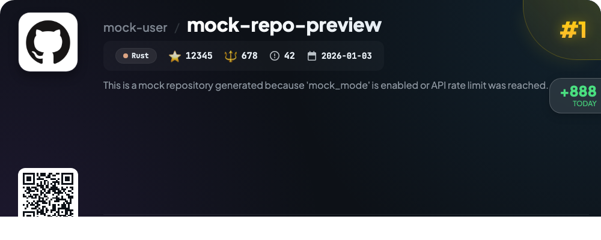

# 📊 🌟 GitHub Trending Daily - 2026-01-03

> > 📅 每日精选 GitHub 热门仓库 | 基于智能算法推荐

## 📋 Overview

**1** 个项目 | **12345** ⭐ | **678** 🍴

**热门语言:** `Rust` (1)

**更新时间:** 2026-01-03 13:08 UTC

**分类分布:**

- 🌟 每日 Top 10 精选 (1 项)

---

## 🌟 每日 Top 10 精选

### 1. [mock-repo-preview](https://github.com/test/mock-repo)

> 🤖 **推荐理由**  
> *mock-repo-preview 是一个基于 Rust 开发的项目，旨在为用户提供一个模拟仓库的预览功能。该项目在启用“mock_mode”或达到 API 速率限制时自动生成模拟数据，确保开发者在测试环境中依然能够获得所需的仓库信息。其核心功能包括支持多种仓库结构和数据类型的模拟，方便用户在无网络连接或受限环境中进行开发和测试。此外，该项目还具备良好的扩展性，允许用户根据自己的需求自定义模拟数据，从而提高了开发效率和灵活性。凭借其简洁的设计和高效的性能，mock-repo-preview 已获得超过 12,000 个星标，成为开发者在构建和测试应用时的重要工具。*

- ⭐ 12345 stars
- 💻 Rust
- 📅 更新: 2026-01-03

---

## 📡 RSS订阅

通过 RSS 订阅，第一时间获取每日精选项目：

- 🔔 [RSS 订阅源] (../../daily-top.xml)
- 🔔 [每日简报] (../../GITHUB_TODAY_CN.md)
- 🔔 [每日 Top 10 精选](../../daily-top.xml)

---

*⚡ Powered by Smart Trending Algorithm | Generated at 2026-01-03 13:08:48 UTC
