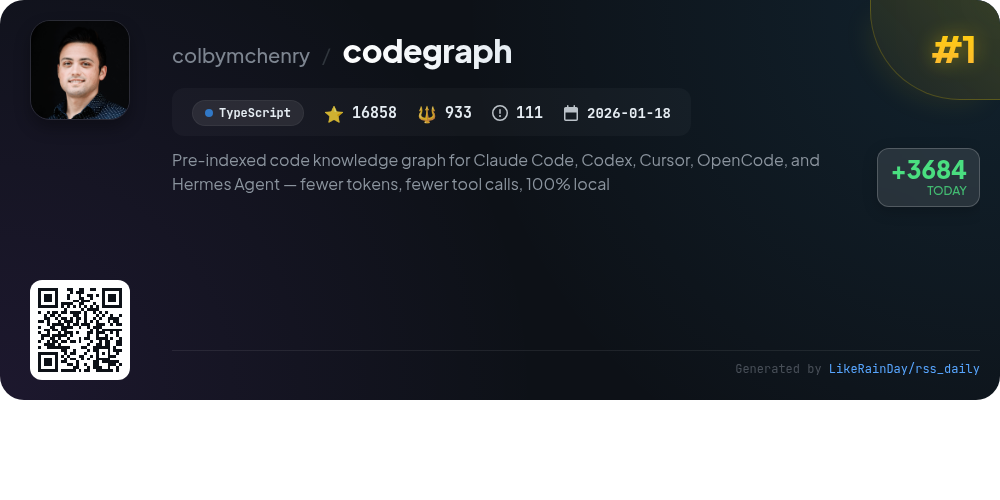
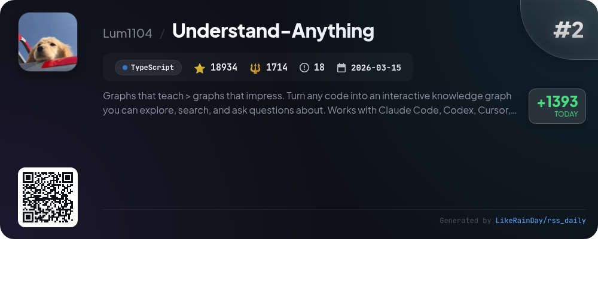
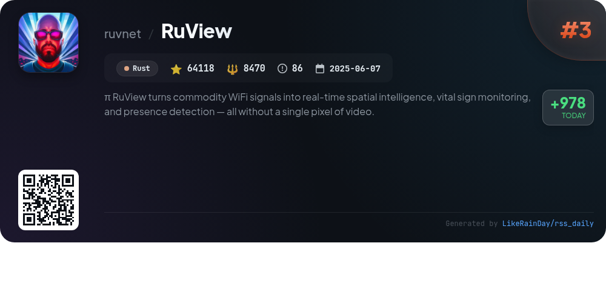
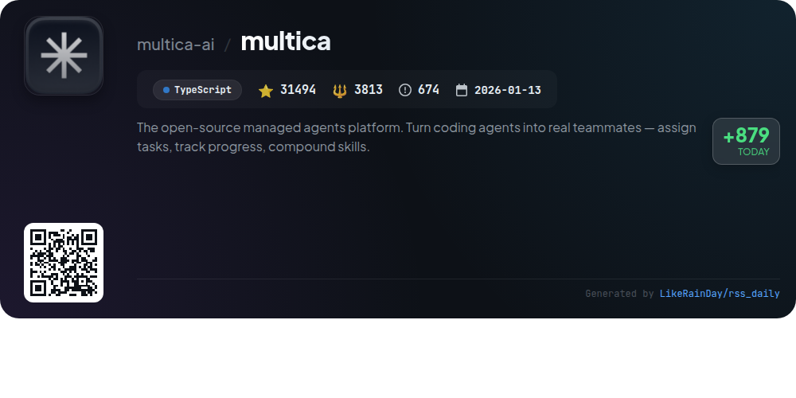
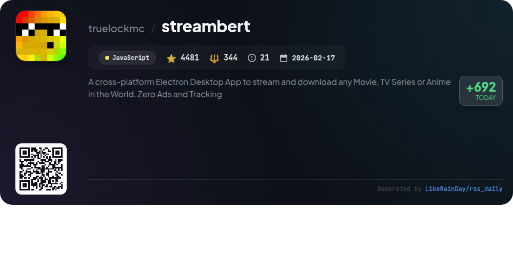
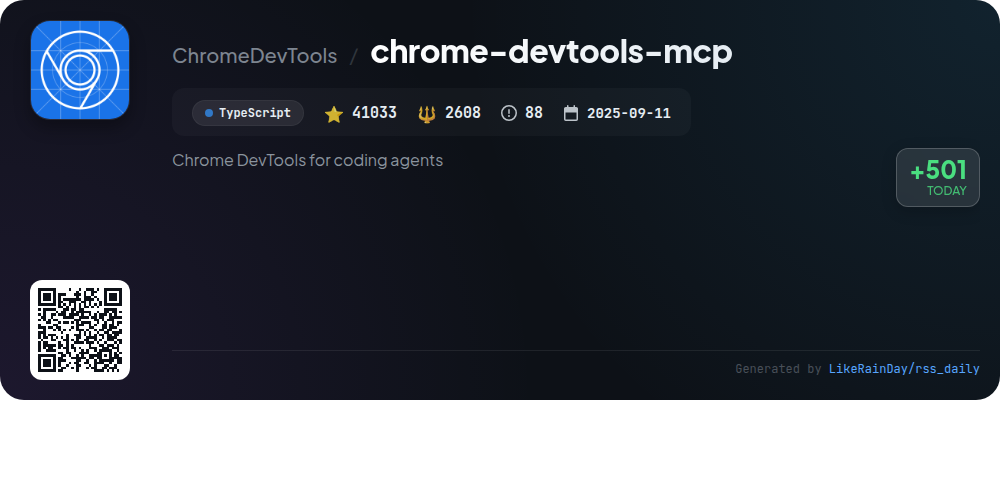
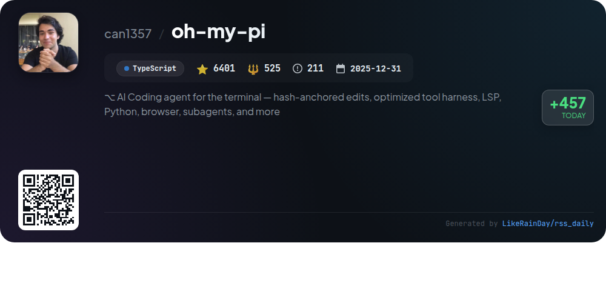
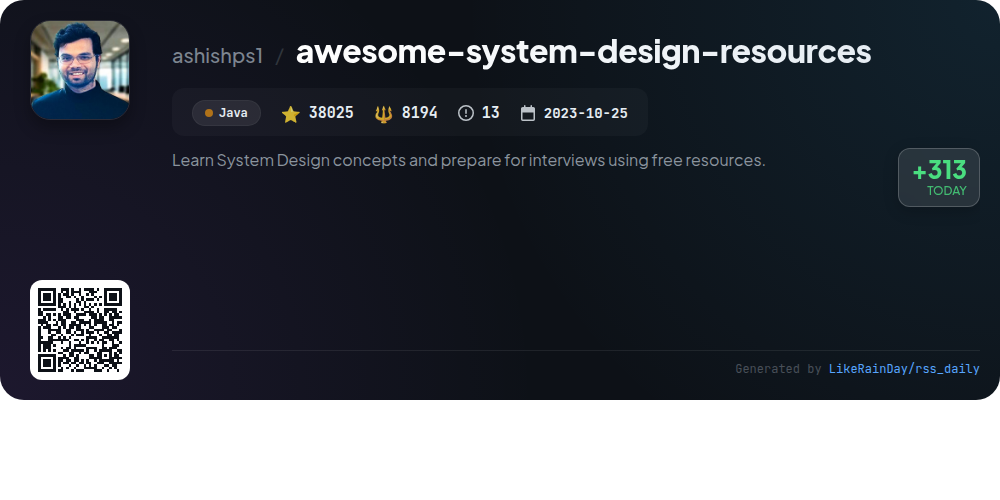
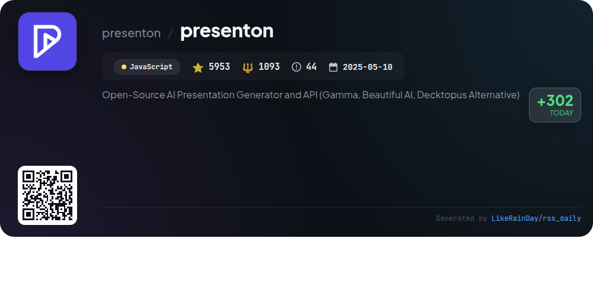

# 📊 🌟 GitHub Trending Daily - 2026-05-23

> > 📅 每日精选 GitHub 热门仓库 | 基于智能算法推荐

## 📋 Overview

**10** 个项目 | **391408** ⭐ | **47098** 🍴

**热门语言:** `TypeScript` (6) · `JavaScript` (2) · `Java` (1)

**更新时间:** 2026-05-23 03:54 UTC

**分类分布:**

- 🌟 每日 Top 10 精选 (10 项)

---

## 🌟 每日 Top 10 精选

### 1. [codegraph](https://github.com/colbymchenry/codegraph)

> 🤖 **推荐理由**  
> *CodeGraph is a pre-indexed code knowledge graph designed for AI coding agents like Claude Code, Codex, and Cursor, enhancing performance with 35% cost savings and 70% fewer tool calls. It offers features such as smart context building, full-text search, and impact analysis across 19+ programming languages. The tool is 100% local, ensuring data privacy, and includes automatic project initialization with a user-friendly installer. CodeGraph keeps its index updated in real-time, providing instant queries and reducing exploration overhead, making it ideal for efficient code exploration and development.*

- ⭐ 16858 stars
- 💻 TypeScript
- 📅 Updated: 2026-05-23

### 2. [Understand-Anything](https://github.com/Lum1104/Understand-Anything)

> 🤖 **推荐理由**  
> *Understand-Anything is an interactive knowledge graph tool that transforms any codebase into a visually navigable map, enhancing understanding and exploration. Compatible with platforms like Claude Code, Codex, and Copilot, it enables users to analyze code structures, visualize dependencies, and understand business logic. Key features include guided tours, fuzzy search, impact analysis, and persona-adaptive UI. The tool supports multi-language outputs and allows seamless collaboration by sharing the generated graph. With over 18,900 stars, it streamlines onboarding and documentation efforts for development teams.*

- ⭐ 18934 stars
- 💻 TypeScript
- 📅 Updated: 2026-05-23

### 3. [RuView](https://github.com/ruvnet/RuView)

> 🤖 **推荐理由**  
> *RuView is an advanced WiFi sensing platform that transforms standard WiFi signals into real-time spatial intelligence, enabling presence detection, vital sign monitoring, and activity recognition without cameras or wearables. Utilizing low-cost ESP32 hardware and sophisticated signal processing, it detects occupancy, breathing, and heart rates through walls and in darkness. Key features include multi-frequency mesh scanning, self-learning AI capabilities, and a modular edge module catalog for various applications, making it ideal for healthcare, security, and smart environments.*

- ⭐ 64118 stars
- 💻 Rust
- 📅 Updated: 2026-05-23

### 4. [multica](https://github.com/multica-ai/multica)

> 🤖 **推荐理由**  
> *The open-source managed agents platform. Turn coding agents into real teammates — assign tasks, track progress, compound skills.. popular project, actively maintained, recently updated*

- ⭐ 31494 stars
- 🍴 3813 forks
- 💻 TypeScript
- 📅 Updated: 2026-05-23

### 5. [streambert](https://github.com/truelockmc/streambert)

> 🤖 **推荐理由**  
> *Streambert is a cross-platform Electron Desktop App designed for streaming and downloading Movies, TV Series, and Anime worldwide, without ads or tracking. Key features include fast streaming, customizable interface, subtitle management, and a library to track and save content. Users can download media via .m3u8 playlists and access Anime metadata from AniList. With over 4,481 stars on GitHub, Streambert is privacy-focused and offers a user-friendly experience, making it an ideal choice for media enthusiasts.*

- ⭐ 4481 stars
- 💻 JavaScript
- 📅 Updated: 2026-05-23

### 6. [chrome-devtools-mcp](https://github.com/ChromeDevTools/chrome-devtools-mcp)

> 🤖 **推荐理由**  
> *chrome-devtools-mcp is a TypeScript project that enables coding agents like Antigravity and Copilot to control and inspect live Chrome browsers. With over 41,000 stars, it acts as a Model-Context-Protocol (MCP) server, providing agents access to the full suite of Chrome DevTools for automation, debugging, and performance analysis. Key features include performance insights, advanced debugging tools, and reliable automation using Puppeteer. The project supports Google Chrome and offers CLI usage, ensuring developers can easily integrate powerful browser capabilities into their AI tools.*

- ⭐ 41033 stars
- 💻 TypeScript
- 📅 Updated: 2026-05-23

### 7. [opencode](https://github.com/anomalyco/opencode)

> 🤖 **推荐理由**  
> *OpenCode is an open-source AI coding agent built in TypeScript, boasting over 164,000 stars on GitHub. It features two primary agents: a full-access "build" agent for development and a "plan" agent for code exploration, ensuring safe interactions with codebases. The project offers a desktop app for macOS, Windows, and Linux, with straightforward installation via multiple package managers. Comprehensive documentation and community support via Discord enhance user experience. OpenCode is designed for developers seeking advanced coding assistance and exploration tools.*

- ⭐ 164111 stars
- 💻 TypeScript
- 📅 Updated: 2026-05-23

### 8. [oh-my-pi](https://github.com/can1357/oh-my-pi)

> 🤖 **推荐理由**  
> *oh-my-pi is an AI coding agent designed for terminal use, featuring over 40 providers and 32 built-in tools for optimized coding workflows. Key highlights include advanced code execution, integrated LSP support, real-time debugging, and subagent task management. It allows hash-anchored edits, memory curation for project context, and can operate across multiple platforms seamlessly. The agent supports interactive and one-shot commands, making it versatile for developers. Built on TypeScript and Rust, it provides efficient performance and extensibility. More info at omp.sh.*

- ⭐ 6401 stars
- 💻 TypeScript
- 📅 Updated: 2026-05-23

### 9. [awesome-system-design-resources](https://github.com/ashishps1/awesome-system-design-resources)

> 🤖 **推荐理由**  
> *The "awesome-system-design-resources" GitHub project offers a comprehensive collection of free resources for mastering System Design concepts and preparing for interviews, boasting over 38,000 stars. Key features include detailed explanations of core concepts like scalability, availability, and caching, alongside practical interview problems ranging from easy to hard. The repository also provides networking, API, database, and architectural fundamentals, along with recommended courses, newsletters, books, and YouTube channels, making it an invaluable resource for aspiring software engineers.*

- ⭐ 38025 stars
- 💻 Java
- 📅 Updated: 2026-05-23

### 10. [presenton](https://github.com/presenton/presenton)

> 🤖 **推荐理由**  
> *Presenton is an open-source AI presentation generator and API, designed as an alternative to platforms like Gamma and Beautiful AI. With over 5,900 stars on GitHub, it offers self-hosting via Docker or a desktop app for macOS, Windows, and Linux. Key features include integration with multiple AI models (OpenAI, Gemini, etc.), customizable templates, and fully editable PPTX export. Users benefit from data privacy, API deployment capabilities, and rich media support. Presenton is fully open-source (Apache 2.0) and enables flexible presentation generation from prompts or documents.*

- ⭐ 5953 stars
- 💻 JavaScript
- 📅 Updated: 2026-05-23

---

## 📡 RSS订阅

通过 RSS 订阅，第一时间获取每日精选项目：

- 🔔 [RSS 订阅源] (../../daily-top.xml)
- 🔔 [每日简报] (../../GITHUB_TODAY_CN.md)
- 🔔 [每日 Top 10 精选](../../daily-top.xml)

---

*⚡ Powered by Smart Trending Algorithm | Generated at 2026-05-23 03:54:16 UTC
