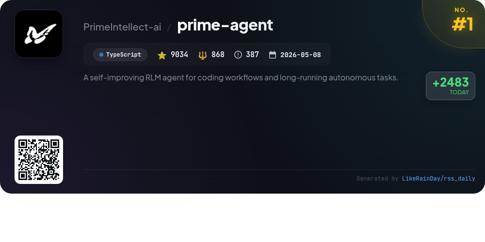
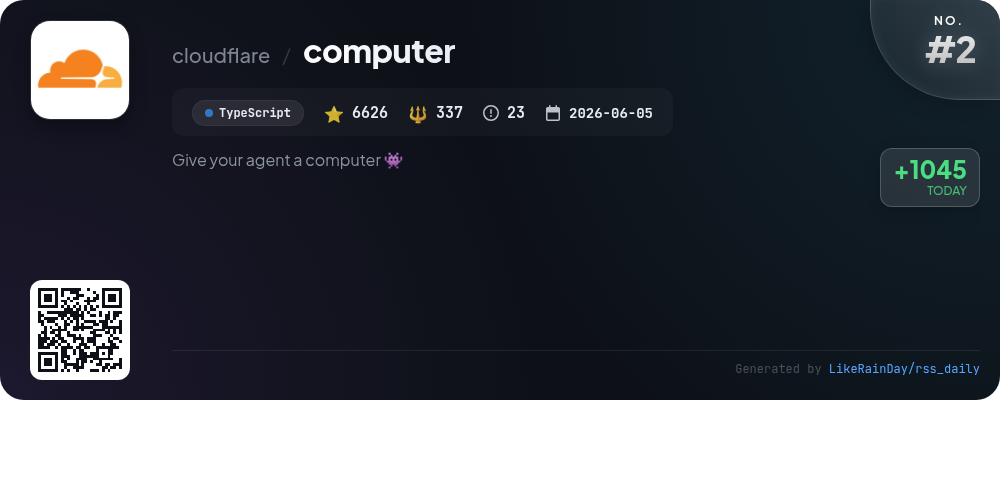
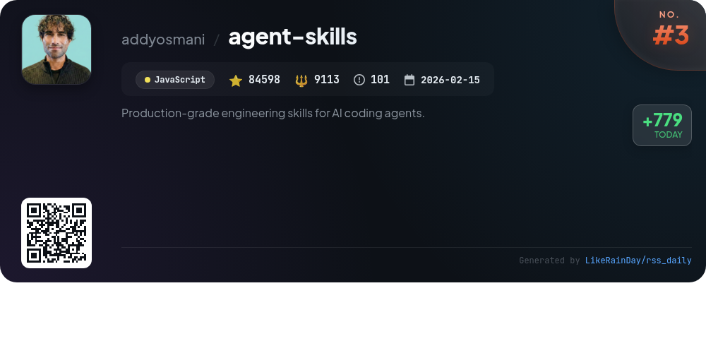
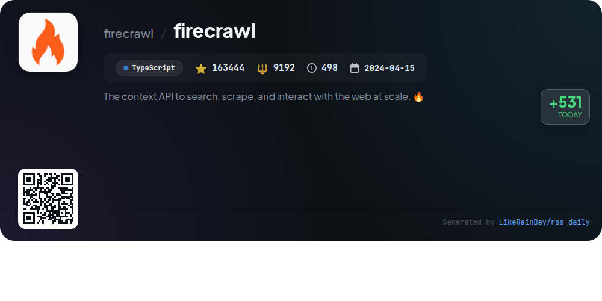
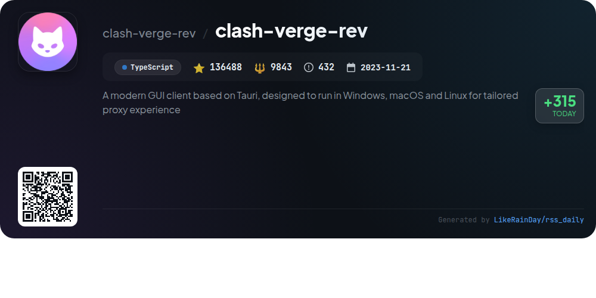
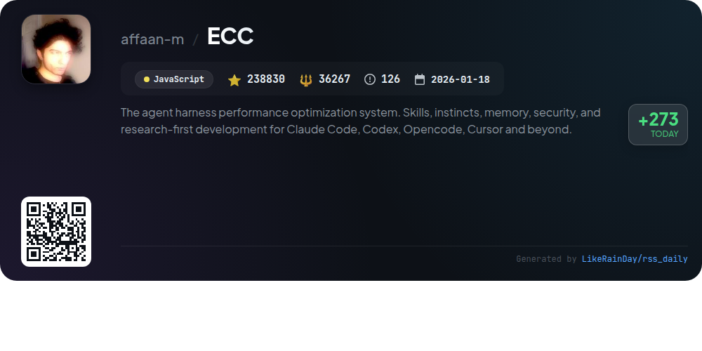

# 📊 🌟 GitHub Trending Daily - 2026-08-09

> > 📅 每日精选 GitHub 热门仓库 | 基于智能算法推荐

## 📋 Overview

**10** 个项目 | **931168** ⭐ | **96420** 🍴

**热门语言:** `TypeScript` (5) · `JavaScript` (3) · `Rust` (1)

**更新时间:** 2026-08-09 02:12 UTC

**分类分布:**

- 🌟 每日 Top 10 精选 (10 项)

---

## 🌟 每日 Top 10 精选

### 1. [prime-agent](https://github.com/PrimeIntellect-ai/prime-agent)

> 🤖 **推荐理由**  
> *Prime Agent is an open-source self-improving RLM agent designed for coding workflows and long-running tasks. It features a persistent Python control environment, allowing programmatic interactions and management of context via subagents. Key highlights include the Continual Harness for durable state updates, background operation of sessions, direct agent communication, and autonomous mode for continuous execution. With built-in skills, reusable workflows, and support for long-term goals, Prime Agent enhances productivity in research and development.*

- ⭐ 9034 stars
- 💻 TypeScript
- 📅 Updated: 2026-08-09

### 2. [computer](https://github.com/cloudflare/computer)

> 🤖 **推荐理由**  
> *Cloudflare Computer is a TypeScript-based virtual filesystem hosted in a Durable Object, leveraging SQLite for authoritative state management. It features three execution backends: 

1. **Container** - integrates with a FUSE mount for full Linux capabilities.
2. **Isolate shell** - utilizes just-bash in a Dynamic Worker for seamless Worker RPC communication.
3. **Isolate JavaScript** - runs ECMAScript modules with durable imports and built-in libraries.

Designed for experimentation and prototyping, it supports multiple backends, offering extensive examples and documentation. Currently in preview, it is not production-ready.*

- ⭐ 6626 stars
- 💻 TypeScript
- 📅 Updated: 2026-08-09

### 3. [agent-skills](https://github.com/addyosmani/agent-skills)

> 🤖 **推荐理由**  
> *Agent Skills is a GitHub project offering production-grade engineering workflows for AI coding agents, enabling them to adhere to best practices in software development. With 24 structured skills, it covers the entire development lifecycle—from defining and planning to building, verifying, reviewing, and shipping code. Key features include automated skill activation based on tasks, a comprehensive CLI for installation across various agents, and specialized personas for targeted code reviews. This toolkit enhances code quality by embedding engineering principles and verification processes, streamlining the development process.*

- ⭐ 84598 stars
- 💻 JavaScript
- 📅 Updated: 2026-08-09

### 4. [witr](https://github.com/pranshuparmar/witr)

> 🤖 **推荐理由**  
> *witr is a powerful tool designed to trace any process, port, container, or file back to its origin, answering the question "Why is this running?" It features a command-line interface (CLI) and an interactive terminal user interface (TUI) for a user-friendly experience. Key highlights include real-time process monitoring, detailed ancestry trees, and multi-platform support (Linux, macOS, Windows, FreeBSD). Its ability to provide machine-readable JSON output and integrate with various package managers enhances usability, making it an essential tool for systems administrators and developers.*

- ⭐ 20146 stars
- 💻 Go
- 📅 Updated: 2026-08-09

### 5. [firecrawl](https://github.com/firecrawl/firecrawl)

> 🤖 **推荐理由**  
> *Firecrawl is a powerful context API for searching, scraping, and interacting with the web at scale. Key features include industry-leading reliability across 96% of the web, fast data retrieval with a P95 latency of 3.4s, and the ability to output clean Markdown or structured JSON. It simplifies complex tasks like rotating proxies and JS-blocked content, enabling seamless integration with AI agents. Core services include web search, content scraping, interactive scraping, and automated data gathering. Firecrawl is open source and offers a hosted service for enhanced capabilities.*

- ⭐ 163444 stars
- 💻 TypeScript
- 📅 Updated: 2026-08-09

### 6. [taste-skill](https://github.com/Leonxlnx/taste-skill)

> 🤖 **推荐理由**  
> *Taste-Skill is an innovative JavaScript framework designed to enhance AI-generated frontends, preventing the generation of generic UIs. With over 74,000 stars, it offers a suite of portable Agent Skills that improve layout, typography, and motion, making interfaces more visually appealing. Key features include customizable design parameters, image-generation capabilities, and specialized skills for various design needs. The framework is compatible with major coding agents like ChatGPT and Codex, enabling seamless integration and implementation of advanced design principles in AI projects.*

- ⭐ 74289 stars
- 💻 JavaScript
- 📅 Updated: 2026-08-09

### 7. [celld](https://github.com/denoland/celld)

> 🤖 **推荐理由**  
> *celld is a self-hosted, distributed implementation of Durable Objects, enabling users to run Cloudflare Workers on their own infrastructure. Each object operates as an individual SQLite database, reducing contention and failure risks. Key features include S3-compatible storage for state replication, automatic hibernation of idle cells, and a decentralized coordination mechanism without a control plane. The project is built in Rust, supports Docker, and offers a command-line interface for deployment and diagnostics, making it efficient for scalable applications.*

- ⭐ 2596 stars
- 💻 Rust
- 📅 Updated: 2026-08-09

### 8. [opencode](https://github.com/anomalyco/opencode)

> 🤖 **推荐理由**  
> *OpenCode is an open-source AI coding agent built in TypeScript, boasting over 195,000 stars on GitHub. It features two main agents: a full-access "build" agent for development and a read-only "plan" agent for analysis, making it ideal for exploring unfamiliar codebases. The project offers a desktop app for macOS, Windows, and Linux, alongside easy installation via various package managers. Comprehensive documentation and a supportive community on Discord enhance the user experience, making OpenCode a valuable tool for developers.*

- ⭐ 195117 stars
- 💻 TypeScript
- 📅 Updated: 2026-08-09

### 9. [clash-verge-rev](https://github.com/clash-verge-rev/clash-verge-rev)

> 🤖 **推荐理由**  
> *Clash Verge Rev is a modern GUI client built on Tauri, designed for Windows, macOS, and Linux, offering a tailored proxy experience. Key features include a sleek, customizable interface, support for the Clash.Meta core, configuration management, system proxy modes, and visual node editing. The project supports multiple languages and provides installation packages for various platforms. Notable services include high-performance VPN solutions and an AI customer support platform. With 136,488 stars, it emphasizes reliability and user satisfaction while enabling advanced proxy functionalities.*

- ⭐ 136488 stars
- 💻 TypeScript
- 📅 Updated: 2026-08-09

### 10. [ECC](https://github.com/affaan-m/ECC)

> 🤖 **推荐理由**  
> *ECC is an advanced performance optimization system for coding agents, featuring 67 specialized agents, 284 reusable skills, and 94 command shims. It streamlines workflows with capabilities like planning, testing, and security reviews, while integrating seamlessly with platforms like Claude Code, Codex, and Cursor. Key highlights include the AgentShield for security auditing, continuous learning through instincts, and a unified memory vault for cross-harness context sharing. ECC is open-source (MIT) and supports multiple languages, making it a versatile tool for developers seeking efficiency and quality in their coding processes.*

- ⭐ 238830 stars
- 💻 JavaScript
- 📅 Updated: 2026-08-09

---

## 📡 RSS订阅

通过 RSS 订阅，第一时间获取每日精选项目：

- 🔔 [RSS 订阅源] (../../daily-top.xml)
- 🔔 [每日简报] (../../GITHUB_TODAY_CN.md)
- 🔔 [每日 Top 10 精选](../../daily-top.xml)

---

*⚡ Powered by Smart Trending Algorithm | Generated at 2026-08-09 02:12:04 UTC
