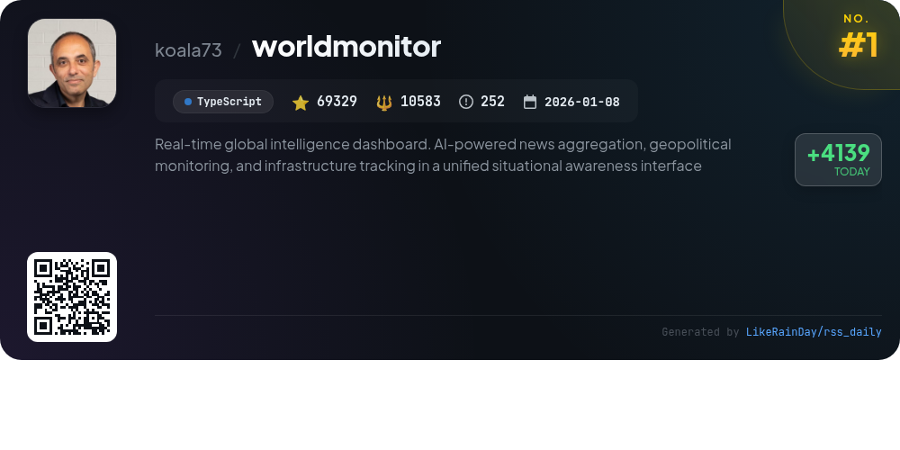
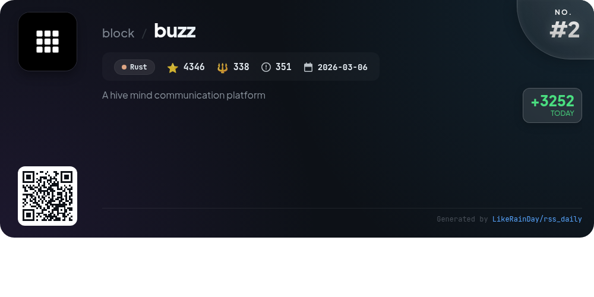
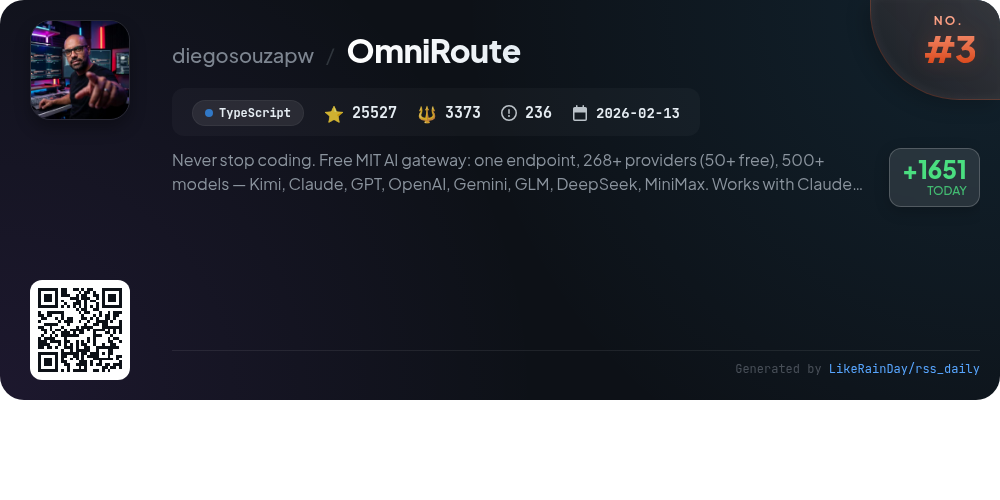
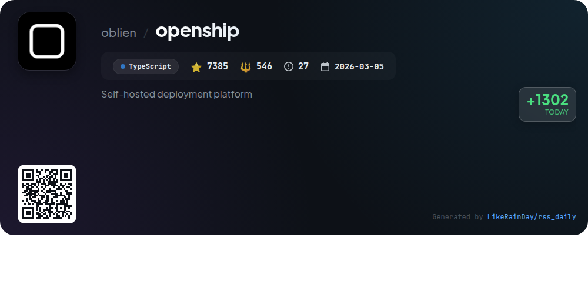
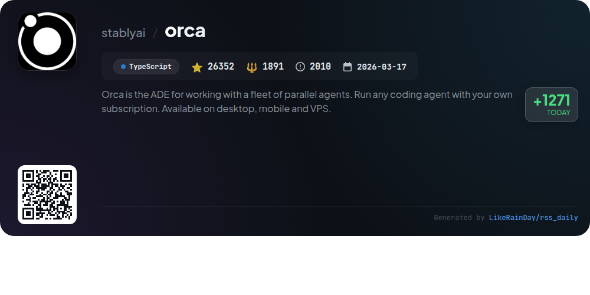
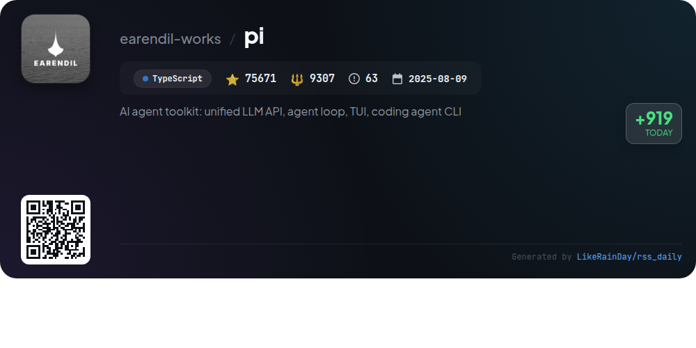
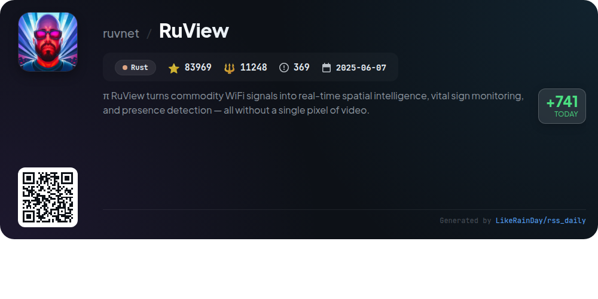
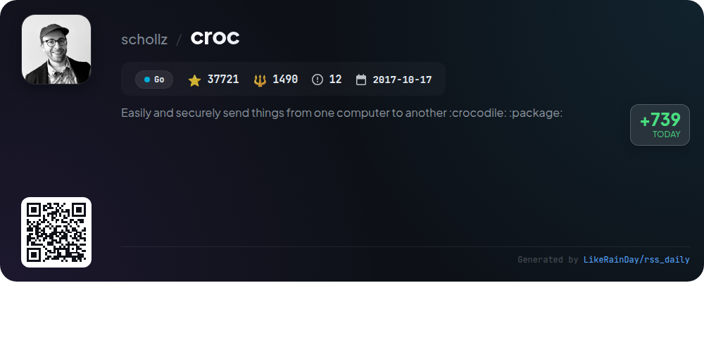
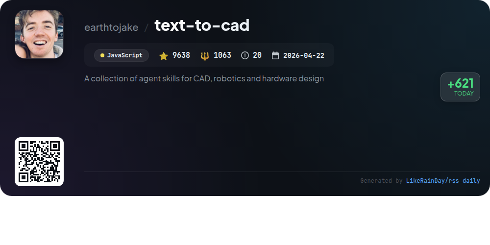
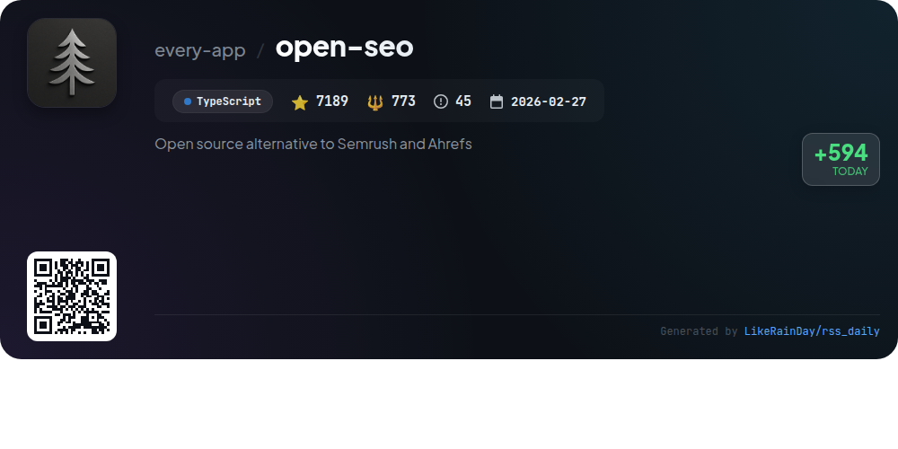

# 📊 🌟 GitHub Trending Daily - 2026-07-23

> > 📅 每日精选 GitHub 热门仓库 | 基于智能算法推荐

## 📋 Overview

**10** 个项目 | **347127** ⭐ | **40612** 🍴

**热门语言:** `TypeScript` (6) · `Rust` (2) · `Go` (1)

**更新时间:** 2026-07-23 03:29 UTC

**分类分布:**

- 🌟 每日 Top 10 精选 (10 项)

---

## 🌟 每日 Top 10 精选

### 1. [worldmonitor](https://github.com/koala73/worldmonitor)

> 🤖 **推荐理由**  
> *WorldMonitor is a real-time global intelligence dashboard that leverages AI for news aggregation, geopolitical monitoring, and infrastructure tracking, providing a unified situational awareness interface. Key features include 500+ curated news feeds, a dual map engine (3D globe and WebGL flat map), and cross-stream correlation of military, economic, and disaster signals. It offers a Country Instability Index, finance radar for stock exchanges and commodities, and supports 25 languages. Available as a native desktop app for multiple platforms, WorldMonitor also provides APIs and SDKs for programmatic access.*

- ⭐ 69329 stars
- 💻 TypeScript
- 📅 Updated: 2026-07-23

### 2. [buzz](https://github.com/block/buzz)

> 🤖 **推荐理由**  
> *Buzz is a self-hostable communication platform designed for collaboration between humans and AI agents. It operates as a single-relay workspace, where every interaction—messages, workflow steps, and git events—are logged and auditable. Key features include agent-assisted bug triage, integrated feature branch collaboration, and a unified search across conversations and events. Buzz facilitates seamless teamwork, allowing agents to manage workflows and engage in discussions with the same capabilities as human members. With 4,346 stars on GitHub, it represents a substantial advancement in AI-integrated development tools.*

- ⭐ 4346 stars
- 💻 Rust
- 📅 Updated: 2026-07-23

### 3. [OmniRoute](https://github.com/diegosouzapw/OmniRoute)

> 🤖 **推荐理由**  
> *OmniRoute is a free AI gateway providing access to over 278 providers (90+ free tiers) through a single endpoint. Key features include intelligent auto-fallback across providers, token compression saving 15-95%, and compatibility with multiple coding tools like Claude Code and Codex. With 500+ models available, OmniRoute supports quota-sharing for teams, real-time usage analytics, and extensive routing strategies. Developed by 500+ contributors, it offers a robust, open-source solution for seamless AI model integration, ensuring users never hit limits while coding.*

- ⭐ 25527 stars
- 💻 TypeScript
- 📅 Updated: 2026-07-23

### 4. [openship](https://github.com/oblien/openship)

> 🤖 **推荐理由**  
> *Openship is a powerful open-source, self-hosted deployment platform that simplifies code deployment and infrastructure management through a desktop app, web dashboard, or CLI. With built-in CI/CD, it supports any tech stack and automates processes like domain management, SSL provisioning, and backups. Key features include real-time monitoring, scaling options, and a user-friendly interface. Openship can be deployed on various environments, from personal machines to cloud servers, making it suitable for solo developers and teams alike.*

- ⭐ 7385 stars
- 💻 TypeScript
- 📅 Updated: 2026-07-23

### 5. [orca](https://github.com/stablyai/orca)

> 🤖 **推荐理由**  
> *Orca is an advanced development environment (ADE) designed for managing a fleet of parallel agents, enabling users to run coding agents like Codex and ClaudeCode in parallel worktrees. Key features include a mobile companion app for remote monitoring, terminal splits for enhanced productivity, and integrated GitHub and Linear support for seamless task management. Users can annotate AI diffs, drag files directly into prompts, and utilize an extensive CLI for scripting workflows. Orca supports macOS, Windows, and Linux, making it versatile for developers.*

- ⭐ 26352 stars
- 💻 TypeScript
- 📅 Updated: 2026-07-23

### 6. [pi](https://github.com/earendil-works/pi)

> 🤖 **推荐理由**  
> *Pi is an AI agent toolkit that offers a unified LLM API, an interactive coding agent CLI, and a terminal UI library, all built in TypeScript. Key features include the **[@earendil-works/pi-ai](packages/ai)** for multi-provider LLM integrations, the **[@earendil-works/pi-agent-core](packages/agent)** for tool calling and state management, and the **[@earendil-works/pi-coding-agent](packages/coding-agent)** for coding automation. Pi emphasizes extensibility, security through containerization options, and community engagement via Discord. Visit [pi.dev](https://pi.dev) for more information.*

- ⭐ 75671 stars
- 💻 TypeScript
- 📅 Updated: 2026-07-23

### 7. [RuView](https://github.com/ruvnet/RuView)

> 🤖 **推荐理由**  
> *RuView transforms WiFi signals into real-time spatial intelligence, enabling presence detection, vital sign monitoring, and activity recognition without cameras or wearables. It supports major smart home ecosystems like Home Assistant, Apple Home, Google Home, and Amazon Alexa, allowing seamless integration. Key features include through-wall sensing, breathing and heart rate measurement, and environment mapping. Built on low-cost ESP32 hardware, RuView operates entirely on edge devices, ensuring privacy and low latency while delivering comprehensive monitoring capabilities in diverse environments.*

- ⭐ 83969 stars
- 💻 Rust
- 📅 Updated: 2026-07-23

### 8. [croc](https://github.com/schollz/croc)

> 🤖 **推荐理由**  
> *Croc is a powerful CLI tool for secure file and folder transfers between any two computers, leveraging end-to-end encryption via PAKE. It supports cross-platform usage (Windows, macOS, Linux), allows multiple file transfers, and can resume interrupted transfers. Notable features include relay support without the need for port forwarding, IPv6-first compatibility, and proxy usage (including Tor). Users can customize transfer options, self-host relays, and utilize QR codes for mobile accessibility. With over 37,000 stars, Croc stands out for its ease of use and robust security measures.*

- ⭐ 37721 stars
- 💻 Go
- 📅 Updated: 2026-07-23

### 9. [text-to-cad](https://github.com/earthtojake/text-to-cad)

> 🤖 **推荐理由**  
> *text-to-cad is a skill library designed for CAD, robotics, and hardware design, featuring 10 core skills. Key functionalities include generating and editing CAD models from plain language, creating URDF files for robot descriptions, and producing 2D DXF drawings. The library supports multiple export formats like STEP, STL, and G-code, facilitating workflows for fabrication and simulation. Users can preview designs in a browser and find off-the-shelf CAD parts. With over 9,600 stars on GitHub, it encourages collaboration and contributions within the CAD community.*

- ⭐ 9638 stars
- 💻 JavaScript
- 📅 Updated: 2026-07-23

### 10. [open-seo](https://github.com/every-app/open-seo)

> 🤖 **推荐理由**  
> *OpenSEO is an open-source SEO tool designed as an affordable alternative to Semrush and Ahrefs, featuring a modern, user-friendly interface. Key functionalities include keyword research, rank tracking, competitor insights, backlinks, site audits, and AI visibility. It enables integration with AI agents like Claude Code and OpenClaw through a customizable MCP server. Users can self-host via Docker or Cloudflare, requiring a DataForSEO API key for data access. OpenSEO offers a hosted version for $10/month, promoting a pay-as-you-go model without subscriptions.*

- ⭐ 7189 stars
- 💻 TypeScript
- 📅 Updated: 2026-07-23

---

## 📡 RSS订阅

通过 RSS 订阅，第一时间获取每日精选项目：

- 🔔 [RSS 订阅源] (../../daily-top.xml)
- 🔔 [每日简报] (../../GITHUB_TODAY_CN.md)
- 🔔 [每日 Top 10 精选](../../daily-top.xml)

---

*⚡ Powered by Smart Trending Algorithm | Generated at 2026-07-23 03:29:23 UTC
