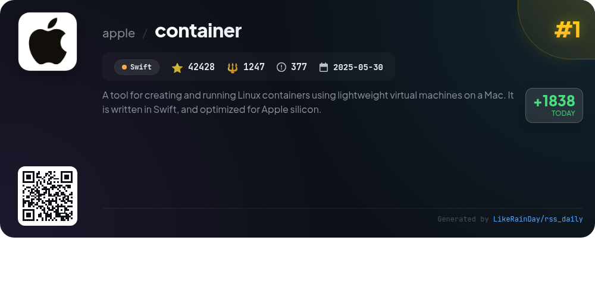
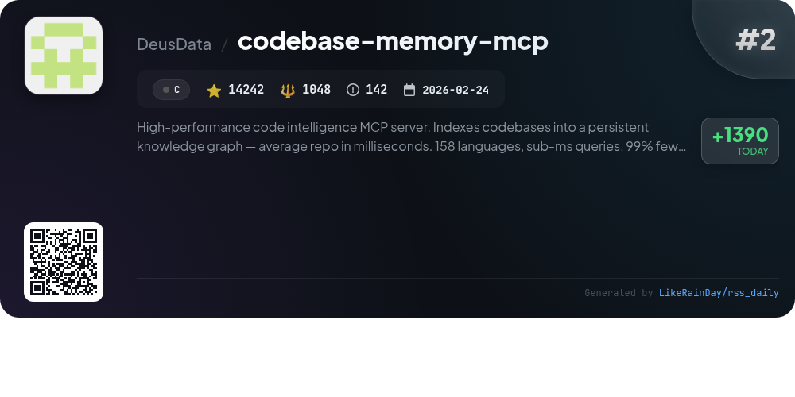
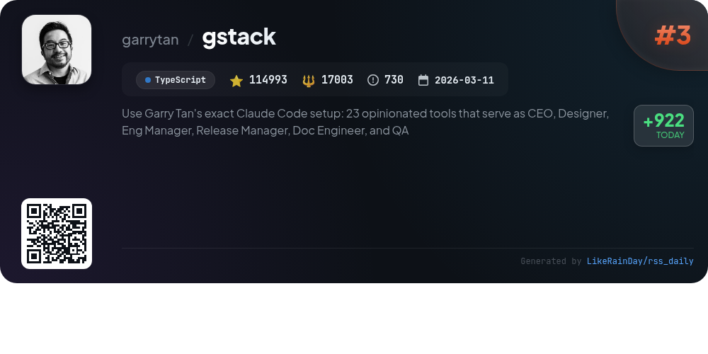
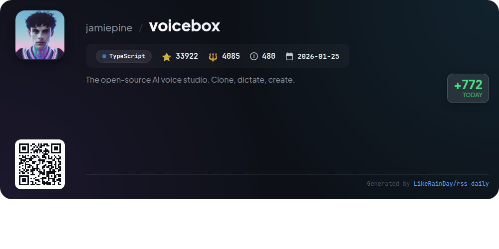
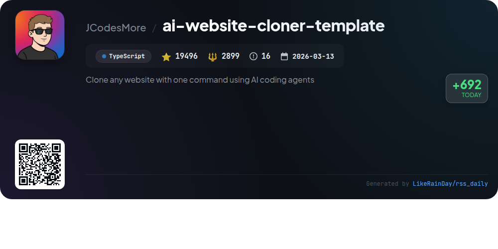
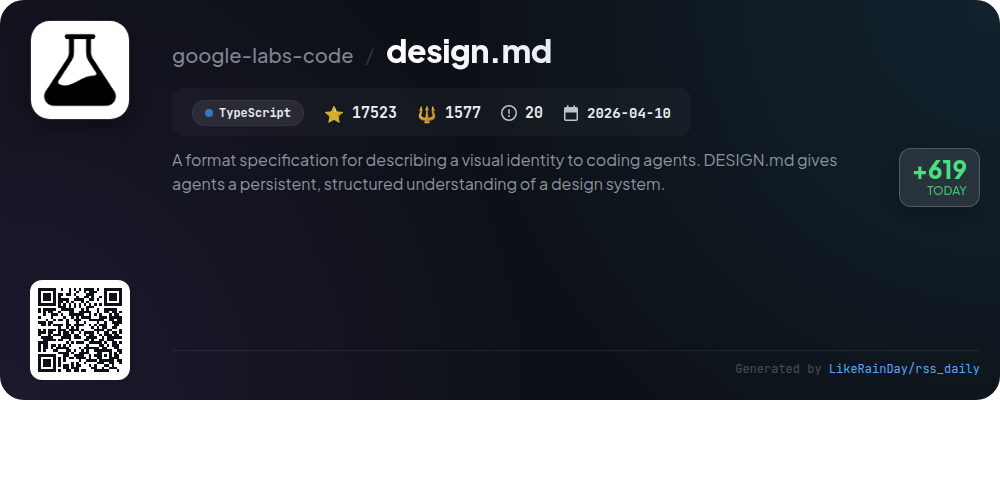
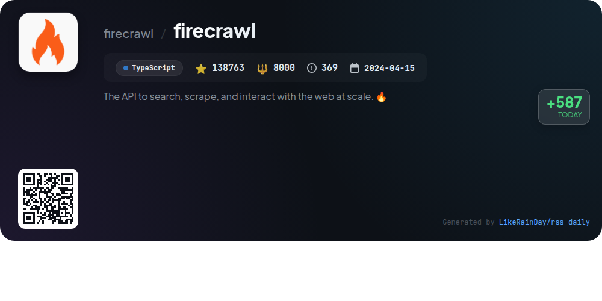
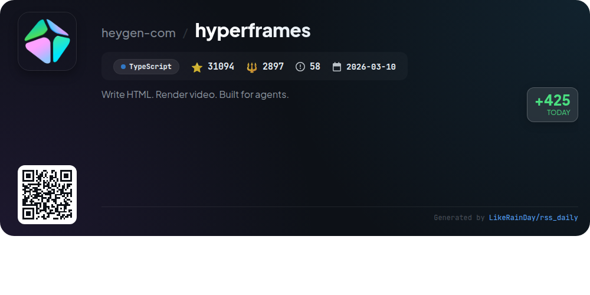
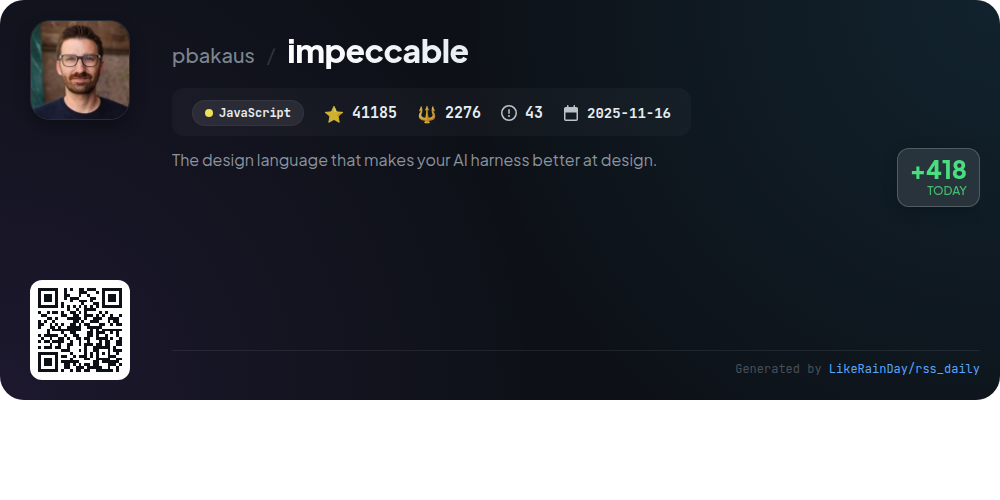

# 📊 🌟 GitHub Trending Daily - 2026-06-25

> > 📅 每日精选 GitHub 热门仓库 | 基于智能算法推荐

## 📋 Overview

**10** 个项目 | **482056** ⭐ | **42587** 🍴

**热门语言:** `TypeScript` (6) · `JavaScript` (1) · `Rust` (1)

**更新时间:** 2026-06-25 04:10 UTC

**分类分布:**

- 🌟 每日 Top 10 精选 (10 项)

---

## 🌟 每日 Top 10 精选

### 1. [container](https://github.com/apple/container)

> 🤖 **推荐理由**  
> *`container` is a Swift-based tool for creating and running Linux containers as lightweight virtual machines on Mac, optimized for Apple silicon. It supports OCI-compatible container images, enabling users to pull, run, and push images from standard registries. Key features include seamless installation, upgrade, downgrade, and uninstallation processes, alongside robust documentation and a guided tour for new users. The project is actively developed, with stability guaranteed within patch versions. Contributions are encouraged, enhancing its growing ecosystem.*

- ⭐ 42428 stars
- 💻 Swift
- 📅 Updated: 2026-06-25

### 2. [codebase-memory-mcp](https://github.com/DeusData/codebase-memory-mcp)

> 🤖 **推荐理由**  
> *High-performance code intelligence MCP server. Indexes codebases into a persistent knowledge graph — average repo in milliseconds. 158 languages, su. popular project, actively maintained, recently updated*

- ⭐ 14242 stars
- 🍴 1048 forks
- 💻 C
- 📅 Updated: 2026-06-25

### 3. [cli](https://github.com/googleworkspace/cli)

> 🤖 **推荐理由**  
> *The Google Workspace CLI (`gws`) is a dynamic command-line tool for managing Google services like Drive, Gmail, Calendar, Sheets, and Docs, built in Rust. It leverages Google’s Discovery Service to automatically adapt to new API endpoints, ensuring a seamless experience. Key features include structured JSON output, 40+ AI agent skills for enhanced automation, and user-friendly commands with built-in help and dry-run options. Ideal for both humans and AI agents, it simplifies API interactions while supporting various authentication methods. Note: This is not an official Google product.*

- ⭐ 28410 stars
- 💻 Rust
- 📅 Updated: 2026-06-25

### 4. [gstack](https://github.com/garrytan/gstack)

> 🤖 **推荐理由**  
> *gstack is an open-source toolset designed to enhance productivity for founders, engineers, and designers by leveraging AI. It transforms Claude Code into a virtual team, offering 23 specialized roles such as CEO, Designer, and QA Lead, through simple slash commands. Key features include automated planning, code reviews, QA testing, and documentation updates, streamlining the entire product development process from ideation to deployment. With robust support for multiple AI agents and a focus on safety, gstack enables rapid, efficient shipping of software, significantly increasing productivity while ensuring quality.*

- ⭐ 114993 stars
- 💻 TypeScript
- 📅 Updated: 2026-06-25

### 5. [voicebox](https://github.com/jamiepine/voicebox)

> 🤖 **推荐理由**  
> *Voicebox is an open-source AI voice studio enabling users to clone voices, generate speech, and dictate into any application. Key features include voice cloning from audio samples, support for seven TTS engines across 23 languages, and global dictation hotkeys. Voicebox ensures complete privacy, with all processing done locally. It offers advanced post-processing effects, expressive speech capabilities, and a multi-track stories editor. Additionally, it provides REST API integration for custom applications and runs on macOS, Windows, and Linux. With over 33,000 stars, Voicebox is a robust alternative to proprietary solutions.*

- ⭐ 33922 stars
- 💻 TypeScript
- 📅 Updated: 2026-06-25

### 6. [ai-website-cloner-template](https://github.com/JCodesMore/ai-website-cloner-template)

> 🤖 **推荐理由**  
> *The AI Website Cloner Template allows users to effortlessly clone any website into a clean, modern Next.js codebase with a single command using various AI coding agents, such as Claude Code. Key features include design token extraction, detailed component specifications, and parallel builders for efficient reconstruction. Ideal for platform migrations, recovering lost code, or educational purposes, it supports multiple AI agents and leverages a robust tech stack including Next.js and TypeScript. The project is open-source under the MIT license and has garnered significant interest with nearly 20,000 stars on GitHub.*

- ⭐ 19496 stars
- 💻 TypeScript
- 📅 Updated: 2026-06-25

### 7. [design.md](https://github.com/google-labs-code/design.md)

> 🤖 **推荐理由**  
> *DESIGN.md is a TypeScript-based format specification that enables coding agents to understand and implement design systems with a structured approach. It combines machine-readable design tokens in YAML with human-readable rationale in Markdown, offering clarity on design choices. Key features include linting for structural correctness, version comparison for detecting changes, and exporting tokens to formats like Tailwind. With over 17,500 stars, DESIGN.md facilitates seamless integration of visual identity into coding workflows, enhancing consistency and efficiency in UI development.*

- ⭐ 17523 stars
- 💻 TypeScript
- 📅 Updated: 2026-06-25

### 8. [firecrawl](https://github.com/firecrawl/firecrawl)

> 🤖 **推荐理由**  
> *Firecrawl is a powerful API designed for scalable web search, scraping, and interaction, built with TypeScript. With over 138k stars, it offers industry-leading reliability, covering 96% of the web, including JavaScript-heavy pages. Key features include real-time data extraction in clean Markdown or structured JSON, autonomous data gathering via an AI agent, and capabilities to interact with web pages. Firecrawl simplifies complex tasks like crawling entire websites and batch scraping multiple URLs, all while managing proxies and rate limits seamlessly. It's open-source, inviting community collaboration.*

- ⭐ 138763 stars
- 💻 TypeScript
- 📅 Updated: 2026-06-25

### 9. [hyperframes](https://github.com/heygen-com/hyperframes)

> 🤖 **推荐理由**  
> *HyperFrames is an open-source framework that transforms HTML and CSS into deterministic MP4 videos, designed for use with AI agents. Key features include a CLI for composition scaffolding, live previewing, and rendering, as well as support for seekable animations via various libraries like GSAP and Lottie. Users can create diverse video content—from product launches to data visualizations—using simple HTML files. HyperFrames emphasizes agent-friendliness, deterministic output, and direct browser compatibility, making video creation accessible and efficient. Explore its capabilities at hyperframes.dev.*

- ⭐ 31094 stars
- 💻 TypeScript
- 📅 Updated: 2026-06-25

### 10. [impeccable](https://github.com/pbakaus/impeccable)

> 🤖 **推荐理由**  
> *Impeccable is a JavaScript design language tool that enhances AI-driven frontend design with 23 commands and 44 deterministic rules. It streamlines the design process through a single setup command (`/impeccable init`), providing context for later commands. Key features include visual iteration, UX audits, and performance checks, all accessible via a unified CLI. It integrates with major tools like Claude Code and GitHub Copilot, ensuring high-quality design while avoiding common anti-patterns. Full documentation is available at impeccable.style.*

- ⭐ 41185 stars
- 💻 JavaScript
- 📅 Updated: 2026-06-25

---

## 📡 RSS订阅

通过 RSS 订阅，第一时间获取每日精选项目：

- 🔔 [RSS 订阅源] (../../daily-top.xml)
- 🔔 [每日简报] (../../GITHUB_TODAY_CN.md)
- 🔔 [每日 Top 10 精选](../../daily-top.xml)

---

*⚡ Powered by Smart Trending Algorithm | Generated at 2026-06-25 04:10:12 UTC
