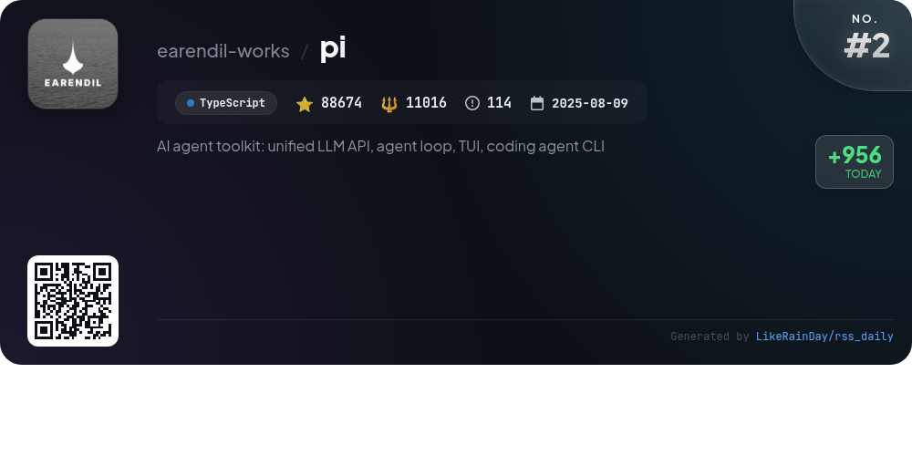
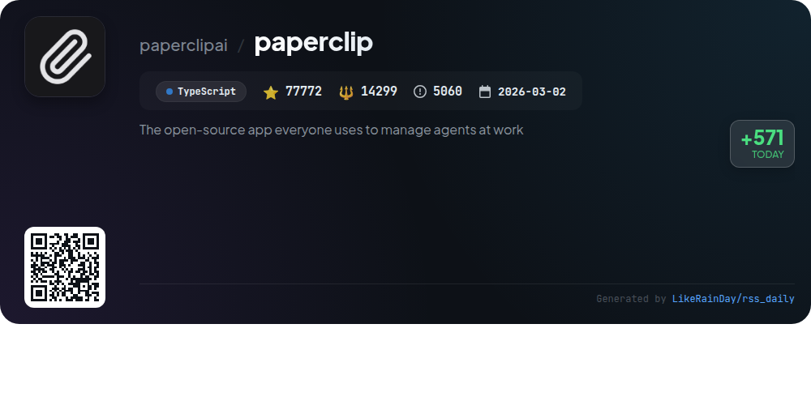
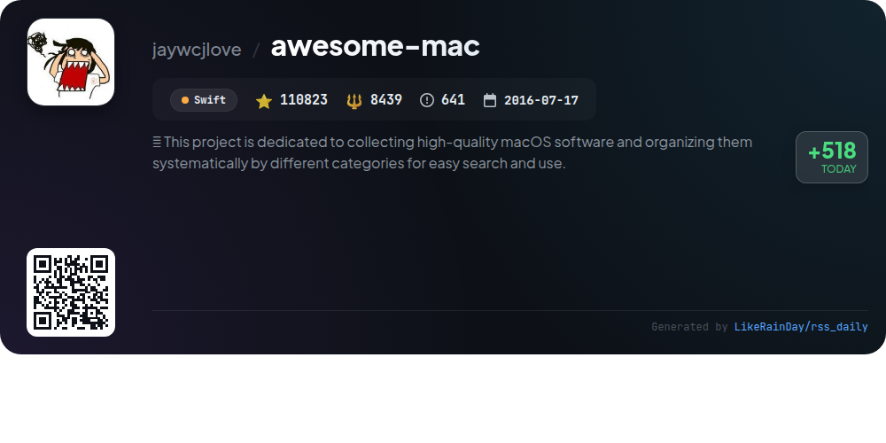
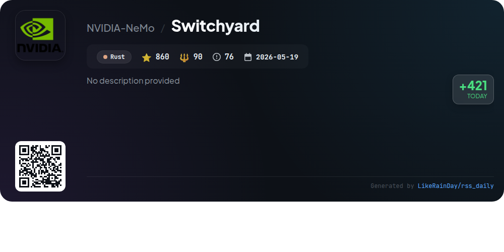
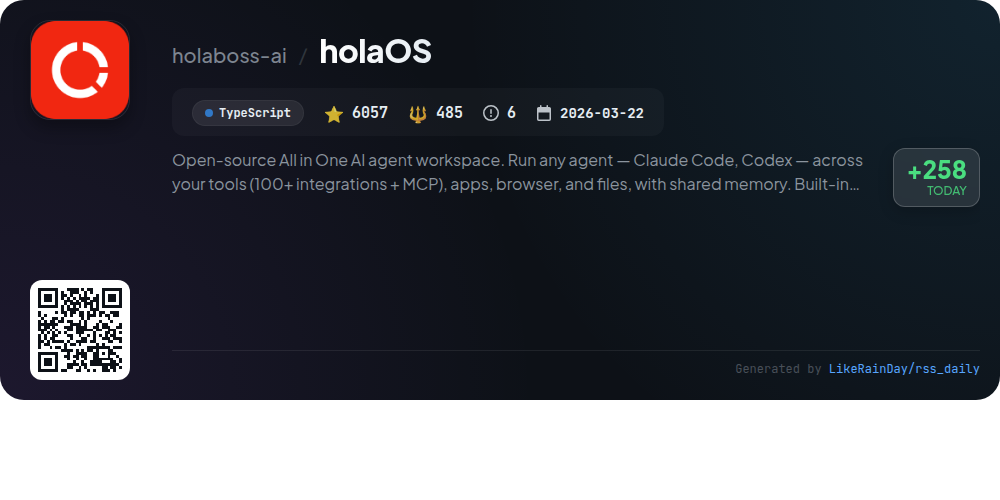
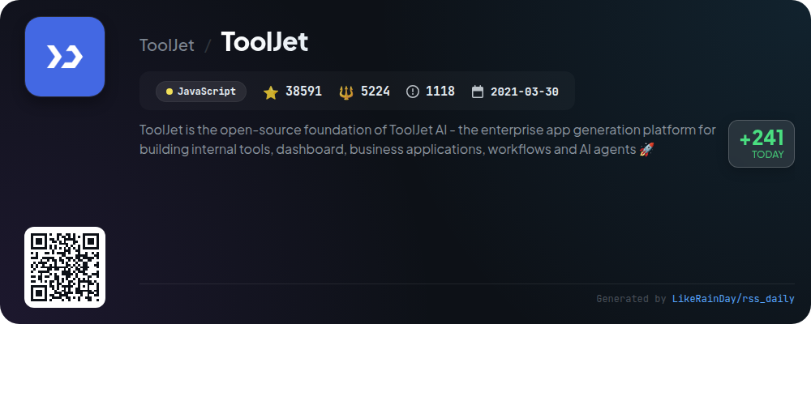

# 📊 🌟 GitHub Trending Daily - 2026-08-13

> > 📅 每日精选 GitHub 热门仓库 | 基于智能算法推荐

## 📋 Overview

**10** 个项目 | **636724** ⭐ | **57790** 🍴

**热门语言:** `TypeScript` (5) · `Rust` (2) · `JavaScript` (2)

**更新时间:** 2026-08-13 02:30 UTC

**分类分布:**

- 🌟 每日 Top 10 精选 (10 项)

---

## 🌟 每日 Top 10 精选

### 1. [orca](https://github.com/stablyai/orca)

> 🤖 **推荐理由**  
> *Orca is a powerful AI Development Environment (ADE) designed for managing a fleet of parallel coding agents across desktop, mobile, and VPS platforms. Key features include parallel worktrees for running multiple agents simultaneously, a mobile companion app for remote monitoring, and advanced terminal splits with WebGL rendering. Users can annotate AI-generated diffs, drag files directly into prompts, and access GitHub and Linear integrations seamlessly. With a robust CLI for scripting workflows, Orca supports any CLI agent, making it a versatile tool for developers.*

- ⭐ 43985 stars
- 💻 TypeScript
- 📅 Updated: 2026-08-13

### 2. [pi](https://github.com/earendil-works/pi)

> 🤖 **推荐理由**  
> *Pi is an AI agent toolkit offering a unified LLM API, agent loop, and interactive TUI for coding. Key features include the @earendil-works/pi-coding-agent CLI for coding assistance, the @earendil-works/pi-agent-core for runtime management, and the @earendil-works/pi-ai for multi-provider LLM integration (OpenAI, Anthropic, Google). The project emphasizes extensibility, with options for containerization to enhance security. With over 88,000 stars on GitHub, Pi fosters community collaboration, encouraging users to share their coding agent sessions for continuous improvement. Visit pi.dev for demos and documentation.*

- ⭐ 88674 stars
- 💻 TypeScript
- 📅 Updated: 2026-08-13

### 3. [ponytail](https://github.com/DietrichGebert/ponytail)

> 🤖 **推荐理由**  
> *Ponytail is a JavaScript GitHub project designed to optimize AI agents, making them function with the efficiency of a seasoned developer who writes minimal, effective code. With over 101,581 stars, it reduces code output by up to 94% while maintaining safety and functionality. Key features include a simple command interface for adjusting output intensity, commands for code reviews and audits, and integration with multiple AI platforms such as Claude Code and Codex. Ponytail emphasizes writing only necessary code, enhancing development speed and reducing costs.*

- ⭐ 101581 stars
- 💻 JavaScript
- 📅 Updated: 2026-08-13

### 4. [firecrawl](https://github.com/firecrawl/firecrawl)

> 🤖 **推荐理由**  
> *Firecrawl is an open-source context API designed for scalable web search, scraping, and interaction. It supports extensive web coverage, including JavaScript-heavy pages, with a 96% reliability rate. Core features include web search, content scraping into Markdown or JSON, and interactive scraping with AI prompts. Firecrawl automates complex tasks like proxy rotation and rate limiting, ensuring ease of use. Additional services include full website crawling, URL mapping, and batch scraping. Developers can leverage SDKs in multiple languages for seamless integration.*

- ⭐ 166481 stars
- 💻 TypeScript
- 📅 Updated: 2026-08-13

### 5. [paperclip](https://github.com/paperclipai/paperclip)

> 🤖 **推荐理由**  
> *Paperclip is an open-source app designed for managing AI agents in business operations. With over 77,000 stars on GitHub, it provides a Node.js server and React UI for orchestrating diverse AI agents toward unified goals. Key features include goal alignment, cost control, a mobile-ready interface, and governance over agent activities. The app allows for seamless integration of various agents, persistent task context, and robust auditing. Paperclip empowers organizations to coordinate multiple agents effectively, making it ideal for those seeking to build autonomous AI-driven companies.*

- ⭐ 77772 stars
- 💻 TypeScript
- 📅 Updated: 2026-08-13

### 6. [awesome-mac](https://github.com/jaywcjlove/awesome-mac)

> 🤖 **推荐理由**  
> *Awesome Mac is a comprehensive repository featuring high-quality macOS software organized by categories for easy access. With over 110,000 stars, it serves as a valuable resource for users seeking tools across various domains, including productivity, design, development, and more. Core features include systematic categorization, user contributions, and support for multiple languages. The project emphasizes community-driven enhancements, inviting users to suggest or add new applications, thereby continually expanding its offerings for macOS users.*

- ⭐ 110823 stars
- 💻 Swift
- 📅 Updated: 2026-08-13

### 7. [Switchyard](https://github.com/NVIDIA-NeMo/Switchyard)

> 🤖 **推荐理由**  
> *Switchyard is a Rust-based proxy and library designed for LLM traffic management, facilitating requests across various providers while translating between OpenAI and Anthropic APIs. Core features include protocol translation, multi-backend routing with customizable algorithms, and comprehensive operational metrics. It allows integration with coding agents, A/B testing, and signal-driven routing. As pre-alpha software, it’s evolving rapidly, emphasizing its experimental nature. Key services include standalone proxy deployment and routing algorithm embedding for Rust applications.*

- ⭐ 860 stars
- 💻 Rust
- 📅 Updated: 2026-08-13

### 8. [holaOS](https://github.com/holaboss-ai/holaOS)

> 🤖 **推荐理由**  
> *holaOS is an open-source, all-in-one AI agent workspace that supports seamless integration of various agents like Claude Code and Codex across over 100 tools and apps, with a unique shared memory feature. Key highlights include local-first operation, built-in advanced models, and the ability to bring your own keys. Users benefit from real-time app interaction, durable memory across sessions, and extensive integrations with popular services like Notion and Slack. With support for macOS, Windows, and Linux, holaOS is designed for flexibility and user control, making it ideal for diverse AI-driven workflows.*

- ⭐ 6057 stars
- 💻 TypeScript
- 📅 Updated: 2026-08-13

### 9. [ToolJet](https://github.com/ToolJet/ToolJet)

> 🤖 **推荐理由**  
> *ToolJet is an open-source platform for building and deploying internal tools, workflows, and AI agents. It features a powerful visual app builder with 60+ components, multi-page app support, and integrations with 80+ data sources. Users can self-host or deploy on cloud services like AWS and Azure. The enterprise version, ToolJet AI, offers AI-driven app generation, query building, and debugging, alongside enhanced security and user management. With a robust community and extensive documentation, ToolJet empowers teams to create complex applications efficiently.*

- ⭐ 38591 stars
- 💻 JavaScript
- 📅 Updated: 2026-08-13

### 10. [macro](https://github.com/macro-inc/macro)

> 🤖 **推荐理由**  
> *Macro is an all-in-one workspace unifying email, chat, docs, tasks, agents, calls, and CRM into a seamless interface with shared AI memory. Core features include a unified inbox for multi-account email management, focused messaging threads, integrated task management linked to conversations, and real-time collaborative markdown docs. Its modular design allows easy navigation through interconnected components, enhancing team productivity. Macro is built with Rust for speed and reliability, catering to small teams needing a cohesive operating system for their workflow.*

- ⭐ 1900 stars
- 💻 Rust
- 📅 Updated: 2026-08-13

---

## 📡 RSS订阅

通过 RSS 订阅，第一时间获取每日精选项目：

- 🔔 [RSS 订阅源] (../../daily-top.xml)
- 🔔 [每日简报] (../../GITHUB_TODAY_CN.md)
- 🔔 [每日 Top 10 精选](../../daily-top.xml)

---

*⚡ Powered by Smart Trending Algorithm | Generated at 2026-08-13 02:30:02 UTC
