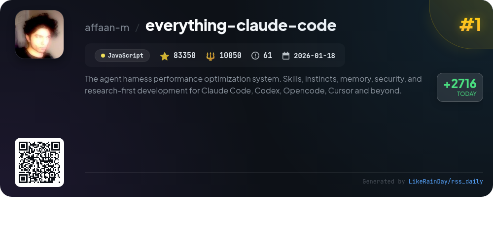
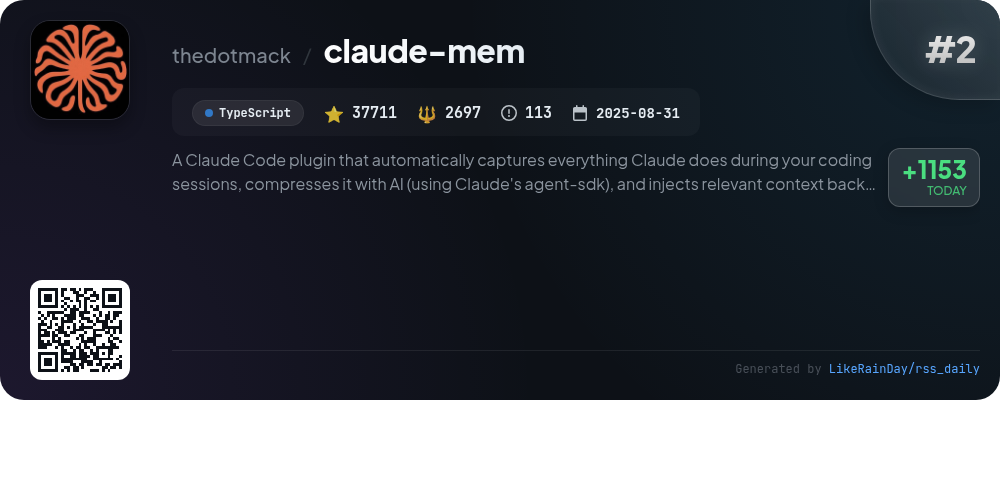
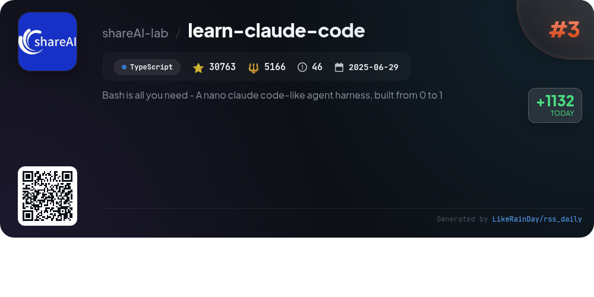
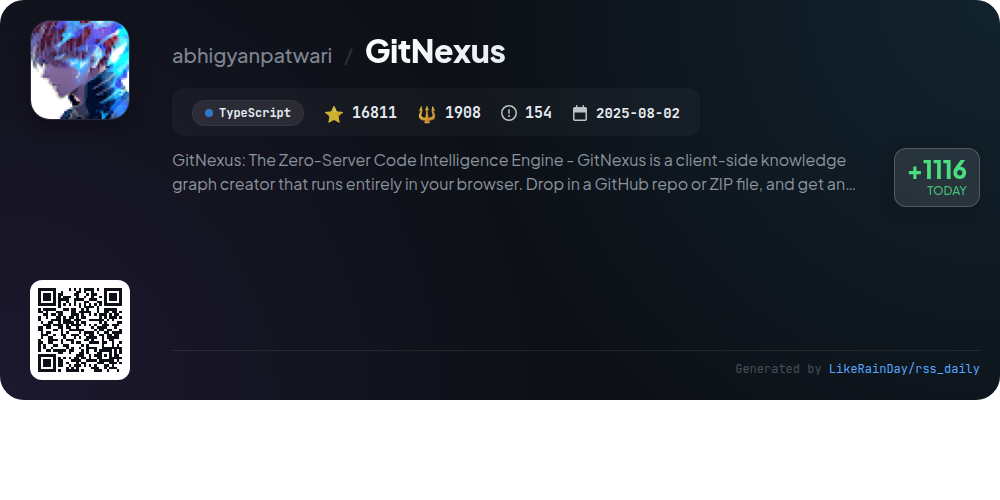
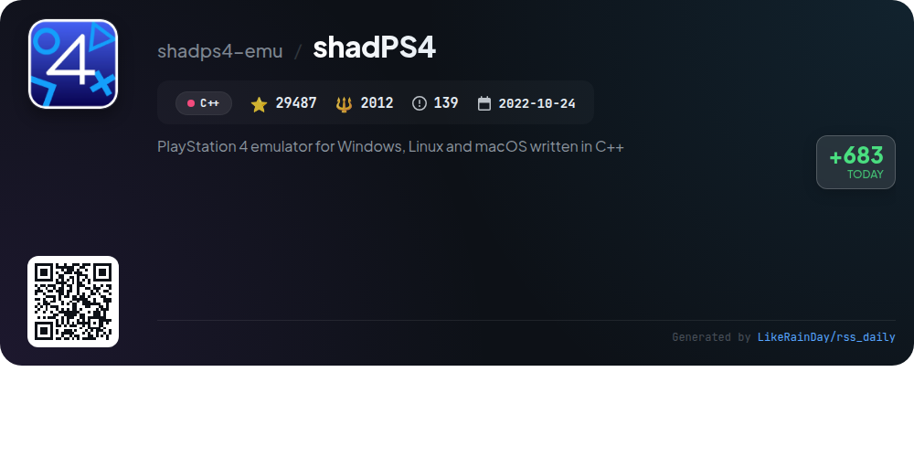
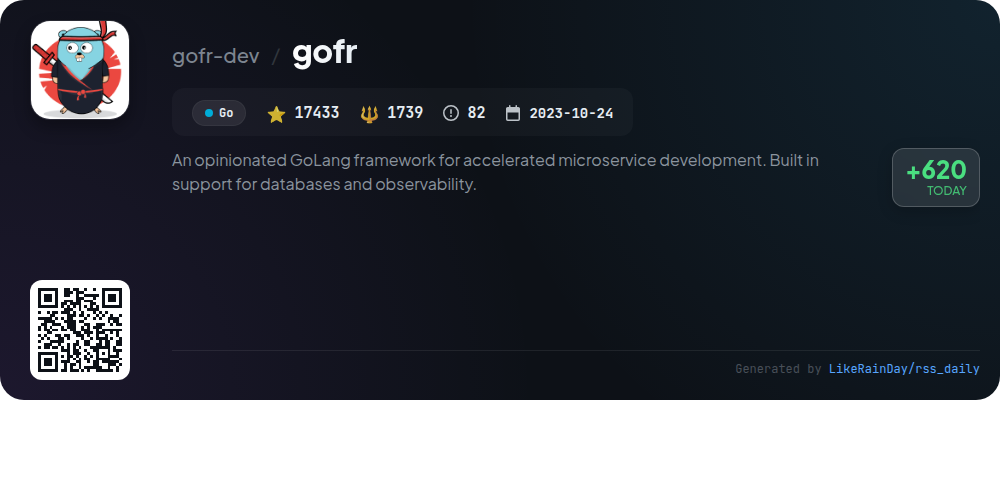
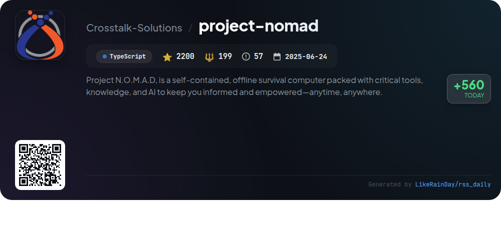
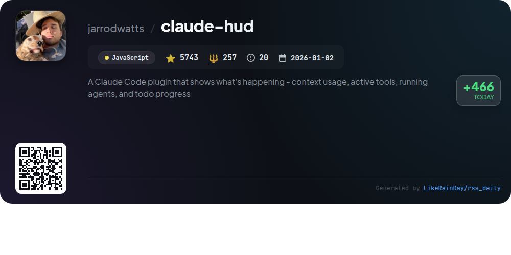
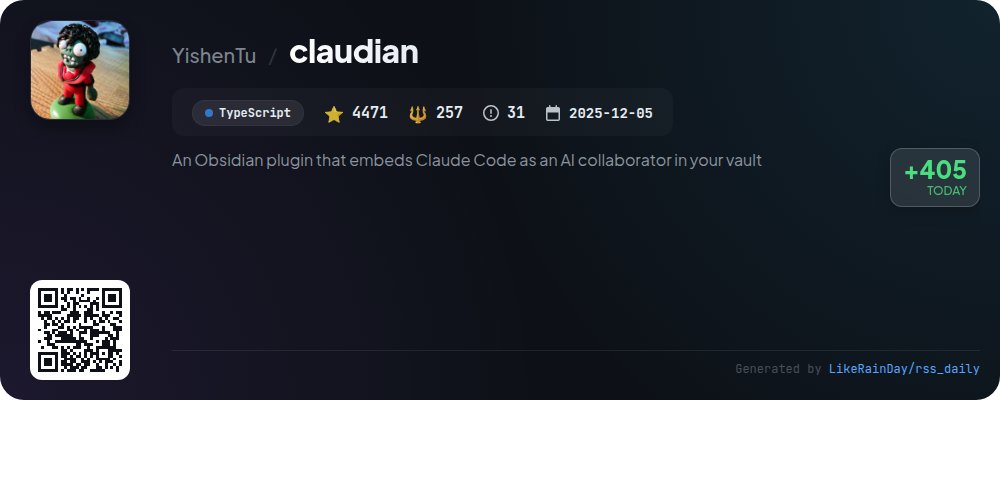
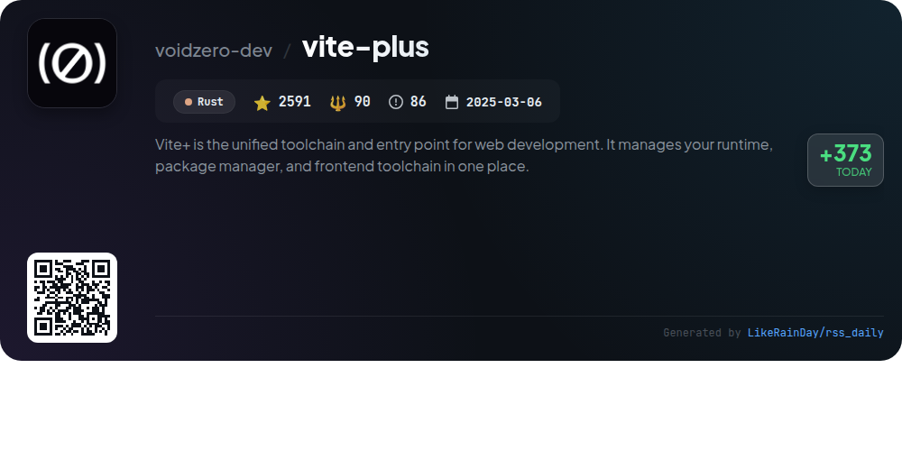

# 📊 🌟 GitHub Trending Daily - 2026-03-18

> > 📅 每日精选 GitHub 热门仓库 | 基于智能算法推荐

## 📋 Overview

**10** 个项目 | **230568** ⭐ | **25175** 🍴

**热门语言:** `TypeScript` (5) · `JavaScript` (2) · `Rust` (1)

**更新时间:** 2026-03-18 02:49 UTC

**分类分布:**

- 🌟 每日 Top 10 精选 (10 项)

---

## 🌟 每日 Top 10 精选

### 1. [everything-claude-code](https://github.com/affaan-m/everything-claude-code)

> 🤖 **推荐理由**  
> *"Everything Claude Code" is a powerful performance optimization system for AI agents, designed for Claude Code, Codex, Cursor, and more. With over 83,000 stars, it offers a comprehensive suite of 25 agents, 108 skills, and 57 commands, enabling seamless continuous learning, memory optimization, and security scanning. Key features include cross-platform support, advanced hooks for automation, and customizable rules. Winner of the Anthropic Hackathon, it emphasizes research-first development, making it a vital tool for enhancing productivity in AI-driven coding environments.*

- ⭐ 83358 stars
- 💻 JavaScript
- 📅 Updated: 2026-03-18

### 2. [claude-mem](https://github.com/thedotmack/claude-mem)

> 🤖 **推荐理由**  
> *Claude-Mem is a TypeScript plugin for Claude Code that enhances coding sessions by automatically capturing user interactions and contextual information. Key features include persistent memory that retains context across sessions, skill-based search capabilities, a web viewer for real-time memory access, and privacy controls to exclude sensitive data. The plugin allows for seamless integration with platforms like OpenClaw and supports intelligent memory retrieval through a structured workflow. With 37,711 stars on GitHub, it is designed to improve project continuity and efficiency.*

- ⭐ 37711 stars
- 💻 TypeScript
- 📅 Updated: 2026-03-18

### 3. [learn-claude-code](https://github.com/shareAI-lab/learn-claude-code)

> 🤖 **推荐理由**  
> *Learn Claude Code is a TypeScript-based repository focused on harness engineering for AI agents. It emphasizes that the agent is a trained model, while the harness provides the necessary environment for its operation. Key features include a modular architecture for building agent tools, on-demand knowledge loading, context management, and task systems. The project consists of 12 progressive sessions that teach developers to create effective harnesses for various domains, from coding to agriculture, enabling intelligent automation. With 30,763 stars, it serves as a masterclass in building robust AI agent environments.*

- ⭐ 30763 stars
- 💻 TypeScript
- 📅 Updated: 2026-03-18

### 4. [GitNexus](https://github.com/abhigyanpatwari/GitNexus)

> 🤖 **推荐理由**  
> *GitNexus is a client-side code intelligence engine that creates interactive knowledge graphs from GitHub repositories or ZIP files, running entirely in the browser. Key features include a powerful CLI for local indexing, a web UI for quick code exploration, and integration with AI agents via the Model Context Protocol (MCP). It supports multiple languages, enabling impact analysis, process tracking, and multi-repo management. GitNexus enhances AI tools with precomputed code relationships, ensuring reliable context and efficient querying for developers.*

- ⭐ 16811 stars
- 💻 TypeScript
- 📅 Updated: 2026-03-18

### 5. [shadPS4](https://github.com/shadps4-emu/shadPS4)

> 🤖 **推荐理由**  
> *shadPS4 is an early-stage PlayStation 4 emulator for Windows, Linux, and macOS, developed in C++. It boasts compatibility with popular titles like Bloodborne and Yakuza 0, though it currently lacks a graphical user interface (GUI). Users can download the QtLauncher for a more user-friendly experience. Key features include keyboard and mouse mappings, support for PlayStation 4 firmware files, and a robust community on Discord for support and collaboration. The project is open-source under the GPL-2.0 license, encouraging contributions and continuous development.*

- ⭐ 29487 stars
- 💻 C++
- 📅 Updated: 2026-03-18

### 6. [gofr](https://github.com/gofr-dev/gofr)

> 🤖 **推荐理由**  
> *GoFr is an opinionated GoLang framework designed to accelerate microservice development, featuring built-in support for databases and observability. Key highlights include a simple API syntax, REST standards, inbuilt authentication middleware, gRPC support, and observability tools for logs, traces, and metrics. GoFr also offers circuit breaker support, health checks, database migration, cron jobs, and Swagger documentation. With a focus on Kubernetes deployment, GoFr simplifies the creation of robust microservices, making it ideal for developers seeking efficiency and scalability.*

- ⭐ 17433 stars
- 💻 Go
- 📅 Updated: 2026-03-18

### 7. [project-nomad](https://github.com/Crosstalk-Solutions/project-nomad)

> 🤖 **推荐理由**  
> *Project N.O.M.A.D, is a self-contained, offline survival computer packed with critical tools, knowledge, and AI to keep you informed and empowered—a. popular project, actively maintained, recently updated*

- ⭐ 2200 stars
- 🍴 199 forks
- 💻 TypeScript
- 📅 Updated: 2026-03-18

### 8. [claude-hud](https://github.com/jarrodwatts/claude-hud)

> 🤖 **推荐理由**  
> *Claude HUD is a powerful plugin for Claude Code, designed to enhance user experience by providing real-time insights into context usage, active tools, running agents, and todo progress. It displays essential information directly below your input, including project paths and context health. Key features include customizable layouts, agent tracking, and usage metrics for Pro/Max subscribers. The plugin updates every 300ms, ensuring users are always informed about their coding environment. Easy installation and configuration make it accessible for all users.*

- ⭐ 5743 stars
- 💻 JavaScript
- 📅 Updated: 2026-03-18

### 9. [claudian](https://github.com/YishenTu/claudian)

> 🤖 **推荐理由**  
> *An Obsidian plugin that embeds Claude Code as an AI collaborator in your vault. popular project, actively maintained, recently updated*

- ⭐ 4471 stars
- 🍴 257 forks
- 💻 TypeScript
- 📅 Updated: 2026-03-18

### 10. [vite-plus](https://github.com/voidzero-dev/vite-plus)

> 🤖 **推荐理由**  
> *Vite+ is a comprehensive toolchain for web development, unifying runtime and package management, and streamlining tasks like creation, development, testing, and building. Built in Rust, it integrates Vite, Vitest, Oxlint, Oxfmt, and more into a zero-config setup. Key features include `vp env` for Node.js management, `vp install` for dependency installation, `vp dev` for a fast ESM dev server, and `vp build` for production-ready applications. Vite+ simplifies project workflows, supports monorepos, and is open-source under the MIT license.*

- ⭐ 2591 stars
- 💻 Rust
- 📅 Updated: 2026-03-18

---

## 📡 RSS订阅

通过 RSS 订阅，第一时间获取每日精选项目：

- 🔔 [RSS 订阅源] (../../daily-top.xml)
- 🔔 [每日简报] (../../GITHUB_TODAY_CN.md)
- 🔔 [每日 Top 10 精选](../../daily-top.xml)

---

*⚡ Powered by Smart Trending Algorithm | Generated at 2026-03-18 02:49:00 UTC
