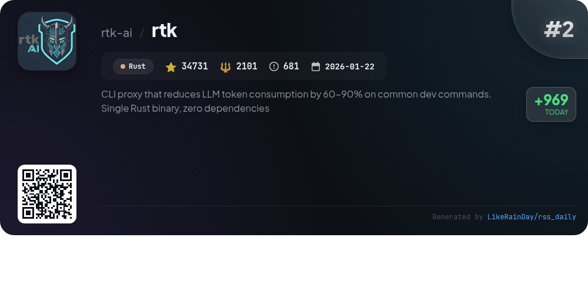
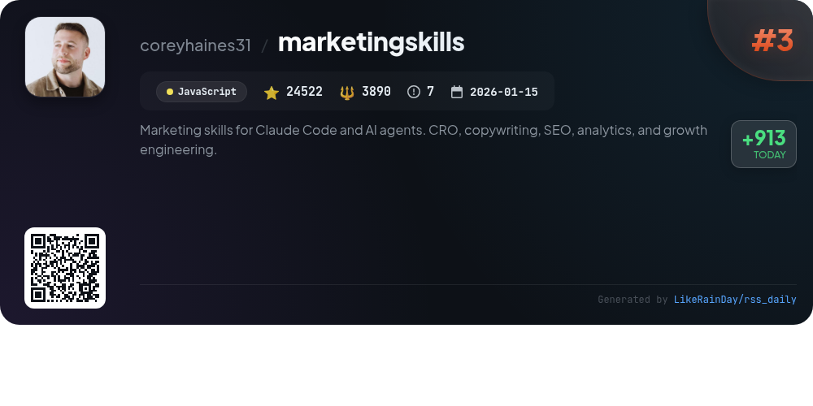
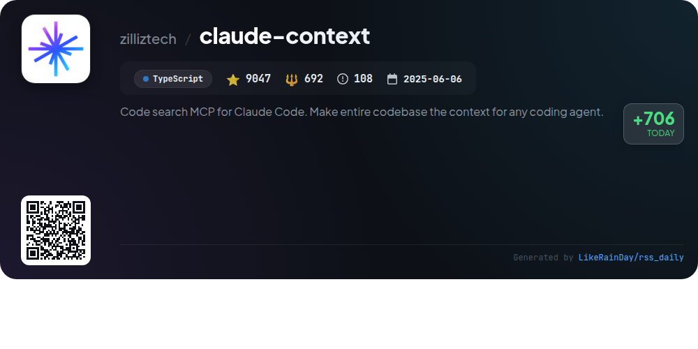
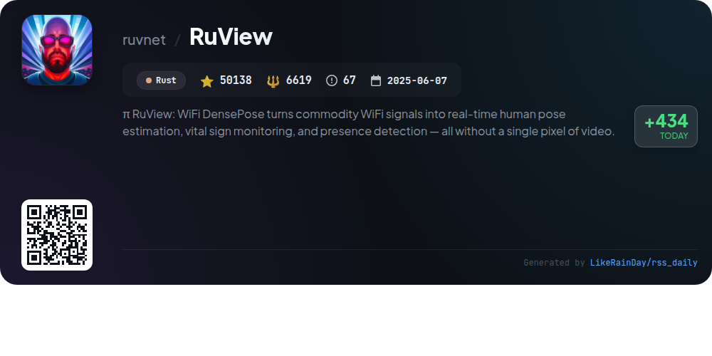
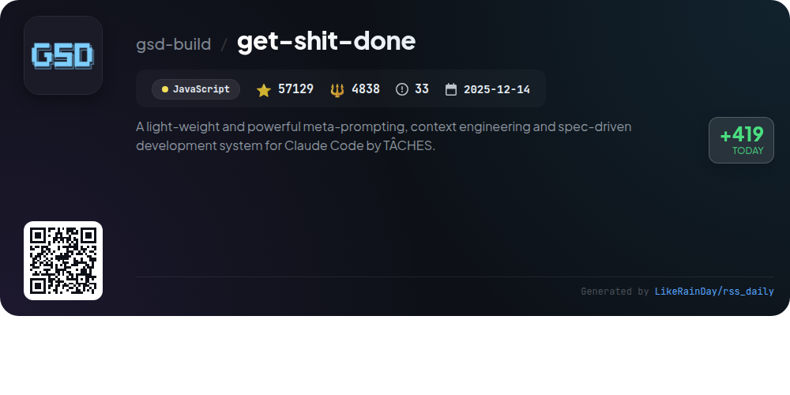

# 📊 🌟 GitHub Trending Daily - 2026-04-25

> > 📅 每日精选 GitHub 热门仓库 | 基于智能算法推荐

## 📋 Overview

**10** 个项目 | **428980** ⭐ | **53332** 🍴

**热门语言:** `JavaScript` (4) · `Rust` (3) · `TypeScript` (2)

**更新时间:** 2026-04-25 02:59 UTC

**分类分布:**

- 🌟 每日 Top 10 精选 (10 项)

---

## 🌟 每日 Top 10 精选

### 1. [everything-claude-code](https://github.com/affaan-m/everything-claude-code)

> 🤖 **推荐理由**  
> *Everything Claude Code is a powerful performance optimization system designed for AI agents, including Claude Code, Codex, and Cursor. It offers skills, instincts, memory optimization, continuous learning, and security features, making it suitable for production-ready applications. Key highlights include a comprehensive agent framework, a dashboard GUI for easy management, and extensive multi-language support across 12 ecosystems. Developed as an Anthropic hackathon winner, it boasts over 166,000 stars and includes robust tools for security scanning and workflow orchestration.*

- ⭐ 166323 stars
- 💻 JavaScript
- 📅 Updated: 2026-04-25

### 2. [rtk](https://github.com/rtk-ai/rtk)

> 🤖 **推荐理由**  
> *RTK (Rust Token Killer) is a high-performance CLI proxy that significantly reduces LLM token consumption by 60-90% on common development commands. Built as a single Rust binary with zero dependencies, it supports over 100 commands, providing a seamless integration experience. Key features include smart filtering, grouping, and deduplication of command outputs, with minimal overhead (<10ms). RTK supports major AI coding tools like Claude Code and GitHub Copilot, enhancing efficiency in command execution. Installation is straightforward via Homebrew or Cargo, with robust analytics for token savings.*

- ⭐ 34731 stars
- 💻 Rust
- 📅 Updated: 2026-04-25

### 3. [marketingskills](https://github.com/coreyhaines31/marketingskills)

> 🤖 **推荐理由**  
> *The **marketingskills** project provides a suite of AI agent capabilities tailored for marketing professionals. Focused on conversion optimization, copywriting, SEO, analytics, and growth engineering, it equips AI agents like Claude Code and OpenAI Codex with specialized skills through markdown files. Users can easily install and integrate skills for tasks such as A/B testing, ad creative generation, and customer research. Developed by Corey Haines, the project encourages contributions and offers resources like the Conversion Factory and Swipe Files for hands-on marketing assistance.*

- ⭐ 24522 stars
- 💻 JavaScript
- 📅 Updated: 2026-04-25

### 4. [Open-Generative-AI](https://github.com/Anil-matcha/Open-Generative-AI)

> 🤖 **推荐理由**  
> *Open Generative AI is an open-source, uncensored AI image and video generation studio, offering 200+ models for text-to-image, image-to-image, text-to-video, and lip sync creation. Key features include no content filters, self-hosting capabilities, and a local inference engine for offline use. The platform supports multi-image input and automated workflows, enabling users to build custom media pipelines. With a user-friendly interface and free access, it serves as a robust alternative to commercial AI services like Higgsfield AI and Freepik.*

- ⭐ 7748 stars
- 💻 JavaScript
- 📅 Updated: 2026-04-25

### 5. [cc-switch](https://github.com/farion1231/cc-switch)

> 🤖 **推荐理由**  
> *CC Switch is a cross-platform desktop tool designed for managing multiple AI CLI applications, including Claude Code, Codex, Gemini CLI, OpenCode, and OpenClaw. With over 50 built-in provider presets, it eliminates the need for manual configuration edits, allowing users to switch providers with a click. Key features include unified MCP and Skills management, cloud sync capabilities, system tray quick switching, and a user-friendly interface. Built with Rust and Tauri, CC Switch ensures reliable performance across Windows, macOS, and Linux, making AI-powered coding more efficient and accessible.*

- ⭐ 50739 stars
- 💻 Rust
- 📅 Updated: 2026-04-25

### 6. [claude-context](https://github.com/zilliztech/claude-context)

> 🤖 **推荐理由**  
> *Claude Context is an advanced MCP plugin for enhancing AI coding agents like Claude Code with semantic code search capabilities. It allows users to leverage an entire codebase as context, efficiently retrieving relevant code without the need for extensive multi-round queries. Key features include hybrid search (BM25 + dense vector), incremental indexing, and intelligent code chunking. The project integrates seamlessly with Zilliz Cloud for scalable vector search and supports various embedding providers. With over 9,000 stars, it’s a cost-effective solution for managing large codebases while improving coding efficiency.*

- ⭐ 9047 stars
- 💻 TypeScript
- 📅 Updated: 2026-04-25

### 7. [OpenMetadata](https://github.com/open-metadata/OpenMetadata)

> 🤖 **推荐理由**  
> *OpenMetadata is a unified metadata platform designed for data discovery, observability, and governance, featuring a central metadata repository and in-depth column-level lineage. Key features include advanced data discovery, collaboration tools, no-code data quality monitoring, and comprehensive data governance capabilities. The platform supports over 84 connectors for seamless integration with various data services. With robust APIs, data insights, and observability tools, OpenMetadata empowers organizations to manage and unlock the value of their data assets effectively.*

- ⭐ 13381 stars
- 💻 TypeScript
- 📅 Updated: 2026-04-25

### 8. [RuView](https://github.com/ruvnet/RuView)

> 🤖 **推荐理由**  
> *RuView is a cutting-edge WiFi sensing platform that transforms standard WiFi signals into real-time human pose estimation, vital sign monitoring, and presence detection, all without cameras or wearables. Utilizing low-cost ESP32 devices, it captures Channel State Information (CSI) to detect and track individuals through walls, offering features like breathing and heart rate monitoring, activity recognition, and environment mapping. RuView empowers privacy-first applications in healthcare, security, and smart environments, operating entirely on edge hardware with no cloud dependency.*

- ⭐ 50138 stars
- 💻 Rust
- 📅 Updated: 2026-04-25

### 9. [get-shit-done](https://github.com/gsd-build/get-shit-done)

> 🤖 **推荐理由**  
> *get-shit-done (GSD) is a lightweight meta-prompting and context engineering system designed to enhance development with Claude Code and other AI coding tools. Key features include context management to combat quality degradation, a structured workflow for project initialization, planning, execution, and verification, and integrated quality gates to ensure robust outputs. GSD supports multiple AI runtimes and automates tasks through a series of commands, making it ideal for developers seeking efficiency without the complexities of traditional project management. Trusted by engineers at leading tech companies, GSD streamlines development while maintaining high-quality standards.*

- ⭐ 57129 stars
- 💻 JavaScript
- 📅 Updated: 2026-04-25

### 10. [sub2api](https://github.com/Wei-Shaw/sub2api)

> 🤖 **推荐理由**  
> *Sub2API is an open-source AI API gateway platform designed to streamline API quota management for services like Claude, OpenAI, and Gemini. Key features include multi-account management, API key distribution, precise billing with token-level tracking, smart scheduling, concurrency control, and built-in payment support via EasyPay, Alipay, and Stripe. The platform offers an admin dashboard for monitoring and integrates with external systems. With a focus on efficient cost-sharing, Sub2API enhances user experience through seamless access to upstream AI services.*

- ⭐ 15222 stars
- 💻 Go
- 📅 Updated: 2026-04-25

---

## 📡 RSS订阅

通过 RSS 订阅，第一时间获取每日精选项目：

- 🔔 [RSS 订阅源] (../../daily-top.xml)
- 🔔 [每日简报] (../../GITHUB_TODAY_CN.md)
- 🔔 [每日 Top 10 精选](../../daily-top.xml)

---

*⚡ Powered by Smart Trending Algorithm | Generated at 2026-04-25 02:59:57 UTC
