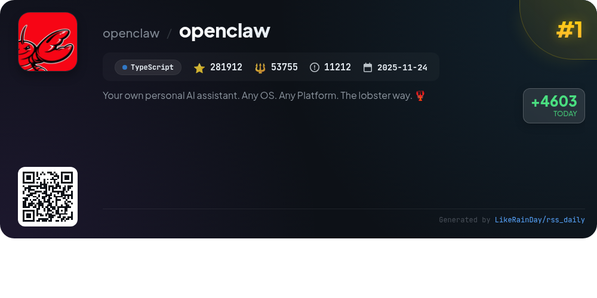
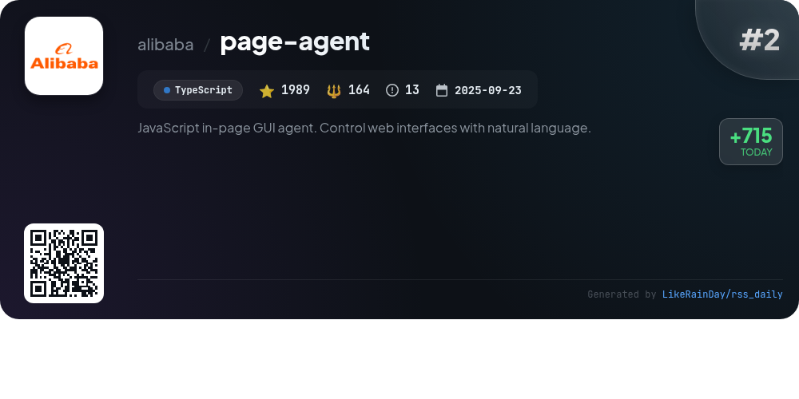
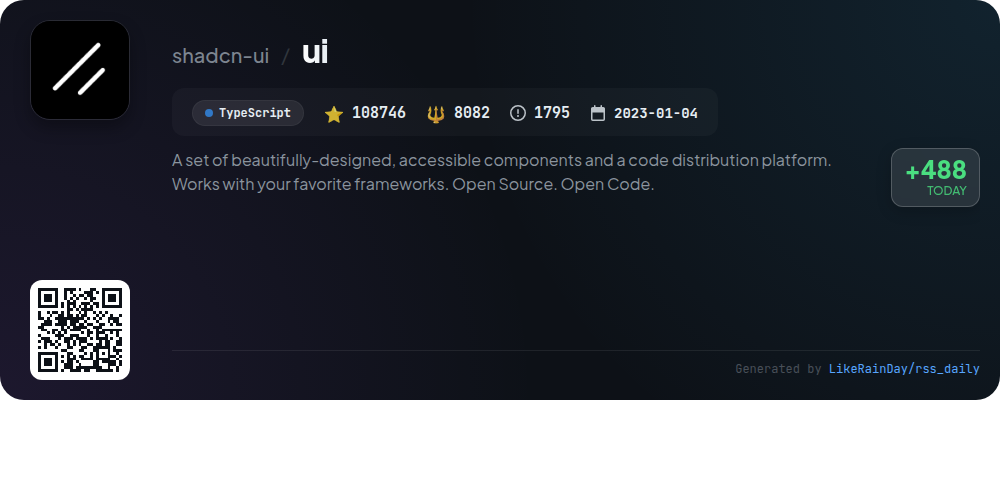
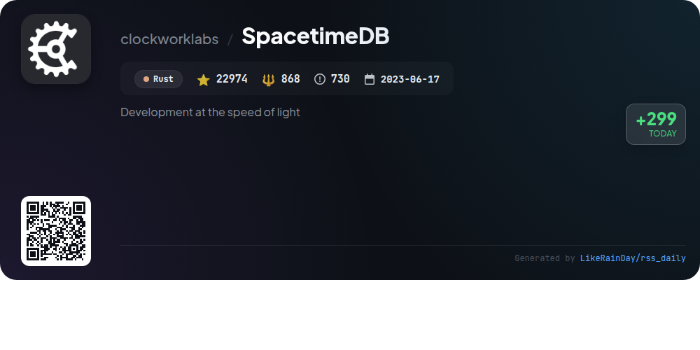
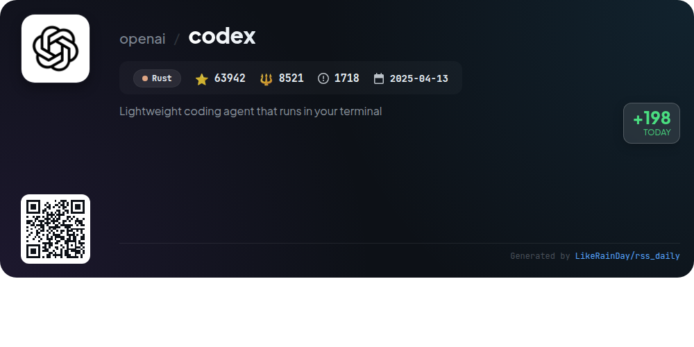

# 📊 🌟 GitHub Trending Daily - 2026-03-09

> > 📅 每日精选 GitHub 热门仓库 | 基于智能算法推荐

## 📋 Overview

**10** 个项目 | **582001** ⭐ | **81029** 🍴

**热门语言:** `TypeScript` (6) · `Rust` (2) · `JavaScript` (1)

**更新时间:** 2026-03-09 02:46 UTC

**分类分布:**

- 🌟 每日 Top 10 精选 (10 项)

---

## 🌟 每日 Top 10 精选

### 1. [openclaw](https://github.com/openclaw/openclaw)

> 🤖 **推荐理由**  
> *OpenClaw is a versatile personal AI assistant designed for any OS and platform, built with TypeScript. It seamlessly integrates with various messaging channels like WhatsApp, Telegram, Discord, and more, providing a local, fast, and always-on experience. Key features include a local-first control plane, multi-channel inbox, voice wake capabilities, live canvas for visual tasks, and a robust onboarding wizard. OpenClaw also supports various tools and automation features, ensuring a customizable and secure user experience. With over 281,000 stars on GitHub, it has garnered a vibrant community and strong support, making it a compelling choice for personal AI assistance.*

- ⭐ 281912 stars
- 💻 TypeScript
- 📅 Updated: 2026-03-09

### 2. [page-agent](https://github.com/alibaba/page-agent)

> 🤖 **推荐理由**  
> *JavaScript in-page GUI agent. Control web interfaces with natural language.. popular project, actively maintained, recently updated*

- ⭐ 1989 stars
- 🍴 164 forks
- 💻 TypeScript
- 📅 Updated: 2026-03-09

### 3. [learn-claude-code](https://github.com/shareAI-lab/learn-claude-code)

> 🤖 **推荐理由**  
> *Learn Claude Code is a TypeScript project designed to build a nano Claude Code-like agent from the ground up. With 12 progressive sessions, it teaches key concepts like agent loops, task management, and team collaboration while emphasizing modular design and tool integration. Key features include a simple agent loop structure, independent subagent contexts, background task processing, and a JSONL mailbox protocol for team communication. The project also offers an interactive web platform for visual learning and documentation in multiple languages, making it an invaluable resource for developers looking to create AI coding agents.*

- ⭐ 23980 stars
- 💻 TypeScript
- 📅 Updated: 2026-03-09

### 4. [AFFiNE](https://github.com/toeverything/AFFiNE)

> 🤖 **推荐理由**  
> *AFFiNE is a next-gen, privacy-focused, open-source knowledge base designed to integrate planning, sorting, and creative tasks in one platform, serving as a versatile alternative to Notion and Miro. Key features include a unique edgeless canvas for diverse content types, real-time collaboration, and local-first data ownership. AFFiNE also offers a multimodal AI assistant for enhanced productivity and customization options for self-hosting. With a growing community and rich template library, AFFiNE is ideal for creative minds seeking a comprehensive workspace.*

- ⭐ 65267 stars
- 💻 TypeScript
- 📅 Updated: 2026-03-09

### 5. [ui](https://github.com/shadcn-ui/ui)

> 🤖 **推荐理由**  
> *shadcn/ui is an open-source library of beautifully designed, customizable, and accessible UI components built with TypeScript. It seamlessly integrates with popular frameworks, allowing developers to create their own component libraries. Key features include extensive documentation and a focus on extendability. With over 108,000 stars, shadcn/ui emphasizes community contributions and collaboration. For detailed usage and guidelines, visit the documentation at https://ui.shadcn.com/docs. The project is licensed under the MIT license.*

- ⭐ 108746 stars
- 💻 TypeScript
- 📅 Updated: 2026-03-09

### 6. [impeccable](https://github.com/pbakaus/impeccable)

> 🤖 **推荐理由**  
> *Impeccable is a JavaScript project designed to enhance AI-driven frontend design. With 1 skill, 17 commands, and curated anti-patterns, it empowers AI models like Claude to produce superior UI designs. Key features include an extensive skill set covering typography, color, spatial, motion, interaction, responsive design, and UX writing. The 17 commands offer functions for auditing, critiquing, normalizing, and optimizing designs. Impeccable also provides clear guidance on design pitfalls to avoid. Visit [impeccable.style](https://impeccable.style) for a quick start and case studies.*

- ⭐ 1888 stars
- 💻 JavaScript
- 📅 Updated: 2026-03-09

### 7. [electrobun](https://github.com/blackboardsh/electrobun)

> 🤖 **推荐理由**  
> *Electrobun is a powerful framework for building ultra-fast, lightweight, cross-platform desktop applications using TypeScript. With features like seamless TypeScript integration for both main and webview processes, fast RPC communication, and minimal app sizes (~12MB), it streamlines the development and distribution process. Developers can easily initialize projects with `npx electrobun init` and benefit from small update sizes (as low as 14KB). Notable applications built with Electrobun include Audio TTS, Co(lab), and a unique DOOM implementation. Visit the documentation at electrobun.dev for more details.*

- ⭐ 9000 stars
- 💻 TypeScript
- 📅 Updated: 2026-03-09

### 8. [SpacetimeDB](https://github.com/clockworklabs/SpacetimeDB)

> 🤖 **推荐理由**  
> *SpacetimeDB is a high-performance relational database that integrates application logic directly within the database, eliminating the need for a separate server. It supports development in Rust, C#, TypeScript, and C++, allowing seamless real-time synchronization with connected clients. With ACID compliance and in-memory data handling for speed, SpacetimeDB simplifies deployment by enabling application delivery as a single binary. Key features include module-based schemas, direct client connections, and extensive SDK support. For more details, visit spacetimedb.com.*

- ⭐ 22974 stars
- 💻 Rust
- 📅 Updated: 2026-03-09

### 9. [CyberStrikeAI](https://github.com/Ed1s0nZ/CyberStrikeAI)

> 🤖 **推荐理由**  
> *CyberStrikeAI is an AI-native security testing platform built in Go. It integrates 100+ security tools, an intelligent orchestration engine, role-base. popular project, actively maintained, recently updated*

- ⭐ 2303 stars
- 🍴 394 forks
- 💻 Go
- 📅 Updated: 2026-03-09

### 10. [codex](https://github.com/openai/codex)

> 🤖 **推荐理由**  
> *Codex is a lightweight coding agent from OpenAI that runs locally in your terminal, built in Rust. With over 63,000 stars on GitHub, it offers seamless integration with IDEs like VS Code and a dedicated desktop app. Users can install Codex via npm or Homebrew, and it supports signing in with a ChatGPT account for enhanced functionality. Key services include the Codex CLI, cloud-based Codex Web, and extensive documentation for installation and usage. Explore the project further on its GitHub page for comprehensive guides and contributions.*

- ⭐ 63942 stars
- 💻 Rust
- 📅 Updated: 2026-03-09

---

## 📡 RSS订阅

通过 RSS 订阅，第一时间获取每日精选项目：

- 🔔 [RSS 订阅源] (../../daily-top.xml)
- 🔔 [每日简报] (../../GITHUB_TODAY_CN.md)
- 🔔 [每日 Top 10 精选](../../daily-top.xml)

---

*⚡ Powered by Smart Trending Algorithm | Generated at 2026-03-09 02:46:33 UTC
