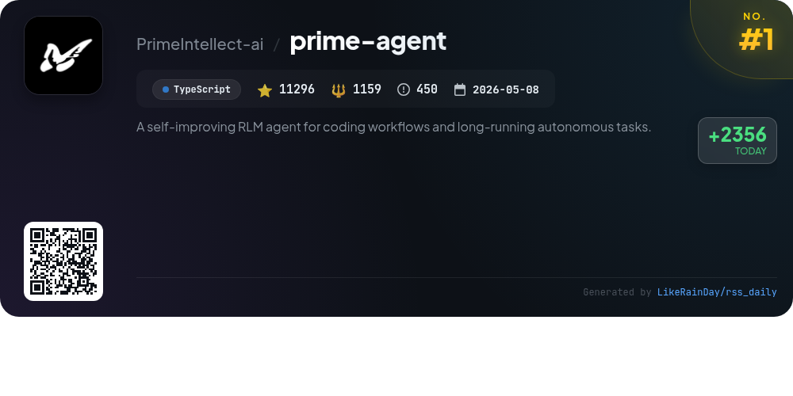
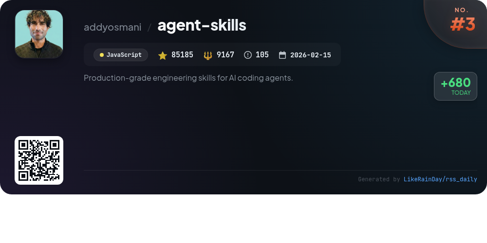
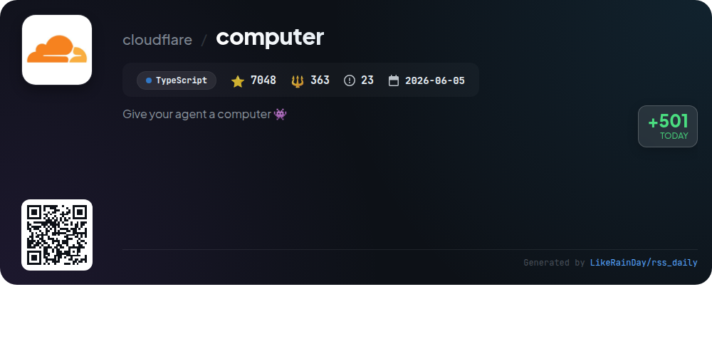
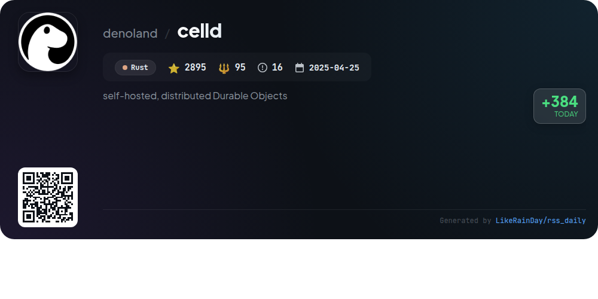
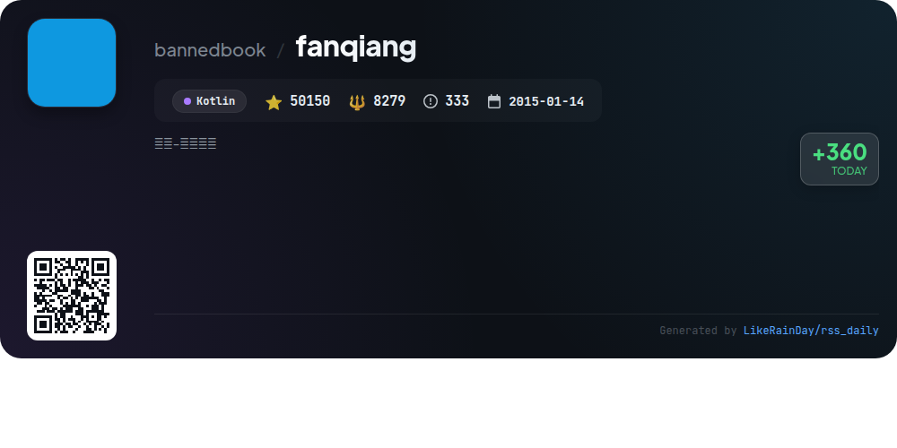
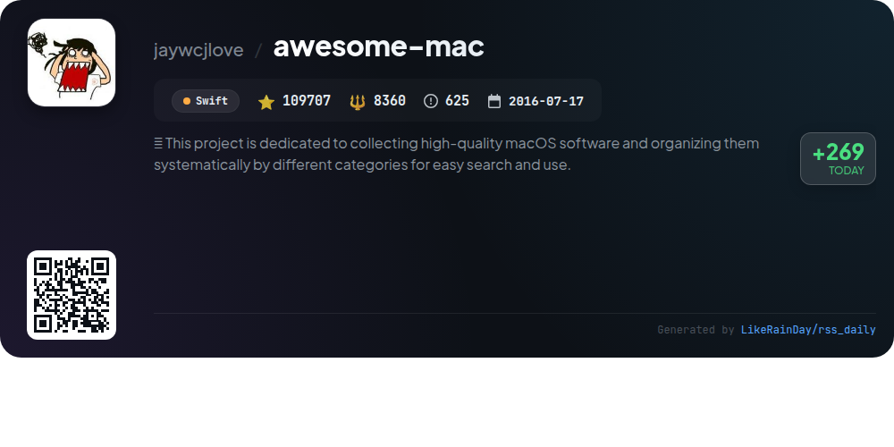
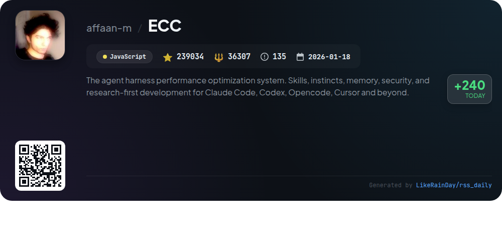
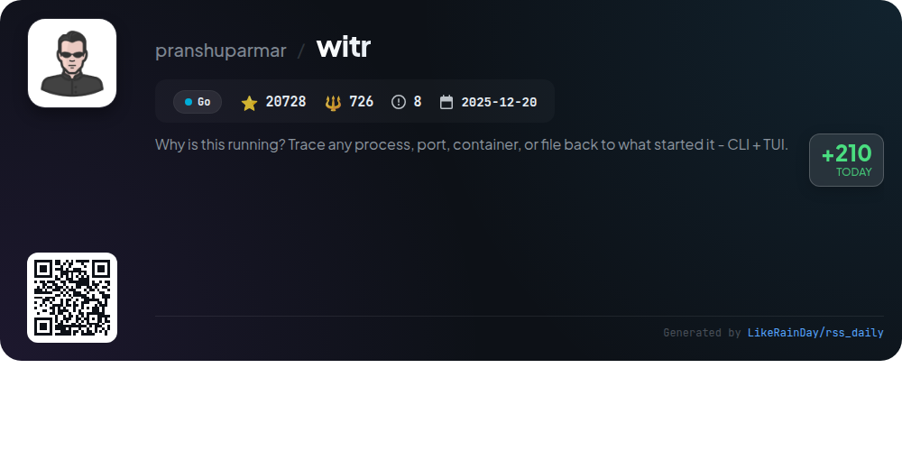

# 📊 🌟 GitHub Trending Daily - 2026-08-10

> > 📅 每日精选 GitHub 热门仓库 | 基于智能算法推荐

## 📋 Overview

**10** 个项目 | **601859** ⭐ | **74987** 🍴

**热门语言:** `TypeScript` (4) · `JavaScript` (2) · `Rust` (1)

**更新时间:** 2026-08-10 02:15 UTC

**分类分布:**

- 🌟 每日 Top 10 精选 (10 项)

---

## 🌟 每日 Top 10 精选

### 1. [prime-agent](https://github.com/PrimeIntellect-ai/prime-agent)

> 🤖 **推荐理由**  
> *Prime Agent is an open-source, self-improving Recursive Language Model (RLM) agent designed for coding workflows and long-running autonomous tasks. Key features include a persistent Python control environment, seamless subagent integration for parallel processing, and a Continual Harness that stores and refines context and skills. It supports direct agent communication, daemon-backed sessions for continuity, and autonomous mode for ongoing tasks. With robust capabilities for long-term research evaluations, Prime Agent empowers efficient and flexible coding and automation workflows.*

- ⭐ 11296 stars
- 💻 TypeScript
- 📅 Updated: 2026-08-10

### 2. [OmniRoute](https://github.com/diegosouzapw/OmniRoute)

> 🤖 **推荐理由**  
> *OmniRoute is a free, open-source AI gateway providing access to over 290 AI providers (90+ free) and 500+ models including Kimi, Claude, GPT, and Gemini. Key features include quota-aware auto-fallback, a unique RTK+Caveman compression system that saves 15-95% tokens, and support for multiple coding tools like Claude Code and Copilot. With a user-friendly setup requiring no API keys or configuration, OmniRoute operates on various platforms, allowing seamless integration and smart routing for cost-effective AI interactions.*

- ⭐ 44324 stars
- 💻 TypeScript
- 📅 Updated: 2026-08-10

### 3. [agent-skills](https://github.com/addyosmani/agent-skills)

> 🤖 **推荐理由**  
> *Agent Skills is a JavaScript project designed to enhance AI coding agents with production-grade engineering workflows. It includes 24 structured skills across the software development lifecycle, from defining project specs to shipping code. Key features include 8 slash commands that automate task execution, skills that adapt based on context, and a quick installation process for various agents. It emphasizes best practices from Google's engineering culture, ensuring reliability and quality in software development. The project has gained significant traction, boasting over 85,000 stars on GitHub.*

- ⭐ 85185 stars
- 💻 JavaScript
- 📅 Updated: 2026-08-10

### 4. [computer](https://github.com/cloudflare/computer)

> 🤖 **推荐理由**  
> *Cloudflare Computer is a virtual filesystem powered by Durable Objects and SQLite, enabling innovative backend execution environments. Key features include three execution backends: a FUSE-mounted container with full Linux userland, a Dynamic Worker running a bash shell, and another executing ECMAScript modules. Users can register multiple backends under stable IDs, allowing for flexible execution through a unified entry point. Designed for experimentation and prototyping, the project offers various examples, including chat agents and artifact generation. Note: it is in preview and not suitable for production use.*

- ⭐ 7048 stars
- 💻 TypeScript
- 📅 Updated: 2026-08-10

### 5. [celld](https://github.com/denoland/celld)

> 🤖 **推荐理由**  
> *celld is a self-hosted, distributed Durable Objects daemon designed to run Cloudflare Workers on your own machines. Each Durable Object functions as an independent SQLite database, ensuring sharding by design and minimizing contention. The system uses an S3-compatible bucket for state persistence and node coordination without a control plane. Key features include idle cell hibernation, a straightforward installation process, and robust diagnostics for fleet operation. Written in Rust, celld emphasizes security, scalability, and resilience, making it ideal for modern distributed applications.*

- ⭐ 2895 stars
- 💻 Rust
- 📅 Updated: 2026-08-10

### 6. [fanqiang](https://github.com/bannedbook/fanqiang)

> 🤖 **推荐理由**  
> *The fanqiang project, boasting over 50,000 stars, provides essential tools and tutorials for circumventing internet censorship. Key features include comprehensive guides for Android, iOS, Windows, macOS, and Linux platforms, covering various VPN and proxy services like V2Ray and Shadowsocks. Users can access a suite of one-click installation packages for browsers like Chrome and Firefox, along with detailed server setup instructions. The project also offers free account options for V2Ray and Shadowsocks, making it a valuable resource for users seeking reliable access to restricted content.*

- ⭐ 50150 stars
- 💻 Kotlin
- 📅 Updated: 2026-08-10

### 7. [awesome-mac](https://github.com/jaywcjlove/awesome-mac)

> 🤖 **推荐理由**  
> *Awesome Mac is a comprehensive repository of high-quality macOS software, meticulously organized into various categories for easy browsing. With over 109,000 stars on GitHub, it serves as a go-to resource for users seeking productivity tools, design applications, utilities, and more. The project encourages community contributions, allowing users to suggest new software and improvements. Key features include a wide range of applications, from development and design to productivity and system tools, all aimed at enhancing the macOS experience.*

- ⭐ 109707 stars
- 💻 Swift
- 📅 Updated: 2026-08-10

### 8. [ECC](https://github.com/affaan-m/ECC)

> 🤖 **推荐理由**  
> *ECC is a powerful performance optimization system designed for coding agents like Claude Code and Codex. With 67 specialized agents, 284 reusable skills, and 94 command shims, ECC enhances the coding process through structured workflows, including TDD, security reviews, and automated memory management. Key features include AgentShield for security scanning, continuous learning capabilities, and a plugin system for easy integration with multiple platforms. ECC is open-source, MIT-licensed, and aims to streamline engineering tasks, ensuring high-quality code and improved productivity.*

- ⭐ 239034 stars
- 💻 JavaScript
- 📅 Updated: 2026-08-10

### 9. [witr](https://github.com/pranshuparmar/witr)

> 🤖 **推荐理由**  
> ***witr** is a powerful tool designed to answer the question, "Why is this running?" It traces processes, ports, containers, and files back to their origins, providing insights through a command-line interface (CLI) and an interactive terminal user interface (TUI). Key features include real-time tracking, ancestry visualization, and multi-platform support (Linux, macOS, Windows, FreeBSD). Users can explore running processes, open ports, and file locks, while gaining detailed context about their origins. With over 20,000 stars on GitHub, witr streamlines system diagnostics and enhances operational efficiency.*

- ⭐ 20728 stars
- 💻 Go
- 📅 Updated: 2026-08-10

### 10. [ai-website-cloner-template](https://github.com/JCodesMore/ai-website-cloner-template)

> 🤖 **推荐理由**  
> *The AI Website Cloner Template allows users to effortlessly clone any website into a modern Next.js codebase using AI coding agents with a single command. It features a multi-phase cloning process that includes reconnaissance, component specification, and parallel building of site sections. The project supports various AI agents, with Claude Code recommended for optimal results. Ideal for platform migrations, recovering lost source code, or learning from real-world examples, this TypeScript-based template promotes clean coding practices and customization.*

- ⭐ 31492 stars
- 💻 TypeScript
- 📅 Updated: 2026-08-10

---

## 📡 RSS订阅

通过 RSS 订阅，第一时间获取每日精选项目：

- 🔔 [RSS 订阅源] (../../daily-top.xml)
- 🔔 [每日简报] (../../GITHUB_TODAY_CN.md)
- 🔔 [每日 Top 10 精选](../../daily-top.xml)

---

*⚡ Powered by Smart Trending Algorithm | Generated at 2026-08-10 02:15:58 UTC
