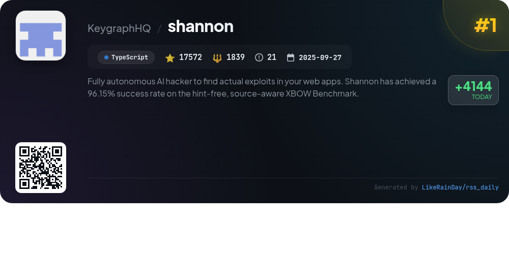
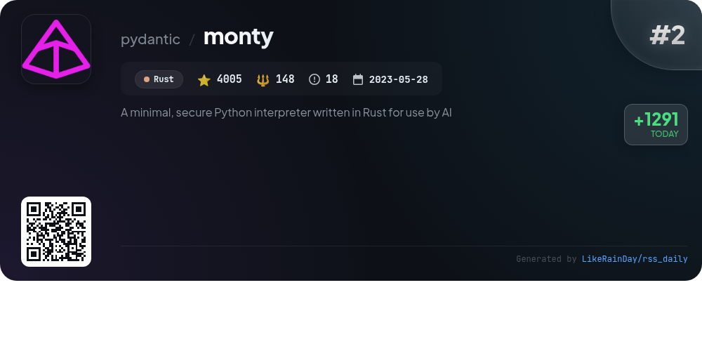
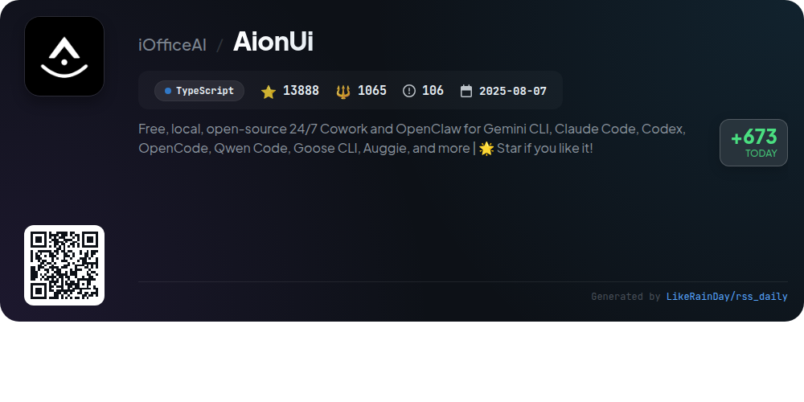
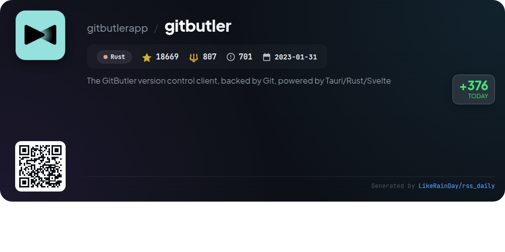
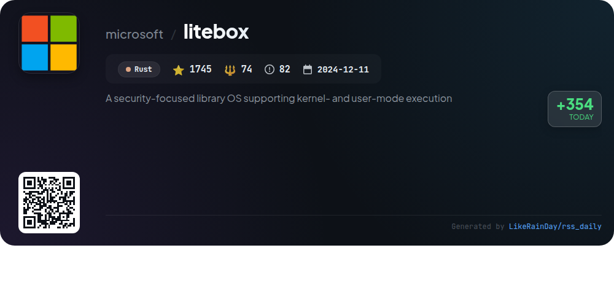
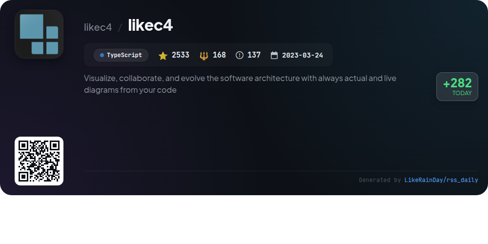
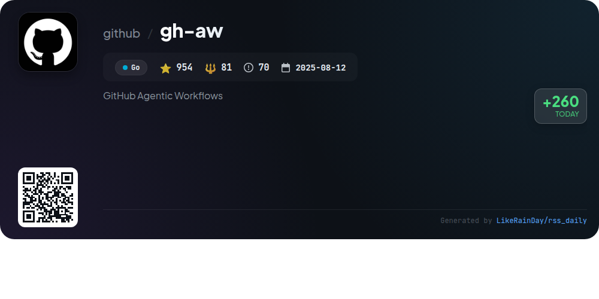
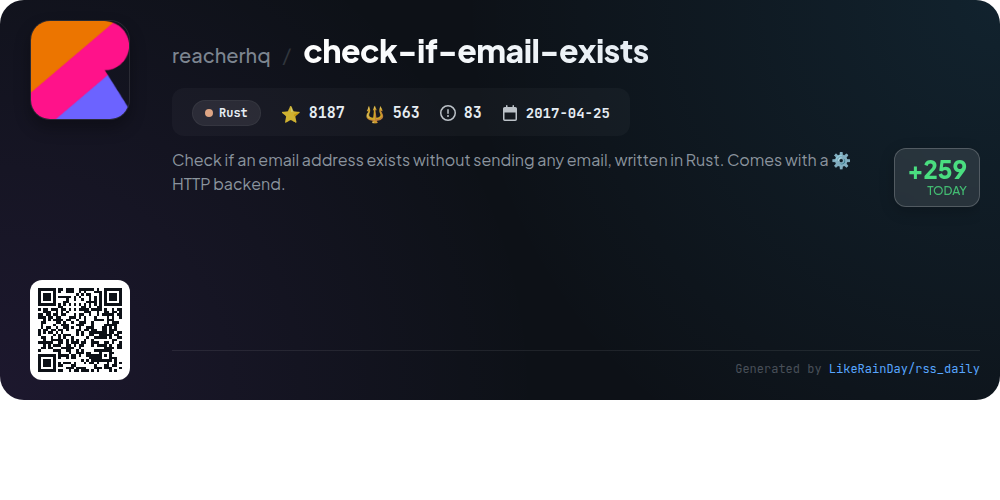
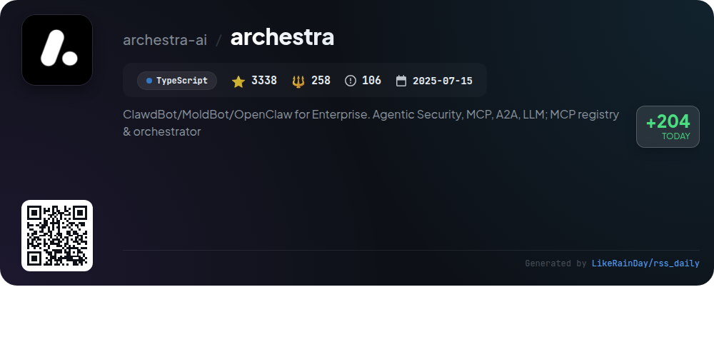

# 📊 🌟 GitHub Trending Daily - 2026-02-10

> > 📅 每日精选 GitHub 热门仓库 | 基于智能算法推荐

## 📋 Overview

**10** 个项目 | **84498** ⭐ | **6630** 🍴

**热门语言:** `TypeScript` (5) · `Rust` (4) · `Go` (1)

**更新时间:** 2026-02-10 02:57 UTC

**分类分布:**

- 🌟 每日 Top 10 精选 (10 项)

---

## 🌟 每日 Top 10 精选

### 1. [shannon](https://github.com/KeygraphHQ/shannon)

> 🤖 **推荐理由**  
> *Shannon is a fully autonomous AI pentester designed to identify and exploit vulnerabilities in web applications, achieving a 96.15% success rate on the XBOW Benchmark. It autonomously conducts penetration tests, executing real exploits like injection attacks and auth bypass to provide actionable proof of vulnerabilities. Key features include code-aware dynamic testing, pentester-grade reports, and parallel processing for faster results. Shannon is available in Lite (free) and Pro (commercial) editions and integrates into the Keygraph Security and Compliance Platform for comprehensive security management.*

- ⭐ 17572 stars
- 💻 TypeScript
- 📅 Updated: 2026-02-10

### 2. [monty](https://github.com/pydantic/monty)

> 🤖 **推荐理由**  
> *Monty is a minimal, secure Python interpreter built in Rust, designed for AI applications. With over 4,000 stars on GitHub, it enables rapid execution of LLM-generated Python code with startup times under 1μs. Key features include strict control over the host environment, type checking support, and the ability to pause and resume execution using serialization. Monty can be called from Python, JavaScript, or Rust, making it versatile for various applications. It emphasizes security and performance, eliminating the complexity of traditional sandboxing solutions.*

- ⭐ 4005 stars
- 💻 Rust
- 📅 Updated: 2026-02-10

### 3. [dexter](https://github.com/virattt/dexter)

> 🤖 **推荐理由**  
> *Dexter is an autonomous financial research agent designed to perform deep analysis by thinking, planning, and learning. It intelligently breaks down complex financial queries into structured tasks, executes them using real-time market data, and self-validates results. Key features include intelligent task planning, autonomous execution of data gathering, and built-in safety features to prevent errors. With access to crucial financial datasets and an evaluation suite for performance tracking, Dexter streamlines financial research and delivers confident, data-backed insights.*

- ⭐ 13607 stars
- 💻 TypeScript
- 📅 Updated: 2026-02-10

### 4. [AionUi](https://github.com/iOfficeAI/AionUi)

> 🤖 **推荐理由**  
> *AionUi is a free, open-source platform designed for seamless collaboration with multiple command-line AI tools such as Gemini CLI, Claude Code, and Codex. Key features include a user-friendly graphical interface, multi-agent support, local data security, and remote access via WebUI and chat platforms like Telegram and Slack. It automates tasks, offers smart file management, and supports real-time previews of AI-generated content. AionUi is cross-platform (macOS, Windows, Linux) and enables users to switch between various AI models effortlessly, enhancing productivity in AI-driven workflows.*

- ⭐ 13888 stars
- 💻 TypeScript
- 📅 Updated: 2026-02-10

### 5. [gitbutler](https://github.com/gitbutlerapp/gitbutler)

> 🤖 **推荐理由**  
> *GitButler is an advanced Git-based version control client designed for modern workflows, featuring both a user-friendly GUI and a powerful CLI. Key features include stacked and parallel branches for efficient development, easy commit management without complex rebasing, an undo timeline for tracking changes, and first-class conflict resolution. It integrates seamlessly with GitHub and GitLab for streamlined collaboration and incorporates AI tools to enhance commit message generation and branch naming. Built with Tauri, Rust, and Svelte, GitButler is a robust and flexible alternative to traditional Git.*

- ⭐ 18669 stars
- 💻 Rust
- 📅 Updated: 2026-02-10

### 6. [litebox](https://github.com/microsoft/litebox)

> 🤖 **推荐理由**  
> *LiteBox is a security-focused library OS written in Rust, designed to minimize the attack surface by reducing the interface to the host. It supports both kernel and user-mode execution, enabling easy interoperability between various "North" shims and "South" platforms. Key features include running unmodified Linux programs on Windows, sandboxing Linux applications, and executing programs on SEV SNP and OP-TEE. LiteBox is actively evolving, with APIs subject to change as development progresses. The project is available under the MIT License and encourages contributions.*

- ⭐ 1745 stars
- 💻 Rust
- 📅 Updated: 2026-02-10

### 7. [likec4](https://github.com/likec4/likec4)

> 🤖 **推荐理由**  
> *LikeC4 is an innovative tool for visualizing, collaborating on, and evolving software architecture through live, up-to-date diagrams generated from code. Built with TypeScript, it allows customization of notation, element types, and architecture levels, inspired by the C4 Model and Structurizr DSL. Key features include a CLI for previewing diagrams, a comprehensive documentation site, and community support via Discord and GitHub Discussions. With over 2,500 stars, LikeC4 is an open-source project, licensed under MIT, and actively welcomes contributions and financial support.*

- ⭐ 2533 stars
- 💻 TypeScript
- 📅 Updated: 2026-02-10

### 8. [gh-aw](https://github.com/github/gh-aw)

> 🤖 **推荐理由**  
> *GitHub Agentic Workflows (gh-aw) enables users to create and run agentic workflows using natural language markdown within GitHub Actions. It emphasizes safety with guardrails, including read-only permissions, sanitized outputs, and multi-layered security measures. Key features include a quick start guide, comprehensive documentation, and integration with companion projects like Agent Workflow Firewall for secure execution. This project fosters automation while ensuring controlled and safe operations, making it ideal for repository management and AI task automation.*

- ⭐ 954 stars
- 💻 Go
- 📅 Updated: 2026-02-10

### 9. [check-if-email-exists](https://github.com/reacherhq/check-if-email-exists)

> 🤖 **推荐理由**  
> *check-if-email-exists is an open-source Rust project that determines the existence of an email address without sending an email. It features a robust HTTP backend available via Docker, a command-line interface (CLI), and programmatic integration for Rust applications. Key functionalities include email reachability assessment, syntax validation, DNS records check, and validation for disposable and role accounts. The project also offers a SaaS solution through Reacher for a user-friendly experience. With 8,187 stars, it provides a comprehensive alternative to paid email verification services.*

- ⭐ 8187 stars
- 💻 Rust
- 📅 Updated: 2026-02-10

### 10. [archestra](https://github.com/archestra-ai/archestra)

> 🤖 **推荐理由**  
> *Archestra is a secure, MCP-native AI platform designed for enterprises, facilitating user-friendly AI integration with robust security. Key features include a centralized MCP orchestrator for server management, a private MCP registry for governance, and a cost monitoring system that can reduce AI expenses by up to 96%. It offers observability tools for tracking usage and performance, alongside security measures to prevent data exfiltration. With a quickstart via Docker and Kubernetes compatibility, Archestra simplifies AI deployment for both technical and non-technical users.*

- ⭐ 3338 stars
- 💻 TypeScript
- 📅 Updated: 2026-02-10

---

## 📡 RSS订阅

通过 RSS 订阅，第一时间获取每日精选项目：

- 🔔 [RSS 订阅源] (../../daily-top.xml)
- 🔔 [每日简报] (../../GITHUB_TODAY_CN.md)
- 🔔 [每日 Top 10 精选](../../daily-top.xml)

---

*⚡ Powered by Smart Trending Algorithm | Generated at 2026-02-10 02:57:02 UTC
