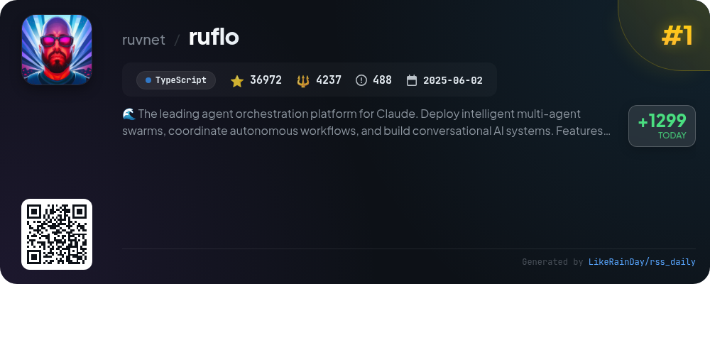
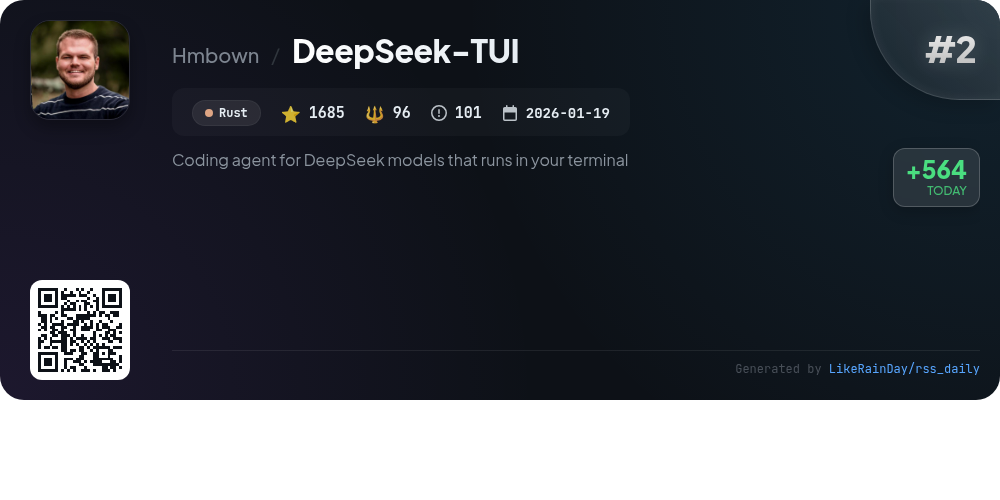
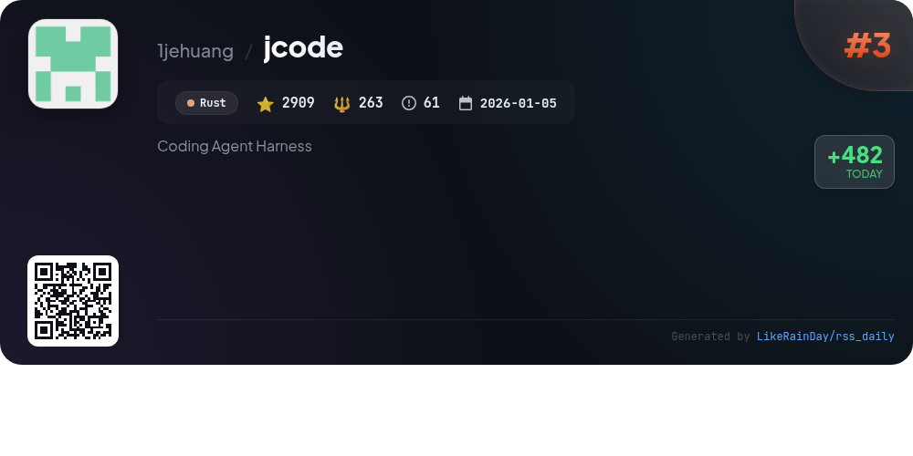
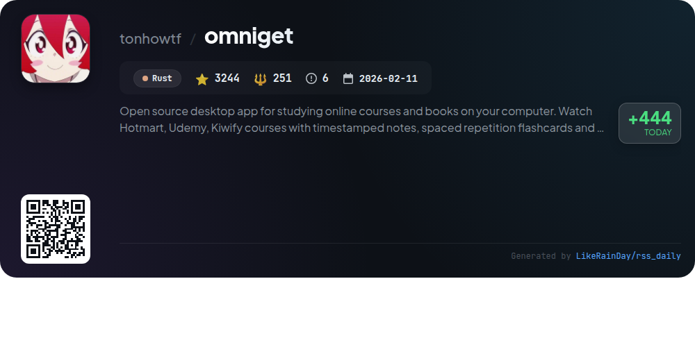
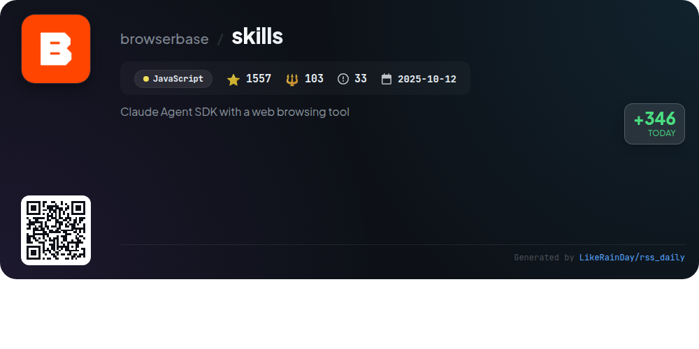
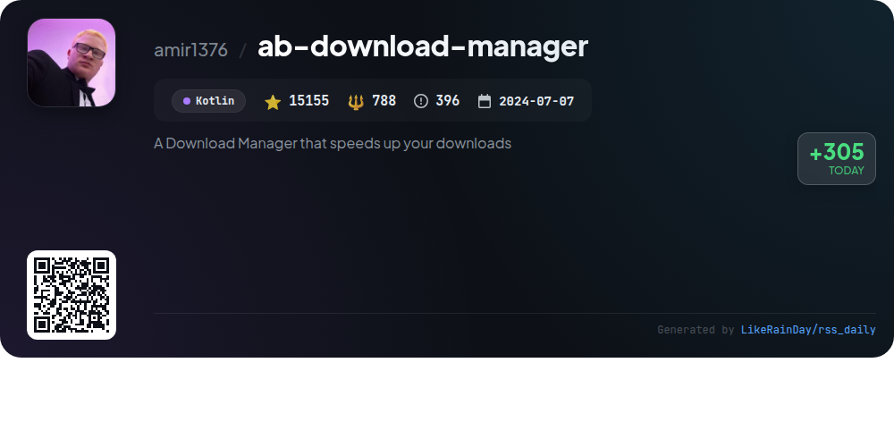
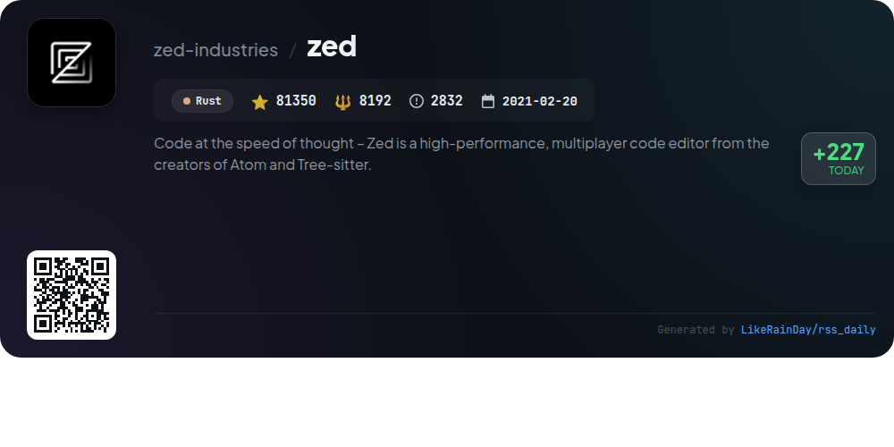
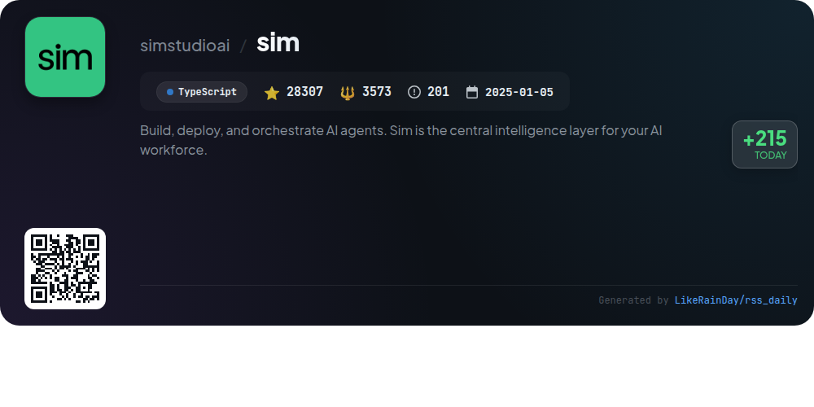
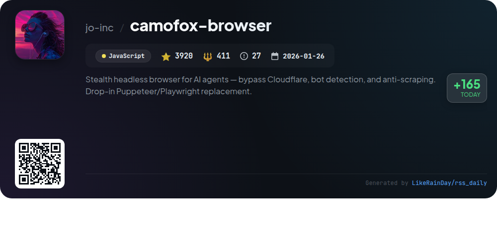
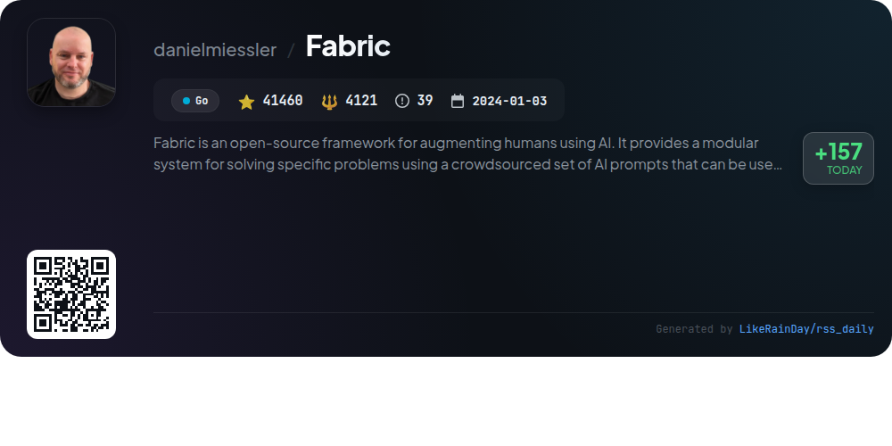

# 📊 🌟 GitHub Trending Daily - 2026-05-03

> > 📅 每日精选 GitHub 热门仓库 | 基于智能算法推荐

## 📋 Overview

**10** 个项目 | **216559** ⭐ | **22035** 🍴

**热门语言:** `Rust` (4) · `JavaScript` (2) · `TypeScript` (2)

**更新时间:** 2026-05-03 03:53 UTC

**分类分布:**

- 🌟 每日 Top 10 精选 (10 项)

---

## 🌟 每日 Top 10 精选

### 1. [ruflo](https://github.com/ruvnet/ruflo)

> 🤖 **推荐理由**  
> *Ruflo is a leading agent orchestration platform for Claude, enabling the deployment of intelligent multi-agent swarms and autonomous workflows. Key features include enterprise-grade architecture, self-learning agents, federated communication, and integration with Claude Code. Users can orchestrate over 100 specialized agents, coordinate tasks, and leverage a robust plugin marketplace. Ruflo also supports secure, zero-trust federation for agent collaboration across machines and organizations. Experience the platform through its web UI and goal planner at flo.ruv.io and goal.ruv.io.*

- ⭐ 36972 stars
- 💻 TypeScript
- 📅 Updated: 2026-05-03

### 2. [DeepSeek-TUI](https://github.com/Hmbown/DeepSeek-TUI)

> 🤖 **推荐理由**  
> *DeepSeek-TUI is a terminal-based coding agent for DeepSeek V4, featuring a 1M-token context and integrated tools. It allows users to manage code and tasks with a keyboard-driven interface, supporting file operations, shell commands, git management, and web searches. Key features include native reasoning mode, thinking-mode streaming, session save/resume, workspace rollback, and an HTTP/SSE runtime API. With three interaction modes (Plan, Agent, YOLO) and live cost tracking, DeepSeek-TUI enhances productivity for developers without requiring a Node/Python runtime.*

- ⭐ 1685 stars
- 💻 Rust
- 📅 Updated: 2026-05-03

### 3. [jcode](https://github.com/1jehuang/jcode)

> 🤖 **推荐理由**  
> *jcode is a cutting-edge coding agent harness built in Rust, designed for efficiency and customizability across Linux, macOS, and Windows. With over 2900 stars on GitHub, it excels in multi-session workflows, utilizing a unique memory system for intelligent recall and context management. Key features include browser automation, real-time collaboration with swarm functionality, and a self-developing mode that allows agents to modify their own source code. jcode integrates various OAuth providers, enabling seamless use of existing models while maintaining high performance and low resource usage.*

- ⭐ 2909 stars
- 💻 Rust
- 📅 Updated: 2026-05-03

### 4. [omniget](https://github.com/tonhowtf/omniget)

> 🤖 **推荐理由**  
> *OmniGet is an open-source desktop app for efficiently studying online courses and books. It supports platforms like Hotmart and Udemy, enabling users to download and watch videos with features like timestamped notes and progress tracking. Users can read PDFs and EPUBs with highlights, bookmarks, and focus modes. Additional functionalities include downloading from YouTube and social media, a Pomodoro timer, spaced repetition flashcards, and a comprehensive library management system. With a user-friendly interface, OmniGet turns study materials into an organized learning experience.*

- ⭐ 3244 stars
- 💻 Rust
- 📅 Updated: 2026-05-03

### 5. [skills](https://github.com/browserbase/skills)

> 🤖 **推荐理由**  
> *Browserbase Skills is a JavaScript SDK that integrates the Claude Agent with Browserbase for advanced browser automation. Key features include the ability to automate web interactions with anti-bot measures, utilize the official `bb` CLI for managing Browserbase projects, and deploy serverless browser functions. Additional tools like site-debugger, browser-trace, and cookie-sync enhance debugging and session management. The plugin supports AI-driven UI testing and provides usage analytics, making it a comprehensive solution for automated web tasks and testing.*

- ⭐ 1557 stars
- 💻 JavaScript
- 📅 Updated: 2026-05-03

### 6. [ab-download-manager](https://github.com/amir1376/ab-download-manager)

> 🤖 **推荐理由**  
> *A Download Manager that speeds up your downloads. popular project, actively maintained, recently updated*

- ⭐ 15155 stars
- 🍴 788 forks
- 💻 Kotlin
- 📅 Updated: 2026-05-03

### 7. [zed](https://github.com/zed-industries/zed)

> 🤖 **推荐理由**  
> *Zed is a high-performance, multiplayer code editor developed by the creators of Atom and Tree-sitter, designed for speed and collaboration. It supports installation on macOS, Linux, and Windows, with plans for web compatibility. Key features include a seamless coding experience, real-time collaboration, and robust development support. Zed is open for contributions and is actively seeking talent. The project is backed by Zed Industries, Inc., and welcomes financial support through GitHub Sponsors, ensuring continued development and innovation.*

- ⭐ 81350 stars
- 💻 Rust
- 📅 Updated: 2026-05-03

### 8. [sim](https://github.com/simstudioai/sim)

> 🤖 **推荐理由**  
> *Sim is an open-source platform designed to build, deploy, and orchestrate AI agents, serving as the central intelligence layer for your AI workforce. With over 28,000 stars on GitHub, it enables users to visually design agent workflows, integrate 1,000+ tools and LLMs, and leverage Copilot for natural language-driven development. Key features include vector database integration for content-specific queries and seamless self-hosting via Docker. Sim supports extensive customization and offers robust documentation for easy setup and deployment.*

- ⭐ 28307 stars
- 💻 TypeScript
- 📅 Updated: 2026-05-03

### 9. [camofox-browser](https://github.com/jo-inc/camofox-browser)

> 🤖 **推荐理由**  
> *camofox-browser is a stealth headless browser designed for AI agents, effectively bypassing Cloudflare and bot detection, making it a robust alternative to Puppeteer and Playwright. Key features include C++-level anti-detection, session isolation, and token-efficient accessibility snapshots. It supports proxy routing, YouTube transcript extraction, and structured logging for observability. With a REST API, users can manage browser sessions, interact with web elements, and utilize search macros for various platforms. Ideal for efficient and secure web browsing in automated environments.*

- ⭐ 3920 stars
- 💻 JavaScript
- 📅 Updated: 2026-05-03

### 10. [Fabric](https://github.com/danielmiessler/Fabric)

> 🤖 **推荐理由**  
> *Fabric is an open-source framework designed to enhance human capabilities through AI integration. Built in Go, it offers a modular system for organizing and utilizing AI prompts, called Patterns, to tackle various real-world tasks. Key features include support for multiple AI providers (OpenAI, Anthropic, Azure, etc.), a REST API for easy access, and a built-in web interface. With over 41,000 stars, Fabric streamlines the integration of AI into daily workflows, enabling users to effectively create, collect, and apply AI solutions across diverse applications.*

- ⭐ 41460 stars
- 💻 Go
- 📅 Updated: 2026-05-03

---

## 📡 RSS订阅

通过 RSS 订阅，第一时间获取每日精选项目：

- 🔔 [RSS 订阅源] (../../daily-top.xml)
- 🔔 [每日简报] (../../GITHUB_TODAY_CN.md)
- 🔔 [每日 Top 10 精选](../../daily-top.xml)

---

*⚡ Powered by Smart Trending Algorithm | Generated at 2026-05-03 03:53:43 UTC
