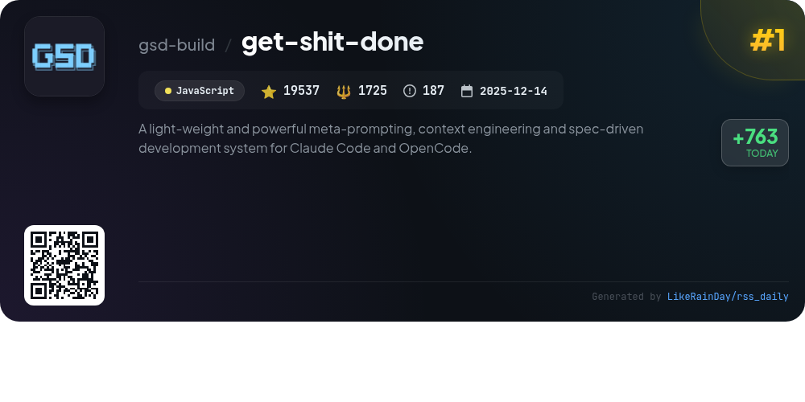
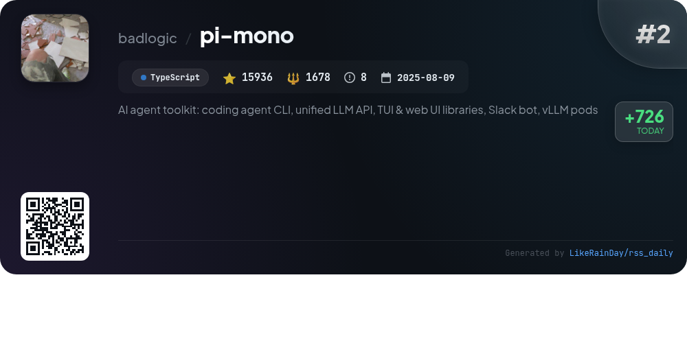
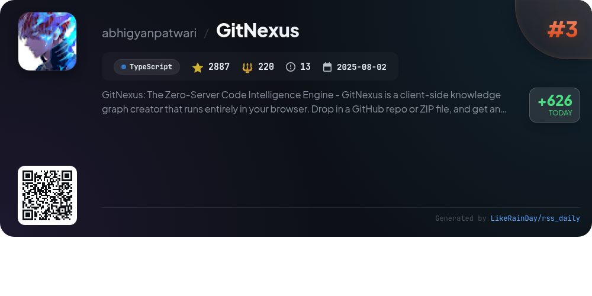
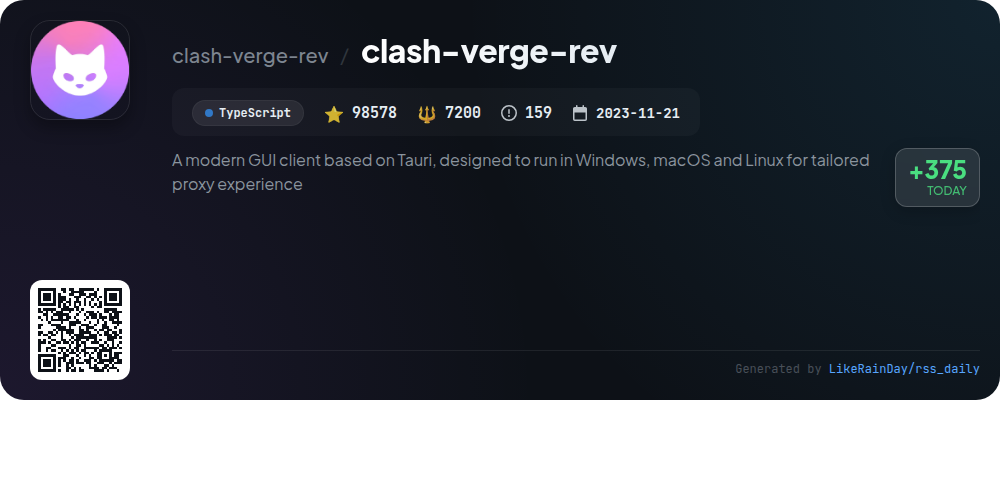
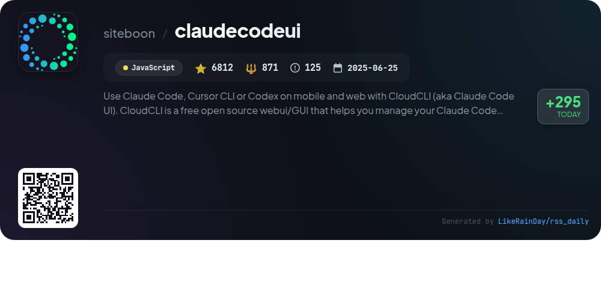
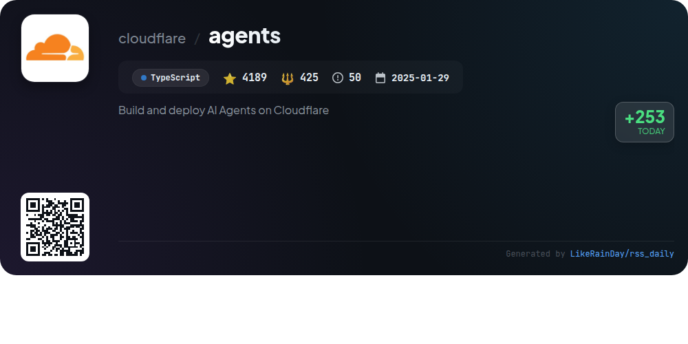
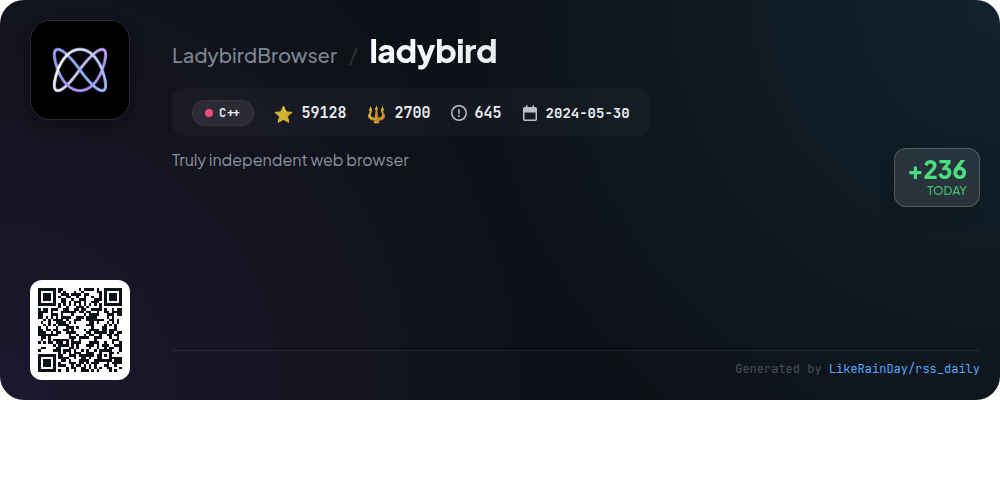
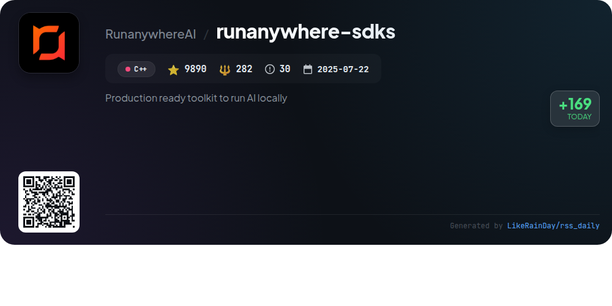

# 📊 🌟 GitHub Trending Daily - 2026-02-25

> > 📅 每日精选 GitHub 热门仓库 | 基于智能算法推荐

## 📋 Overview

**10** 个项目 | **244193** ⭐ | **17141** 🍴

**热门语言:** `TypeScript` (4) · `JavaScript` (3) · `C++` (2)

**更新时间:** 2026-02-25 02:45 UTC

**分类分布:**

- 🌟 每日 Top 10 精选 (10 项)

---

## 🌟 每日 Top 10 精选

### 1. [get-shit-done](https://github.com/gsd-build/get-shit-done)

> 🤖 **推荐理由**  
> *Get Shit Done (GSD) is a lightweight, robust development system designed for Claude Code, OpenCode, Gemini CLI, and Codex, addressing context degradation in AI-generated code. With over 19,500 stars, GSD streamlines the development process through meta-prompting and context engineering, enabling users to define their project vision, requirements, and roadmap efficiently. Key features include automated planning, execution in parallel waves, atomic Git commits, and seamless verification of deliverables. GSD is trusted by engineers at top tech firms, ensuring high-quality, consistent results.*

- ⭐ 19537 stars
- 💻 JavaScript
- 📅 Updated: 2026-02-25

### 2. [pi-mono](https://github.com/badlogic/pi-mono)

> 🤖 **推荐理由**  
> *pi-mono is an AI agent toolkit designed for building and managing AI agents and LLM deployments. It features a unified LLM API supporting multiple providers (OpenAI, Anthropic, Google), an interactive coding agent CLI, a Slack bot for message delegation, and libraries for terminal and web UIs. The toolkit includes CLI tools for managing vLLM deployments on GPU pods. With 15,936 stars, pi-mono provides essential tools for developers looking to integrate AI capabilities into their applications. Contributions are currently paused until March 2026.*

- ⭐ 15936 stars
- 💻 TypeScript
- 📅 Updated: 2026-02-25

### 3. [GitNexus](https://github.com/abhigyanpatwari/GitNexus)

> 🤖 **推荐理由**  
> *GitNexus is a zero-server code intelligence engine that creates a client-side knowledge graph from GitHub repositories or ZIP files directly in your browser. Key features include a Web UI for quick code exploration and a CLI with Model Context Protocol (MCP) for integrating AI agents, offering deep insights into dependencies, call chains, and execution flows. With support for multiple programming languages and advanced tools for impact analysis, refactoring, and documentation generation, GitNexus enhances code understanding while ensuring privacy through local processing.*

- ⭐ 2887 stars
- 💻 TypeScript
- 📅 Updated: 2026-02-25

### 4. [clash-verge-rev](https://github.com/clash-verge-rev/clash-verge-rev)

> 🤖 **推荐理由**  
> *Clash Verge Rev is a modern GUI client built on Tauri, designed for a tailored proxy experience across Windows, macOS, and Linux. With nearly 99,000 stars, it offers a sleek interface with customizable themes, robust configuration management, and visual node editing. Key features include support for the Clash.Meta kernel, TUN mode, and WebDav backup. It emphasizes high performance with a focus on security and usability. The project supports multiple languages and encourages community contributions, making it a versatile tool for users seeking an efficient proxy solution.*

- ⭐ 98578 stars
- 💻 TypeScript
- 📅 Updated: 2026-02-25

### 5. [cc-switch](https://github.com/farion1231/cc-switch)

> 🤖 **推荐理由**  
> *cc-switch is a cross-platform desktop assistant tool for interacting with Claude Code, Codex, and Gemini CLI, built with Rust and Tauri. With over 19,800 stars, it offers seamless provider management, skills and prompts systems, and multi-endpoint configuration. Key features include a dual-layer architecture for data storage, a modern UI, and support for auto-launch on startup. The tool integrates with various API relay services, enhancing productivity and offering discounts for users. It supports English, Chinese, and Japanese, making it accessible to a broader audience.*

- ⭐ 19804 stars
- 💻 Rust
- 📅 Updated: 2026-02-25

### 6. [claudecodeui](https://github.com/siteboon/claudecodeui)

> 🤖 **推荐理由**  
> *Cloud CLI (Claude Code UI) is a versatile, open-source web interface for managing Claude Code, Cursor CLI, and Codex sessions on both mobile and desktop. It features a responsive design for seamless access, an interactive chat interface, and an integrated shell terminal for direct CLI access. Users can navigate projects with a live file explorer, manage Git operations, and utilize AI-driven task management with optional TaskMaster AI integration. With support for multiple languages and easy setup, it enhances productivity for developers working remotely.*

- ⭐ 6812 stars
- 💻 JavaScript
- 📅 Updated: 2026-02-25

### 7. [agents](https://github.com/cloudflare/agents)

> 🤖 **推荐理由**  
> *Cloudflare Agents is a TypeScript SDK enabling the creation and deployment of stateful AI agents on Cloudflare's infrastructure. With 4,189 stars, it offers persistent state management, callable methods, real-time communication, and scheduling capabilities. Agents can hibernate when inactive, allowing for efficient resource use. Key features include AI chat integration, workflows, email handling, and SQLite support. The SDK also provides React hooks for easy frontend integration. Comprehensive documentation and examples are available for developers to get started quickly.*

- ⭐ 4189 stars
- 💻 TypeScript
- 📅 Updated: 2026-02-25

### 8. [ai-guide](https://github.com/liyupi/ai-guide)

> 🤖 **推荐理由**  
> *ai-guide is a comprehensive, open-source platform focusing on AI knowledge sharing. It features a wide array of resources, including guides on model selection (DeepSeek, GPT, Gemini), AI programming tutorials, practical applications, and monetization strategies. The standout "Vibe Coding" course enables users, even with no background, to create and launch AI-driven products. With over 7,400 stars on GitHub, it fosters community engagement and aims to democratize AI technology for all. Explore the wealth of information at [ai.codefather.cn](https://ai.codefather.cn).*

- ⭐ 7432 stars
- 💻 JavaScript
- 📅 Updated: 2026-02-25

### 9. [ladybird](https://github.com/LadybirdBrowser/ladybird)

> 🤖 **推荐理由**  
> *Ladybird is an independent web browser in pre-alpha development, designed using a novel engine based on web standards. It features a multi-process architecture for enhanced security, with each tab running in its own sandboxed renderer process. Core components are derived from SerenityOS, including LibWeb for rendering, LibJS for JavaScript execution, and LibCrypto for security protocols. Ladybird supports Linux, macOS, Windows (WSL2), and other UNIX-like systems. Developers are encouraged to participate via Discord and contribute following the provided guidelines.*

- ⭐ 59128 stars
- 💻 C++
- 📅 Updated: 2026-02-25

### 10. [runanywhere-sdks](https://github.com/RunanywhereAI/runanywhere-sdks)

> 🤖 **推荐理由**  
> *RunAnywhere is a production-ready toolkit for running AI locally across various platforms, enabling on-device capabilities for LLM chat, speech-to-text, and text-to-speech. Key features include offline operation, fast performance, and privacy, as no data leaves the device. Supported SDKs for Swift (iOS/macOS), Kotlin (Android), Web, React Native, and Flutter facilitate easy integration. With over 9,890 stars on GitHub, it offers robust capabilities like voice assistants and visual language models, making it ideal for developers seeking privacy-first AI solutions.*

- ⭐ 9890 stars
- 💻 C++
- 📅 Updated: 2026-02-25

---

## 📡 RSS订阅

通过 RSS 订阅，第一时间获取每日精选项目：

- 🔔 [RSS 订阅源] (../../daily-top.xml)
- 🔔 [每日简报] (../../GITHUB_TODAY_CN.md)
- 🔔 [每日 Top 10 精选](../../daily-top.xml)

---

*⚡ Powered by Smart Trending Algorithm | Generated at 2026-02-25 02:45:54 UTC
