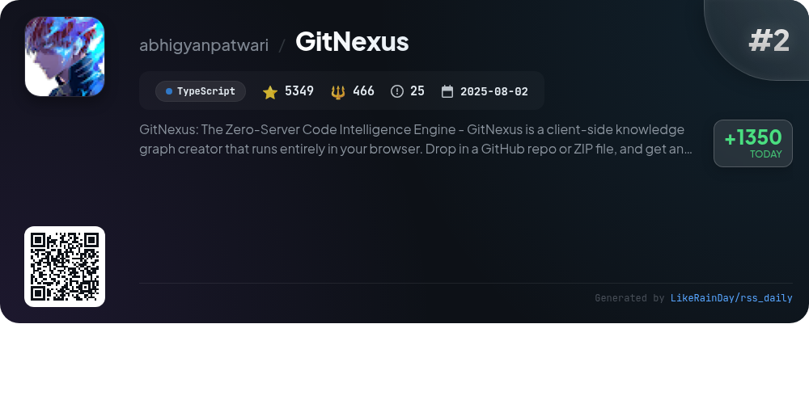
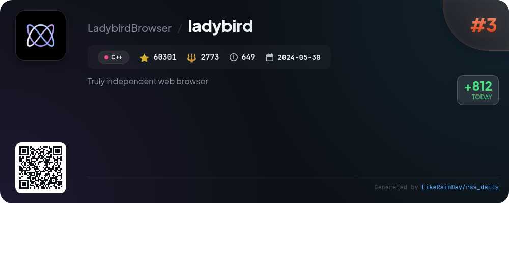
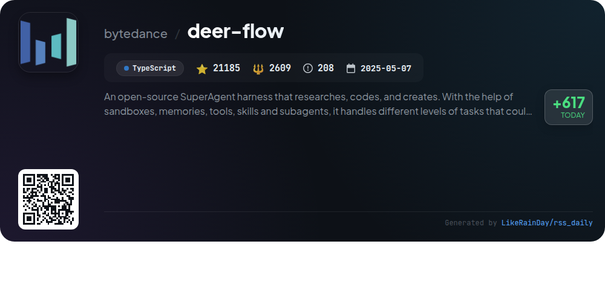
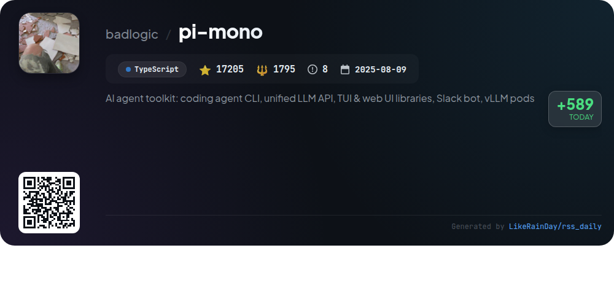
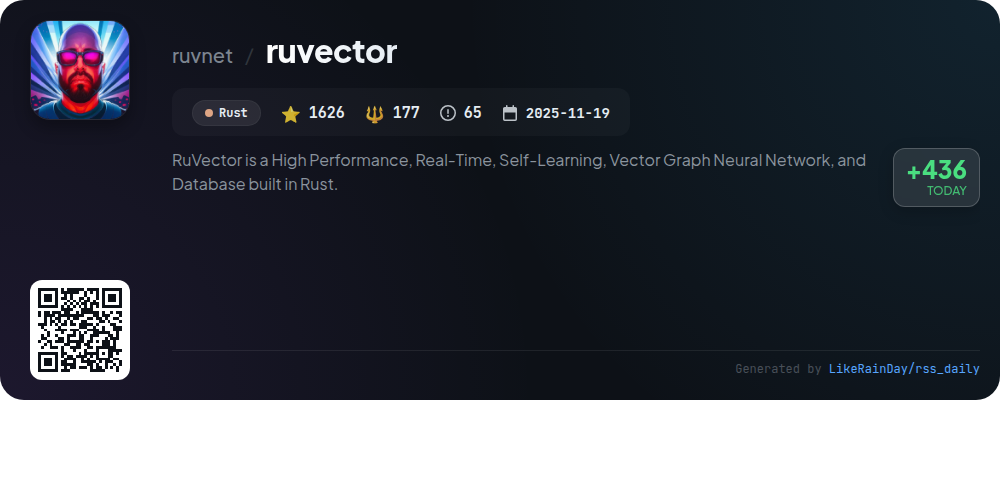
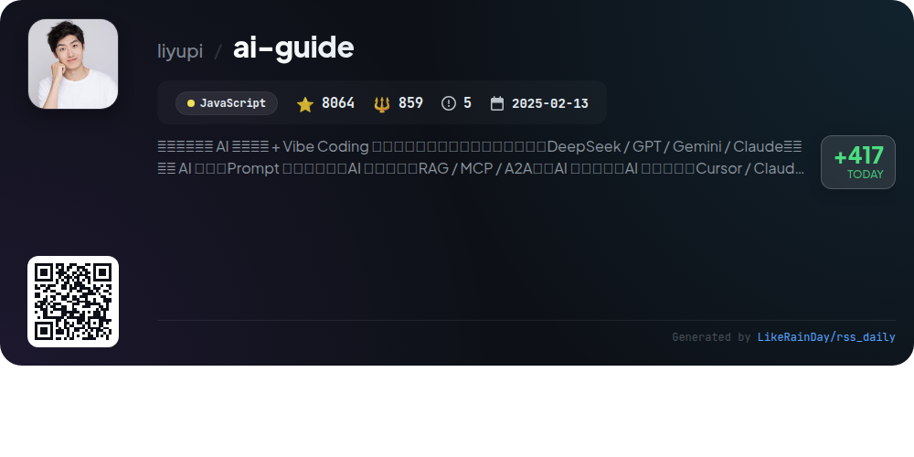

# 📊 🌟 GitHub Trending Daily - 2026-02-27

> > 📅 每日精选 GitHub 热门仓库 | 基于智能算法推荐

## 📋 Overview

**10** 个项目 | **409787** ⭐ | **57407** 🍴

**热门语言:** `TypeScript` (4) · `Rust` (3) · `JavaScript` (2)

**更新时间:** 2026-02-27 02:39 UTC

**分类分布:**

- 🌟 每日 Top 10 精选 (10 项)

---

## 🌟 每日 Top 10 精选

### 1. [openclaw](https://github.com/openclaw/openclaw)

> 🤖 **推荐理由**  
> *OpenClaw is a versatile personal AI assistant that runs on any OS and platform, designed for seamless integration with messaging services like WhatsApp, Telegram, Slack, and more. Key features include a local-first control plane, multi-channel inbox, voice activation, and a live canvas for visual tasks. The onboarding wizard simplifies setup, while robust tools and automation capabilities enhance user experience. Built on TypeScript with a focus on security, OpenClaw offers a fast, always-on assistant tailored for individual use.*

- ⭐ 233326 stars
- 💻 TypeScript
- 📅 Updated: 2026-02-27

### 2. [GitNexus](https://github.com/abhigyanpatwari/GitNexus)

> 🤖 **推荐理由**  
> *GitNexus is a zero-server code intelligence engine that creates client-side knowledge graphs directly in your browser. Users can analyze GitHub repositories or ZIP files to generate interactive graphs and leverage a built-in Graph RAG Agent for enhanced code exploration. Key features include local indexing via CLI, a web UI for quick interactions, and support for multiple programming languages. GitNexus ensures privacy by running entirely in-browser or locally, making it ideal for deep architectural insights and reliable AI agent integration without the risk of missed dependencies.*

- ⭐ 5349 stars
- 💻 TypeScript
- 📅 Updated: 2026-02-27

### 3. [ladybird](https://github.com/LadybirdBrowser/ladybird)

> 🤖 **推荐理由**  
> *Ladybird is a pre-alpha, independent web browser built with a novel engine based on web standards, featuring a multi-process architecture for enhanced security and performance. Each tab operates in its own sandboxed renderer process, ensuring robustness against malicious content. Core components include LibWeb, LibJS, and LibCrypto, providing web rendering, JavaScript support, and encryption. It supports Linux, macOS, Windows (WSL2), and other UNIX-like systems. Join the development community on Discord and explore contribution opportunities.*

- ⭐ 60301 stars
- 💻 C++
- 📅 Updated: 2026-02-27

### 4. [get-shit-done](https://github.com/gsd-build/get-shit-done)

> 🤖 **推荐理由**  
> *Get Shit Done (GSD) is a lightweight, powerful meta-prompting and context engineering system designed for Claude Code, OpenCode, Gemini CLI, and Codex. It addresses context rot, ensuring high-quality code generation through a streamlined workflow. Core features include project initialization, multi-phase planning, parallel execution, and automated verification, all with atomic Git commits for traceability. Trusted by engineers from Amazon, Google, and Shopify, GSD simplifies development by focusing on delivering precise outcomes without unnecessary complexity.*

- ⭐ 21058 stars
- 💻 JavaScript
- 📅 Updated: 2026-02-27

### 5. [deer-flow](https://github.com/bytedance/deer-flow)

> 🤖 **推荐理由**  
> *DeerFlow 2.0 is an open-source super agent harness designed for efficient research and task automation. It orchestrates sub-agents, memory, and sandboxes to handle complex tasks, from research to content generation. Key features include extensible skills and tools, isolated sub-agent contexts, a full filesystem for sandboxed execution, and long-term memory that personalizes user interactions. Built on LangGraph and LangChain, it supports any LLM with OpenAI-compatible APIs, making it a powerful platform for developers seeking to automate workflows and enhance productivity.*

- ⭐ 21185 stars
- 💻 TypeScript
- 📅 Updated: 2026-02-27

### 6. [pi-mono](https://github.com/badlogic/pi-mono)

> 🤖 **推荐理由**  
> *The pi-mono project is an AI agent toolkit that offers a comprehensive suite for building and managing AI agents and LLM deployments. Key features include a unified LLM API supporting multiple providers, an interactive coding agent CLI, a Slack bot for delegation, and libraries for terminal and web UI development. The toolkit also includes tools for managing vLLM deployments on GPU pods. With over 17,000 stars, pi-mono is designed for developers looking to enhance their AI capabilities efficiently. Note that contributions are paused until March 2026.*

- ⭐ 17205 stars
- 💻 TypeScript
- 📅 Updated: 2026-02-27

### 7. [SpacetimeDB](https://github.com/clockworklabs/SpacetimeDB)

> 🤖 **推荐理由**  
> *SpacetimeDB is a high-performance relational database and server solution built in Rust, designed for real-time applications like games and collaboration tools. By allowing developers to upload application logic as modules directly to the database, it eliminates the need for traditional server architectures, enabling faster deployments with minimal infrastructure. Key features include in-memory state management, a write-ahead-log for data persistence, and support for multiple programming languages. With over 20,000 stars on GitHub, SpacetimeDB streamlines development while optimizing speed and latency.*

- ⭐ 20924 stars
- 💻 Rust
- 📅 Updated: 2026-02-27

### 8. [ruvector](https://github.com/ruvnet/ruvector)

> 🤖 **推荐理由**  
> *RuVector is a high-performance, real-time, self-learning vector graph neural network and database built in Rust, designed to evolve with usage. Key features include automatic learning from queries, local LLM execution, real-time graph updates, and a self-booting microservice architecture. It supports advanced graph queries using Cypher, operates offline, and offers cryptographic audit trails for operations. RuVector integrates seamlessly with AI orchestration platforms, making it suitable for dynamic applications like multi-agent systems and cognitive containers. The project is open-source under the MIT license.*

- ⭐ 1626 stars
- 💻 Rust
- 📅 Updated: 2026-02-27

### 9. [cc-switch](https://github.com/farion1231/cc-switch)

> 🤖 **推荐理由**  
> *cc-switch is a cross-platform desktop assistant tool designed for Claude Code, Codex, and Gemini CLI, built with Rust and Tauri. It boasts a user-friendly interface, SQLite-based data management, and features like one-click provider switching, skills management, and prompt handling. Users can seamlessly integrate multiple AI models, manage MCP servers, and benefit from auto-launch capabilities. The tool supports cloud sync and includes extensive internationalization. With over 20,000 stars, it leverages partnerships with API relay services, ensuring efficient and cost-effective AI interactions.*

- ⭐ 20749 stars
- 💻 Rust
- 📅 Updated: 2026-02-27

### 10. [ai-guide](https://github.com/liyupi/ai-guide)

> 🤖 **推荐理由**  
> *ai-guide is a comprehensive, open-source AI knowledge platform designed to eliminate information barriers and empower users with AI technology. It offers a wide array of resources, including a beginner-friendly "Vibe Coding" tutorial, AI tool evaluations, and guidance on model selection (DeepSeek, GPT, etc.), along with practical programming tutorials. Key features include hands-on project guides, monetization strategies, and a repository of AI concepts and tips. With over 8,000 stars on GitHub, it aims to democratize access to AI knowledge and skills.*

- ⭐ 8064 stars
- 💻 JavaScript
- 📅 Updated: 2026-02-27

---

## 📡 RSS订阅

通过 RSS 订阅，第一时间获取每日精选项目：

- 🔔 [RSS 订阅源] (../../daily-top.xml)
- 🔔 [每日简报] (../../GITHUB_TODAY_CN.md)
- 🔔 [每日 Top 10 精选](../../daily-top.xml)

---

*⚡ Powered by Smart Trending Algorithm | Generated at 2026-02-27 02:39:10 UTC
