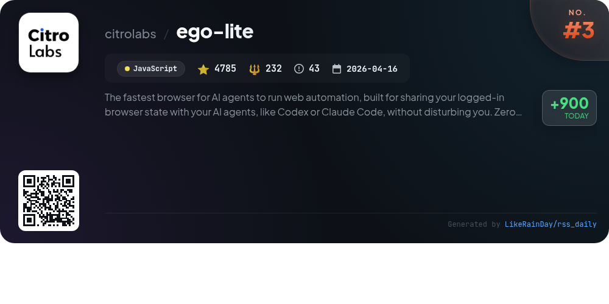
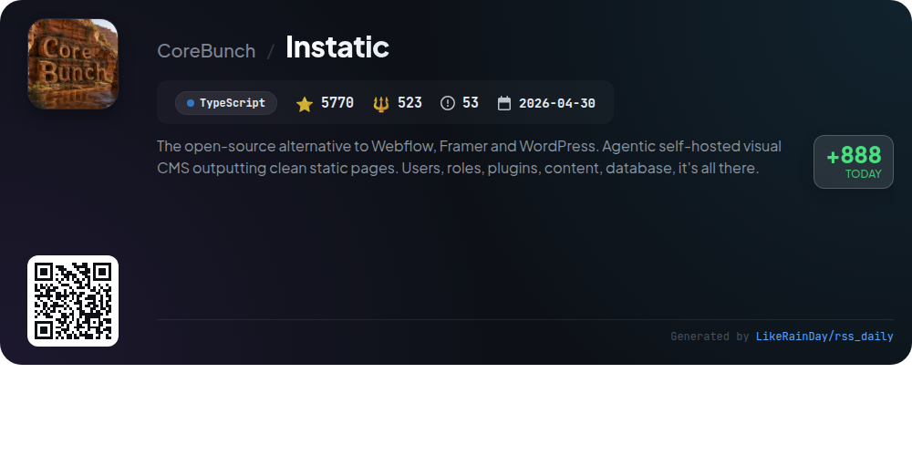
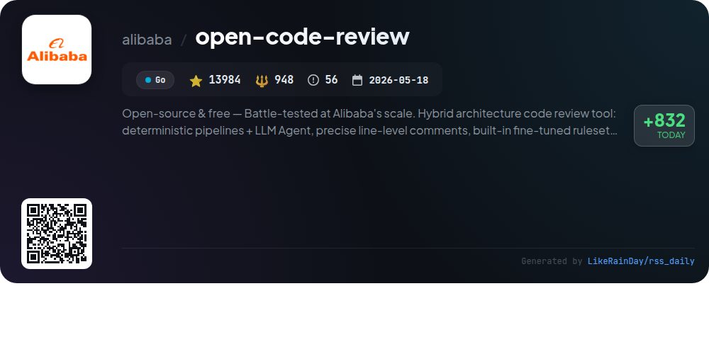
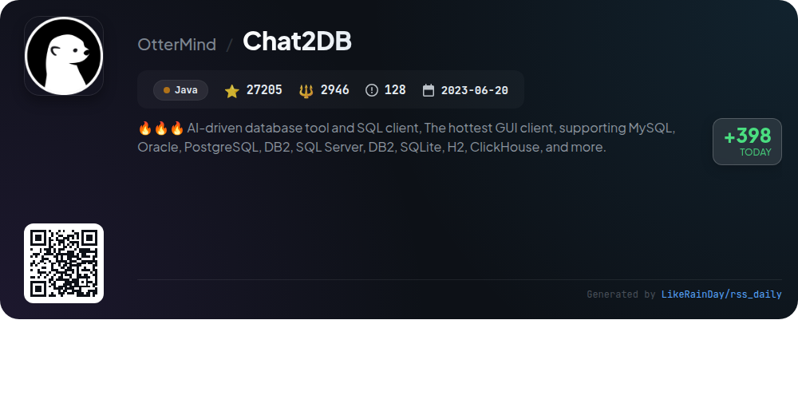
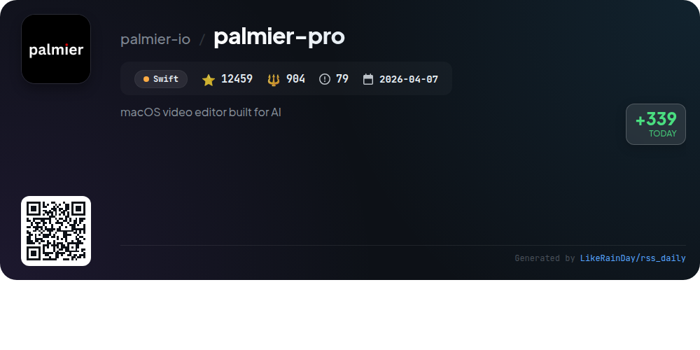
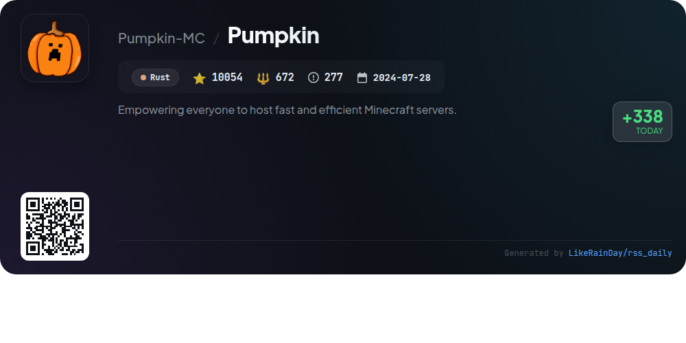

# 📊 🌟 GitHub Trending Daily - 2026-07-27

> > 📅 每日精选 GitHub 热门仓库 | 基于智能算法推荐

## 📋 Overview

**10** 个项目 | **402866** ⭐ | **50725** 🍴

**热门语言:** `JavaScript` (3) · `Rust` (2) · `Swift` (2)

**更新时间:** 2026-07-27 03:43 UTC

**分类分布:**

- 🌟 每日 Top 10 精选 (10 项)

---

## 🌟 每日 Top 10 精选

### 1. [buzz](https://github.com/block/buzz)

> 🤖 **推荐理由**  
> *Buzz is a self-hostable communication platform that integrates humans and AI agents into a cohesive workspace. It features a single-relay architecture for community management, allowing users to interact through channels, threads, and DMs while maintaining a unified event log for all actions. Key capabilities include agent-driven bug triaging, branch-based collaboration, and comprehensive search functionality. With a focus on shared workflows and audit trails, Buzz aims to streamline project management and enhance team collaboration. Built in Rust, it supports desktop and CLI interactions, fostering a collaborative environment where agents act as active team members.*

- ⭐ 13485 stars
- 💻 Rust
- 📅 Updated: 2026-07-27

### 2. [bitchat](https://github.com/permissionlesstech/bitchat)

> 🤖 **推荐理由**  
> *bitchat is a decentralized peer-to-peer messaging app featuring a dual transport architecture that combines Bluetooth mesh networks for offline communication and the Nostr protocol for global messaging. With no accounts or central servers, it prioritizes privacy and features intelligent message routing, location-based channels, and end-to-end encryption. The app supports both iOS and macOS, offers an IRC-style command interface, and includes emergency wipe capabilities. Ideal for group chats in various scenarios, bitchat ensures secure, flexible communication without reliance on the internet.*

- ⭐ 30620 stars
- 💻 Swift
- 📅 Updated: 2026-07-27

### 3. [ego-lite](https://github.com/citrolabs/ego-lite)

> 🤖 **推荐理由**  
> *ego-lite is a cutting-edge browser designed for seamless web automation by AI agents, allowing parallel task execution without disrupting user browsing. Key features include dedicated Spaces for each agent, fast JavaScript-based task execution, and high-quality page snapshots. It inherits Chrome’s data for user convenience and offers a straightforward setup with zero configuration. Currently available for macOS, with Windows and Linux support planned, ego-lite empowers agents like Codex and Claude Code to automate tasks efficiently while users maintain control over their tabs.*

- ⭐ 4785 stars
- 💻 JavaScript
- 📅 Updated: 2026-07-27

### 4. [Instatic](https://github.com/CoreBunch/Instatic)

> 🤖 **推荐理由**  
> *Instatic is an open-source, self-hosted visual CMS that serves as an alternative to Webflow, Framer, and WordPress, designed to generate clean static pages. It consolidates the visual editor, content engine, and publishing tools within a single Bun server, supporting SQLite or Postgres databases. Key features include a real-time design canvas, a robust data management system, built-in analytics, and a plugin architecture for extensibility. With one-click deployment options and a focus on semantic HTML and compact CSS, Instatic prioritizes site ownership and performance.*

- ⭐ 5770 stars
- 💻 TypeScript
- 📅 Updated: 2026-07-27

### 5. [open-code-review](https://github.com/alibaba/open-code-review)

> 🤖 **推荐理由**  
> *Open-source & free — Battle-tested at Alibaba's scale. Hybrid architecture code review tool: deterministic pipelines + LLM Agent, precise line-level. popular project, actively maintained, recently updated*

- ⭐ 13984 stars
- 🍴 948 forks
- 💻 Go
- 📅 Updated: 2026-07-27

### 6. [ECC](https://github.com/affaan-m/ECC)

> 🤖 **推荐理由**  
> *ECC is a comprehensive performance optimization system designed for AI agent harnessing, supporting platforms like Claude Code, Codex, and Cursor. Key features include skills and instinct management, memory optimization, security scanning, and research-focused development. With over 233,000 stars, ECC provides cross-harness agent workflows, a user-friendly GUI dashboard, and a rich ecosystem of 67 agents and 281 skills. It emphasizes seamless integration, allowing users to optimize coding practices, automate tasks, and ensure security, making it suitable for both individual developers and teams.*

- ⭐ 233712 stars
- 💻 JavaScript
- 📅 Updated: 2026-07-27

### 7. [impeccable](https://github.com/pbakaus/impeccable)

> 🤖 **推荐理由**  
> *Impeccable is a powerful design language for AI coding agents, featuring 23 commands and 60 deterministic detector rules to enhance AI-generated frontend design. It offers a streamlined setup with `/impeccable init`, allowing users to define design context easily. Key commands include `polish`, `audit`, `critique`, and `animate`, facilitating comprehensive design workflows. The CLI and browser extension enable real-time iteration and quality checks. Impeccable supports multiple platforms, including Claude Code and GitHub Copilot, making it an essential tool for improving design quality in AI projects.*

- ⭐ 50792 stars
- 💻 JavaScript
- 📅 Updated: 2026-07-27

### 8. [Chat2DB](https://github.com/OtterMind/Chat2DB)

> 🤖 **推荐理由**  
> *Chat2DB is an AI-powered database tool and SQL client supporting over 30 databases, including MySQL, PostgreSQL, Oracle, and more. It offers a comprehensive SQL workspace with features like editing, completion, execution history, and a customizable AI assistant for generating and optimizing SQL queries. Users can manage database objects, import/export data, and create dashboards and charts. The application is cross-platform and runs locally, ensuring data security. Chat2DB also includes an open-source CLI and provides community and commercial editions with additional features.*

- ⭐ 27205 stars
- 💻 Java
- 📅 Updated: 2026-07-27

### 9. [palmier-pro](https://github.com/palmier-io/palmier-pro)

> 🤖 **推荐理由**  
> *Palmier Pro is an open-source video editor for macOS, designed with AI integration in mind. Built using Swift, it features a timeline editor where users can collaborate with AI agents to generate and edit videos. Key highlights include built-in generative AI tools for video and image creation, seamless integration with agents like Claude and Codex, and an MCP server for real-time collaboration. While the core video editing features are free, generative AI capabilities require a subscription. Compatible only with macOS 26 on Apple Silicon, Palmier Pro aims to streamline video editing workflows.*

- ⭐ 12459 stars
- 💻 Swift
- 📅 Updated: 2026-07-27

### 10. [Pumpkin](https://github.com/Pumpkin-MC/Pumpkin)

> 🤖 **推荐理由**  
> *Pumpkin is a high-performance Minecraft server built in Rust, designed to offer an efficient and customizable gaming experience. With over 10,000 stars on GitHub, it supports both Java and Bedrock editions while maintaining Vanilla mechanics. Key features include multi-threading for speed, robust security against exploits, and extensive configurability. The project is extensible with plugin support, and comprehensive tracking for world, player, and entity management. Join their Discord for updates and contribute to ongoing development. Visit [pumpkinmc.org](https://pumpkinmc.org/) for more details.*

- ⭐ 10054 stars
- 💻 Rust
- 📅 Updated: 2026-07-27

---

## 📡 RSS订阅

通过 RSS 订阅，第一时间获取每日精选项目：

- 🔔 [RSS 订阅源] (../../daily-top.xml)
- 🔔 [每日简报] (../../GITHUB_TODAY_CN.md)
- 🔔 [每日 Top 10 精选](../../daily-top.xml)

---

*⚡ Powered by Smart Trending Algorithm | Generated at 2026-07-27 03:43:54 UTC
