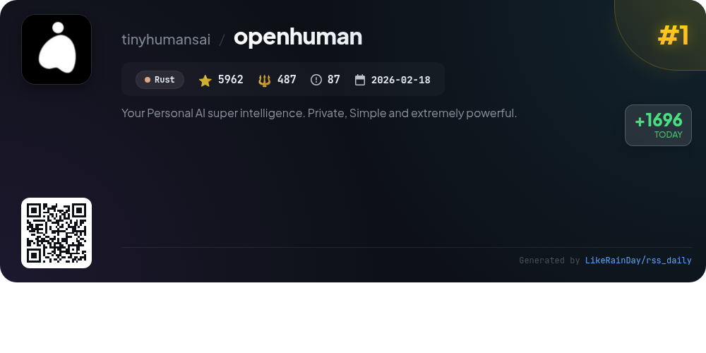
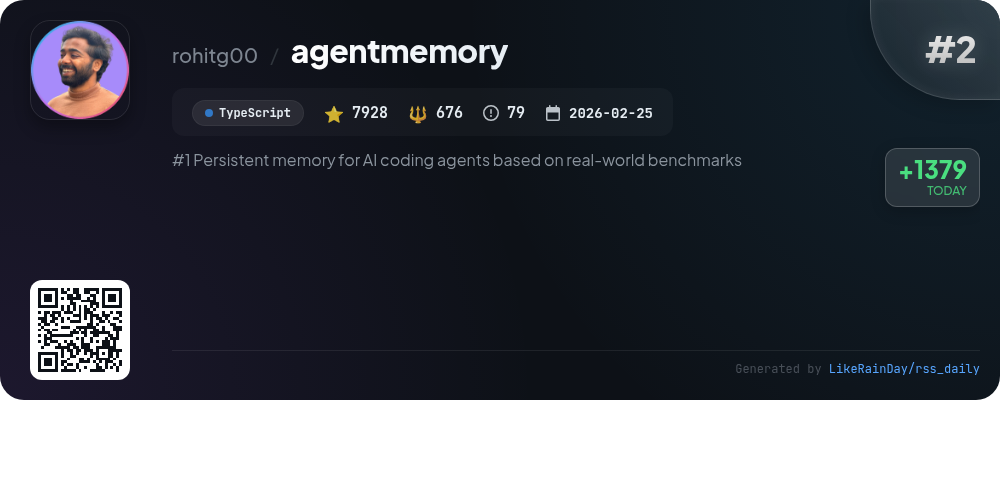
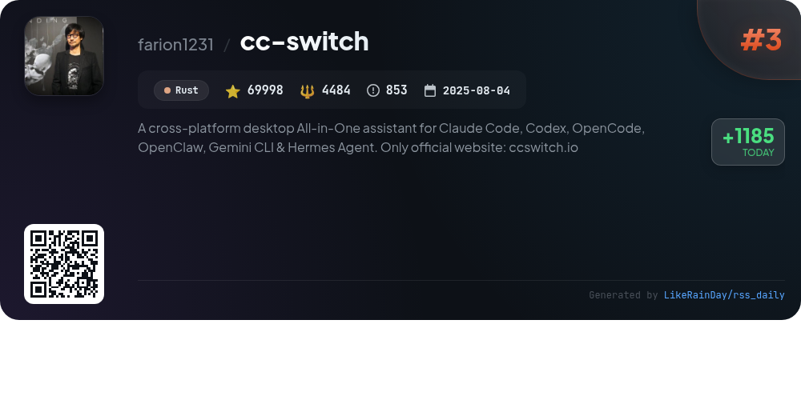
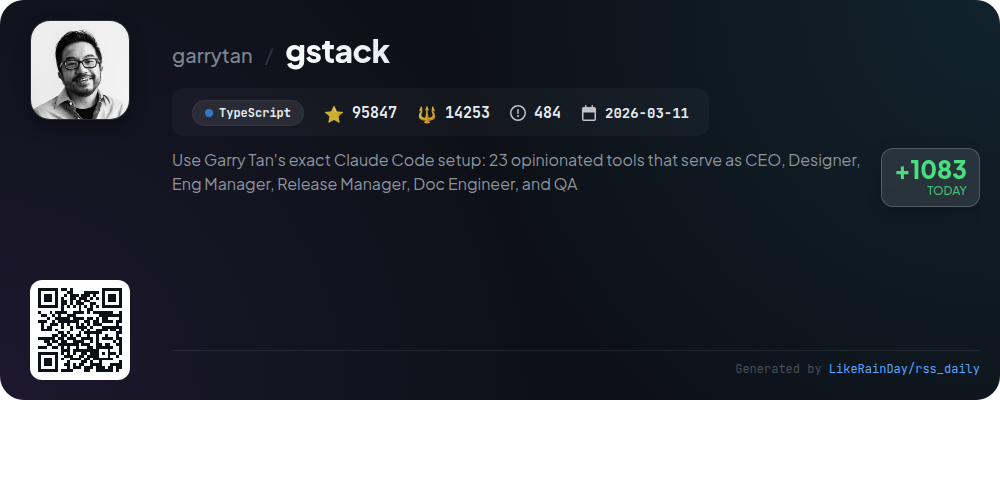
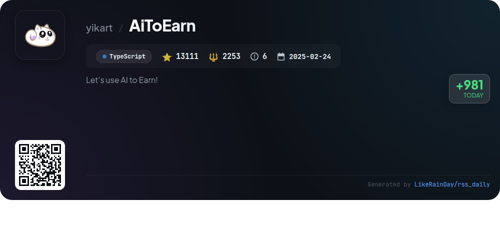
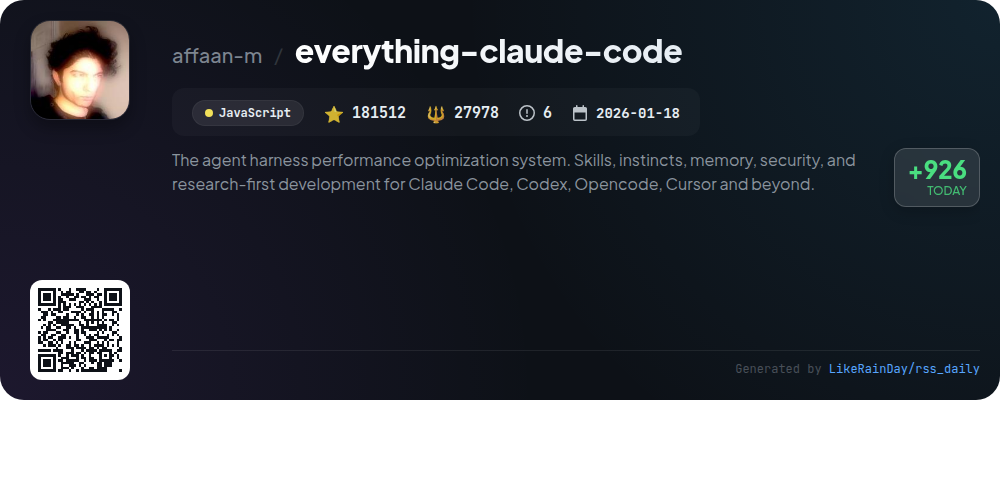
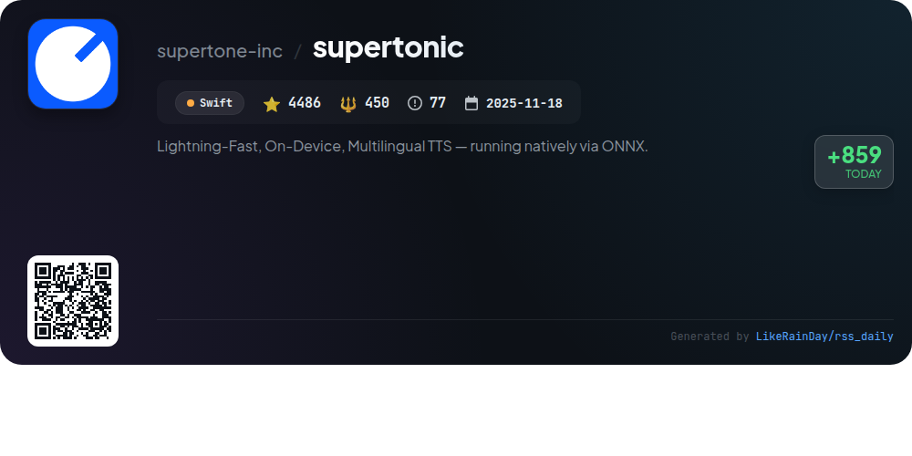
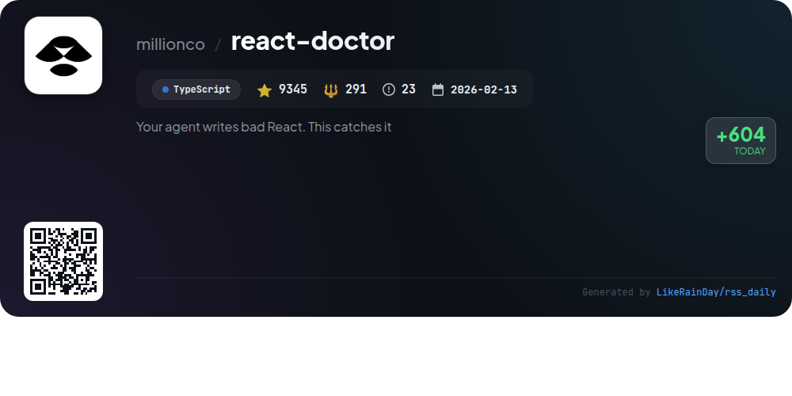
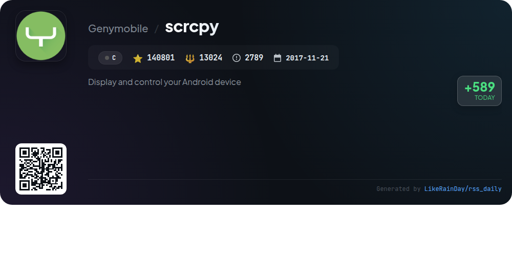
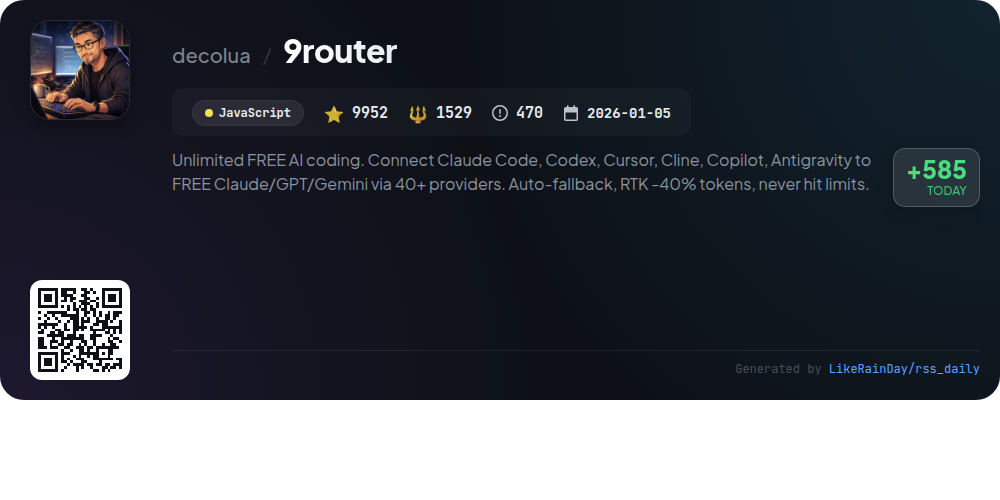

# 📊 🌟 GitHub Trending Daily - 2026-05-14

> > 📅 每日精选 GitHub 热门仓库 | 基于智能算法推荐

## 📋 Overview

**10** 个项目 | **538942** ⭐ | **65425** 🍴

**热门语言:** `TypeScript` (4) · `Rust` (2) · `JavaScript` (2)

**更新时间:** 2026-05-14 03:59 UTC

**分类分布:**

- 🌟 每日 Top 10 精选 (10 项)

---

## 🌟 每日 Top 10 精选

### 1. [openhuman](https://github.com/tinyhumansai/openhuman)

> 🤖 **推荐理由**  
> *OpenHuman is an open-source personal AI assistant designed for seamless daily integration. It features a user-friendly interface and requires minimal setup, allowing users to connect over 118 third-party services with one-click OAuth. Key highlights include a Memory Tree for local knowledge storage, auto-fetching data every 20 minutes, and smart token compression to optimize performance. With built-in tools for web search, coding, and voice interaction, OpenHuman prioritizes privacy and offers a comprehensive, context-aware experience. Currently in early beta, it aims to revolutionize personal AI interactions.*

- ⭐ 5962 stars
- 💻 Rust
- 📅 Updated: 2026-05-14

### 2. [agentmemory](https://github.com/rohitg00/agentmemory)

> 🤖 **推荐理由**  
> *Agentmemory is a powerful persistent memory engine for AI coding agents, enabling seamless context retention across sessions. Built on the iii engine, it supports various clients like Claude Code, Cursor, and Codex CLI, allowing them to remember previous interactions without re-explaining. Key features include automatic observation capture, hybrid semantic search, and real-time memory visualization. With a retrieval accuracy of 95.2% and 92% fewer tokens used, agentmemory enhances coding efficiency, making it the top choice for developers seeking advanced memory capabilities in AI.*

- ⭐ 7928 stars
- 💻 TypeScript
- 📅 Updated: 2026-05-14

### 3. [cc-switch](https://github.com/farion1231/cc-switch)

> 🤖 **推荐理由**  
> *CC Switch is a cross-platform desktop assistant for managing multiple AI CLI tools, including Claude Code, Codex, Gemini CLI, OpenCode, and OpenClaw. With over 69,998 stars, it simplifies API provider management through a user-friendly interface, enabling one-click switching and unified MCP and Skills management. Key features include 50+ built-in provider presets, cloud sync across devices, session management, and a local proxy for failover. Built with Rust and Tauri, CC Switch is available for Windows, macOS, and Linux, enhancing productivity in modern AI coding workflows. Visit ccswitch.io for more.*

- ⭐ 69998 stars
- 💻 Rust
- 📅 Updated: 2026-05-14

### 4. [gstack](https://github.com/garrytan/gstack)

> 🤖 **推荐理由**  
> *gstack is an open-source toolkit designed to enhance productivity for developers and teams, enabling rapid shipping of features with AI assistance. It features 23 specialized roles, including CEO, Designer, and QA, facilitating a structured workflow from planning to deployment. Key highlights include automated design reviews, real-time QA testing, and seamless integration with multiple AI agents. With commands for brainstorming, planning, coding, and testing, gstack streamlines the development process, allowing users to operate like a full engineering team. Ideal for founders and technical leads, it promotes efficient collaboration and continuous improvement.*

- ⭐ 95847 stars
- 💻 TypeScript
- 📅 Updated: 2026-05-14

### 5. [AiToEarn](https://github.com/yikart/AiToEarn)

> 🤖 **推荐理由**  
> *AiToEarn is an AI-driven content marketing platform designed for content creators, brands, and businesses to monetize, publish, and engage across major global platforms like TikTok, YouTube, and Instagram. With features like automated content creation, multi-platform publishing, and interactive engagement tools, AiToEarn streamlines the monetization process through various payment models (CPS, CPE, CPM). Users can quickly access the platform via a web interface, integration with AI assistants, or private deployment using Docker, making it versatile for different user needs.*

- ⭐ 13111 stars
- 💻 TypeScript
- 📅 Updated: 2026-05-14

### 6. [everything-claude-code](https://github.com/affaan-m/everything-claude-code)

> 🤖 **推荐理由**  
> *Everything Claude Code is a cutting-edge performance optimization system for AI agents, offering skills, instincts, memory optimization, and security scanning for frameworks like Claude Code, Codex, and Cursor. With over 181K stars and 60 specialized agents, it enables continuous learning and production-ready workflows. Key features include a user-friendly dashboard, multi-language support, and advanced security auditing via AgentShield. The project fosters a collaborative ecosystem for AI development, providing extensive documentation and community contributions for enhanced adaptability and efficiency.*

- ⭐ 181512 stars
- 💻 JavaScript
- 📅 Updated: 2026-05-14

### 7. [supertonic](https://github.com/supertone-inc/supertonic)

> 🤖 **推荐理由**  
> *Supertonic is a lightning-fast, on-device multilingual text-to-speech (TTS) system utilizing ONNX Runtime for local inference, ensuring privacy and low latency. With support for 31 languages, Supertonic 3 enhances reading accuracy and reduces errors. Key features include a voice builder for custom TTS, batch processing, and compatibility across multiple platforms, including Python, Node.js, and iOS. It outputs 16-bit WAV files and provides a seamless experience with expressive tags for natural speech. Explore demos and models on Hugging Face.*

- ⭐ 4486 stars
- 💻 Swift
- 📅 Updated: 2026-05-14

### 8. [react-doctor](https://github.com/millionco/react-doctor)

> 🤖 **推荐理由**  
> *React Doctor is a TypeScript tool designed to analyze and improve React codebases. It scans your project with a single command, generating a health score (0-100) alongside actionable diagnostics in areas like state management, performance, architecture, security, and accessibility. It integrates seamlessly with frameworks like Next.js and Vite, and supports over 50 coding agents to enforce best practices. The tool also features GitHub Actions for CI integration, customizable configuration options, and optional linting plugins. With over 9,300 stars on GitHub, React Doctor is an essential resource for maintaining high-quality React applications.*

- ⭐ 9345 stars
- 💻 TypeScript
- 📅 Updated: 2026-05-14

### 9. [scrcpy](https://github.com/Genymobile/scrcpy)

> 🤖 **推荐理由**  
> *scrcpy is an open-source application that enables users to display and control Android devices via USB or TCP/IP without requiring root access or additional apps. It supports Linux, Windows, and macOS, offering high performance (30–120fps) and low latency (35–70ms). Key features include audio forwarding, screen recording, virtual display, and keyboard/mouse simulation. It allows mirroring with the device screen off, copy-paste functionality, and gamepad support. scrcpy is free of ads and accounts, prioritizing user privacy and simplicity.*

- ⭐ 140801 stars
- 💻 C
- 📅 Updated: 2026-05-14

### 10. [9router](https://github.com/decolua/9router)

> 🤖 **推荐理由**  
> *9Router is a powerful AI coding router that connects various coding tools (Claude Code, Codex, Cursor, etc.) to over 40 AI providers, ensuring unlimited access to free models. Key features include an RTK token saver that reduces token usage by 20-40%, auto-fallback to cheaper or free models to prevent downtime, real-time quota tracking, and multi-account support. With a user-friendly dashboard, 9Router maximizes coding efficiency while minimizing costs, making it ideal for developers seeking reliable AI assistance without financial constraints.*

- ⭐ 9952 stars
- 💻 JavaScript
- 📅 Updated: 2026-05-14

---

## 📡 RSS订阅

通过 RSS 订阅，第一时间获取每日精选项目：

- 🔔 [RSS 订阅源] (../../daily-top.xml)
- 🔔 [每日简报] (../../GITHUB_TODAY_CN.md)
- 🔔 [每日 Top 10 精选](../../daily-top.xml)

---

*⚡ Powered by Smart Trending Algorithm | Generated at 2026-05-14 03:59:16 UTC
