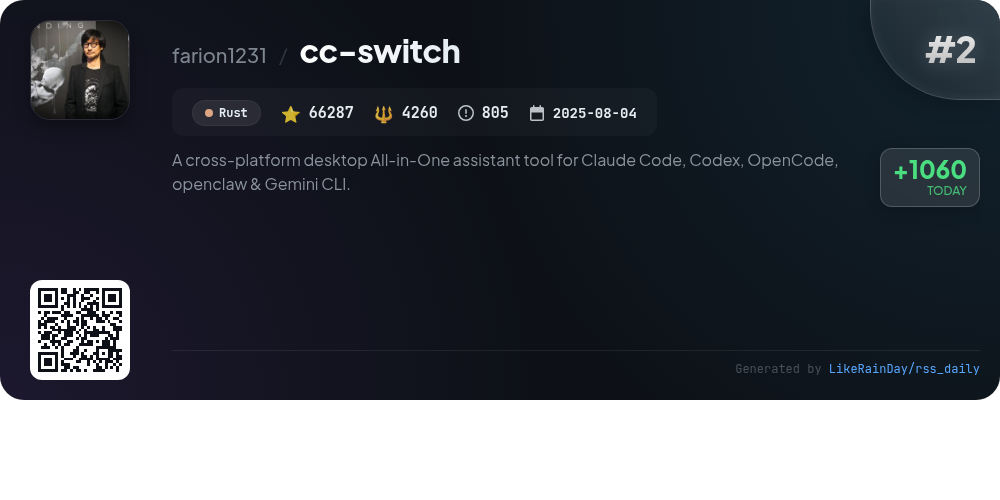
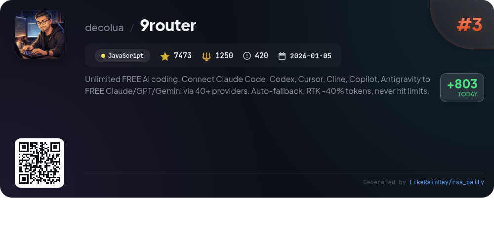
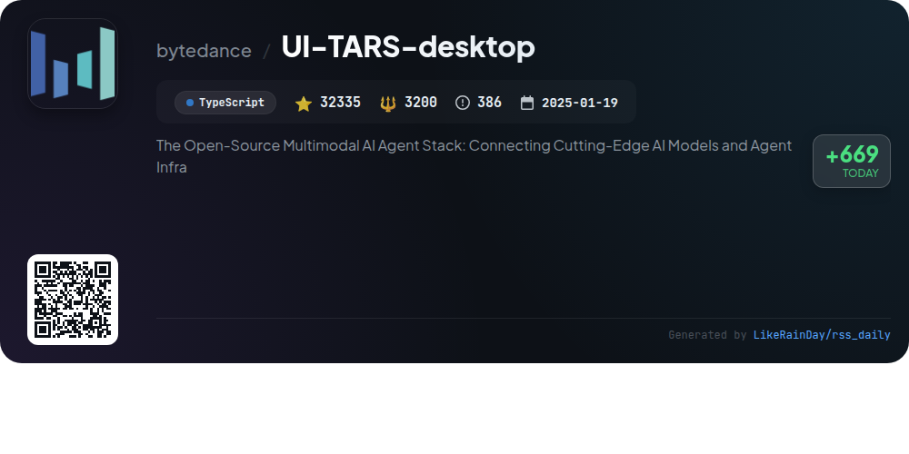
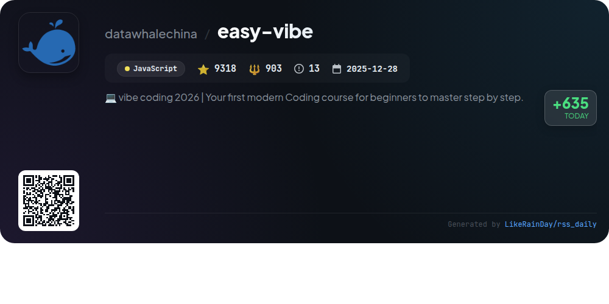
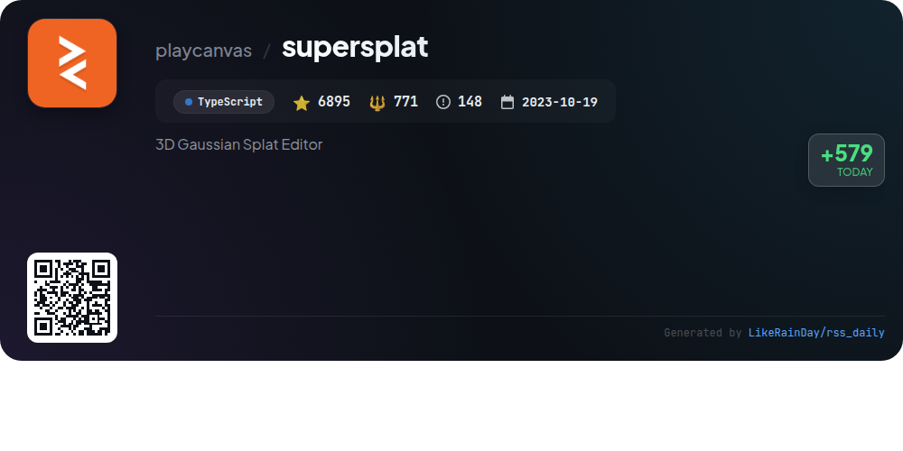
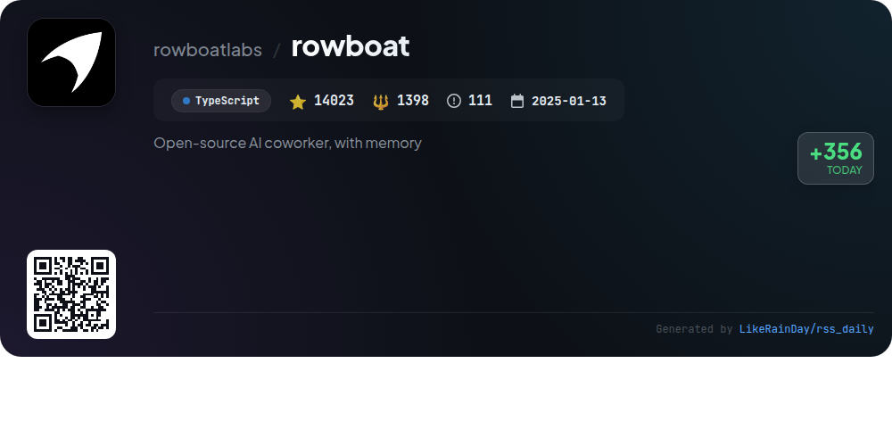

# 📊 🌟 GitHub Trending Daily - 2026-05-11

> > 📅 每日精选 GitHub 热门仓库 | 基于智能算法推荐

## 📋 Overview

**10** 个项目 | **374136** ⭐ | **49544** 🍴

**热门语言:** `TypeScript` (5) · `JavaScript` (3) · `Rust` (1)

**更新时间:** 2026-05-11 04:07 UTC

**分类分布:**

- 🌟 每日 Top 10 精选 (10 项)

---

## 🌟 每日 Top 10 精选

### 1. [everything-claude-code](https://github.com/affaan-m/everything-claude-code)

> 🤖 **推荐理由**  
> *Everything Claude Code (ECC) is a comprehensive performance optimization system for AI agents, designed for Claude Code, Codex, Cursor, OpenCode, and more. With over 178,000 stars, it features skills, instincts, memory optimization, continuous learning, and security scanning. ECC offers 48 agents, 182 skills, and tools for production-ready development, enabling seamless integration across various ecosystems. Key highlights include a customizable dashboard, sophisticated installation options, and advanced security auditing via AgentShield. Ideal for developers seeking optimized workflows and enhanced AI capabilities.*

- ⭐ 178492 stars
- 💻 JavaScript
- 📅 Updated: 2026-05-11

### 2. [cc-switch](https://github.com/farion1231/cc-switch)

> 🤖 **推荐理由**  
> *CC Switch is a cross-platform desktop tool designed for managing multiple AI CLI tools, including Claude Code, Codex, Gemini CLI, OpenCode, and OpenClaw. With over 66,000 stars on GitHub, it offers a unified interface to switch providers effortlessly, eliminating manual config edits. Key features include 50+ built-in provider presets, unified MCP and Skills management, cloud sync capabilities, and session history tracking. Built with Rust and Tauri, CC Switch supports Windows, macOS, and Linux, ensuring seamless integration and user-friendly operation across devices.*

- ⭐ 66287 stars
- 💻 Rust
- 📅 Updated: 2026-05-11

### 3. [9router](https://github.com/decolua/9router)

> 🤖 **推荐理由**  
> *9Router is an open-source AI coding router that connects various tools like Claude Code, Codex, and Copilot to over 40 AI providers, offering unlimited free AI coding. Key features include an RTK Token Saver that reduces token usage by 20-40%, smart 3-tier fallback to avoid downtime, real-time quota tracking, and support for multiple accounts. Users can easily integrate with popular CLI tools and manage costs effectively by leveraging both free and paid models. With 7,473 stars on GitHub, it’s designed for developers looking to optimize their coding experience.*

- ⭐ 7473 stars
- 💻 JavaScript
- 📅 Updated: 2026-05-11

### 4. [UI-TARS-desktop](https://github.com/bytedance/UI-TARS-desktop)

> 🤖 **推荐理由**  
> *UI-TARS-desktop is an open-source multimodal AI agent stack designed to enhance user interaction through advanced AI capabilities. It features a native GUI agent that operates on local computers, supporting natural language control, screenshot and visual recognition, and precise input control across platforms (Windows/MacOS/Browser). Key highlights include one-click CLI support, hybrid browser integration, and real-time feedback. The project also offers remote operation capabilities, enabling users to control distant devices effortlessly. With over 32,000 stars on GitHub, it's a powerful tool for seamless automation and task management.*

- ⭐ 32335 stars
- 💻 TypeScript
- 📅 Updated: 2026-05-11

### 5. [agentmemory](https://github.com/rohitg00/agentmemory)

> 🤖 **推荐理由**  
> *agentmemory is a cutting-edge persistent memory solution for AI coding agents, built on the iii engine, enabling seamless memory retention across multiple sessions and agents. With a remarkable 95.2% retrieval accuracy, it offers automatic capture of interactions, semantic search capabilities, and a real-time viewer for monitoring memory evolution. Supporting various agents like Claude Code and Cursor, agentmemory eliminates repetitive explanations, ensuring agents remember context and preferences. Key features include a comprehensive MCP toolkit, hybrid search, and auto-forgetting mechanisms, optimizing both performance and token efficiency.*

- ⭐ 3994 stars
- 💻 TypeScript
- 📅 Updated: 2026-05-11

### 6. [easy-vibe](https://github.com/datawhalechina/easy-vibe)

> 🤖 **推荐理由**  
> *Easy-Vibe is a modern coding course designed for beginners, helping them master programming through step-by-step tutorials. With over 9,300 stars on GitHub, it offers a beginner-friendly learning map, immersive tutorials, and interactive components that simplify complex concepts like AI integration and full-stack development. Key features include simulated coding environments, guidance on product prototyping, and a comprehensive knowledge base covering 80+ topics. Easy-Vibe empowers learners to build real applications, transforming ideas into tangible products in the AI era.*

- ⭐ 9318 stars
- 💻 JavaScript
- 📅 Updated: 2026-05-11

### 7. [supersplat](https://github.com/playcanvas/supersplat)

> 🤖 **推荐理由**  
> *SuperSplat is a free, open-source 3D Gaussian Splat Editor built with TypeScript, allowing users to inspect, edit, optimize, and publish 3D Gaussian splats directly in their browser—no downloads required. With over 6,895 stars on GitHub, it offers a user-friendly interface and supports localization for multiple languages. Key features include a live editing environment, easy setup for local development, and a comprehensive user guide. Engage with the community through Discord and forums for support and collaboration. Visit [SuperSplat Editor](https://superspl.at/editor) to get started.*

- ⭐ 6895 stars
- 💻 TypeScript
- 📅 Updated: 2026-05-11

### 8. [AiToEarn](https://github.com/yikart/AiToEarn)

> 🤖 **推荐理由**  
> *AiToEarn is an AI-driven platform designed for content creators, brands, and businesses to monetize, publish, and engage with their content across 10+ major social media platforms, including TikTok, YouTube, and Instagram. Key features include automated content creation, multi-platform publishing, and engagement tools that enhance interaction through AI-generated responses. It supports various deployment methods such as web access, AI assistant integration, and Docker for private hosting. With over 10,000 stars on GitHub, AiToEarn empowers creators to efficiently monetize their content through flexible payment models.*

- ⭐ 10057 stars
- 💻 TypeScript
- 📅 Updated: 2026-05-11

### 9. [rowboat](https://github.com/rowboatlabs/rowboat)

> 🤖 **推荐理由**  
> *Rowboat is an open-source AI coworker designed to enhance productivity by creating a long-lived knowledge graph from your email and meeting notes. It streamlines tasks such as generating documents, preparing meeting briefs, and tracking important topics. Key features include real-time note updates, voice memo integration, and local storage in Markdown format, ensuring data privacy. Rowboat connects with Google services and can integrate with various external tools via Model Context Protocol (MCP). This ensures a customizable, efficient workflow while maintaining user control over data.*

- ⭐ 14023 stars
- 💻 TypeScript
- 📅 Updated: 2026-05-11

### 10. [fanqiang](https://github.com/bannedbook/fanqiang)

> 🤖 **推荐理由**  
> *The "fanqiang" project provides tools and tutorials for bypassing internet censorship in China, featuring a comprehensive repository of resources. Key offerings include an Android app (FQNews), Chrome and Firefox one-click proxy packages, and detailed guides for setting up V2ray and Shadowsocks servers. It supports multiple platforms, including Windows, macOS, iOS, and various routers, ensuring broad accessibility. The project has garnered over 45,000 stars on GitHub, reflecting its value to users seeking reliable access to restricted content.*

- ⭐ 45262 stars
- 💻 Kotlin
- 📅 Updated: 2026-05-11

---

## 📡 RSS订阅

通过 RSS 订阅，第一时间获取每日精选项目：

- 🔔 [RSS 订阅源] (../../daily-top.xml)
- 🔔 [每日简报] (../../GITHUB_TODAY_CN.md)
- 🔔 [每日 Top 10 精选](../../daily-top.xml)

---

*⚡ Powered by Smart Trending Algorithm | Generated at 2026-05-11 04:07:28 UTC
