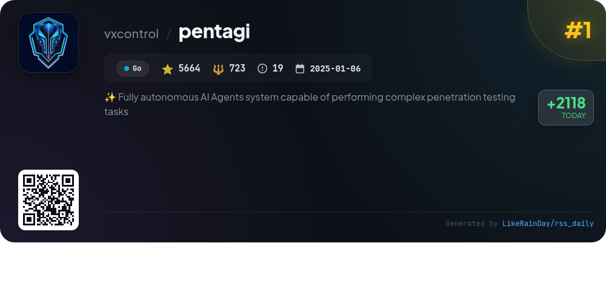
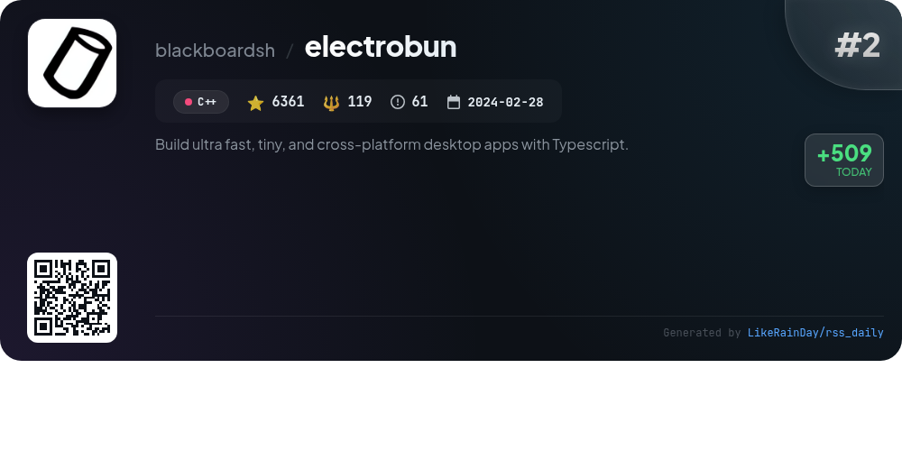
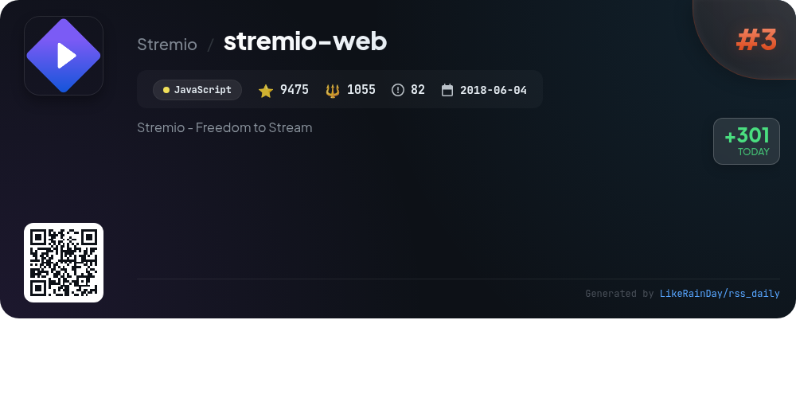
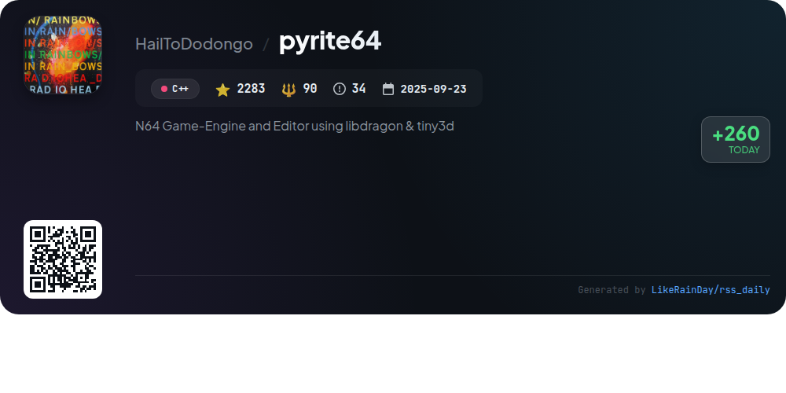
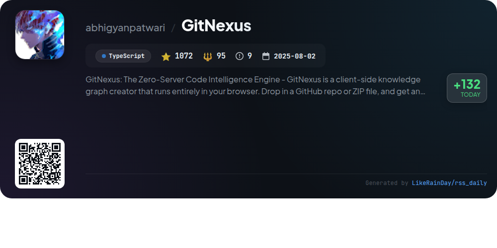
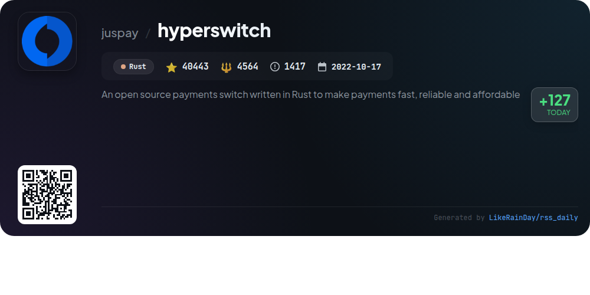
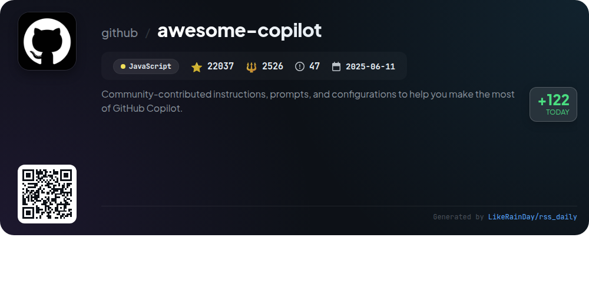
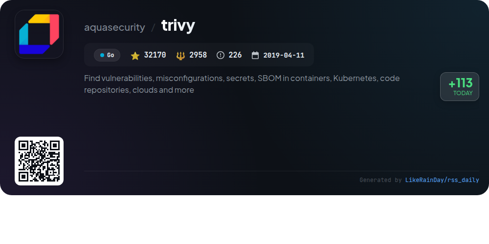

# 📊 🌟 GitHub Trending Daily - 2026-02-22

> > 📅 每日精选 GitHub 热门仓库 | 基于智能算法推荐

## 📋 Overview

**10** 个项目 | **312663** ⭐ | **30740** 🍴

**热门语言:** `TypeScript` (3) · `JavaScript` (2) · `Go` (2)

**更新时间:** 2026-02-22 02:47 UTC

**分类分布:**

- 🌟 每日 Top 10 精选 (10 项)

---

## 🌟 每日 Top 10 精选

### 1. [pentagi](https://github.com/vxcontrol/pentagi)

> 🤖 **推荐理由**  
> *PentAGI is a cutting-edge autonomous AI agent system designed for comprehensive penetration testing. Key features include a secure sandboxed environment, a suite of 20+ professional pentesting tools, a smart memory system for storing findings, and integration with advanced search APIs. It offers detailed reporting, REST/GraphQL APIs for automation, and a modern web interface. Users can leverage its scalable architecture for seamless deployment and monitoring. Join a vibrant community of ethical hackers and security researchers to enhance your testing capabilities.*

- ⭐ 5664 stars
- 💻 Go
- 📅 Updated: 2026-02-22

### 2. [electrobun](https://github.com/blackboardsh/electrobun)

> 🤖 **推荐理由**  
> *Electrobun is a powerful framework for creating ultra-fast, lightweight, and cross-platform desktop applications using TypeScript. With features like seamless TypeScript integration for both main and webview processes, small self-extracting app bundles (~12MB), and minimal update sizes (as small as 14KB), it streamlines the development and distribution workflow. Built on Bun and Zig, Electrobun ensures easy RPC communication and rapid setup. Notable applications include Audio TTS and Co(lab). Explore documentation and templates at electrobun.dev.*

- ⭐ 6361 stars
- 💻 C++
- 📅 Updated: 2026-02-22

### 3. [stremio-web](https://github.com/Stremio/stremio-web)

> 🤖 **推荐理由**  
> *Stremio is a modern media center that offers users the freedom to discover, watch, and organize video content through easily installable addons. With over 9,475 stars on GitHub, this JavaScript-based project provides a seamless experience for video entertainment. Key features include a user-friendly interface for content discovery, detailed metadata views, and support for development with tools like Node.js and Docker. Stremio is open-source and available under the GPLv2 license, encouraging community contributions and enhancements.*

- ⭐ 9475 stars
- 💻 JavaScript
- 📅 Updated: 2026-02-22

### 4. [pyrite64](https://github.com/HailToDodongo/pyrite64)

> 🤖 **推荐理由**  
> *Pyrite64 is an open-source N64 game engine and editor built with libdragon and tiny3d, enabling the creation of 3D games for real N64 consoles and accurate emulators. Key features include automatic toolchain installation on Windows, 3D model import (GLTF) with material support, HDR and bloom rendering, and big-texture rendering (256x256). The runtime engine manages scene management, collision, audio, and global asset management. A node-graph editor facilitates basic scripting. As the project is in early development, documentation and features are ongoing.*

- ⭐ 2283 stars
- 💻 C++
- 📅 Updated: 2026-02-22

### 5. [gemini-cli](https://github.com/google-gemini/gemini-cli)

> 🤖 **推荐理由**  
> *Gemini CLI is an open-source AI agent that integrates the power of Gemini directly into your terminal. With a generous free tier of 60 requests/min and 1,000 requests/day, it supports advanced features like powerful Gemini 3 models, built-in tools for Google Search, file operations, and shell commands. The CLI is designed for developers, offering automation capabilities, GitHub integration for code review and issue triage, and extensibility through custom integrations. It supports various authentication methods, ensuring flexibility for individual and enterprise users.*

- ⭐ 95214 stars
- 💻 TypeScript
- 📅 Updated: 2026-02-22

### 6. [GitNexus](https://github.com/abhigyanpatwari/GitNexus)

> 🤖 **推荐理由**  
> *GitNexus is a zero-server code intelligence engine that creates a comprehensive knowledge graph from any GitHub repository or ZIP file, all within your browser. It offers two primary interfaces: a CLI for local indexing and AI integration via the Model Context Protocol (MCP), and a browser-based Web UI for interactive code exploration. Key features include dependency mapping, call chain tracing, and impact analysis, making it ideal for enhancing AI agent performance. With support for multiple programming languages, GitNexus democratizes code analysis, ensuring reliability and contextual awareness for developers.*

- ⭐ 1072 stars
- 💻 TypeScript
- 📅 Updated: 2026-02-22

### 7. [clash-verge-rev](https://github.com/clash-verge-rev/clash-verge-rev)

> 🤖 **推荐理由**  
> *Clash Verge Rev is a modern GUI client built on Tauri, designed for Windows, macOS, and Linux, offering a tailored proxy experience. With over 97,944 stars, it features a sleek user interface that supports custom themes, configuration management, and a built-in Clash.Meta kernel. Key highlights include system proxy support, visual node and rule editing, and WebDav backup. The application ensures high performance with Rust, while providing options for stable, alpha, and auto-build releases. Seamlessly unlock streaming and AI services with advanced protocols like QUIC.*

- ⭐ 97944 stars
- 💻 TypeScript
- 📅 Updated: 2026-02-22

### 8. [hyperswitch](https://github.com/juspay/hyperswitch)

> 🤖 **推荐理由**  
> *Hyperswitch is an open-source payments switch built in Rust, designed for speed, reliability, and affordability. It offers a modular payments infrastructure, allowing businesses to integrate only the necessary components, such as cost observability, intelligent routing, revenue recovery, and vault services. Key highlights include a hosted sandbox for easy testing, cloud deployment options on AWS, GCP, or Azure, and a visual workflow builder. With over 40,000 stars, Hyperswitch emphasizes payment diversity, community-driven development, and high standards for performance and security.*

- ⭐ 40443 stars
- 💻 Rust
- 📅 Updated: 2026-02-22

### 9. [awesome-copilot](https://github.com/github/awesome-copilot)

> 🤖 **推荐理由**  
> *Awesome GitHub Copilot is a community-driven repository designed to enhance your GitHub Copilot experience. With over 22,000 stars, it offers specialized resources including custom agents, task-specific prompts, coding instructions, automated hooks, and plugins organized by themes. Key highlights include an MCP server for easy customization installations, curated plugins for streamlined workflows, and an extensive collection of real-world coding examples. This project empowers developers to improve productivity and adhere to best practices through expert-level guidance and community contributions.*

- ⭐ 22037 stars
- 💻 JavaScript
- 📅 Updated: 2026-02-22

### 10. [trivy](https://github.com/aquasecurity/trivy)

> 🤖 **推荐理由**  
> *Trivy is an open-source security scanner designed to identify vulnerabilities, misconfigurations, secrets, and Software Bill of Materials (SBOM) in various targets, including container images, filesystems, Git repositories, virtual machines, and Kubernetes. With over 32,000 stars, it supports multiple programming languages and integrates seamlessly with platforms like GitHub Actions and Kubernetes operators. Key features include support for known vulnerabilities (CVEs), IaC issues, and sensitive data detection. For installation and detailed documentation, visit the Trivy homepage.*

- ⭐ 32170 stars
- 💻 Go
- 📅 Updated: 2026-02-22

---

## 📡 RSS订阅

通过 RSS 订阅，第一时间获取每日精选项目：

- 🔔 [RSS 订阅源] (../../daily-top.xml)
- 🔔 [每日简报] (../../GITHUB_TODAY_CN.md)
- 🔔 [每日 Top 10 精选](../../daily-top.xml)

---

*⚡ Powered by Smart Trending Algorithm | Generated at 2026-02-22 02:47:13 UTC
