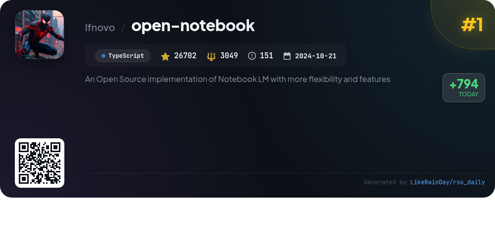
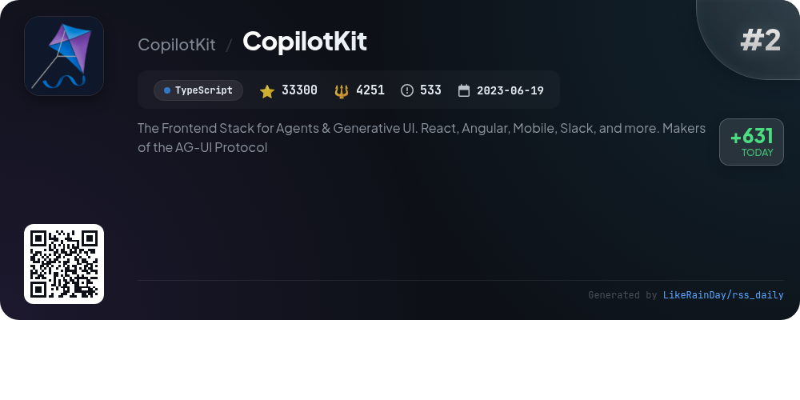
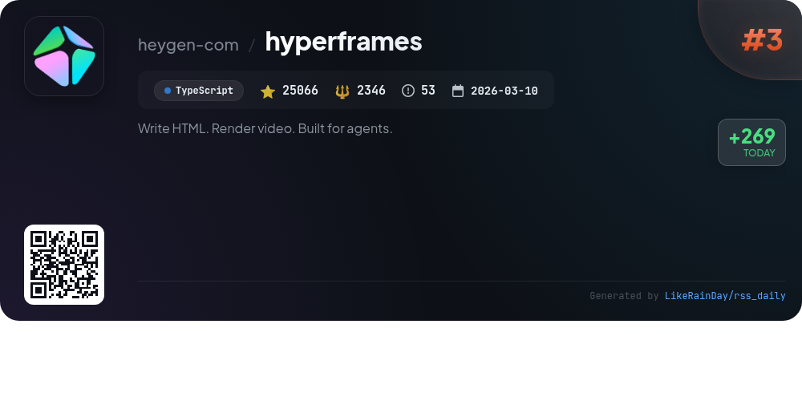
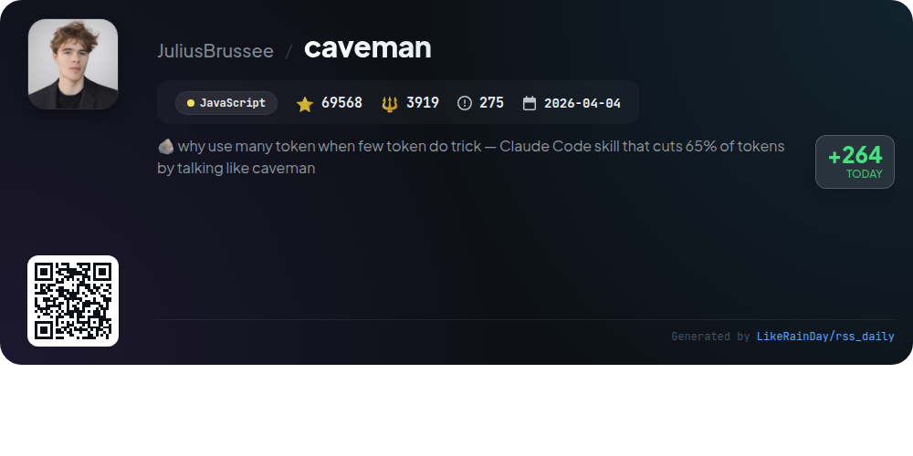
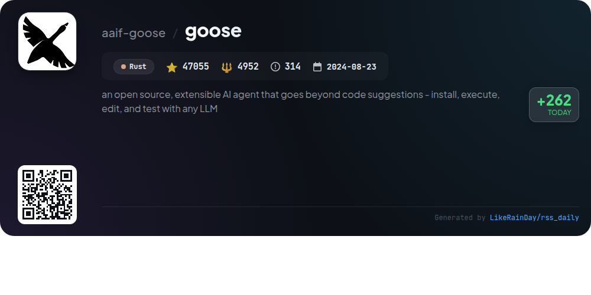
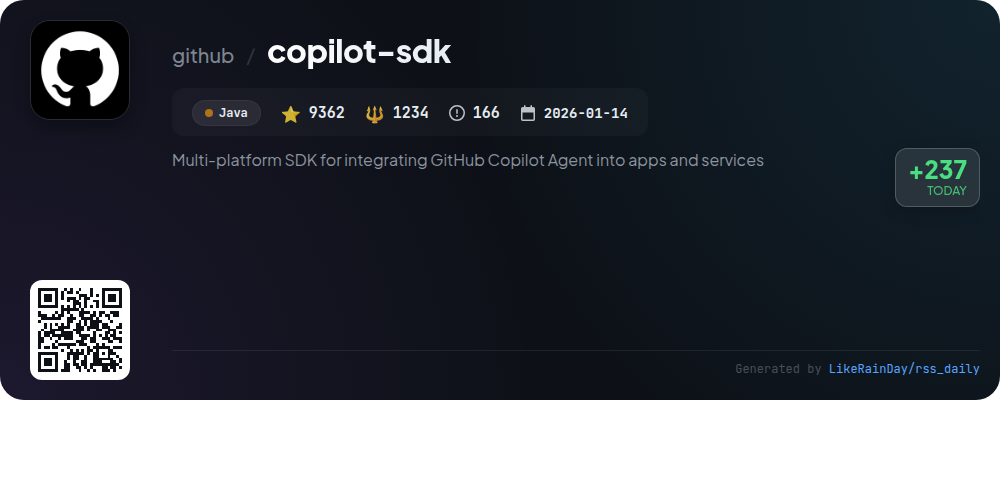
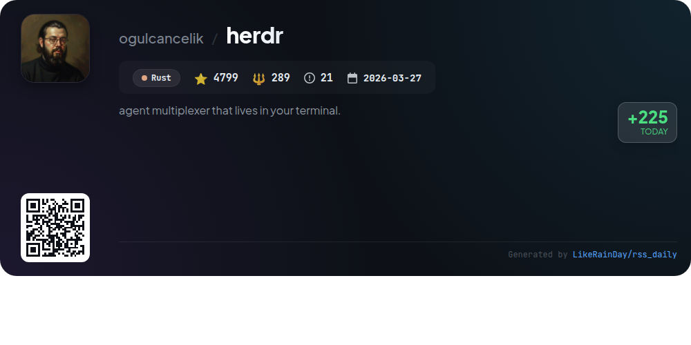
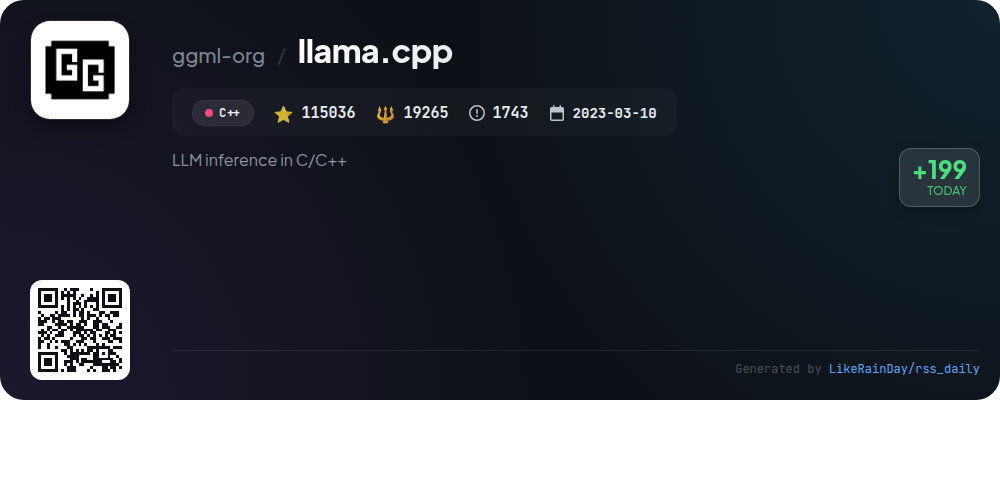

# 📊 🌟 GitHub Trending Daily - 2026-06-07

> > 📅 每日精选 GitHub 热门仓库 | 基于智能算法推荐

## 📋 Overview

**10** 个项目 | **421886** ⭐ | **52693** 🍴

**热门语言:** `TypeScript` (3) · `Rust` (3) · `JavaScript` (2)

**更新时间:** 2026-06-07 04:41 UTC

**分类分布:**

- 🌟 每日 Top 10 精选 (10 项)

---

## 🌟 每日 Top 10 精选

### 1. [open-notebook](https://github.com/lfnovo/open-notebook)

> 🤖 **推荐理由**  
> *Open Notebook is an open-source, privacy-focused alternative to Google's Notebook LM, designed for flexibility and control over your data. It supports 18+ AI models, including OpenAI and Anthropic, enabling users to choose their preferred providers. Key features include multi-modal content organization (PDFs, audio, etc.), intelligent search, context-aware AI chat, and advanced podcast generation with multiple speakers. Its self-hosted nature guarantees complete data sovereignty, making it a powerful tool for researchers seeking customization and privacy in their workflows.*

- ⭐ 26702 stars
- 💻 TypeScript
- 📅 Updated: 2026-06-07

### 2. [CopilotKit](https://github.com/CopilotKit/CopilotKit)

> 🤖 **推荐理由**  
> *CopilotKit is a versatile SDK for building agent-native applications across various platforms, including React, Angular, Vue, and mobile. Key features include a customizable chat UI, generative UI for dynamic component rendering, shared state for real-time data synchronization, and human-in-the-loop workflows. It supports integration with Slack and Microsoft Teams, enabling deployment in familiar environments. With self-learning capabilities, agents improve over time using user feedback. The framework is backed by the AG-UI Protocol, adopted by major tech companies.*

- ⭐ 33300 stars
- 💻 TypeScript
- 📅 Updated: 2026-06-07

### 3. [hyperframes](https://github.com/heygen-com/hyperframes)

> 🤖 **推荐理由**  
> *HyperFrames is an open-source framework that transforms HTML, CSS, and media into deterministic MP4 videos, catering to developers and AI agents. Key features include a CLI for local video production, reusable components via a catalog, and seamless integration with popular animation libraries like GSAP and Lottie. It emphasizes HTML-native authoring without a build step, ensuring replicable outputs. The platform supports distributed rendering through AWS Lambda and offers a community-driven playground for sharing projects. With 25,066 stars, HyperFrames is designed for efficient video creation and automation workflows.*

- ⭐ 25066 stars
- 💻 TypeScript
- 📅 Updated: 2026-06-07

### 4. [caveman](https://github.com/JuliusBrussee/caveman)

> 🤖 **推荐理由**  
> *Caveman is a JavaScript-based Claude Code skill designed to significantly reduce token usage by simplifying responses—achieving an average of 65% reduction while maintaining technical accuracy. Users can choose from four levels of brevity: lite, full, ultra, or wenyan. Key features include token-saving commands for PR reviews, commit messages, and memory files, alongside a suite of tools like caveman-code for full terminal agent usage. With over 69,000 stars, it promotes efficient communication in coding environments while enhancing readability and speed.*

- ⭐ 69568 stars
- 💻 JavaScript
- 📅 Updated: 2026-06-07

### 5. [goose](https://github.com/aaif-goose/goose)

> 🤖 **推荐理由**  
> *Goose is an open-source AI agent designed for various tasks beyond code suggestions, including research, writing, and automation. Available as a native desktop app for macOS, Linux, and Windows, it also features a full CLI and API for integration. Built in Rust, Goose supports 15+ AI providers like OpenAI and Google, and connects to over 70 extensions via the Model Context Protocol. It is now part of the Agentic AI Foundation at the Linux Foundation. Join the community on Discord or access extensive documentation and tutorials to get started.*

- ⭐ 47055 stars
- 💻 Rust
- 📅 Updated: 2026-06-07

### 6. [copilot-sdk](https://github.com/github/copilot-sdk)

> 🤖 **推荐理由**  
> *The GitHub Copilot SDK is a multi-platform SDK designed for integrating the GitHub Copilot Agent into various applications. With support for languages like Java, Python, TypeScript, Go, .NET, and Rust, it streamlines the embedding of Copilot's agent workflows. Key features include a production-tested agent runtime, customizable tool invocation, and support for Bring Your Own Key (BYOK) authentication. The SDK facilitates easy interaction with the Copilot CLI via JSON-RPC, allowing developers to define custom agents and skills. Comprehensive documentation and quick-start guides are provided to assist users.*

- ⭐ 9362 stars
- 💻 Java
- 📅 Updated: 2026-06-07

### 7. [herdr](https://github.com/ogulcancelik/herdr)

> 🤖 **推荐理由**  
> *Herdr is a powerful terminal-based agent multiplexer developed in Rust, boasting 4,799 stars on GitHub. It enables users to manage workspaces, tabs, and panes seamlessly, offering mouse-native interactions and real terminal views. Key features include session persistence, agent awareness for monitoring tasks, and built-in support for various integrations like Claude Code and GitHub Copilot. It provides a lightweight, GUI-free experience that runs directly in the terminal, with customizable keybindings and themes. Ideal for developers seeking efficient management of concurrent tasks.*

- ⭐ 4799 stars
- 💻 Rust
- 📅 Updated: 2026-06-07

### 8. [plugins](https://github.com/openai/plugins)

> 🤖 **推荐理由**  
> *The "plugins" repository offers a curated collection of Codex plugin examples in JavaScript, featuring diverse functionalities across various applications. Key highlights include plugins for Figma (design systems), Notion (planning and knowledge capture), and workflows for building iOS, macOS, and web apps. Additional plugins support Expo for React Native apps and integration with services like Netlify, Remotion, and Google Slides. Each plugin is structured with a manifest and optional companion files, enabling developers to enhance their applications with rich, customizable features.*

- ⭐ 1811 stars
- 💻 JavaScript
- 📅 Updated: 2026-06-07

### 9. [codex](https://github.com/openai/codex)

> 🤖 **推荐理由**  
> *Codex is a lightweight coding agent from OpenAI that runs locally in your terminal, designed to enhance your coding experience. With 89,187 stars on GitHub, it supports installation on Mac, Linux, and Windows via scripts or package managers like npm and Homebrew. Codex integrates seamlessly with IDEs like VS Code and offers a desktop app version. Users can sign in with their ChatGPT accounts for enhanced functionality, or use an API key. Comprehensive documentation and community contributions are available to guide users.*

- ⭐ 89187 stars
- 💻 Rust
- 📅 Updated: 2026-06-07

### 10. [llama.cpp](https://github.com/ggml-org/llama.cpp)

> 🤖 **推荐理由**  
> *llama.cpp is a C/C++ library for high-performance large language model (LLM) inference, featuring minimal dependencies and optimized for diverse hardware, including Apple Silicon and NVIDIA GPUs. With support for various quantization formats (1.5-8 bits), it enables faster inference and reduced memory usage. Key services include a CLI for local model execution, a REST API server for integration, and compatibility with Hugging Face models. The project supports multimodal capabilities, customizable grammar constraints, and a range of bindings across multiple programming languages, making it versatile for developers.*

- ⭐ 115036 stars
- 💻 C++
- 📅 Updated: 2026-06-07

---

## 📡 RSS订阅

通过 RSS 订阅，第一时间获取每日精选项目：

- 🔔 [RSS 订阅源] (../../daily-top.xml)
- 🔔 [每日简报] (../../GITHUB_TODAY_CN.md)
- 🔔 [每日 Top 10 精选](../../daily-top.xml)

---

*⚡ Powered by Smart Trending Algorithm | Generated at 2026-06-07 04:41:55 UTC
