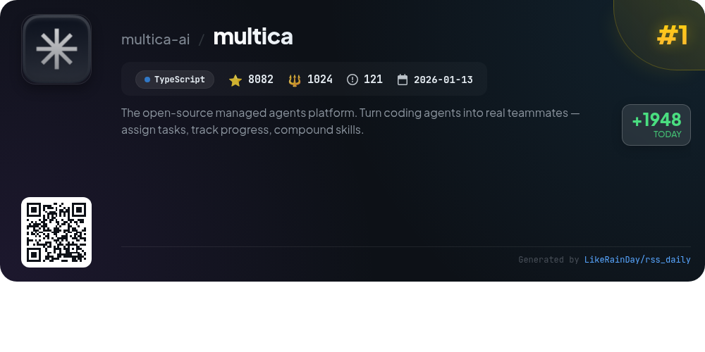
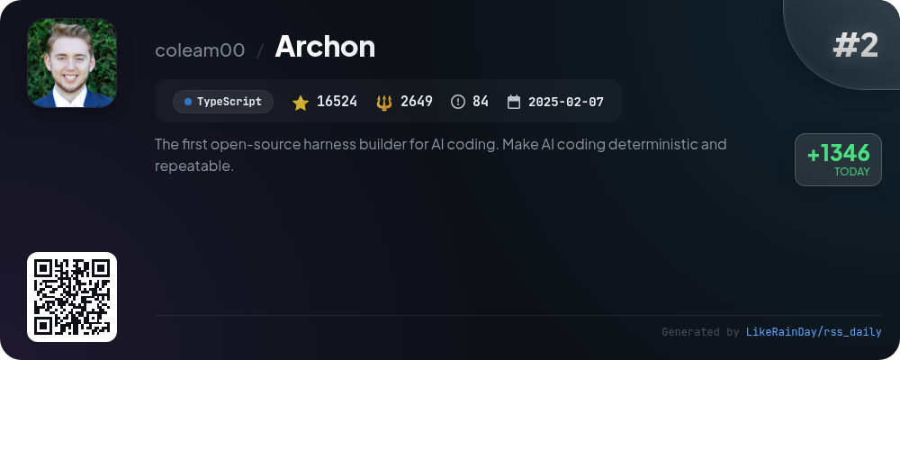
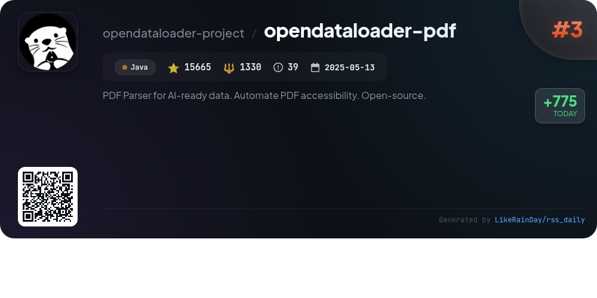
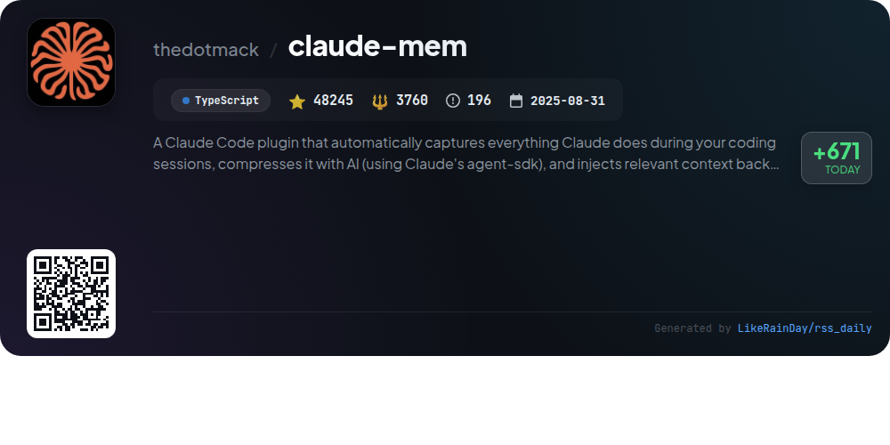
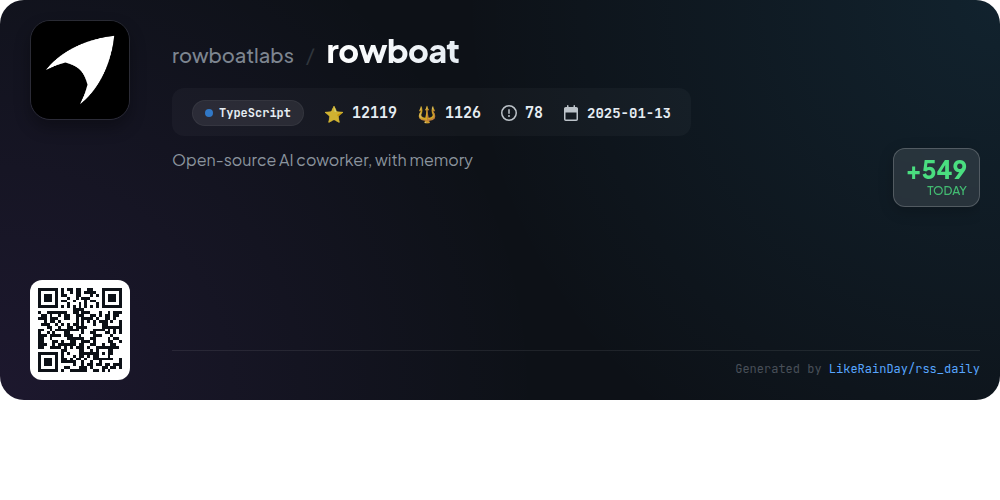
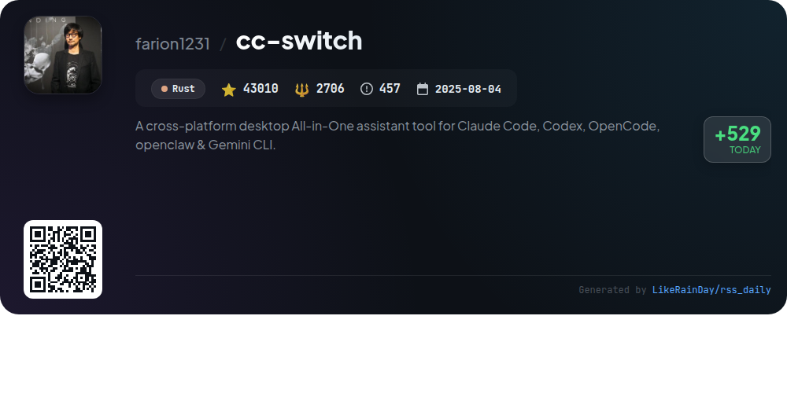
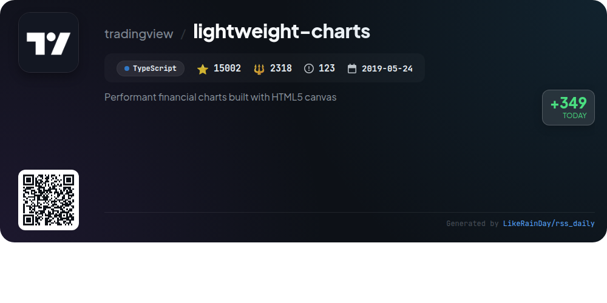
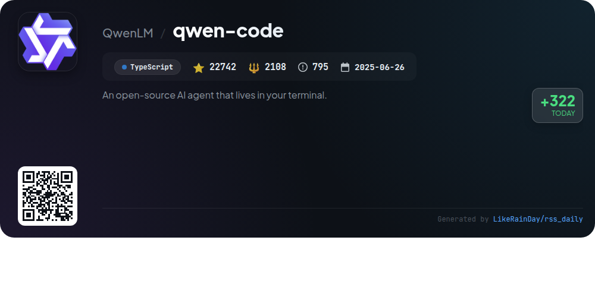

# 📊 🌟 GitHub Trending Daily - 2026-04-12

> > 📅 每日精选 GitHub 热门仓库 | 基于智能算法推荐

## 📋 Overview

**10** 个项目 | **309716** ⭐ | **25823** 🍴

**热门语言:** `TypeScript` (7) · `Rust` (1) · `JavaScript` (1)

**更新时间:** 2026-04-12 03:29 UTC

**分类分布:**

- 🌟 每日 Top 10 精选 (10 项)

---

## 🌟 每日 Top 10 精选

### 1. [multica](https://github.com/multica-ai/multica)

> 🤖 **推荐理由**  
> *The open-source managed agents platform. Turn coding agents into real teammates — assign tasks, track progress, compound skills.. popular project, actively maintained, recently updated*

- ⭐ 8082 stars
- 🍴 1024 forks
- 💻 TypeScript
- 📅 Updated: 2026-04-12

### 2. [Archon](https://github.com/coleam00/Archon)

> 🤖 **推荐理由**  
> *Archon is the first open-source harness builder for AI coding, designed to make AI coding workflows deterministic and repeatable. With 16,524 stars on GitHub, it allows users to define development processes as YAML workflows, ensuring consistency across projects. Key features include isolated workflow runs, the ability to mix AI and deterministic nodes, and support for multiple platforms (CLI, Web UI, Slack, Telegram, GitHub). Archon automates tasks like bug fixing, feature development, and PR reviews, streamlining software development with a focus on reliability and control. For detailed documentation, visit archon.diy.*

- ⭐ 16524 stars
- 💻 TypeScript
- 📅 Updated: 2026-04-12

### 3. [opendataloader-pdf](https://github.com/opendataloader-project/opendataloader-pdf)

> 🤖 **推荐理由**  
> *OpenDataLoader PDF is an open-source PDF parser designed for AI-ready data extraction and automated accessibility. It excels in converting PDFs to structured formats (Markdown, JSON, HTML) with high accuracy (0.907 overall) and supports hybrid processing for complex documents. Key features include built-in OCR, table extraction, and AI-generated descriptions for charts, making it ideal for RAG pipelines. The project also pioneers PDF accessibility compliance, offering auto-tagging to Tagged PDFs (coming Q2 2026) and enterprise options for PDF/UA export. With SDKs in Python, Node.js, and Java, it empowers users to streamline PDF processing and enhance document accessibility effortlessly.*

- ⭐ 15665 stars
- 💻 Java
- 📅 Updated: 2026-04-12

### 4. [claude-mem](https://github.com/thedotmack/claude-mem)

> 🤖 **推荐理由**  
> *Claude-Mem is a powerful TypeScript plugin for Claude Code that enhances coding sessions by automatically capturing and compressing contextual data. Key features include persistent memory, which retains project context across sessions, a skill-based search tool for querying past observations, and a real-time web viewer for memory streams. The plugin operates autonomously, ensuring seamless continuity in coding. Users can easily install it via command line or the Claude marketplace, making it an essential tool for developers seeking efficient knowledge management.*

- ⭐ 48245 stars
- 💻 TypeScript
- 📅 Updated: 2026-04-12

### 5. [rowboat](https://github.com/rowboatlabs/rowboat)

> 🤖 **推荐理由**  
> *Rowboat is an open-source AI coworker designed to enhance productivity by building a long-term knowledge graph from your email and meeting notes. Key features include generating documents and briefs from context, tracking topics with live notes, and maintaining a local Markdown vault for easy inspection and editing. It integrates with Gmail, Google Calendar, and external tools via Model Context Protocol (MCP). Rowboat prioritizes user privacy, storing all data locally, ensuring no proprietary formats or vendor lock-in. Download for Mac, Windows, or Linux at [rowboatlabs.com](https://www.rowboatlabs.com/).*

- ⭐ 12119 stars
- 💻 TypeScript
- 📅 Updated: 2026-04-12

### 6. [cc-switch](https://github.com/farion1231/cc-switch)

> 🤖 **推荐理由**  
> *CC Switch is a cross-platform desktop assistant tool designed for managing CLI applications like Claude Code, Codex, Gemini CLI, OpenCode, and OpenClaw. With over 43,000 stars on GitHub, it simplifies provider switching through a unified interface, eliminating manual config edits. Key features include 50+ built-in provider presets, unified management for MCP and Skills, cloud sync capabilities, and a system tray quick switch option. Built with Rust and Tauri, CC Switch offers reliable performance and is compatible with Windows, macOS, and Linux.*

- ⭐ 43010 stars
- 💻 Rust
- 📅 Updated: 2026-04-12

### 7. [lightweight-charts](https://github.com/tradingview/lightweight-charts)

> 🤖 **推荐理由**  
> *Lightweight Charts™ is a high-performance library for creating interactive financial charts using HTML5 canvas, designed for optimal loading speed and minimal impact on web performance. With over 15,000 stars on GitHub, it offers rich charting capabilities out-of-the-box and supports custom plugins for extended functionality. The library is lightweight, making it ideal for replacing static image charts. Installation is straightforward via npm or CDN. Explore demos and documentation for implementation details and plugin examples on the official site.*

- ⭐ 15002 stars
- 💻 TypeScript
- 📅 Updated: 2026-04-12

### 8. [qwen-code](https://github.com/QwenLM/qwen-code)

> 🤖 **推荐理由**  
> *Qwen Code is an open-source AI agent for terminal environments, designed to enhance coding productivity. Key features include support for multiple AI protocols (OpenAI, Anthropic, Gemini), a free-tier OAuth for 1,000 requests/day, and a rich agentic workflow with built-in tools and sub-agents. It integrates seamlessly with IDEs like VS Code and JetBrains, offering interactive and headless modes for diverse use cases. With over 22,000 stars on GitHub, Qwen Code empowers developers to navigate complex codebases and automate tasks efficiently.*

- ⭐ 22742 stars
- 💻 TypeScript
- 📅 Updated: 2026-04-12

### 9. [clash-verge-rev](https://github.com/clash-verge-rev/clash-verge-rev)

> 🤖 **推荐理由**  
> *Clash Verge Rev is a modern GUI client built with Tauri, supporting Windows, macOS, and Linux for an enhanced proxy experience. Key features include a sleek interface with customizable themes, integration of Clash.Meta for advanced proxy management, and tools for configuration file handling. Users benefit from visual node editing, system proxy management, and WebDav backup. With a focus on performance using Rust, it offers a stable release for everyday use and an AutoBuild version for testing. The project boasts a strong community with 109,820 stars on GitHub.*

- ⭐ 109820 stars
- 💻 TypeScript
- 📅 Updated: 2026-04-12

### 10. [impeccable](https://github.com/pbakaus/impeccable)

> 🤖 **推荐理由**  
> *Impeccable is a JavaScript design language enhancing AI's frontend design capabilities, boasting 18 commands and 7 domain-specific references. It offers tools for auditing, critiquing, and polishing UI designs, alongside curated anti-patterns that guide AI away from common mistakes. Key features include a standalone CLI for detecting design issues and integration with various tools like Cursor and VS Code Copilot. For quick start and ready-to-use bundles, visit impeccable.style. With 18,507 stars, Impeccable provides a comprehensive solution for impeccable UI design.*

- ⭐ 18507 stars
- 💻 JavaScript
- 📅 Updated: 2026-04-12

---

## 📡 RSS订阅

通过 RSS 订阅，第一时间获取每日精选项目：

- 🔔 [RSS 订阅源] (../../daily-top.xml)
- 🔔 [每日简报] (../../GITHUB_TODAY_CN.md)
- 🔔 [每日 Top 10 精选](../../daily-top.xml)

---

*⚡ Powered by Smart Trending Algorithm | Generated at 2026-04-12 03:29:13 UTC
