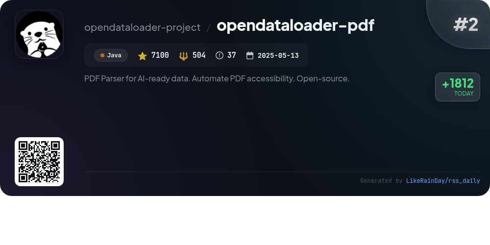
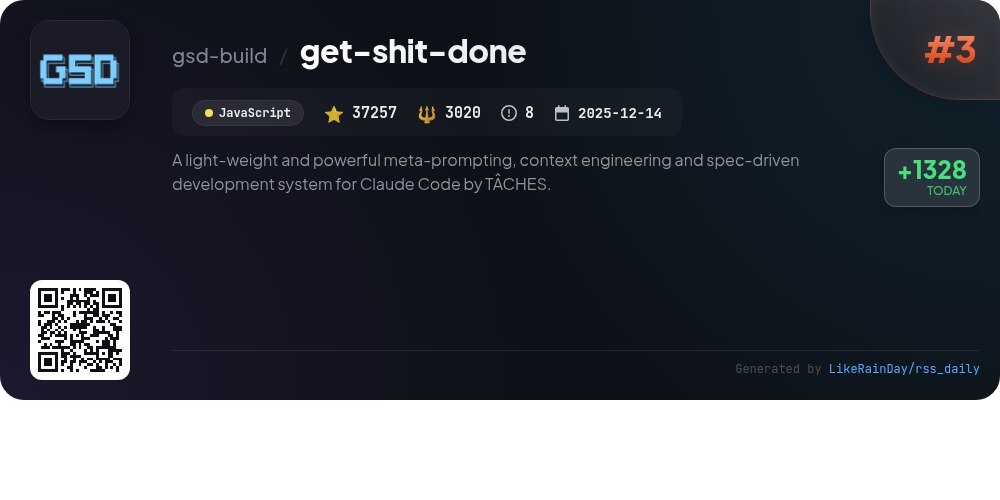
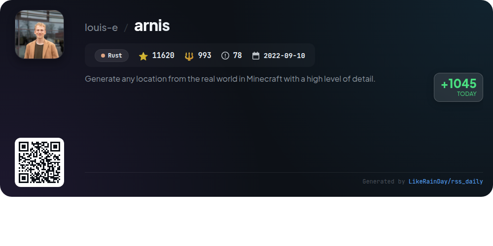
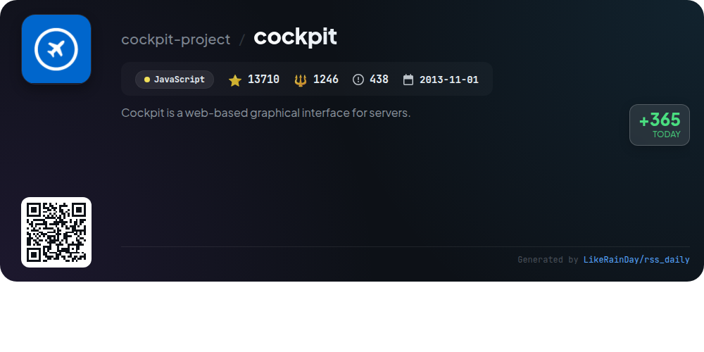

# 📊 🌟 GitHub Trending Daily - 2026-03-21

> > 📅 每日精选 GitHub 热门仓库 | 基于智能算法推荐

## 📋 Overview

**10** 个项目 | **382591** ⭐ | **37188** 🍴

**热门语言:** `JavaScript` (4) · `TypeScript` (2) · `Rust` (2)

**更新时间:** 2026-03-21 02:35 UTC

**分类分布:**

- 🌟 每日 Top 10 精选 (10 项)

---

## 🌟 每日 Top 10 精选

### 1. [everything-claude-code](https://github.com/affaan-m/everything-claude-code)

> 🤖 **推荐理由**  
> *Everything Claude Code is a comprehensive performance optimization system for AI agents, featuring skills, instincts, memory optimization, and security scanning. This JavaScript-based project supports integration with Claude Code, Codex, and Cursor, among others. Key highlights include 28 specialized agents, 116 skills, and 59 commands to enhance development workflows. Notable functionalities encompass continuous learning, token optimization, and a security auditor, AgentShield. As an Anthropic hackathon winner, it has garnered over 90,000 stars, reflecting its community impact and usability.*

- ⭐ 90973 stars
- 💻 JavaScript
- 📅 Updated: 2026-03-21

### 2. [opendataloader-pdf](https://github.com/opendataloader-project/opendataloader-pdf)

> 🤖 **推荐理由**  
> *OpenDataLoader PDF is an open-source PDF parser designed for AI-ready data extraction and PDF accessibility automation. With over 7,100 stars on GitHub, it achieves #1 benchmark accuracy (0.90 overall) for extracting structured data like Markdown, JSON, and HTML, including support for complex tables and OCR. The tool automates PDF accessibility compliance by auto-tagging untagged PDFs to create Tagged PDFs, adhering to industry standards. It offers SDKs in Python, Node.js, and Java, making it versatile for various applications. Enterprise features include PDF/UA export and an accessibility studio, ensuring comprehensive regulatory compliance.*

- ⭐ 7100 stars
- 💻 Java
- 📅 Updated: 2026-03-21

### 3. [get-shit-done](https://github.com/gsd-build/get-shit-done)

> 🤖 **推荐理由**  
> *Get Shit Done (GSD) is a lightweight meta-prompting and context engineering system designed for Claude Code and other AI platforms. It tackles context rot by ensuring high-quality code generation through structured phases: initialization, discussion, planning, execution, and verification. Key features include atomic git commits for each task, multi-agent orchestration for parallel execution, and tailored project management with detailed roadmaps and requirements. Trusted by engineers at major tech companies, GSD streamlines development without the complexity of traditional methodologies.*

- ⭐ 37257 stars
- 💻 JavaScript
- 📅 Updated: 2026-03-21

### 4. [claude-hud](https://github.com/jarrodwatts/claude-hud)

> 🤖 **推荐理由**  
> *Claude HUD is a powerful plugin for Claude Code that enhances your coding experience by providing real-time insights into context usage, active tools, running agents, and todo progress. It features a customizable status line that displays essential information like project path, context health, and task completion. Users can configure the HUD layout and elements, enabling a tailored view to suit their workflow. With updates every 300ms, Claude HUD integrates seamlessly into any terminal, making it an invaluable tool for developers seeking efficient project management.*

- ⭐ 9595 stars
- 💻 JavaScript
- 📅 Updated: 2026-03-21

### 5. [arnis](https://github.com/louis-e/arnis)

> 🤖 **推荐理由**  
> *Arnis is an open-source tool that generates detailed Minecraft worlds based on real-world geography and architecture, supporting both Java (1.17+) and Bedrock editions. Utilizing geospatial data from OpenStreetMap and elevation data, Arnis allows users to create complex landscapes, from hometowns to major cities. Key features include a user-friendly interface for area selection, customizable generation settings, and cross-platform compatibility. The project is actively maintained, with comprehensive documentation available, making it accessible for contributions and enhancements.*

- ⭐ 11620 stars
- 💻 Rust
- 📅 Updated: 2026-03-21

### 6. [opencode](https://github.com/anomalyco/opencode)

> 🤖 **推荐理由**  
> *OpenCode is an open-source AI coding agent built in TypeScript, designed to enhance development experiences. It features two built-in agents: a full-access "build" agent for development and a "plan" agent for analysis and exploration. Users can seamlessly switch between these agents. OpenCode supports multiple programming models, is provider-agnostic, and offers an intuitive terminal user interface (TUI). Available as a desktop app for macOS, Windows, and Linux, it also provides comprehensive documentation and community support via Discord. With over 126,000 stars, OpenCode is a powerful tool for developers.*

- ⭐ 126505 stars
- 💻 TypeScript
- 📅 Updated: 2026-03-21

### 7. [cc-switch](https://github.com/farion1231/cc-switch)

> 🤖 **推荐理由**  
> *CC Switch is a cross-platform desktop assistant tool for managing multiple AI CLI tools: Claude Code, Codex, OpenCode, OpenClaw, and Gemini CLI. With over 31,000 stars on GitHub, this Rust-built application simplifies API management through a unified interface, offering 50+ presets, one-click provider switching, and comprehensive MCP and Skills management. Key features include cloud sync, session management, local proxy capabilities, and built-in utilities for configuration management. It supports Windows, macOS, and Linux, enhancing productivity for developers using modern AI technologies.*

- ⭐ 31101 stars
- 💻 Rust
- 📅 Updated: 2026-03-21

### 8. [Maestro](https://github.com/mobile-dev-inc/Maestro)

> 🤖 **推荐理由**  
> *Maestro is an open-source framework for effortless end-to-end testing of mobile (Android, iOS) and web applications. With over 12,700 stars on GitHub, it features human-readable YAML flows for defining tests, smart waiting to handle dynamic UIs, and easy installation. Key offerings include Maestro Studio, a visual test IDE, and Maestro Cloud for scalable parallel execution, reducing test times by up to 90%. Designed for simplicity and speed, Maestro enables quick test creation and execution across platforms. Join the Maestro community for support and resources.*

- ⭐ 12786 stars
- 💻 Kotlin
- 📅 Updated: 2026-03-21

### 9. [cockpit](https://github.com/cockpit-project/cockpit)

> 🤖 **推荐理由**  
> *Cockpit is a web-based graphical interface for server administration, designed for ease of use and lightweight operation. It allows sysadmins to perform tasks such as container management, storage administration, network configuration, and log inspection directly from a browser. With seamless integration between the web interface and terminal commands, users can manage multiple machines via SSH. Compatible with various Linux distributions, Cockpit enhances server discoverability and simplifies system management, making it an essential tool for any sysadmin.*

- ⭐ 13710 stars
- 💻 JavaScript
- 📅 Updated: 2026-03-21

### 10. [oh-my-openagent](https://github.com/code-yeongyu/oh-my-openagent)

> 🤖 **推荐理由**  
> *Oh-My-OpenAgent (OmO) is a powerful TypeScript-based agent harness that simplifies multi-model orchestration for AI development. Key features include the `ultrawork` command for seamless task execution, background agents for parallel processing, and a hash-anchored edit tool to prevent stale edits. It integrates LSP, AST tools, and built-in MCPs for enhanced coding efficiency. OmO supports various AI models, ensuring optimal task delegation. With a strong community and ongoing development, it redefines the open-source coding experience, earning acclaim from professionals.*

- ⭐ 41944 stars
- 💻 TypeScript
- 📅 Updated: 2026-03-21

---

## 📡 RSS订阅

通过 RSS 订阅，第一时间获取每日精选项目：

- 🔔 [RSS 订阅源] (../../daily-top.xml)
- 🔔 [每日简报] (../../GITHUB_TODAY_CN.md)
- 🔔 [每日 Top 10 精选](../../daily-top.xml)

---

*⚡ Powered by Smart Trending Algorithm | Generated at 2026-03-21 02:35:00 UTC
