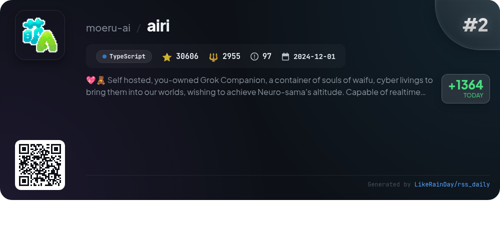
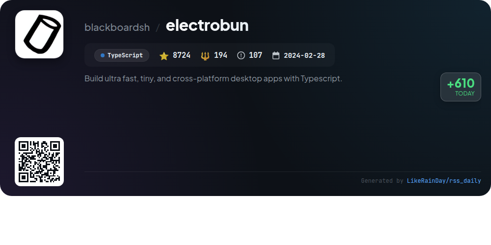
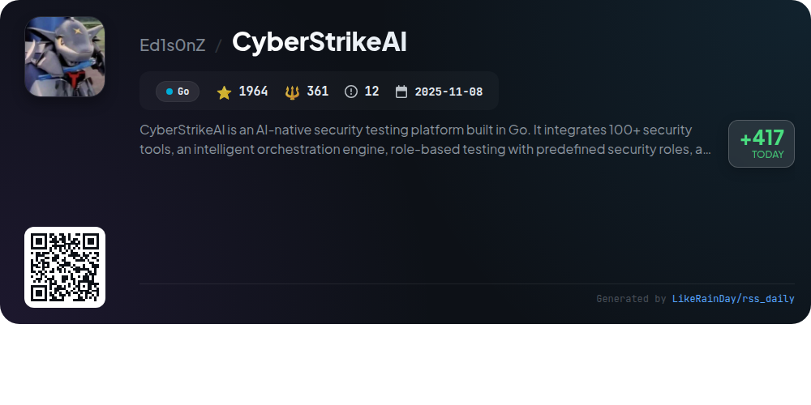
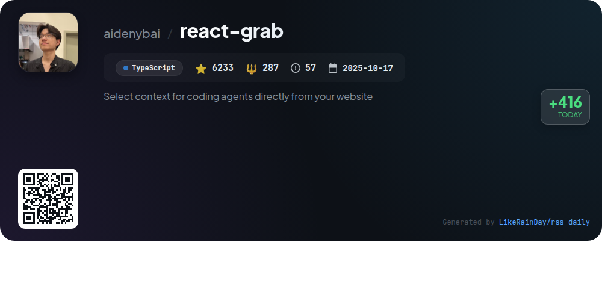
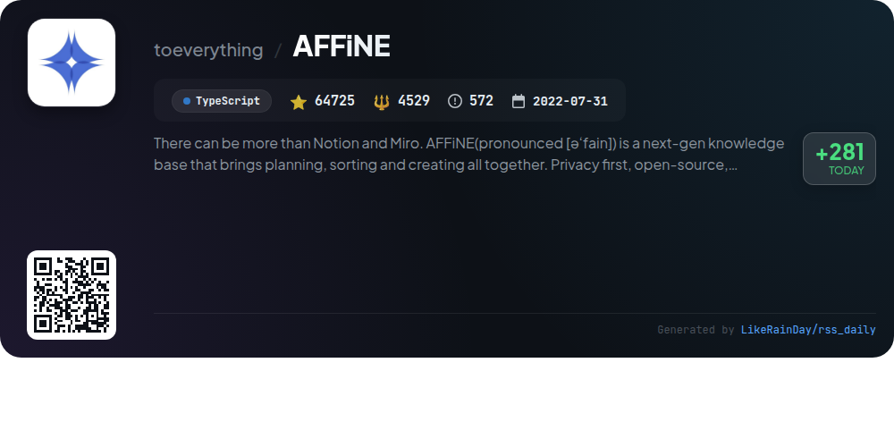
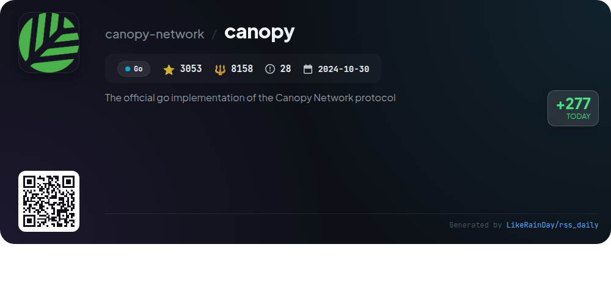
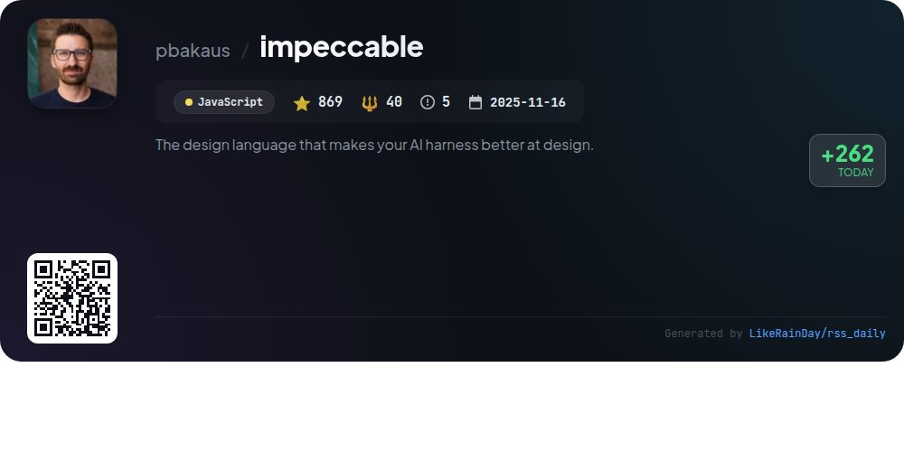
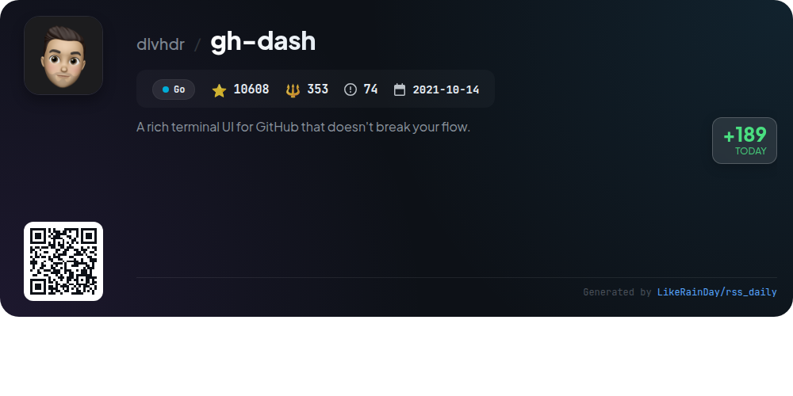

# 📊 🌟 GitHub Trending Daily - 2026-03-08

> > 📅 每日精选 GitHub 热门仓库 | 基于智能算法推荐

## 📋 Overview

**10** 个项目 | **425990** ⭐ | **73920** 🍴

**热门语言:** `TypeScript` (6) · `Go` (3) · `JavaScript` (1)

**更新时间:** 2026-03-08 02:44 UTC

**分类分布:**

- 🌟 每日 Top 10 精选 (10 项)

---

## 🌟 每日 Top 10 精选

### 1. [openclaw](https://github.com/openclaw/openclaw)

> 🤖 **推荐理由**  
> *OpenClaw is a personal AI assistant that operates across various platforms, allowing users to engage through popular messaging channels like WhatsApp, Telegram, Discord, and more. Key features include a local-first gateway for session management, multi-channel integration, and voice capabilities on macOS/iOS/Android. It supports a variety of tools, including a live Canvas, browser control, and automation options. With a guided onboarding wizard, OpenClaw ensures a seamless setup for users seeking a fast, always-on assistant tailored to their needs.*

- ⭐ 275978 stars
- 💻 TypeScript
- 📅 Updated: 2026-03-08

### 2. [airi](https://github.com/moeru-ai/airi)

> 🤖 **推荐理由**  
> *Project AIRI is a self-hosted AI companion designed to recreate the experience of Neuro-sama, offering users their own digital waifu or virtual character. Key features include real-time voice chat, gameplay capabilities for Minecraft and Factorio, and support for multiple platforms (Web, macOS, Windows). Built with TypeScript, AIRI leverages advanced web technologies for enhanced performance. Users can engage in conversations, utilize a memory system, and customize their experience with VRM and Live2D models. AIRI invites developers and artists to contribute to its ongoing development and expansion.*

- ⭐ 30606 stars
- 💻 TypeScript
- 📅 Updated: 2026-03-08

### 3. [learn-claude-code](https://github.com/shareAI-lab/learn-claude-code)

> 🤖 **推荐理由**  
> *Learn Claude Code is a TypeScript project designed to build a nano Claude Code-like AI agent from scratch. It features a progressive learning path across 12 sessions, introducing core mechanisms such as task delegation, tool handling, and context management. Users can interact with an agent loop that efficiently manages messages and tool execution. The project also offers a web platform for interactive visualizations and documentation in multiple languages. Additionally, it provides a Kode Agent CLI and SDK for embedding agent capabilities in applications, facilitating both coding and task management.*

- ⭐ 23230 stars
- 💻 TypeScript
- 📅 Updated: 2026-03-08

### 4. [electrobun](https://github.com/blackboardsh/electrobun)

> 🤖 **推荐理由**  
> *Electrobun is a powerful framework for creating ultra-fast, tiny, cross-platform desktop applications using TypeScript. With over 8,700 stars, it simplifies development by allowing you to write TypeScript for both the main process and webviews seamlessly. Key features include small app bundles (~12MB), efficient updates (as small as 14KB), and robust inter-process communication. Built on the Bun runtime and with native Zig bindings, Electrobun enables rapid app deployment in minutes. Explore its capabilities through example apps like Audio TTS and Co(lab), and access comprehensive documentation at electrobun.dev.*

- ⭐ 8724 stars
- 💻 TypeScript
- 📅 Updated: 2026-03-08

### 5. [CyberStrikeAI](https://github.com/Ed1s0nZ/CyberStrikeAI)

> 🤖 **推荐理由**  
> *CyberStrikeAI is an AI-native security testing platform built in Go. It integrates 100+ security tools, an intelligent orchestration engine, role-base. popular project, actively maintained, recently updated*

- ⭐ 1964 stars
- 🍴 361 forks
- 💻 Go
- 📅 Updated: 2026-03-08

### 6. [react-grab](https://github.com/aidenybai/react-grab)

> 🤖 **推荐理由**  
> *Select context for coding agents directly from your website. popular project, actively maintained, recently updated*

- ⭐ 6233 stars
- 🍴 287 forks
- 💻 TypeScript
- 📅 Updated: 2026-03-08

### 7. [AFFiNE](https://github.com/toeverything/AFFiNE)

> 🤖 **推荐理由**  
> *AFFiNE is an open-source, privacy-focused knowledge base that seamlessly integrates planning, sorting, and creation in one platform, offering a unique alternative to Notion and Miro. Key features include a flexible edgeless canvas for various content types, real-time collaboration, and local-first data ownership. With a multimodal AI partner for creative tasks and the ability to self-host or customize, AFFiNE caters to diverse user needs. Its rich ecosystem includes community-driven templates and extensive documentation, making it an ideal choice for creative minds.*

- ⭐ 64725 stars
- 💻 TypeScript
- 📅 Updated: 2026-03-08

### 8. [canopy](https://github.com/canopy-network/canopy)

> 🤖 **推荐理由**  
> *Canopy is the official Go implementation of the Canopy Network protocol, designed for building blockchains through a recursive architecture. Key features include a centralized controller for system communication, a Finite State Machine for transaction logic, Byzantine Fault Tolerance for consensus, and secure peer-to-peer networking. It supports Docker for easy deployment and is currently in Betanet. The project invites community contributions and offers comprehensive documentation through its wiki. For more details, visit the Canopy Network website.*

- ⭐ 3053 stars
- 💻 Go
- 📅 Updated: 2026-03-08

### 9. [impeccable](https://github.com/pbakaus/impeccable)

> 🤖 **推荐理由**  
> *Impeccable is a JavaScript design language enhancing AI-driven frontend design. With 869 stars, it offers a comprehensive skill set that includes 7 domain-specific references and 17 steering commands for tasks like auditing, polishing, and optimizing designs. Notably, it provides curated anti-patterns to prevent common design mistakes. Users can quickly start using Impeccable by downloading bundles from impeccable.style. It supports popular tools like Cursor and Codex CLI, enabling seamless integration into various projects for improved UI/UX outcomes.*

- ⭐ 869 stars
- 💻 JavaScript
- 📅 Updated: 2026-03-08

### 10. [gh-dash](https://github.com/dlvhdr/gh-dash)

> 🤖 **推荐理由**  
> *gh-dash is a terminal UI for GitHub designed to enhance productivity without interrupting your workflow. With over 10,600 stars, it offers user-defined PRs and issues sections, customizable vim-style hotkeys, and the ability to perform all GitHub actions like diffing, commenting, and pushing. Configuration is managed through a YAML file, and extensive documentation is available at gh-dash.dev. Built using technologies like Bubble Tea and Cobra, gh-dash also features an active Discord community for support and collaboration.*

- ⭐ 10608 stars
- 💻 Go
- 📅 Updated: 2026-03-08

---

## 📡 RSS订阅

通过 RSS 订阅，第一时间获取每日精选项目：

- 🔔 [RSS 订阅源] (../../daily-top.xml)
- 🔔 [每日简报] (../../GITHUB_TODAY_CN.md)
- 🔔 [每日 Top 10 精选](../../daily-top.xml)

---

*⚡ Powered by Smart Trending Algorithm | Generated at 2026-03-08 02:44:17 UTC
