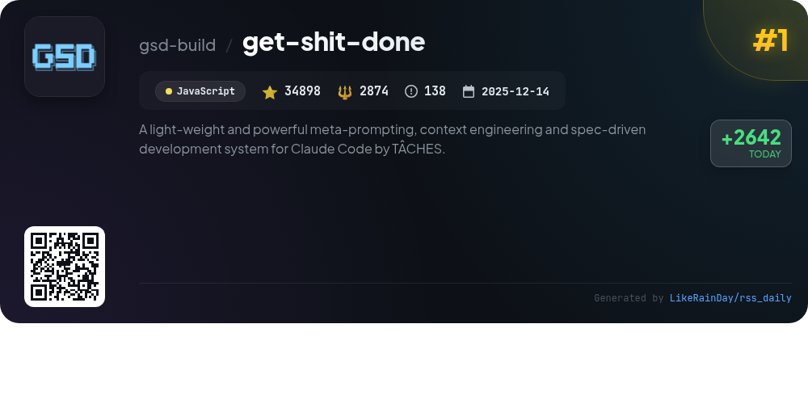
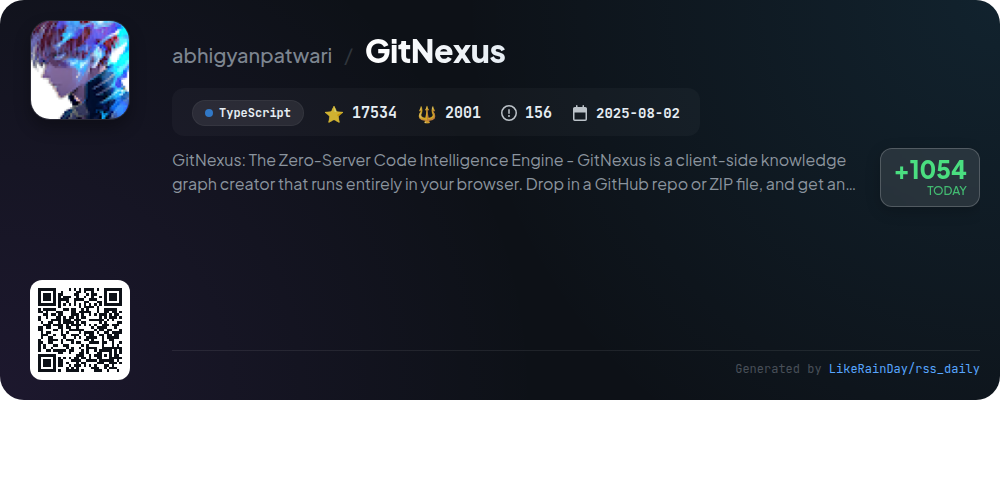
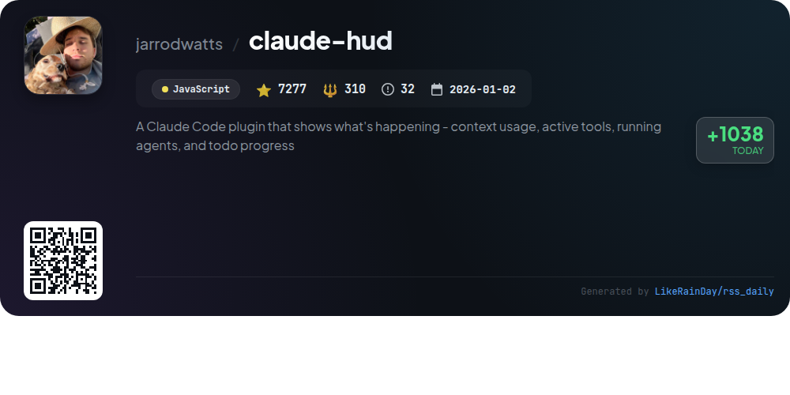
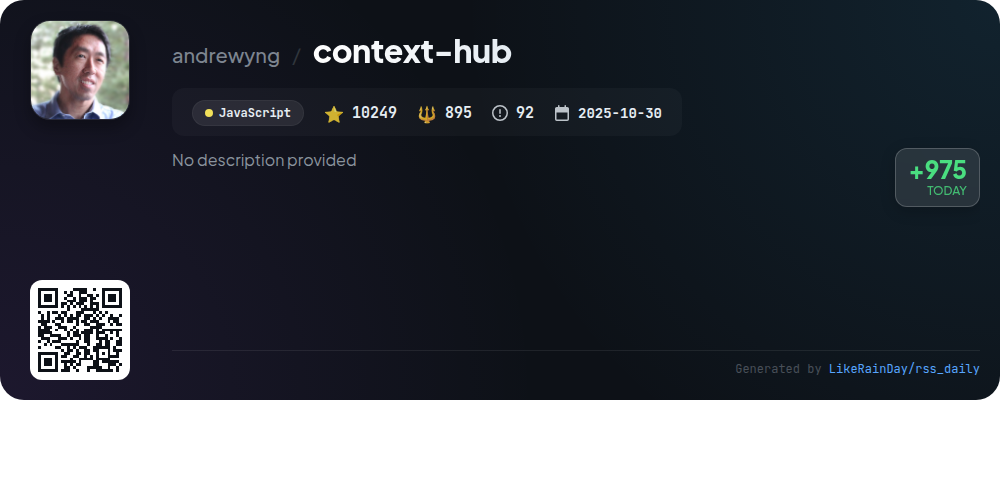
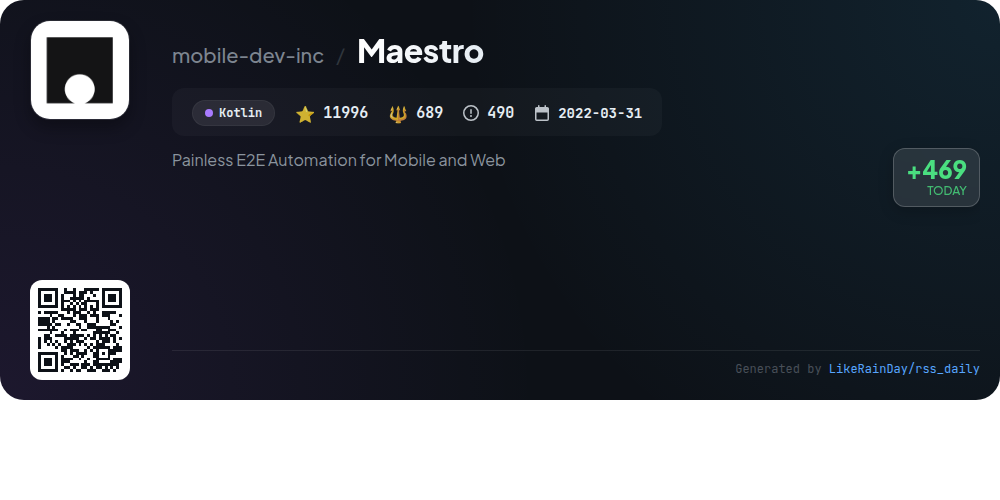
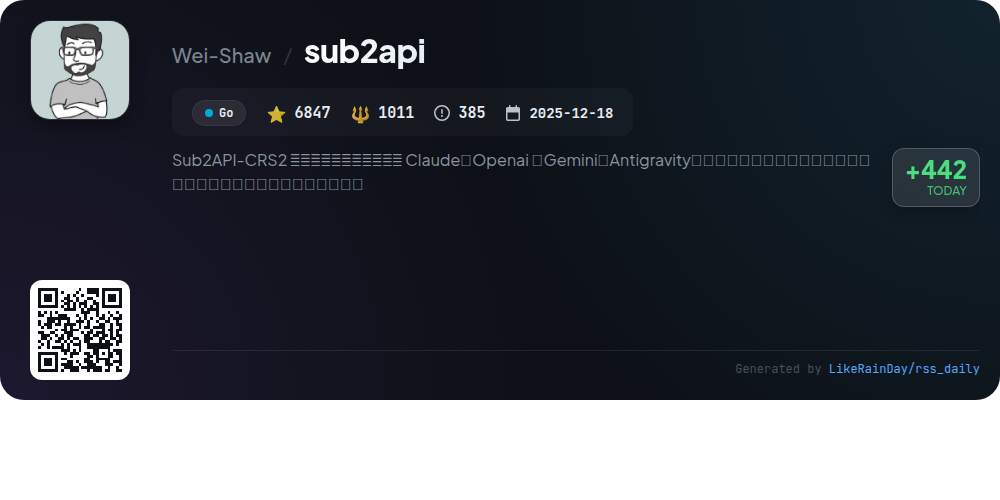
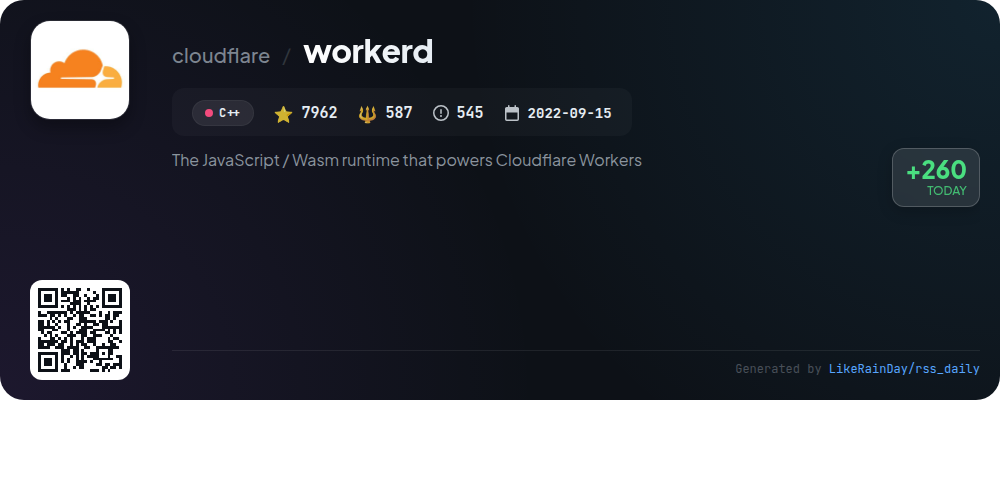

# 📊 🌟 GitHub Trending Daily - 2026-03-19

> > 📅 每日精选 GitHub 热门仓库 | 基于智能算法推荐

## 📋 Overview

**10** 个项目 | **229614** ⭐ | **27116** 🍴

**热门语言:** `JavaScript` (5) · `TypeScript` (2) · `Go` (1)

**更新时间:** 2026-03-19 02:50 UTC

**分类分布:**

- 🌟 每日 Top 10 精选 (10 项)

---

## 🌟 每日 Top 10 精选

### 1. [get-shit-done](https://github.com/gsd-build/get-shit-done)

> 🤖 **推荐理由**  
> *Get Shit Done (GSD) is a lightweight JavaScript-based meta-prompting and context engineering system designed for Claude Code and other platforms. With 34,898 stars, it addresses context rot by maintaining high-quality outputs through structured workflows. Key features include project initialization, phased planning, execution in parallel waves, and automated verification. GSD facilitates a smooth development process by allowing users to focus on their vision without the complexities of traditional development tools. It is trusted by engineers at top companies like Amazon and Google.*

- ⭐ 34898 stars
- 💻 JavaScript
- 📅 Updated: 2026-03-19

### 2. [everything-claude-code](https://github.com/affaan-m/everything-claude-code)

> 🤖 **推荐理由**  
> *Everything Claude Code is a powerful performance optimization system for AI agents, designed to enhance productivity with skills, instincts, memory optimization, and security scanning. This project supports multiple platforms, including Claude Code, Codex, Cursor, and OpenCode, offering 25 agents, 108 skills, and 57 commands. Key features include continuous learning, token optimization, and a comprehensive security audit tool (AgentShield). Winner of the Anthropic hackathon, it provides guides for setup and advanced usage, making it an essential resource for developers.*

- ⭐ 85847 stars
- 💻 JavaScript
- 📅 Updated: 2026-03-19

### 3. [learn-claude-code](https://github.com/shareAI-lab/learn-claude-code)

> 🤖 **推荐理由**  
> *Learn Claude Code is a TypeScript-based project focused on harness engineering for AI agents, emphasizing that an agent is fundamentally a trained model, not merely a code framework. With over 32,000 stars, it offers a masterclass in building effective agent harnesses through 12 progressive sessions. Key features include tool integration, context management, task systems, and team coordination. The repository provides a comprehensive learning path, interactive visualizations, and a web platform for hands-on experience, aiming to empower developers to create intelligent solutions across various domains.*

- ⭐ 32366 stars
- 💻 TypeScript
- 📅 Updated: 2026-03-19

### 4. [GitNexus](https://github.com/abhigyanpatwari/GitNexus)

> 🤖 **推荐理由**  
> *GitNexus is a zero-server code intelligence engine that creates a client-side knowledge graph for GitHub repositories or ZIP files, running entirely in the browser. Key features include a Web UI for interactive code exploration and a CLI for deep integration with AI agents like Cursor and Claude Code. The tool indexes dependencies, call chains, and execution flows, enhancing code understanding and reliability. It supports multiple languages, offers impact analysis, and facilitates multi-repo management, all while ensuring local privacy and security.*

- ⭐ 17534 stars
- 💻 TypeScript
- 📅 Updated: 2026-03-19

### 5. [claude-hud](https://github.com/jarrodwatts/claude-hud)

> 🤖 **推荐理由**  
> *Claude HUD is a JavaScript plugin for Claude Code that enhances user insights during coding sessions by displaying context usage, active tools, running agents, and todo progress in a persistent HUD. Key features include real-time context health monitoring, tool activity tracking, and customizable display options. Users can configure the HUD using presets and manual settings, ensuring a tailored experience. With support for displaying git status and usage limits, Claude HUD streamlines workflow and improves project visibility. Install easily within Claude Code for immediate access.*

- ⭐ 7277 stars
- 💻 JavaScript
- 📅 Updated: 2026-03-19

### 6. [context-hub](https://github.com/andrewyng/context-hub)

> 🤖 **推荐理由**  
> *Context Hub is a powerful tool designed to enhance coding agents by providing curated, versioned API documentation and learning capabilities. With over 10,000 stars, it allows agents to search, fetch, and annotate documentation with ease, improving their performance over time. Key features include incremental fetching of documents, local annotations that persist across sessions, and a feedback system for continuous improvement. Content is maintained in markdown format, making contributions from the community straightforward. This ensures agents become smarter and more efficient with each task.*

- ⭐ 10249 stars
- 💻 JavaScript
- 📅 Updated: 2026-03-19

### 7. [Maestro](https://github.com/mobile-dev-inc/Maestro)

> 🤖 **推荐理由**  
> *Maestro is an open-source framework for painless end-to-end testing of Android, iOS, and web applications, enabling users to write tests in YAML and execute them seamlessly on various platforms. Key features include human-readable YAML flows, resilience with smart waiting, and rapid installation. The project also offers Maestro Studio, a visual test IDE for easy test design, and Maestro Cloud for scalable parallel execution. With over 11,996 stars, Maestro simplifies cross-platform testing while fostering community collaboration through resources and support channels.*

- ⭐ 11996 stars
- 💻 Kotlin
- 📅 Updated: 2026-03-19

### 8. [sub2api](https://github.com/Wei-Shaw/sub2api)

> 🤖 **推荐理由**  
> *Sub2API is an open-source AI API gateway designed for efficient subscription quota distribution across services like Claude, OpenAI, and Gemini. Key features include multi-account management, API key generation, precise billing, smart scheduling, and configurable rate limits. The platform offers an admin dashboard for monitoring and integrates with external systems for enhanced functionality. Users can opt for the official relay service, PinCC, for hassle-free access. Built with Go, Vue, and PostgreSQL, Sub2API supports Docker deployment for easy setup.*

- ⭐ 6847 stars
- 💻 Go
- 📅 Updated: 2026-03-19

### 9. [marketingskills](https://github.com/coreyhaines31/marketingskills)

> 🤖 **推荐理由**  
> *The "marketingskills" GitHub project provides a set of AI agent skills tailored for marketing tasks, ideal for technical marketers and founders. Key features include capabilities in conversion optimization, copywriting, SEO, analytics, and growth engineering, with compatibility across various AI platforms like Claude Code and OpenAI Codex. The repository offers a rich library of skills, enabling agents to execute specialized marketing functions. Additional services include hands-on support through Conversion Factory, marketing insights via Swipe Files, and autonomous management through Magister. Contributions are encouraged to enhance skill offerings.*

- ⭐ 14638 stars
- 💻 JavaScript
- 📅 Updated: 2026-03-19

### 10. [workerd](https://github.com/cloudflare/workerd)

> 🤖 **推荐理由**  
> *`workerd` is Cloudflare's JavaScript/Wasm runtime, facilitating the self-hosting of applications designed for Cloudflare Workers. Key features include a server-first architecture, standard-based APIs, and nanoservices that enhance performance and composability. It supports local development and testing, functions as a programmable HTTP proxy, and ensures backward compatibility with JavaScript code. Designed for POSIX systems, it requires specific dependencies for building and running. `workerd` is not a hardened sandbox, necessitating secure environments for potentially malicious code.*

- ⭐ 7962 stars
- 💻 C++
- 📅 Updated: 2026-03-19

---

## 📡 RSS订阅

通过 RSS 订阅，第一时间获取每日精选项目：

- 🔔 [RSS 订阅源] (../../daily-top.xml)
- 🔔 [每日简报] (../../GITHUB_TODAY_CN.md)
- 🔔 [每日 Top 10 精选](../../daily-top.xml)

---

*⚡ Powered by Smart Trending Algorithm | Generated at 2026-03-19 02:50:22 UTC
