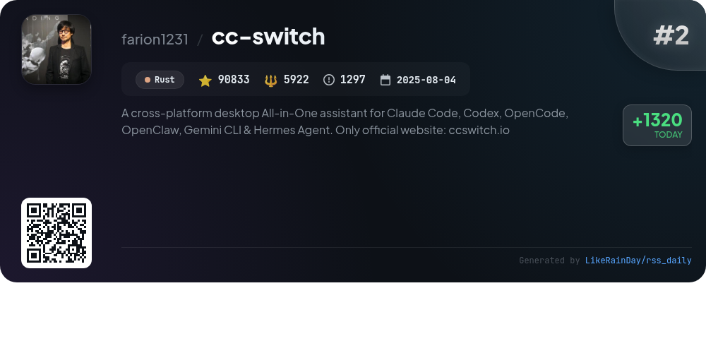
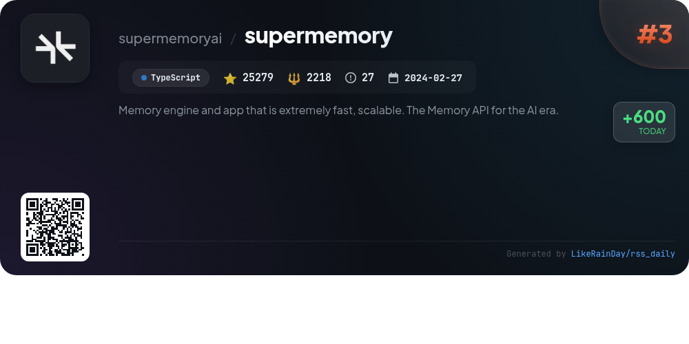
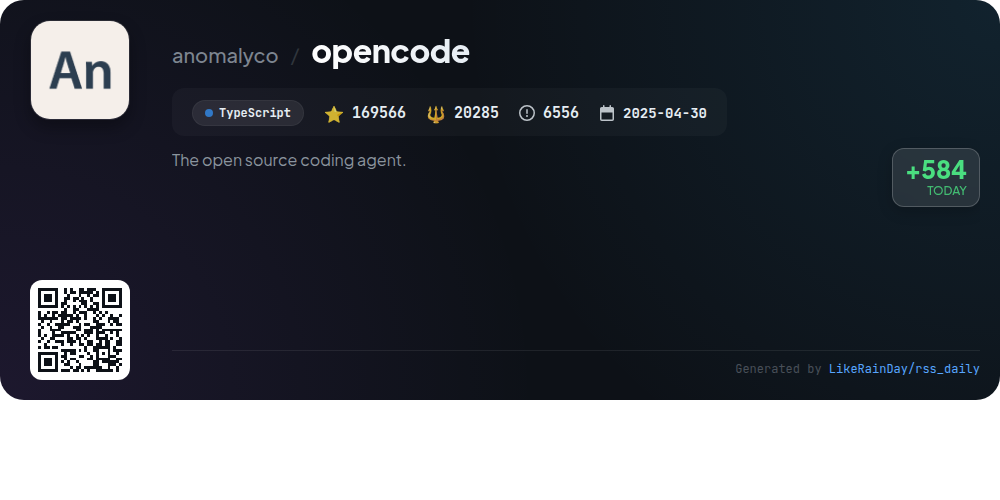
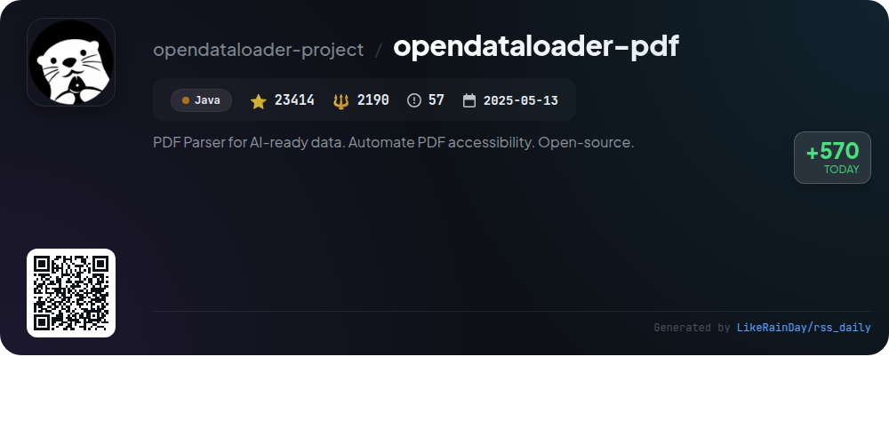
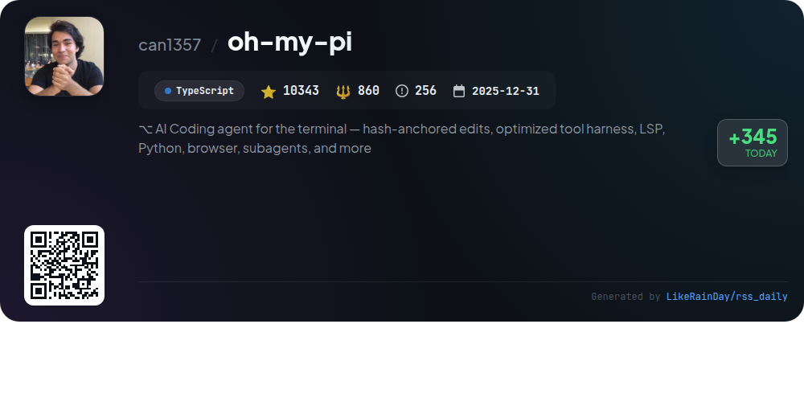

# 📊 🌟 GitHub Trending Daily - 2026-06-04

> > 📅 每日精选 GitHub 热门仓库 | 基于智能算法推荐

## 📋 Overview

**10** 个项目 | **689968** ⭐ | **83011** 🍴

**热门语言:** `TypeScript` (5) · `Rust` (2) · `JavaScript` (2)

**更新时间:** 2026-06-04 04:48 UTC

**分类分布:**

- 🌟 每日 Top 10 精选 (10 项)

---

## 🌟 每日 Top 10 精选

### 1. [ECC](https://github.com/affaan-m/ECC)

> 🤖 **推荐理由**  
> *ECC is a comprehensive performance optimization system designed for AI agents like Claude Code, Codex, and Cursor. It offers skills, instincts, memory optimization, and security scanning, fostering research-driven development. Key features include 63 specialized agents, 249 reusable skills, and advanced hooks for automation. The ECC v2.0.0-rc.1 introduces a user-friendly dashboard, enhanced operator workflows, and a security audit tool (AgentShield). This system is adaptable across multiple platforms, making it ideal for developers in various ecosystems.*

- ⭐ 206033 stars
- 💻 JavaScript
- 📅 Updated: 2026-06-04

### 2. [cc-switch](https://github.com/farion1231/cc-switch)

> 🤖 **推荐理由**  
> *CC Switch is a cross-platform desktop application for managing AI coding tools like Claude Code, Codex, and Gemini CLI. It simplifies API management with a unified interface, allowing users to switch between 50+ provider presets without manual edits. Key features include a system tray for quick switching, cloud sync, and a unified MCP & Skills management panel. Built with Rust and Tauri, it supports Windows, macOS, and Linux. CC Switch enhances workflow efficiency, offering built-in utilities and detailed usage tracking, making it indispensable for AI-powered development.*

- ⭐ 90833 stars
- 💻 Rust
- 📅 Updated: 2026-06-04

### 3. [supermemory](https://github.com/supermemoryai/supermemory)

> 🤖 **推荐理由**  
> *Supermemory is a high-performance memory engine and API designed for AI applications, enabling persistent memory and context across conversations. It excels in benchmarks like LongMemEval and offers features such as automatic fact extraction, user profile maintenance, hybrid search, and real-time data syncing from platforms like Google Drive and Notion. With a single API, developers can integrate memory and context capabilities seamlessly. The user-friendly app allows individuals to build their personal memory graph, enhancing AI interactions over time.*

- ⭐ 25279 stars
- 💻 TypeScript
- 📅 Updated: 2026-06-04

### 4. [impeccable](https://github.com/pbakaus/impeccable)

> 🤖 **推荐理由**  
> *Impeccable is a JavaScript design language skill that enhances AI-assisted frontend design with 23 commands and 7 domain-specific reference files, including typography and UX writing. It offers a quick start via ready-to-use bundles at impeccable.style. Key features include deterministic anti-pattern rules, a CLI for direct command execution, and a browser extension for real-time design critique. Designed to overcome common design pitfalls, Impeccable provides tools for auditing, polishing, and critiquing designs, making it invaluable for developers seeking high-quality outputs in their projects.*

- ⭐ 34149 stars
- 💻 JavaScript
- 📅 Updated: 2026-06-04

### 5. [opencode](https://github.com/anomalyco/opencode)

> 🤖 **推荐理由**  
> *OpenCode is an open-source AI coding agent built with TypeScript, boasting over 169,000 stars on GitHub. It features two main agents: a full-access "build" agent for development and a "plan" agent for code analysis, both switchable via the Tab key. OpenCode offers a user-friendly installation process across multiple platforms, including a desktop application (in beta). Extensive documentation is available to aid configuration, and the project encourages community contributions. Join the OpenCode community on Discord for support and collaboration.*

- ⭐ 169566 stars
- 💻 TypeScript
- 📅 Updated: 2026-06-04

### 6. [opendataloader-pdf](https://github.com/opendataloader-project/opendataloader-pdf)

> 🤖 **推荐理由**  
> *OpenDataLoader PDF is an open-source PDF parser designed for AI-ready data extraction and automated PDF accessibility. With an impressive benchmark accuracy of 0.907, it converts PDFs into structured Markdown, JSON (with bounding boxes), HTML, and Tagged PDFs. Key features include built-in OCR, hybrid processing for complex content, and auto-tagging for accessibility compliance. It supports multiple programming languages (Python, Node.js, Java) and collaborates with industry leaders for PDF/UA compliance. Ideal for enhancing document accessibility and streamlining data extraction workflows.*

- ⭐ 23414 stars
- 💻 Java
- 📅 Updated: 2026-06-04

### 7. [hyperframes](https://github.com/heygen-com/hyperframes)

> 🤖 **推荐理由**  
> *HyperFrames is an open-source framework designed for creating deterministic MP4 videos from HTML, CSS, and animations. With over 24,000 stars, it allows users to define video compositions as HTML files with data attributes for timing and effects, making it agent-friendly and eliminating complex build steps. Key features include a CLI for local rendering, reusable catalog components, support for various animation libraries, and AWS Lambda integration for distributed rendering. HyperFrames emphasizes simplicity and accessibility for both developers and AI coding agents.*

- ⭐ 24047 stars
- 💻 TypeScript
- 📅 Updated: 2026-06-04

### 8. [oh-my-pi](https://github.com/can1357/oh-my-pi)

> 🤖 **推荐理由**  
> *oh-my-pi is an AI coding agent for terminal environments, offering a robust set of features like hash-anchored edits, optimized tool integration, and LSP support. Key highlights include seamless code execution, real-time debugging, and the ability to manage multiple subagents for parallel tasks. It supports 40+ providers and provides tools for reading, writing, editing, and searching across various file types. The project is built with TypeScript and Rust, ensuring high performance and extensibility. With over 10,000 stars on GitHub, it’s designed to enhance productivity for developers.*

- ⭐ 10343 stars
- 💻 TypeScript
- 📅 Updated: 2026-06-04

### 9. [codex](https://github.com/openai/codex)

> 🤖 **推荐理由**  
> *Codex is a powerful lightweight coding agent from OpenAI, designed to run locally in your terminal. With over 88,000 stars on GitHub, it offers a seamless coding experience for developers. Users can easily install Codex CLI on Mac, Linux, or Windows using simple commands or package managers. Codex integrates with popular IDEs and provides a desktop app for enhanced usability. Signing in with a ChatGPT account unlocks additional features, while API key support allows for customization. Comprehensive documentation and contribution guidelines are available.*

- ⭐ 88411 stars
- 💻 Rust
- 📅 Updated: 2026-06-04

### 10. [AiToEarn](https://github.com/yikart/AiToEarn)

> 🤖 **推荐理由**  
> *AiToEarn is a powerful AI-driven content marketing platform designed for creators, brands, and businesses to monetize, publish, and engage across major global platforms like TikTok, YouTube, and Instagram. Core features include automated content generation, multi-platform publishing, and interactive engagement tools, enabling users to streamline their content creation and distribution processes. With various monetization models—CPS, CPE, and CPM—AiToEarn helps creators earn from their content effectively. The platform supports easy access via web, integrations with AI assistants, and Docker deployment for teams.*

- ⭐ 17893 stars
- 💻 TypeScript
- 📅 Updated: 2026-06-04

---

## 📡 RSS订阅

通过 RSS 订阅，第一时间获取每日精选项目：

- 🔔 [RSS 订阅源] (../../daily-top.xml)
- 🔔 [每日简报] (../../GITHUB_TODAY_CN.md)
- 🔔 [每日 Top 10 精选](../../daily-top.xml)

---

*⚡ Powered by Smart Trending Algorithm | Generated at 2026-06-04 04:48:20 UTC
