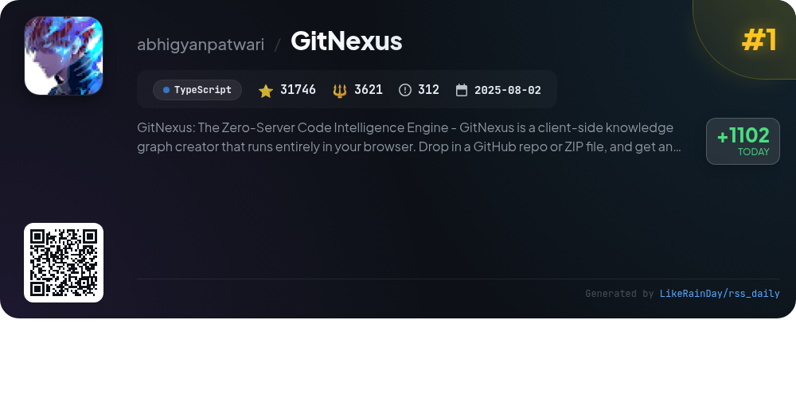
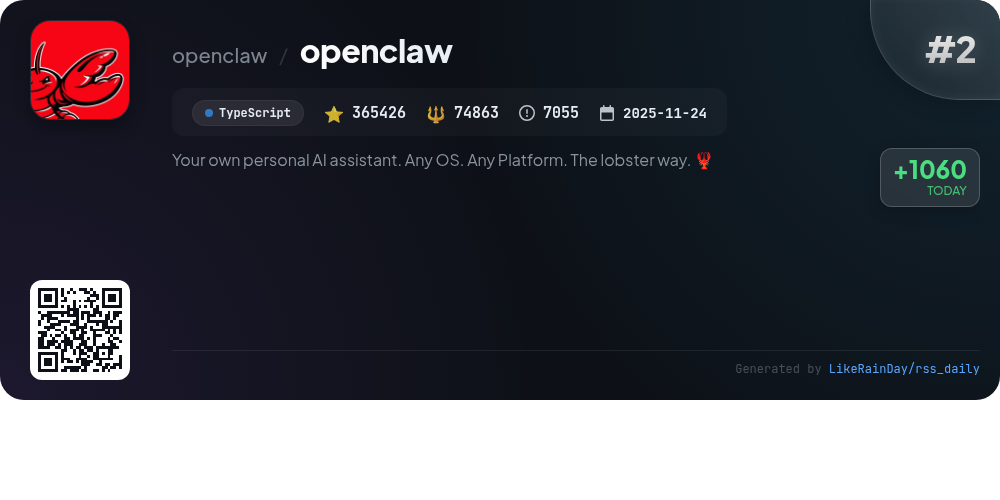
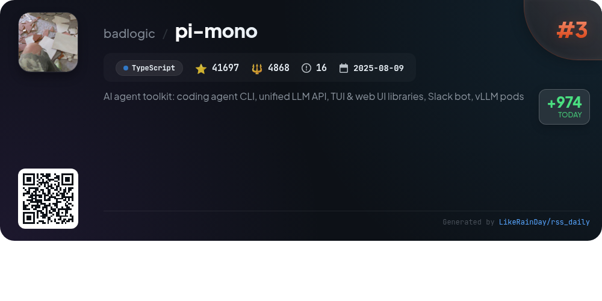
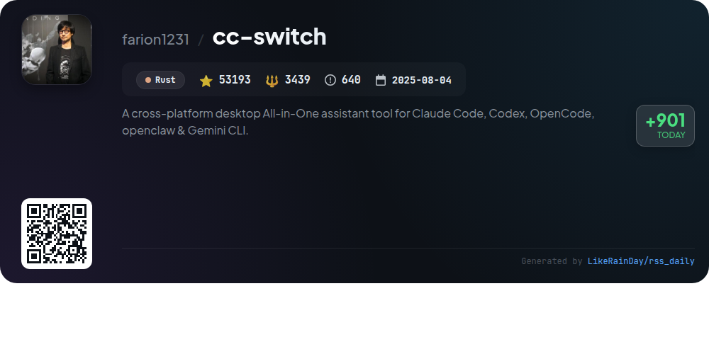
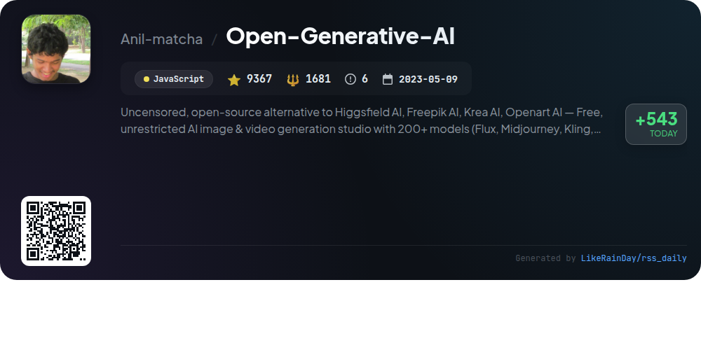
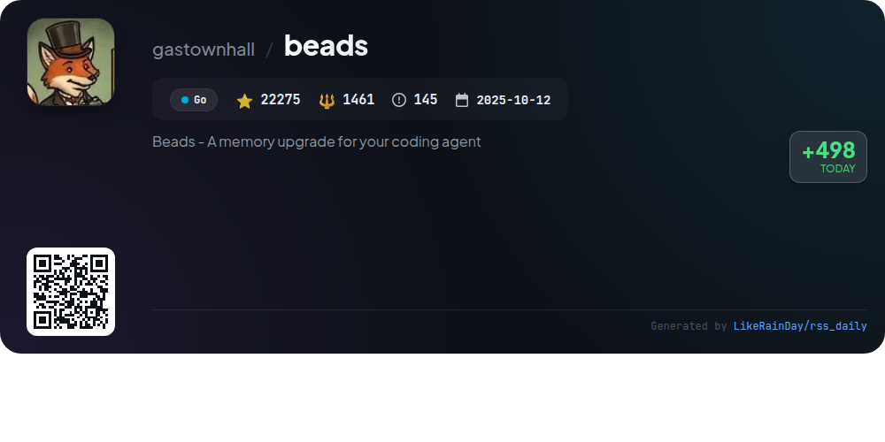
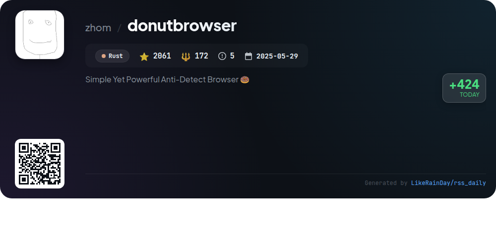
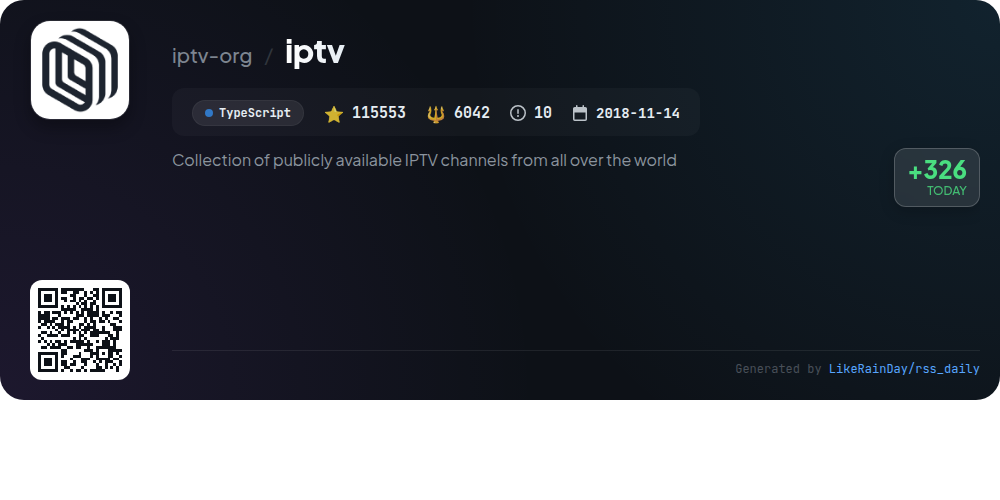
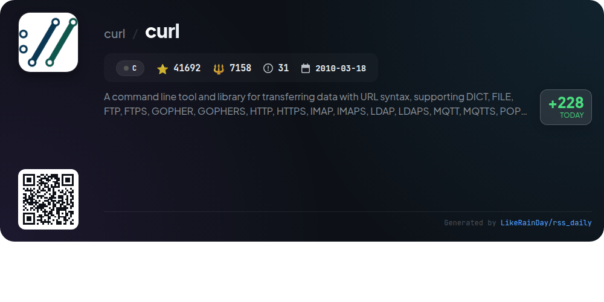

# 📊 🌟 GitHub Trending Daily - 2026-04-28

> > 📅 每日精选 GitHub 热门仓库 | 基于智能算法推荐

## 📋 Overview

**10** 个项目 | **699215** ⭐ | **106157** 🍴

**热门语言:** `TypeScript` (4) · `Rust` (2) · `Go` (2)

**更新时间:** 2026-04-28 03:49 UTC

**分类分布:**

- 🌟 每日 Top 10 精选 (10 项)

---

## 🌟 每日 Top 10 精选

### 1. [GitNexus](https://github.com/abhigyanpatwari/GitNexus)

> 🤖 **推荐理由**  
> *GitNexus: The Zero-Server Code Intelligence Engine -       GitNexus is a client-side knowledge graph creator that runs entirely in your browser. Drop . popular project, actively maintained, recently updated*

- ⭐ 31746 stars
- 🍴 3621 forks
- 💻 TypeScript
- 📅 Updated: 2026-04-28

### 2. [openclaw](https://github.com/openclaw/openclaw)

> 🤖 **推荐理由**  
> *OpenClaw is a versatile personal AI assistant designed for any operating system and platform, boasting over 365,000 stars on GitHub. Built with TypeScript, it seamlessly integrates with popular messaging platforms like WhatsApp, Telegram, and Discord. Key features include multi-channel support, voice activation, live canvas interfaces, and a local-first gateway for user control. The onboarding process is user-friendly, guiding setup across various devices. OpenClaw prioritizes security with robust DM policies, making it ideal for users seeking a fast, personal, and secure AI assistant experience.*

- ⭐ 365426 stars
- 💻 TypeScript
- 📅 Updated: 2026-04-28

### 3. [pi-mono](https://github.com/badlogic/pi-mono)

> 🤖 **推荐理由**  
> *pi-mono is an AI agent toolkit designed for building and managing AI agents with a focus on coding tasks. Key features include a unified LLM API supporting multiple providers (OpenAI, Anthropic, Google), an interactive coding agent CLI, a Slack bot for message delegation, and both terminal and web UI libraries for AI chat interfaces. The project also offers vLLM deployment management via CLI. With over 41,000 stars, pi-mono encourages collaboration by sharing OSS coding agent sessions to enhance real-world task performance.*

- ⭐ 41697 stars
- 💻 TypeScript
- 📅 Updated: 2026-04-28

### 4. [cc-switch](https://github.com/farion1231/cc-switch)

> 🤖 **推荐理由**  
> *CC Switch is a cross-platform desktop assistant designed for managing multiple CLI tools including Claude Code, Codex, Gemini CLI, OpenCode, and OpenClaw. Key features include over 50 built-in provider presets for easy configuration, unified MCP and Skills management, and system tray quick switching for seamless transitions between tools. It supports cloud sync for provider data and offers a user-friendly interface, eliminating the need for manual file editing. Built with Rust and Tauri, CC Switch is available on Windows, macOS, and Linux, streamlining AI-powered coding workflows.*

- ⭐ 53193 stars
- 💻 Rust
- 📅 Updated: 2026-04-28

### 5. [Open-Generative-AI](https://github.com/Anil-matcha/Open-Generative-AI)

> 🤖 **推荐理由**  
> *Open Generative AI is a free, uncensored, open-source platform for AI image and video generation, offering over 200 models, including text-to-image, image-to-video, and lip-sync capabilities. Key features include a self-hosted option, no content filters, and a user-friendly interface. Users can automate media workflows with AI coding agents and access a hosted version online. The platform supports multi-image inputs and local model inference, ensuring full creative control. Built on Next.js and MIT licensed, it emphasizes privacy and customization.*

- ⭐ 9367 stars
- 💻 JavaScript
- 📅 Updated: 2026-04-28

### 6. [beads](https://github.com/gastownhall/beads)

> 🤖 **推荐理由**  
> *Beads is a distributed graph issue tracker for AI agents, leveraging Dolt for a structured, persistent memory solution in Go. With over 22,000 stars, it operates on macOS, Linux, Windows, and FreeBSD. Key features include dependency-aware task management, zero-conflict ID handling, and semantic memory decay for context preservation. It supports both embedded and server modes for database management, enabling efficient multi-agent collaboration. Beads enhances workflow with messaging, task linking, and a CLI for easy integration into projects without needing Git.*

- ⭐ 22275 stars
- 💻 Go
- 📅 Updated: 2026-04-28

### 7. [donutbrowser](https://github.com/zhom/donutbrowser)

> 🤖 **推荐理由**  
> *Donut Browser is a powerful open-source anti-detect browser built in Rust, featuring unlimited isolated profiles with unique fingerprints, cookies, and extensions. It utilizes Chromium and Firefox engines for enhanced privacy and supports various proxies and VPNs. Key features include cloud sync with end-to-end encryption, profile management, and cookie/extension handling. Users can import profiles from other browsers and benefit from a REST API for automation. With zero telemetry, Donut Browser prioritizes user privacy and security. Visit [donutbrowser.com](https://donutbrowser.com) for more information.*

- ⭐ 2061 stars
- 💻 Rust
- 📅 Updated: 2026-04-28

### 8. [sub2api](https://github.com/Wei-Shaw/sub2api)

> 🤖 **推荐理由**  
> *Sub2API is an open-source AI API gateway platform that streamlines subscription management for services like Claude, OpenAI, and Gemini. Key features include multi-account management, API key generation, precise billing, smart scheduling, and a built-in payment system supporting various methods. The platform also offers an admin dashboard for monitoring and management, as well as external system integration capabilities. With 16,205 stars on GitHub, Sub2API provides efficient cost-sharing through pooled subscriptions, making it an ideal solution for developers and teams seeking seamless AI service access.*

- ⭐ 16205 stars
- 💻 Go
- 📅 Updated: 2026-04-28

### 9. [iptv](https://github.com/iptv-org/iptv)

> 🤖 **推荐理由**  
> *The IPTV project offers a comprehensive collection of publicly available IPTV channels worldwide, enabling users to stream live content effortlessly. Key features include a central playlist accessible via a simple URL, Electronic Program Guide (EPG) downloads, and robust API support for integration. The repository fosters community engagement through discussions and contributions, while ensuring legal compliance by linking only to publicly shared streams. With over 115,000 stars, it stands as a valuable resource for IPTV enthusiasts and developers alike.*

- ⭐ 115553 stars
- 💻 TypeScript
- 📅 Updated: 2026-04-28

### 10. [curl](https://github.com/curl/curl)

> 🤖 **推荐理由**  
> *curl is a versatile command-line tool and library for transferring data using a wide array of protocols, including HTTP, FTP, SMTP, and more. With over 41,000 stars on GitHub, it offers robust features like support for secure data transfer and easy integration via libcurl. As an open-source project under an MIT-like license, curl provides extensive documentation, installation guides, and a supportive community. For commercial support and security issue reporting, users can access dedicated resources on the official website.*

- ⭐ 41692 stars
- 💻 C
- 📅 Updated: 2026-04-28

---

## 📡 RSS订阅

通过 RSS 订阅，第一时间获取每日精选项目：

- 🔔 [RSS 订阅源] (../../daily-top.xml)
- 🔔 [每日简报] (../../GITHUB_TODAY_CN.md)
- 🔔 [每日 Top 10 精选](../../daily-top.xml)

---

*⚡ Powered by Smart Trending Algorithm | Generated at 2026-04-28 03:49:32 UTC
