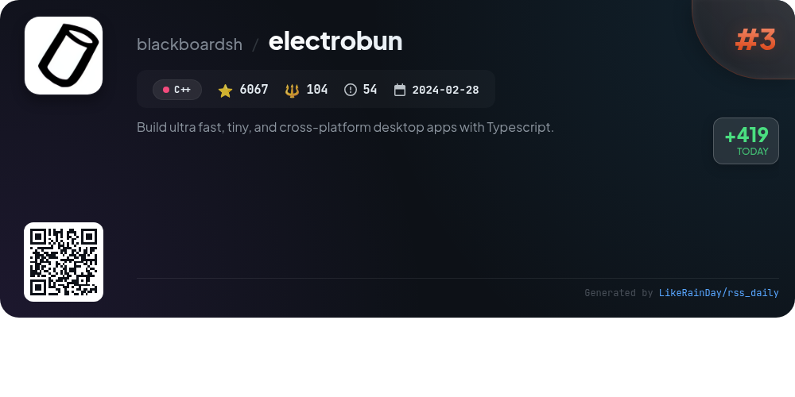
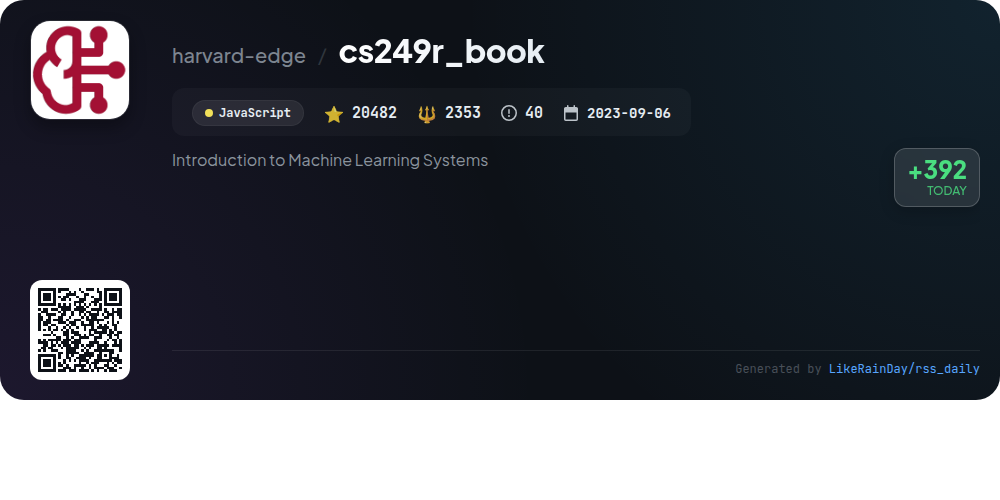
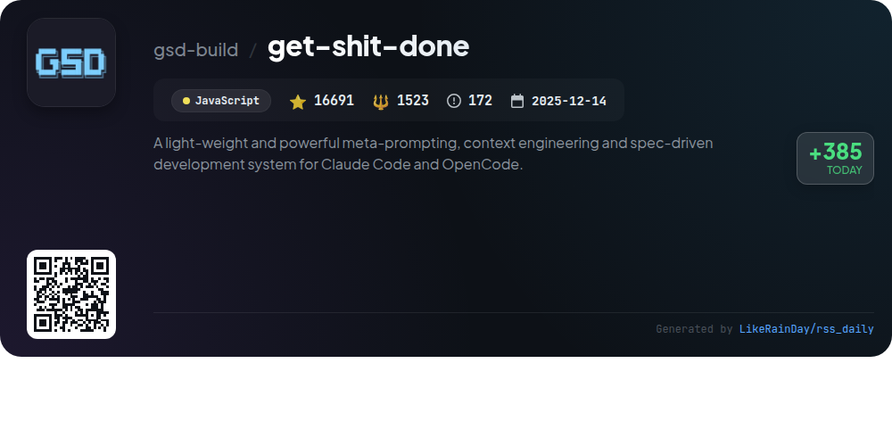
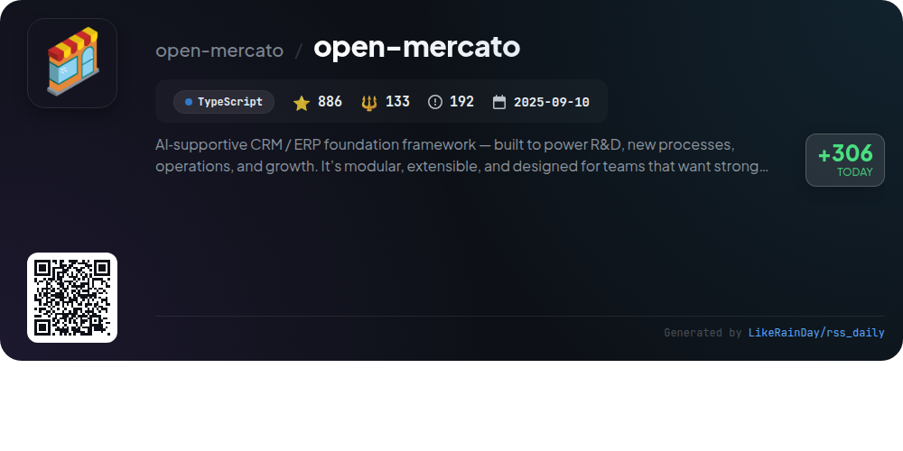
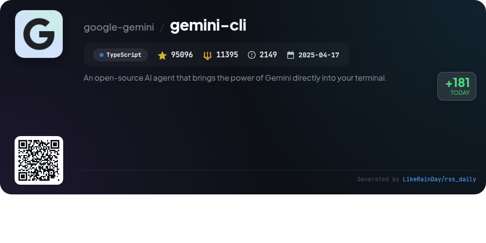
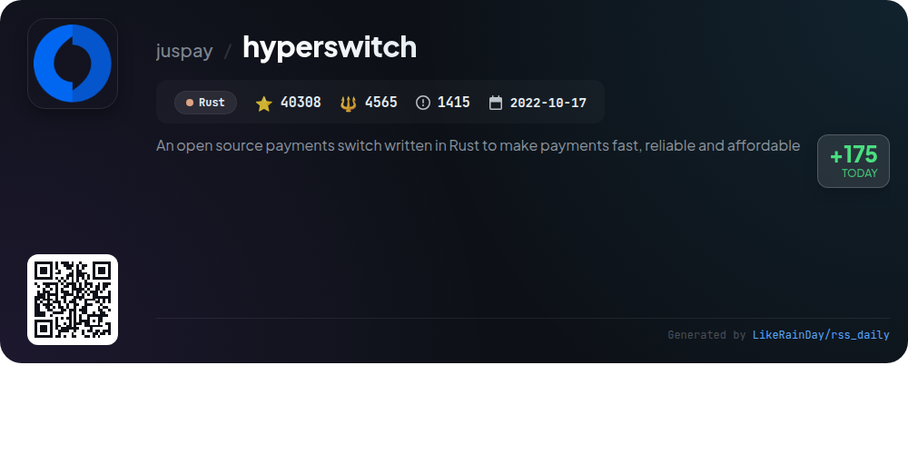
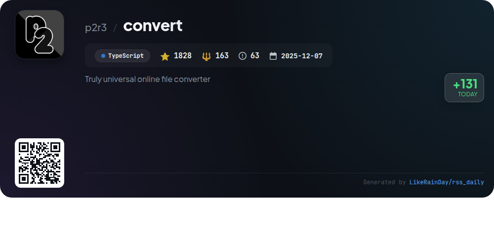

# 📊 🌟 GitHub Trending Daily - 2026-02-21

> > 📅 每日精选 GitHub 热门仓库 | 基于智能算法推荐

## 📋 Overview

**10** 个项目 | **209404** ⭐ | **23386** 🍴

**热门语言:** `JavaScript` (3) · `TypeScript` (3) · `C++` (2)

**更新时间:** 2026-02-21 02:35 UTC

**分类分布:**

- 🌟 每日 Top 10 精选 (10 项)

---

## 🌟 每日 Top 10 精选

### 1. [pentagi](https://github.com/vxcontrol/pentagi)

> 🤖 **推荐理由**  
> *PentAGI is a fully autonomous AI agent system designed for advanced penetration testing, leveraging AI technologies to automate complex security assessments. Key features include a secure Docker-based environment, integration of 20+ professional pentesting tools, a smart memory system for storing research results, and a knowledge graph for enhanced context understanding. It supports REST/GraphQL APIs, real-time monitoring through Grafana, and flexible authentication options. PentAGI is scalable, self-hosted, and ideal for security professionals seeking efficient and effective testing solutions.*

- ⭐ 4003 stars
- 💻 Go
- 📅 Updated: 2026-02-21

### 2. [pyrite64](https://github.com/HailToDodongo/pyrite64)

> 🤖 **推荐理由**  
> *Pyrite64 is an N64 game engine and editor built with libdragon and tiny3d, enabling developers to create 3D games for real N64 hardware and accurate emulators. Key features include an intuitive visual editor, automatic toolchain installation on Windows, 3D model import (GLTF) with fast64 material support, HDR+BLOOM rendering, and big-texture support. The engine manages scene, rendering, collision, and audio, while offering a Node-Graph editor for scripting. As an open-source project under the MIT License, it encourages community contributions and has growing documentation.*

- ⭐ 2140 stars
- 💻 C++
- 📅 Updated: 2026-02-21

### 3. [electrobun](https://github.com/blackboardsh/electrobun)

> 🤖 **推荐理由**  
> *Electrobun is a powerful framework for creating ultra-fast, tiny, cross-platform desktop applications using TypeScript. With 6,067 stars on GitHub, it simplifies the development process by allowing developers to write TypeScript for both the main process and webviews, featuring quick, typed RPC for seamless interaction. Key highlights include small app bundles (~12MB), minimal updates (as small as 14KB), and a streamlined setup process. Electrobun supports macOS, Windows, and Ubuntu, and comes with built-in templates to kickstart projects in minutes.*

- ⭐ 6067 stars
- 💻 C++
- 📅 Updated: 2026-02-21

### 4. [cs249r_book](https://github.com/harvard-edge/cs249r_book)

> 🤖 **推荐理由**  
> *The cs249r_book project is an open resource for learning AI engineering, focusing on the principles and practices of building machine learning systems. With over 20,000 stars, it offers a comprehensive textbook, the TinyTorch framework for hands-on coding, and hardware kits for real-world deployment on devices like Arduino and Raspberry Pi. Upcoming features include software co-labs and an AI Olympics for practical competitions. The project aims to establish AI engineering as a foundational discipline, encouraging learners to design, build, and evaluate robust AI systems.*

- ⭐ 20482 stars
- 💻 JavaScript
- 📅 Updated: 2026-02-21

### 5. [get-shit-done](https://github.com/gsd-build/get-shit-done)

> 🤖 **推荐理由**  
> *Get Shit Done (GSD) is a lightweight, powerful system for meta-prompting, context engineering, and spec-driven development, designed for Claude Code, OpenCode, and Gemini CLI. With over 16,600 stars, GSD effectively combats context rot, ensuring high-quality code generation. Key features include streamlined project initialization, phase discussion and planning, parallel execution of tasks, and automated verification. GSD supports seamless integration with existing codebases and offers atomic Git commits for clear version control, making it ideal for developers seeking efficient and reliable workflows.*

- ⭐ 16691 stars
- 💻 JavaScript
- 📅 Updated: 2026-02-21

### 6. [open-mercato](https://github.com/open-mercato/open-mercato)

> 🤖 **推荐理由**  
> *Open Mercato is an AI-supportive, modular CRM/ERP framework designed for enterprise-grade applications. Built with TypeScript and Next.js, it enables teams to customize workflows, manage customer relationships, and handle orders efficiently. Key features include a flexible architecture, multi-tenant support, encrypted data management, and a built-in AI Assistant for schema and API discovery. With strong defaults for CRM, ERP, and commerce backends, Open Mercato allows users to start with 80% of their needs met and customize the remaining 20%.*

- ⭐ 886 stars
- 💻 TypeScript
- 📅 Updated: 2026-02-21

### 7. [gemini-cli](https://github.com/google-gemini/gemini-cli)

> 🤖 **推荐理由**  
> *Gemini CLI is an open-source AI agent designed to integrate Gemini's capabilities directly into your terminal. With over 95,000 stars on GitHub, it offers a free tier of 60 requests/min and advanced features like powerful Gemini 3 models, built-in tools for Google Search, and automation capabilities. Users can customize workflows with the Model Context Protocol (MCP), enabling seamless integration into GitHub for code reviews and issue triage. Quick installation is available via npx, npm, or Homebrew, making it accessible for developers who prefer terminal-first solutions.*

- ⭐ 95096 stars
- 💻 TypeScript
- 📅 Updated: 2026-02-21

### 8. [hyperswitch](https://github.com/juspay/hyperswitch)

> 🤖 **推荐理由**  
> *Hyperswitch is an open-source payments infrastructure built in Rust, designed for fast, reliable, and affordable transactions. With over 40,300 stars on GitHub, it offers a modular architecture allowing businesses to integrate only necessary components without vendor lock-in. Key features include cost observability, revenue recovery, a PCI-compliant vault, intelligent routing, and easy integration of alternate payment methods. Hyperswitch supports various global payment methods and provides a visual workflow builder for enhanced control, making it a robust solution for modern payment processing needs.*

- ⭐ 40308 stars
- 💻 Rust
- 📅 Updated: 2026-02-21

### 9. [awesome-copilot](https://github.com/github/awesome-copilot)

> 🤖 **推荐理由**  
> *Awesome GitHub Copilot is a community-driven repository that enhances your GitHub Copilot experience. With over 21,900 stars, it offers a rich toolkit, including specialized agents, task-specific prompts, comprehensive instructions, automated hooks, and curated plugins. Key features include the MCP server for easy installation of customizations, a cookbook of practical code snippets, and a structured overview for Large Language Models. This project empowers developers with productivity tools, best practices, and specialized assistance, fostering continuous learning and collaboration.*

- ⭐ 21903 stars
- 💻 JavaScript
- 📅 Updated: 2026-02-21

### 10. [convert](https://github.com/p2r3/convert)

> 🤖 **推荐理由**  
> *Convert.to.it is a versatile online file converter that supports a wide range of file format transformations, breaking the limitations of traditional converters that restrict conversions within the same medium. Users can effortlessly convert files, such as AVI to PDF, without compromising privacy by uploading to servers. The tool is designed for flexibility and aims to provide reliable outputs. Developed in TypeScript, it encourages community contributions for additional format support and offers local and Docker deployment options for developers.*

- ⭐ 1828 stars
- 💻 TypeScript
- 📅 Updated: 2026-02-21

---

## 📡 RSS订阅

通过 RSS 订阅，第一时间获取每日精选项目：

- 🔔 [RSS 订阅源] (../../daily-top.xml)
- 🔔 [每日简报] (../../GITHUB_TODAY_CN.md)
- 🔔 [每日 Top 10 精选](../../daily-top.xml)

---

*⚡ Powered by Smart Trending Algorithm | Generated at 2026-02-21 02:35:16 UTC
