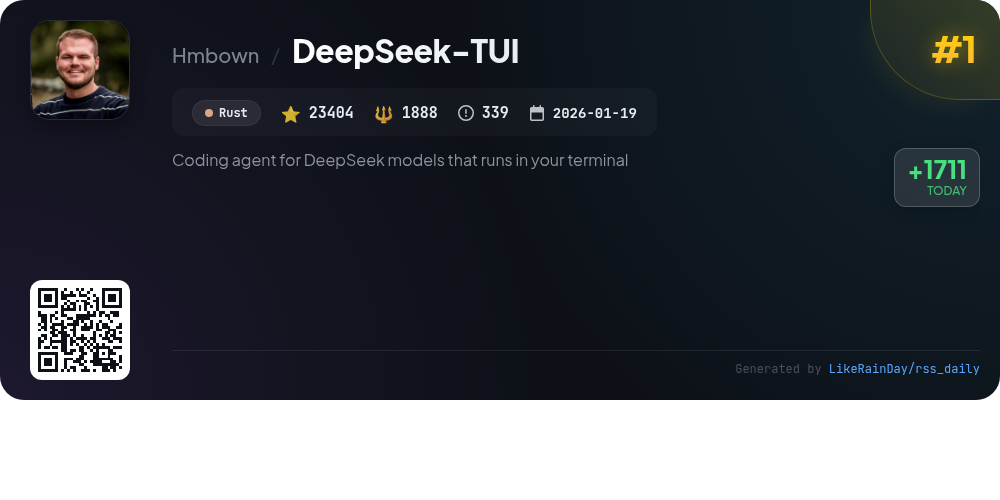
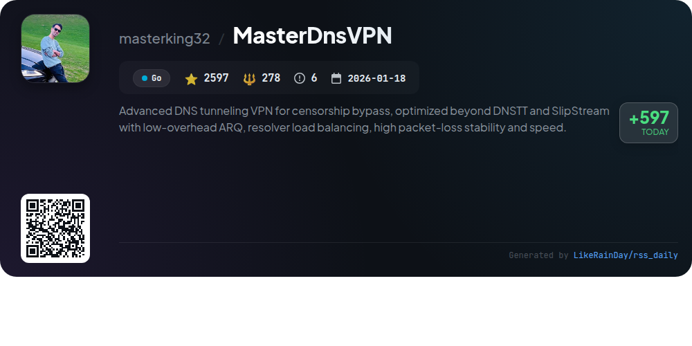
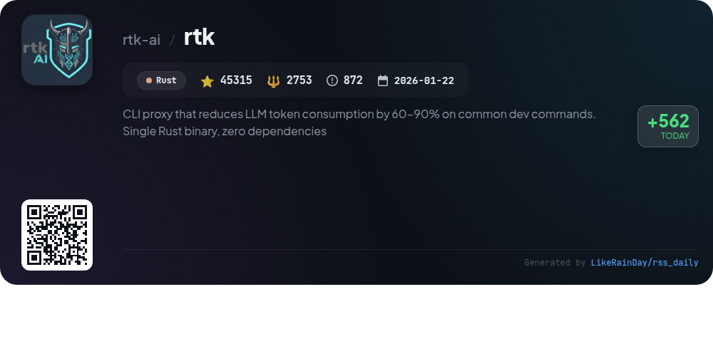
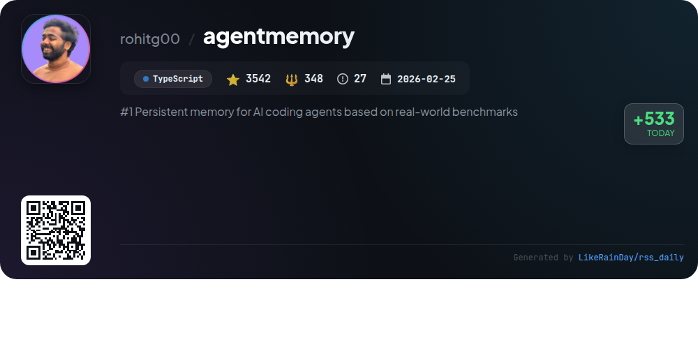

# 📊 🌟 GitHub Trending Daily - 2026-05-10

> > 📅 每日精选 GitHub 热门仓库 | 基于智能算法推荐

## 📋 Overview

**10** 个项目 | **277764** ⭐ | **27480** 🍴

**热门语言:** `TypeScript` (4) · `Rust` (3) · `Kotlin` (1)

**更新时间:** 2026-05-10 03:56 UTC

**分类分布:**

- 🌟 每日 Top 10 精选 (10 项)

---

## 🌟 每日 Top 10 精选

### 1. [DeepSeek-TUI](https://github.com/Hmbown/DeepSeek-TUI)

> 🤖 **推荐理由**  
> *DeepSeek-TUI is a terminal-based coding agent for DeepSeek models, designed to streamline coding tasks. Key features include an auto mode for dynamic model selection, three operational modes (Plan, Agent, YOLO), and a comprehensive tool suite for file operations, shell commands, and git management. It supports 1M-token context windows, live reasoning streaming, session management, and user memory. The project is built in Rust, offering easy installation via npm, Cargo, or Docker, and is localized in multiple languages. With 23,404 stars, it emphasizes efficient coding workflows and enhanced user experience.*

- ⭐ 23404 stars
- 💻 Rust
- 📅 Updated: 2026-05-10

### 2. [cc-switch](https://github.com/farion1231/cc-switch)

> 🤖 **推荐理由**  
> *CC Switch is a cross-platform desktop assistant tool designed to manage multiple CLI tools, including Claude Code, Codex, Gemini CLI, OpenCode, and OpenClaw. With over 65,000 stars on GitHub, it offers a unified interface for configuration management, enabling one-click provider switching and MCP management. Key features include 50+ built-in presets, cloud sync, session management, and a system tray quick switch for seamless operation. Built with Rust and Tauri, it supports Windows, macOS, and Linux, enhancing productivity in AI-powered coding environments.*

- ⭐ 65137 stars
- 💻 Rust
- 📅 Updated: 2026-05-10

### 3. [fanqiang](https://github.com/bannedbook/fanqiang)

> 🤖 **推荐理由**  
> *The "fanqiang" project, with over 45,000 stars, provides comprehensive tools and tutorials for circumventing internet censorship. Developed in Kotlin, it offers resources for various platforms, including Android, iOS, Windows, macOS, and routers. Key features include one-click proxy packages for Chrome, Firefox, and Edge, along with guides for setting up V2Ray and Shadowsocks servers. The project also includes free account access for these services and specialized tutorials for gaming consoles. It aims to help users achieve unrestricted internet access.*

- ⭐ 45045 stars
- 💻 Kotlin
- 📅 Updated: 2026-05-10

### 4. [9router](https://github.com/decolua/9router)

> 🤖 **推荐理由**  
> *9Router is a powerful tool enabling unlimited free AI coding by connecting various AI coding tools (like Claude Code, Codex, Copilot) to over 40 providers. Key features include RTK Token Saver, which reduces token usage by 20-40%, and a smart 3-tier fallback system that ensures seamless transitions between subscription, cheap, and free models, preventing downtime and maximizing resource use. With multi-account support and real-time quota tracking, users can optimize their coding experience while minimizing costs. Ideal for developers seeking efficiency and flexibility in AI-assisted coding.*

- ⭐ 6624 stars
- 💻 JavaScript
- 📅 Updated: 2026-05-10

### 5. [react-doctor](https://github.com/millionco/react-doctor)

> 🤖 **推荐理由**  
> *React Doctor is a TypeScript-based tool designed to analyze and improve React code quality. With over 7,300 stars, it provides a health score (0-100) for your codebase, identifying issues related to state management, performance, security, and accessibility. It supports frameworks like Next.js, Vite, and React Native. Key features include CLI diagnostics, integration with GitHub Actions for automated feedback, and customizable configurations. Additionally, it can teach coding agents best practices to prevent bad code from being written. Contribute and explore more at [react.doctor](https://react.doctor).*

- ⭐ 7338 stars
- 💻 TypeScript
- 📅 Updated: 2026-05-10

### 6. [MasterDnsVPN](https://github.com/masterking32/MasterDnsVPN)

> 🤖 **推荐理由**  
> *MasterDnsVPN is an advanced DNS tunneling VPN designed for censorship evasion, outperforming similar projects like DNSTT and SlipStream. Key features include low-overhead ARQ, resolver load balancing, high-speed data delivery, and exceptional stability under packet loss. Its lightweight architecture supports multipath traffic, automatic resolver health checks, and encrypted data transmission. Additionally, it allows seamless integration with SOCKS5 and Shadowsocks, ensuring versatility for various applications. This project is particularly effective in harsh network conditions and during total internet blackouts.*

- ⭐ 2597 stars
- 💻 Go
- 📅 Updated: 2026-05-10

### 7. [rtk](https://github.com/rtk-ai/rtk)

> 🤖 **推荐理由**  
> *RTK (Rust Token Killer) is a high-performance CLI proxy that significantly reduces LLM token consumption by 60-90% across over 100 common developer commands. Built as a single Rust binary with zero dependencies, RTK filters and compresses command outputs, ensuring minimal overhead (<10ms). Key features include smart filtering of noise, grouping similar outputs, and deduplication of logs. It seamlessly integrates with AI tools like Claude Code and GitHub Copilot, making it ideal for efficient development workflows. Installation is straightforward via Homebrew, Curl, or Cargo.*

- ⭐ 45315 stars
- 💻 Rust
- 📅 Updated: 2026-05-10

### 8. [UI-TARS-desktop](https://github.com/bytedance/UI-TARS-desktop)

> 🤖 **推荐理由**  
> *UI-TARS-desktop is an open-source multimodal AI agent stack designed for seamless human-like task completion. It features a native GUI agent powered by advanced Vision-Language models, enabling natural language control, visual recognition, and precise input handling across platforms (Windows, MacOS, Browser). Key highlights include one-click CLI access, hybrid browser control, real-time feedback, and secure local processing. It supports both local and remote operations, making it versatile for diverse user needs. With over 31,000 stars on GitHub, it is a robust tool for automation and integration with real-world applications.*

- ⭐ 31507 stars
- 💻 TypeScript
- 📅 Updated: 2026-05-10

### 9. [agentmemory](https://github.com/rohitg00/agentmemory)

> 🤖 **推荐理由**  
> *agentmemory is a powerful TypeScript-based solution providing persistent memory for AI coding agents, enabling them to remember context between sessions. With features like automatic observation capture, semantic search, and a real-time viewer, it eliminates repetitive explanations and enhances productivity. Compatible with various agents (Claude Code, Cursor, Codex CLI, etc.), it offers advanced capabilities like knowledge graph extraction, auto-forgetting, and a comprehensive MCP toolkit. With 95.2% retrieval accuracy and 92% fewer tokens used, agentmemory sets a new standard for AI coding memory systems.*

- ⭐ 3542 stars
- 💻 TypeScript
- 📅 Updated: 2026-05-10

### 10. [pi](https://github.com/earendil-works/pi)

> 🤖 **推荐理由**  
> *Pi is an AI agent toolkit that features a coding agent CLI, a unified LLM API for multiple providers (OpenAI, Anthropic, Google), and libraries for terminal and web UIs. Key components include the interactive coding agent CLI, agent runtime for tool management, and Slack automation capabilities. The project encourages sharing OSS coding sessions to enhance real-world application of coding agents. With 47,255 stars on GitHub, Pi is designed for extensibility and ease of use, making it a valuable resource for developers working with AI.*

- ⭐ 47255 stars
- 💻 TypeScript
- 📅 Updated: 2026-05-10

---

## 📡 RSS订阅

通过 RSS 订阅，第一时间获取每日精选项目：

- 🔔 [RSS 订阅源] (../../daily-top.xml)
- 🔔 [每日简报] (../../GITHUB_TODAY_CN.md)
- 🔔 [每日 Top 10 精选](../../daily-top.xml)

---

*⚡ Powered by Smart Trending Algorithm | Generated at 2026-05-10 03:56:02 UTC
