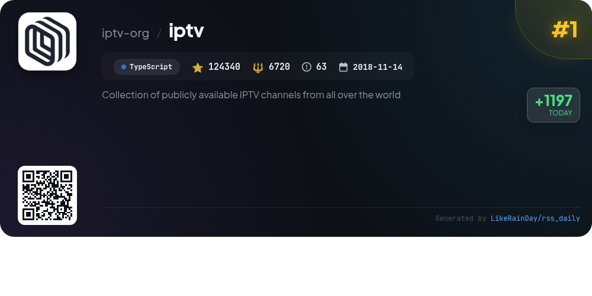
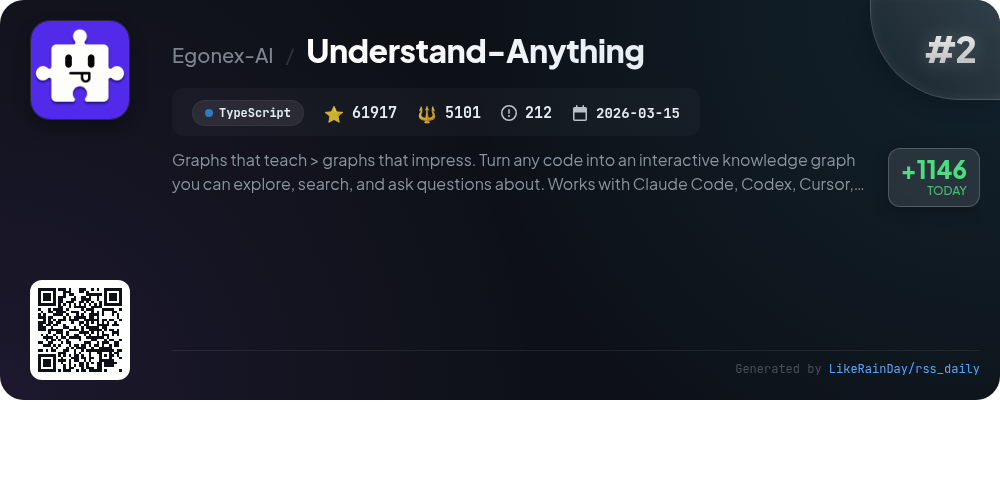
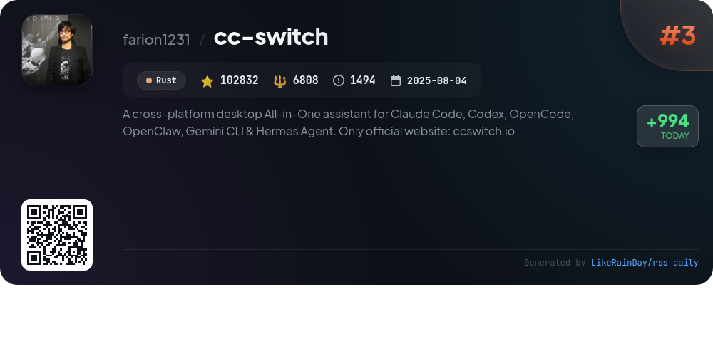
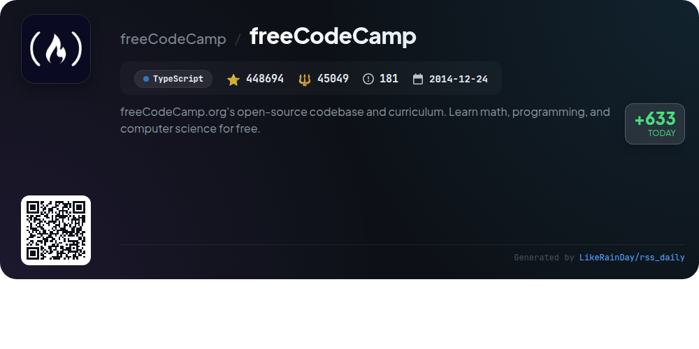
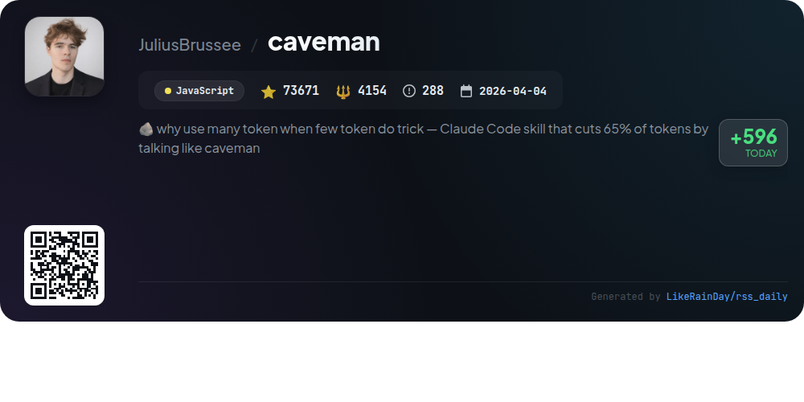
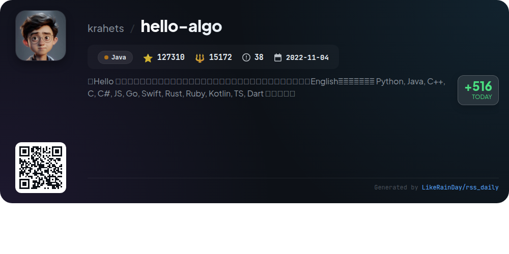
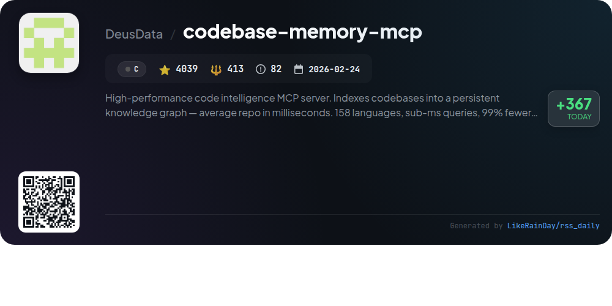
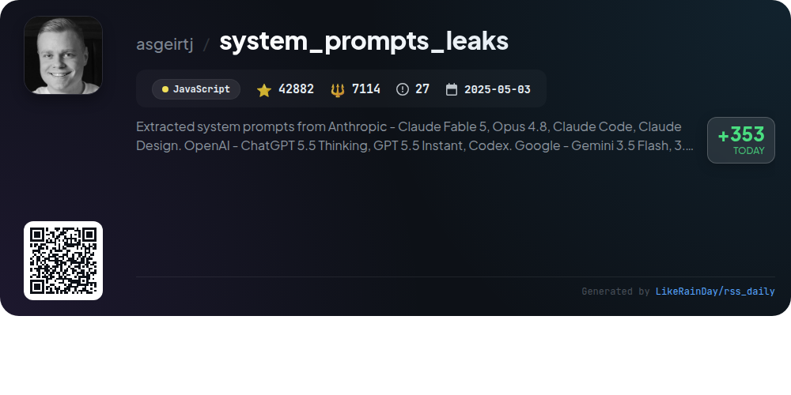

# 📊 🌟 GitHub Trending Daily - 2026-06-17

> > 📅 每日精选 GitHub 热门仓库 | 基于智能算法推荐

## 📋 Overview

**10** 个项目 | **1058376** ⭐ | **98669** 🍴

**热门语言:** `TypeScript` (4) · `Rust` (2) · `JavaScript` (2)

**更新时间:** 2026-06-17 04:52 UTC

**分类分布:**

- 🌟 每日 Top 10 精选 (10 项)

---

## 🌟 每日 Top 10 精选

### 1. [iptv](https://github.com/iptv-org/iptv)

> 🤖 **推荐理由**  
> *The IPTV project is a comprehensive repository of publicly available IPTV channels from around the globe, utilizing TypeScript. With over 124,000 stars, it offers playlists for easy streaming via various video players, an Electronic Program Guide (EPG) for channel scheduling, and a robust API for developers. Users can access the main playlist at https://iptv-org.github.io/iptv/index.m3u, while community discussions, contribution guidelines, and legal information are also provided. This project emphasizes user-contributed links, ensuring a wide selection of content without hosting any video files.*

- ⭐ 124340 stars
- 💻 TypeScript
- 📅 Updated: 2026-06-17

### 2. [Understand-Anything](https://github.com/Egonex-AI/Understand-Anything)

> 🤖 **推荐理由**  
> *Understand-Anything is an open-source tool that transforms codebases into interactive knowledge graphs for exploration and understanding. Compatible with platforms like Claude Code, Codex, and Copilot, it offers features such as guided tours, fuzzy search, impact analysis, and persona-adaptive UI. Users can analyze code structure, visualize architectural layers, and explore business logic, enhancing onboarding and collaboration. With over 61k stars, it emphasizes clarity and comprehension over complexity, making it an essential resource for developers and teams.*

- ⭐ 61917 stars
- 💻 TypeScript
- 📅 Updated: 2026-06-17

### 3. [cc-switch](https://github.com/farion1231/cc-switch)

> 🤖 **推荐理由**  
> *CC Switch is a cross-platform desktop assistant designed to streamline the management of AI coding tools like Claude Code, Codex, Gemini CLI, and more. It features a unified interface for managing multiple providers, with 50+ presets for easy configuration, quick switching from the system tray, and cloud sync capabilities. Key highlights include a unified MCP and Skills management panel, usage tracking, and built-in utilities. Built with Rust and Tauri, it ensures data integrity with atomic writes. Available for Windows, macOS, and Linux, CC Switch enhances productivity by simplifying API management.*

- ⭐ 102832 stars
- 💻 Rust
- 📅 Updated: 2026-06-17

### 4. [freeCodeCamp](https://github.com/freeCodeCamp/freeCodeCamp)

> 🤖 **推荐理由**  
> *freeCodeCamp is an open-source platform offering a comprehensive curriculum to learn programming, math, and computer science for free. With over 448,000 stars on GitHub, it provides an extensive range of interactive coding challenges and certifications in full-stack development, machine learning, and languages. Key features include a supportive community, a forum for help, a YouTube channel with free courses, and resources for job interview preparation. The platform prioritizes academic integrity and encourages contributions from volunteers, helping millions transition into tech careers.*

- ⭐ 448694 stars
- 💻 TypeScript
- 📅 Updated: 2026-06-17

### 5. [caveman](https://github.com/JuliusBrussee/caveman)

> 🤖 **推荐理由**  
> *Caveman is a JavaScript plugin for Claude Code that significantly reduces output tokens by simplifying language while maintaining technical accuracy. It achieves an average of 65% token reduction, enhancing readability and speed. Users can select from different compression levels (lite, full, ultra, wenyan) and utilize commands for various tasks, including generating compact commit messages and one-line PR reviews. Caveman integrates seamlessly with 30+ AI agents, making it a versatile tool for efficient communication in coding and technical documentation.*

- ⭐ 73671 stars
- 💻 JavaScript
- 📅 Updated: 2026-06-17

### 6. [hello-algo](https://github.com/krahets/hello-algo)

> 🤖 **推荐理由**  
> *Hello-algo is an open-source, user-friendly tutorial for data structures and algorithms, featuring animated illustrations and runnable code examples. It supports multiple languages, including Simplified and Traditional Chinese, English, and Japanese, with implementations in Python, Java, C++, C, C#, JavaScript, Go, Swift, Rust, Ruby, Kotlin, TypeScript, and Dart. With over 127,000 stars, this project aims to help beginners grasp algorithmic concepts and improve programming skills through interactive learning and community collaboration.*

- ⭐ 127310 stars
- 💻 Java
- 📅 Updated: 2026-06-17

### 7. [codebase-memory-mcp](https://github.com/DeusData/codebase-memory-mcp)

> 🤖 **推荐理由**  
> *High-performance code intelligence MCP server. Indexes codebases into a persistent knowledge graph — average repo in milliseconds. 158 languages, su. popular project, actively maintained, recently updated*

- ⭐ 4039 stars
- 🍴 413 forks
- 💻 C
- 📅 Updated: 2026-06-17

### 8. [system_prompts_leaks](https://github.com/asgeirtj/system_prompts_leaks)

> 🤖 **推荐理由**  
> *The "system_prompts_leaks" GitHub project documents extracted system prompts from leading AI chatbots, including Anthropic's Claude, OpenAI's ChatGPT, Google's Gemini, and xAI's Grok. With 42,882 stars, it serves as a comprehensive resource for understanding the underlying instructions of various AI models, including Claude Fable 5 and GPT-5.5. The repository is regularly updated, offering detailed insights, comparison diffs, and links to specific model prompts. It is a valuable tool for researchers and developers interested in AI behavior and capabilities.*

- ⭐ 42882 stars
- 💻 JavaScript
- 📅 Updated: 2026-06-17

### 9. [iroh](https://github.com/n0-computer/iroh)

> 🤖 **推荐理由**  
> *Iroh is a modular networking stack in Rust that enables connections via public keys rather than traditional IP addresses. With a focus on performance, it employs hole-punching techniques and a network of public relays to maintain fast connections. Built on QUIC, Iroh supports authenticated encryption and concurrent streams. Key features include pre-built protocols like iroh-blobs for scalable blob transfer, iroh-gossip for publish-subscribe networks, and iroh-docs for a key-value store. The project is well-documented and actively maintained, boasting over 9,300 stars on GitHub.*

- ⭐ 9347 stars
- 💻 Rust
- 📅 Updated: 2026-06-17

### 10. [pi](https://github.com/earendil-works/pi)

> 🤖 **推荐理由**  
> *Pi is an AI agent toolkit offering a unified LLM API, agent loop, terminal UI, and an interactive coding agent CLI, all built in TypeScript. Key features include the multi-provider LLM API supporting OpenAI and Google, a robust agent runtime for tool management, and a coding agent for streamlined development. The project encourages sharing OSS coding sessions to enhance agent capabilities, and supports containerization for security. With a strong community presence and extensive documentation, Pi aims to empower developers in AI-driven coding tasks.*

- ⭐ 63344 stars
- 💻 TypeScript
- 📅 Updated: 2026-06-17

---

## 📡 RSS订阅

通过 RSS 订阅，第一时间获取每日精选项目：

- 🔔 [RSS 订阅源] (../../daily-top.xml)
- 🔔 [每日简报] (../../GITHUB_TODAY_CN.md)
- 🔔 [每日 Top 10 精选](../../daily-top.xml)

---

*⚡ Powered by Smart Trending Algorithm | Generated at 2026-06-17 04:52:04 UTC
