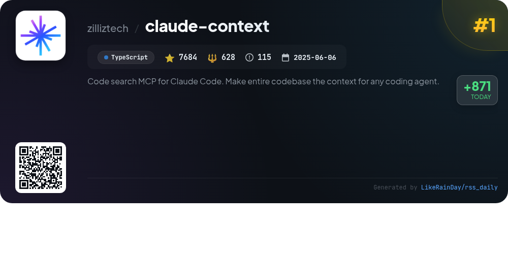
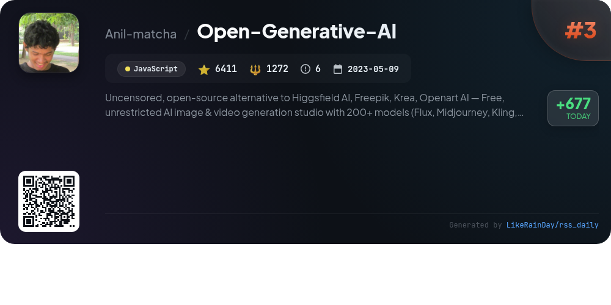
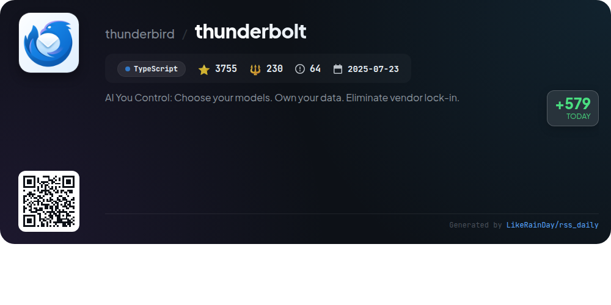
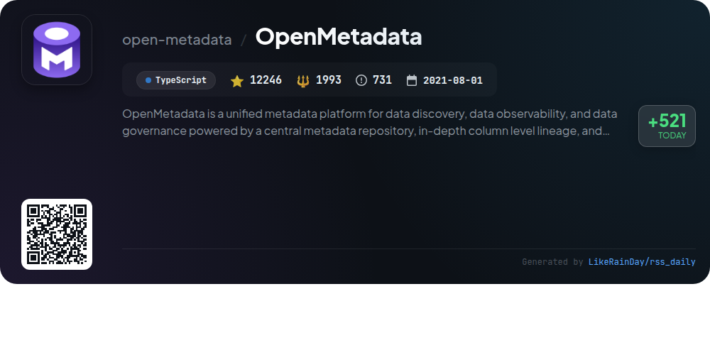
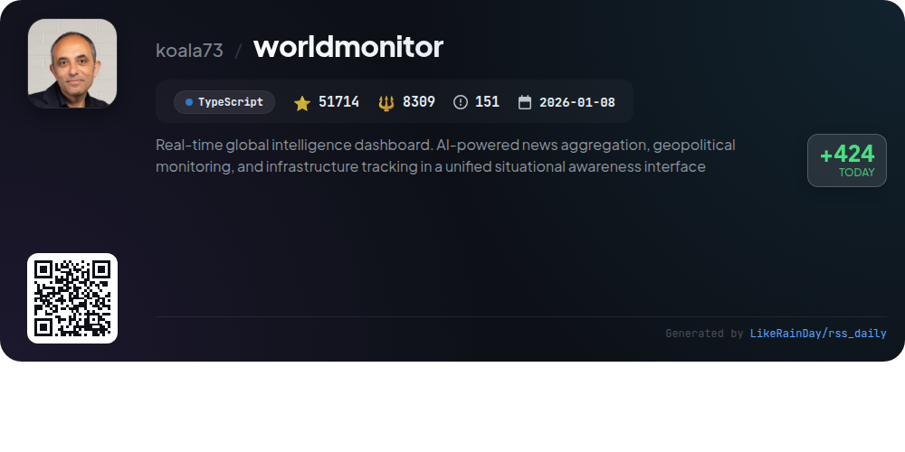
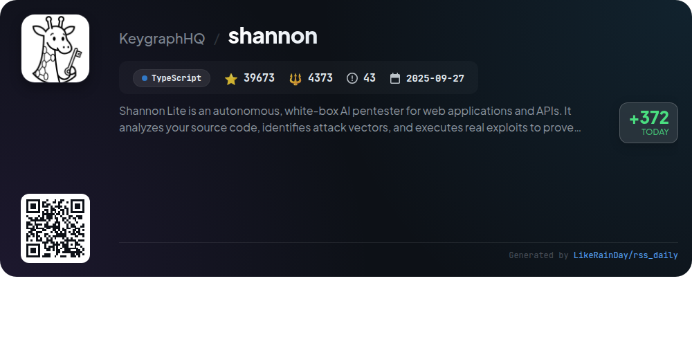
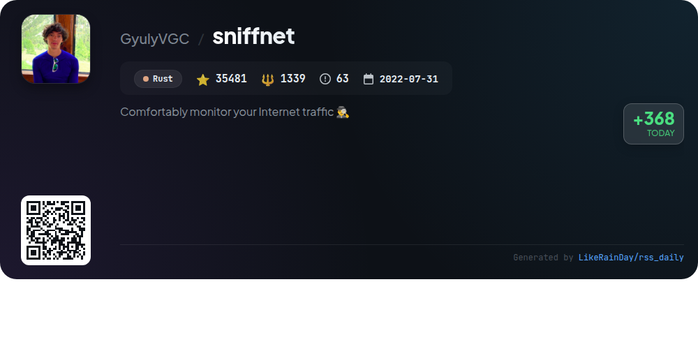

# 📊 🌟 GitHub Trending Daily - 2026-04-23

> > 📅 每日精选 GitHub 热门仓库 | 基于智能算法推荐

## 📋 Overview

**10** 个项目 | **288390** ⭐ | **29766** 🍴

**热门语言:** `TypeScript` (5) · `Rust` (4) · `JavaScript` (1)

**更新时间:** 2026-04-23 03:30 UTC

**分类分布:**

- 🌟 每日 Top 10 精选 (10 项)

---

## 🌟 每日 Top 10 精选

### 1. [claude-context](https://github.com/zilliztech/claude-context)

> 🤖 **推荐理由**  
> *Claude Context is a powerful MCP plugin that enhances coding agents like Claude Code by integrating semantic code search, enabling them to utilize an entire codebase as context. With 7,684 stars on GitHub, it features efficient indexing via a vector database, reducing costs by avoiding full directory loads. Key functionalities include hybrid search capabilities, customizable indexing options, and support for multiple programming languages. Additionally, it provides a VS Code extension for seamless integration, making it ideal for developers seeking intelligent code assistance.*

- ⭐ 7684 stars
- 💻 TypeScript
- 📅 Updated: 2026-04-23

### 2. [rtk](https://github.com/rtk-ai/rtk)

> 🤖 **推荐理由**  
> *RTK is a high-performance CLI proxy that significantly reduces LLM token consumption by 60-90% for over 100 common developer commands, using a single Rust binary with zero dependencies. It offers smart filtering, grouping, truncation, and deduplication to optimize command outputs, resulting in faster and more efficient interactions with AI coding tools. RTK supports integration with various AI platforms and provides an auto-rewrite hook for seamless command execution. Installation is straightforward via Homebrew or direct download, ensuring broad accessibility for developers.*

- ⭐ 32697 stars
- 💻 Rust
- 📅 Updated: 2026-04-23

### 3. [Open-Generative-AI](https://github.com/Anil-matcha/Open-Generative-AI)

> 🤖 **推荐理由**  
> *Open Generative AI is a free, open-source AI image and video generation studio, providing an uncensored alternative to platforms like Higgsfield AI and Freepik. It features 200+ models, including advanced options for text-to-image, image-to-image, text-to-video, and lip sync functionalities. Users can self-host, ensuring data privacy and creative freedom without content filters. The platform includes a workflow studio for building multi-step AI pipelines, a responsive design for desktop and mobile, and local model inference for offline use.*

- ⭐ 6411 stars
- 💻 JavaScript
- 📅 Updated: 2026-04-23

### 4. [cc-switch](https://github.com/farion1231/cc-switch)

> 🤖 **推荐理由**  
> *CC Switch is a cross-platform desktop tool designed to manage multiple AI CLI tools, including Claude Code, Codex, Gemini CLI, OpenCode, and OpenClaw. With over 49,000 stars on GitHub, it offers a user-friendly interface to switch providers effortlessly, eliminating the need for manual configuration. Key features include 50+ built-in provider presets, unified MCP and Skills management, cloud sync capabilities, and a system tray for quick access. Built with Rust and Tauri, CC Switch ensures a reliable experience across Windows, macOS, and Linux platforms.*

- ⭐ 49312 stars
- 💻 Rust
- 📅 Updated: 2026-04-23

### 5. [thunderbolt](https://github.com/thunderbird/thunderbolt)

> 🤖 **推荐理由**  
> *Thunderbolt is an open-source AI client designed for on-prem deployment, targeting enterprise users. Key features include support for various AI models, cross-platform accessibility (web, iOS, Android, Mac, Linux, Windows), and the ability to self-host with Docker. Users can choose their models and maintain data ownership, eliminating vendor lock-in. Thunderbolt is currently under active development, with a focus on security and enterprise readiness. Comprehensive documentation and community support are available to assist users and developers.*

- ⭐ 3755 stars
- 💻 TypeScript
- 📅 Updated: 2026-04-23

### 6. [RuView](https://github.com/ruvnet/RuView)

> 🤖 **推荐理由**  
> *RuView is an innovative WiFi DensePose platform that utilizes commodity WiFi signals for real-time human pose estimation, vital sign monitoring, and presence detection, all without video. Key features include accurate detection of breathing and heart rates, multi-person tracking, and through-wall capabilities. It operates entirely on low-cost ESP32 hardware, enabling edge processing without cloud dependency. The system employs advanced AI techniques such as self-learning and attention mechanisms, ensuring adaptability across various environments. With 54K fps processing speed, RuView is poised for applications in healthcare, security, and smart environments.*

- ⭐ 49417 stars
- 💻 Rust
- 📅 Updated: 2026-04-23

### 7. [OpenMetadata](https://github.com/open-metadata/OpenMetadata)

> 🤖 **推荐理由**  
> *OpenMetadata is a unified metadata platform designed for data discovery, observability, and governance, leveraging a central metadata repository and in-depth column-level lineage. Key features include data discovery through advanced searches, seamless team collaboration via notifications and tasks, data quality monitoring with no-code tests, and comprehensive data governance capabilities. The platform supports over 84 connectors for diverse data services, enabling efficient metadata management. OpenMetadata empowers organizations to enhance data value while ensuring security and compliance.*

- ⭐ 12246 stars
- 💻 TypeScript
- 📅 Updated: 2026-04-23

### 8. [worldmonitor](https://github.com/koala73/worldmonitor)

> 🤖 **推荐理由**  
> *World Monitor is a real-time global intelligence dashboard that combines AI-powered news aggregation, geopolitical monitoring, and infrastructure tracking into a unified interface. Key features include over 500 curated news feeds, dual map engines with 3D and flat maps, cross-stream correlation of military, economic, and disaster signals, and a comprehensive Country Intelligence Index. It offers five site variants, a native desktop app for multiple platforms, and supports 21 languages. With a robust tech stack and numerous data sources, World Monitor provides extensive situational awareness and analytics.*

- ⭐ 51714 stars
- 💻 TypeScript
- 📅 Updated: 2026-04-23

### 9. [shannon](https://github.com/KeygraphHQ/shannon)

> 🤖 **推荐理由**  
> *Shannon Lite is an autonomous AI pentester for web applications and APIs, designed to identify and exploit vulnerabilities before deployment. Key features include fully autonomous operation, reproducible proof-of-concept exploits, and OWASP vulnerability coverage (e.g., injection, XSS). Shannon analyzes source code, conducts live exploitation, and generates actionable reports with validated findings. It offers a local testing environment (AGPL-3.0) and is ideal for organizations aiming to close security gaps with on-demand testing. Shannon Pro, a commercial version, combines advanced SAST, SCA, and pentesting capabilities for integrated application security.*

- ⭐ 39673 stars
- 💻 TypeScript
- 📅 Updated: 2026-04-23

### 10. [sniffnet](https://github.com/GyulyVGC/sniffnet)

> 🤖 **推荐理由**  
> *Comfortably monitor your Internet traffic 🕵️‍♂️. popular project, actively maintained, recently updated*

- ⭐ 35481 stars
- 🍴 1339 forks
- 💻 Rust
- 📅 Updated: 2026-04-23

---

## 📡 RSS订阅

通过 RSS 订阅，第一时间获取每日精选项目：

- 🔔 [RSS 订阅源] (../../daily-top.xml)
- 🔔 [每日简报] (../../GITHUB_TODAY_CN.md)
- 🔔 [每日 Top 10 精选](../../daily-top.xml)

---

*⚡ Powered by Smart Trending Algorithm | Generated at 2026-04-23 03:30:05 UTC
