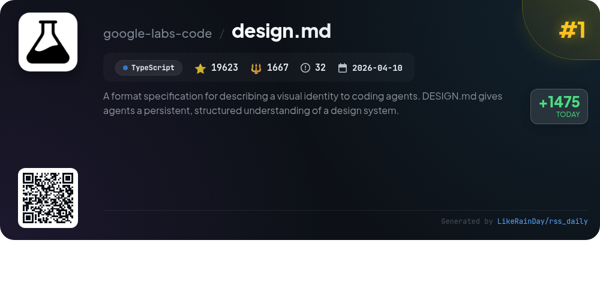
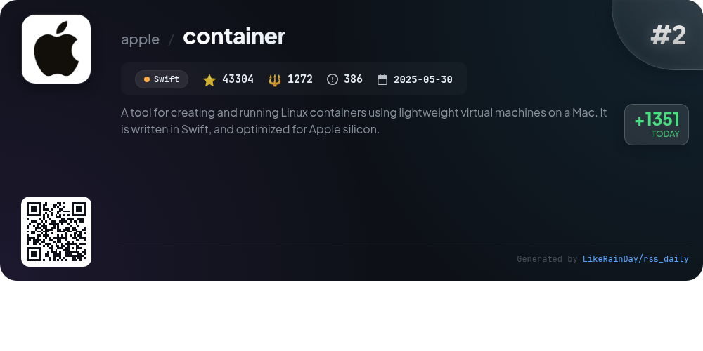
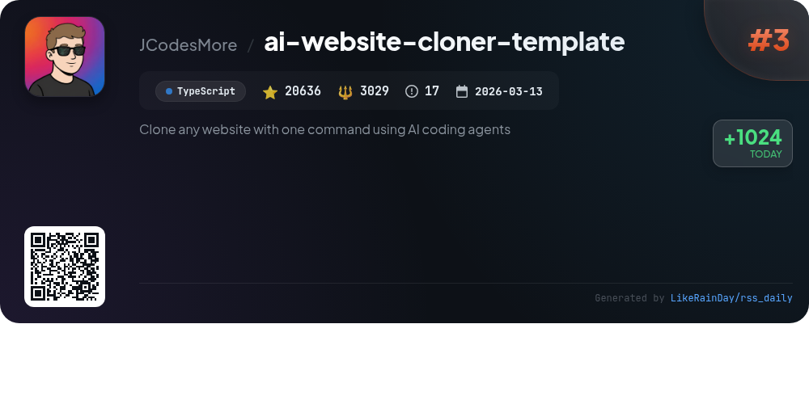
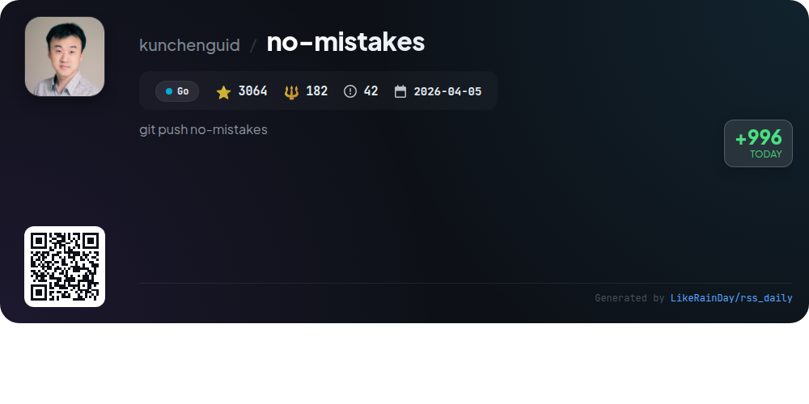
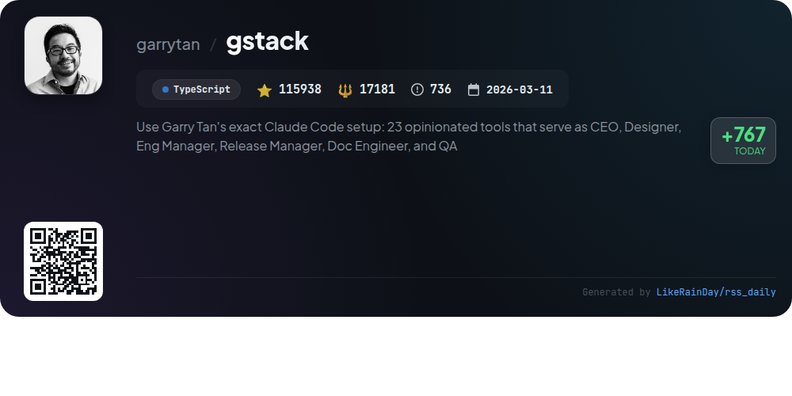
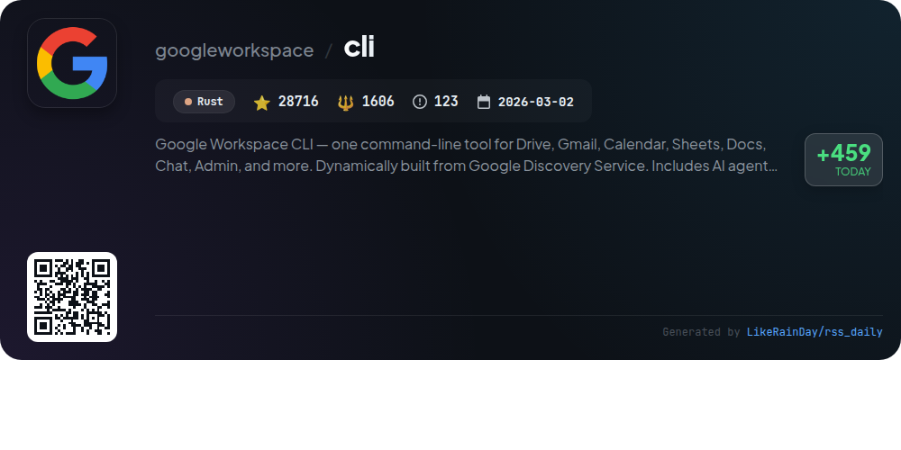

# 📊 🌟 GitHub Trending Daily - 2026-06-26

> > 📅 每日精选 GitHub 热门仓库 | 基于智能算法推荐

## 📋 Overview

**10** 个项目 | **584130** ⭐ | **67702** 🍴

**热门语言:** `TypeScript` (4) · `Rust` (2) · `JavaScript` (1)

**更新时间:** 2026-06-26 04:17 UTC

**分类分布:**

- 🌟 每日 Top 10 精选 (10 项)

---

## 🌟 每日 Top 10 精选

### 1. [design.md](https://github.com/google-labs-code/design.md)

> 🤖 **推荐理由**  
> *DESIGN.md is a TypeScript-based format specification for defining visual identities for coding agents, combining machine-readable design tokens with human-readable design rationale. It allows agents to understand a design system thoroughly. Key features include linting for structural correctness, token comparison, and exporting to various formats like Tailwind and DTCG. The platform supports validation of design tokens, checks WCAG compliance, and facilitates tracking changes between design versions. With over 19,600 stars, DESIGN.md is positioned as a robust tool for modern design systems.*

- ⭐ 19623 stars
- 💻 TypeScript
- 📅 Updated: 2026-06-26

### 2. [container](https://github.com/apple/container)

> 🤖 **推荐理由**  
> *`container` is a Swift-based tool for creating and running Linux containers as lightweight virtual machines on Mac, optimized for Apple silicon. It supports OCI-compatible container images, allowing users to pull, run, and push images from standard registries. Key features include easy installation, upgrade/downgrade scripts, and a guided tour for building and publishing containers. Active development ensures ongoing enhancements, with contributions encouraged. The project leverages Apple’s Containerization package for efficient management of containers and images.*

- ⭐ 43304 stars
- 💻 Swift
- 📅 Updated: 2026-06-26

### 3. [ai-website-cloner-template](https://github.com/JCodesMore/ai-website-cloner-template)

> 🤖 **推荐理由**  
> *AI Website Cloner Template enables users to reverse-engineer any website into a modern Next.js codebase with a single command. Utilizing AI coding agents, this template inspects a target URL to extract design tokens, assets, and component specifications, facilitating a streamlined rebuilding process. Key features include support for various AI agents, a detailed multi-phase cloning pipeline, and a focus on clean, maintainable code. Ideal for platform migrations, recovering lost code, or learning from existing websites, it emphasizes ethical usage and compliance with terms of service.*

- ⭐ 20636 stars
- 💻 TypeScript
- 📅 Updated: 2026-06-26

### 4. [no-mistakes](https://github.com/kunchenguid/no-mistakes)

> 🤖 **推荐理由**  
> *`no-mistakes` is a Go-based Git proxy tool designed to streamline code submissions by ensuring clean pull requests. It operates by launching a disposable worktree for every push to `no-mistakes`, running an AI-driven validation pipeline, and only forwarding to the remote once all checks pass. Key features include non-blocking operation, support for multiple AI agents, and the ability to auto-fix issues while allowing developer oversight. It simplifies workflow with commands like `git push no-mistakes` and integrates with coding agents to enhance productivity. Full documentation is available online.*

- ⭐ 3064 stars
- 💻 Go
- 📅 Updated: 2026-06-26

### 5. [gstack](https://github.com/garrytan/gstack)

> 🤖 **推荐理由**  
> *gstack is an open-source project designed to enhance productivity for tech founders and engineers, leveraging AI to replicate a full team of specialists. With 23 unique tools, gstack facilitates roles such as CEO, Designer, and QA, streamlining processes from ideation to deployment. Key features include automated reviews, real-time debugging, and comprehensive documentation updates. It integrates seamlessly with Claude Code and supports multiple AI agents. This innovative setup allows users to ship products efficiently, transforming how software is built and managed.*

- ⭐ 115938 stars
- 💻 TypeScript
- 📅 Updated: 2026-06-26

### 6. [cc-switch](https://github.com/farion1231/cc-switch)

> 🤖 **推荐理由**  
> *CC Switch is a cross-platform desktop application designed to manage multiple AI coding tools, including Claude Code, Codex, and Gemini CLI, all from a single interface. Key features include over 50 provider presets for easy switching, unified management of MCP and skills, cloud sync across devices, and a system tray quick-switch option. Built with Rust and Tauri, it ensures reliable configuration through atomic writes. With extensive tracking for usage and costs, CC Switch streamlines AI-assisted programming, making it an essential tool for developers. Visit ccswitch.io for more details.*

- ⭐ 108596 stars
- 💻 Rust
- 📅 Updated: 2026-06-26

### 7. [codebase-memory-mcp](https://github.com/DeusData/codebase-memory-mcp)

> 🤖 **推荐理由**  
> *High-performance code intelligence MCP server. Indexes codebases into a persistent knowledge graph — average repo in milliseconds. 158 languages, su. popular project, actively maintained, recently updated*

- ⭐ 14883 stars
- 🍴 1094 forks
- 💻 C
- 📅 Updated: 2026-06-26

### 8. [orca](https://github.com/stablyai/orca)

> 🤖 **推荐理由**  
> *Orca is an advanced development environment (ADE) designed for managing a fleet of parallel coding agents, compatible with desktop and mobile platforms. Key features include parallel worktrees for running multiple agents simultaneously, a mobile companion for remote monitoring, and integrated GitHub & Linear task management. Users can leverage powerful terminal splits, design mode for UI elements, and SSH support for remote operations. With over 7,500 stars on GitHub, Orca is ideal for developers seeking to streamline their workflows and enhance productivity.*

- ⭐ 7567 stars
- 💻 TypeScript
- 📅 Updated: 2026-06-26

### 9. [ECC](https://github.com/affaan-m/ECC)

> 🤖 **推荐理由**  
> *ECC is a powerful performance optimization system designed for AI agents, integrating skills, instincts, memory, and security into workflows across platforms like Claude Code, Codex, and Cursor. With over 221,000 stars, it features 67 specialized agents, 271 skills, and extensive support for multiple programming languages. Key highlights include continuous learning capabilities, a security auditor (AgentShield), and a user-friendly dashboard for managing components. ECC enables seamless automation and optimization in coding, testing, and deployment tasks, enhancing productivity and code quality.*

- ⭐ 221803 stars
- 💻 JavaScript
- 📅 Updated: 2026-06-26

### 10. [cli](https://github.com/googleworkspace/cli)

> 🤖 **推荐理由**  
> *Google Workspace CLI (gws) is a command-line tool designed for seamless interaction with Google Workspace APIs, including Drive, Gmail, Calendar, Sheets, and Docs. Built dynamically from Google's Discovery Service, it allows real-time command generation as new APIs are added. Key features include structured JSON outputs, over 40 AI agent skills for automated workflows, and a user-friendly authentication process. With zero boilerplate code, it simplifies operations for both humans and AI agents, making it an essential tool for efficient Workspace management.*

- ⭐ 28716 stars
- 💻 Rust
- 📅 Updated: 2026-06-26

---

## 📡 RSS订阅

通过 RSS 订阅，第一时间获取每日精选项目：

- 🔔 [RSS 订阅源] (../../daily-top.xml)
- 🔔 [每日简报] (../../GITHUB_TODAY_CN.md)
- 🔔 [每日 Top 10 精选](../../daily-top.xml)

---

*⚡ Powered by Smart Trending Algorithm | Generated at 2026-06-26 04:17:00 UTC
