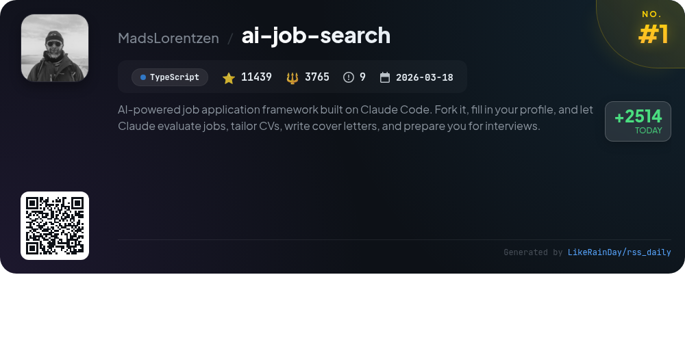
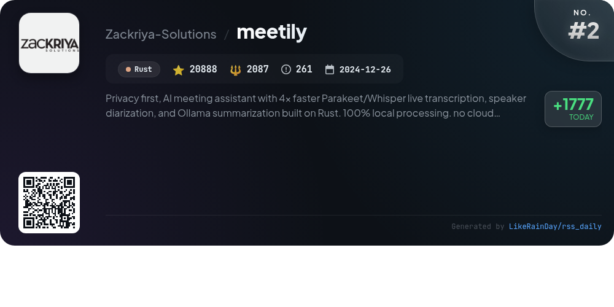
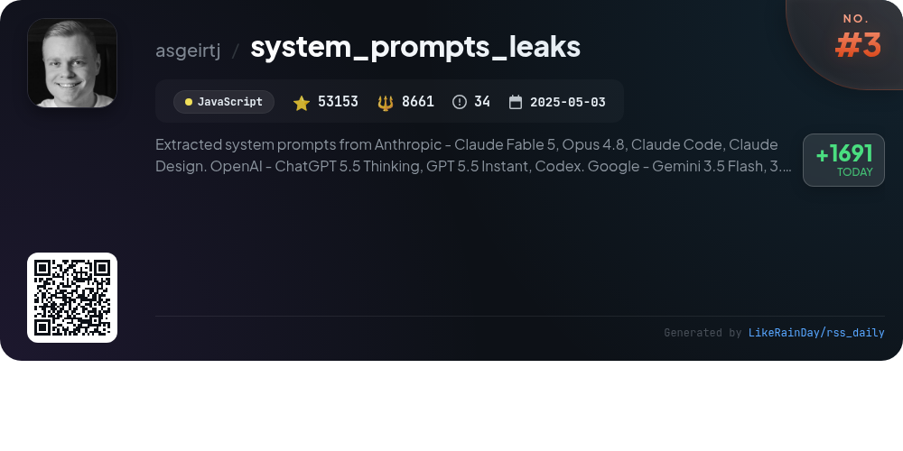
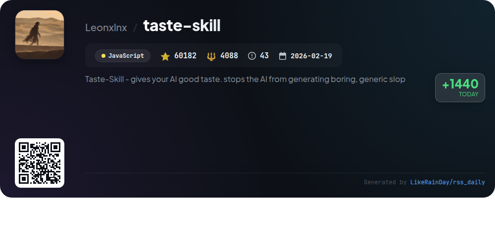
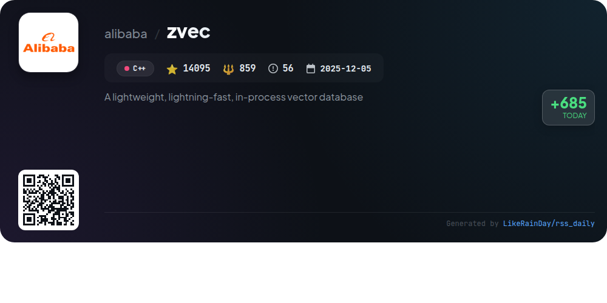
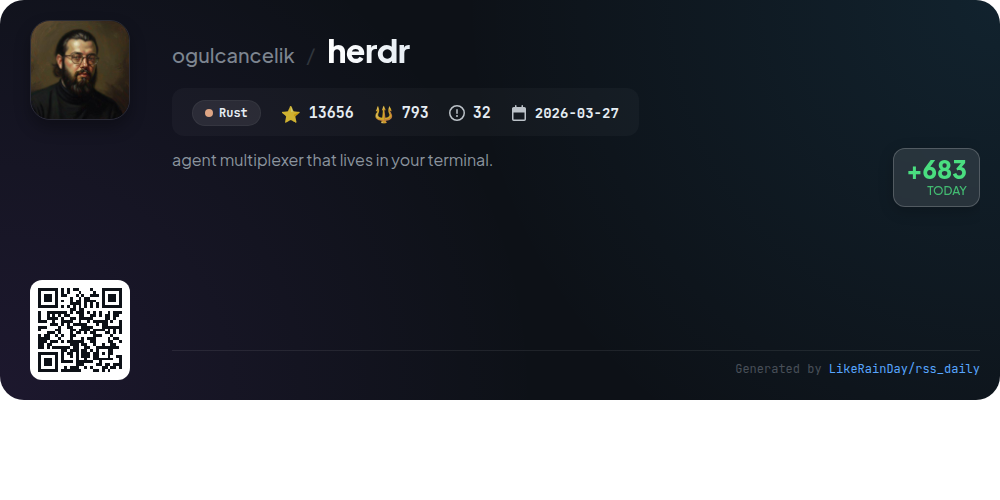
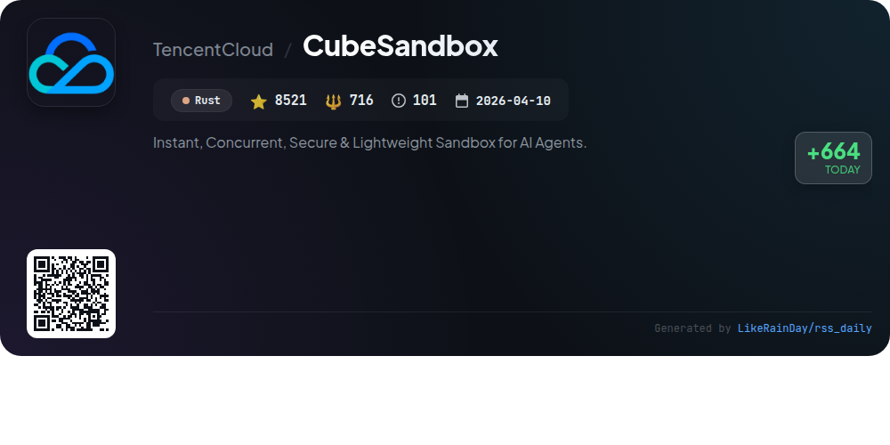
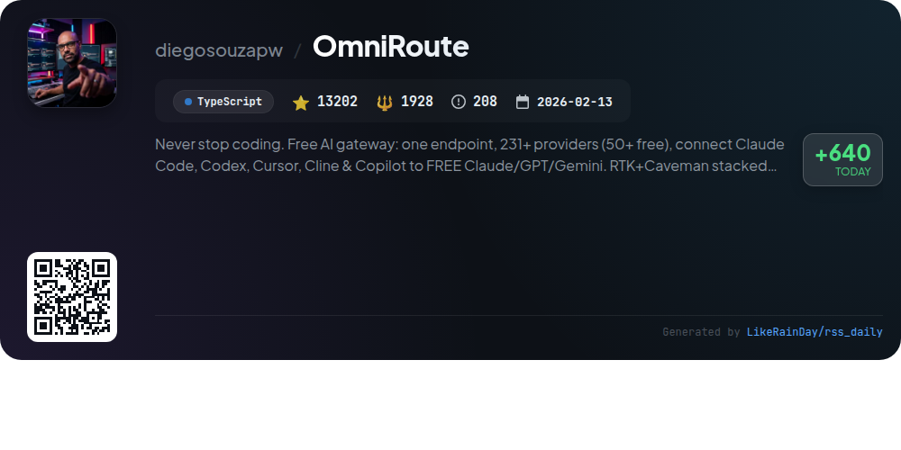
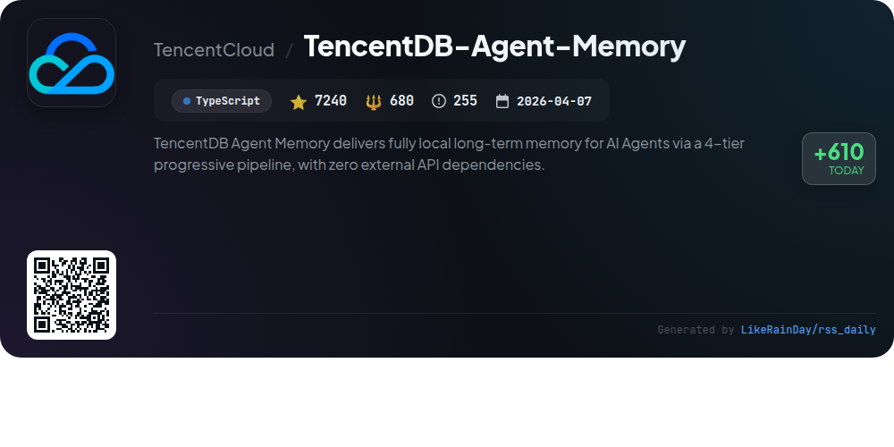

# 📊 🌟 GitHub Trending Daily - 2026-07-08

> > 📅 每日精选 GitHub 热门仓库 | 基于智能算法推荐

## 📋 Overview

**10** 个项目 | **280955** ⭐ | **34150** 🍴

**热门语言:** `Rust` (4) · `TypeScript` (3) · `JavaScript` (2)

**更新时间:** 2026-07-08 03:28 UTC

**分类分布:**

- 🌟 每日 Top 10 精选 (10 项)

---

## 🌟 每日 Top 10 精选

### 1. [ai-job-search](https://github.com/MadsLorentzen/ai-job-search)

> 🤖 **推荐理由**  
> *The **ai-job-search** project is an AI-driven job application framework using Claude Code. With over 11,400 stars, it enables users to streamline their job search by filling out a profile, which Claude then uses to evaluate job postings, tailor CVs, write cover letters, and prepare for interviews. Key features include a structured workflow for job evaluation, a drafter-reviewer application process, and support for multiple job portals, specifically in Denmark. The tool is customizable, allowing users to add templates and job portals, and it emphasizes ATS compatibility for CVs.*

- ⭐ 11439 stars
- 💻 TypeScript
- 📅 Updated: 2026-07-08

### 2. [meetily](https://github.com/Zackriya-Solutions/meetily)

> 🤖 **推荐理由**  
> *Meetily is a privacy-first, AI meeting assistant designed for macOS and Windows, offering local processing with no reliance on cloud services. It features 4x faster live transcription using Parakeet/Whisper, speaker diarization, and AI-driven summaries via Ollama. Built on Rust, this open-source tool ensures data sovereignty and compliance, making it ideal for enterprises. Key highlights include real-time transcription, customizable AI provider support, and GPU acceleration. Meetily PRO enhances functionality with advanced exports and team features, catering to professionals seeking high accuracy and control.*

- ⭐ 20888 stars
- 💻 Rust
- 📅 Updated: 2026-07-08

### 3. [system_prompts_leaks](https://github.com/asgeirtj/system_prompts_leaks)

> 🤖 **推荐理由**  
> *The "system_prompts_leaks" GitHub project documents extracted system prompts from various leading AI chatbots, including Anthropic's Claude, OpenAI's ChatGPT, Google's Gemini, and xAI's Grok. With over 53,000 stars, it offers insights into the underlying instructions that guide these models. The repository is regularly updated, showcasing recent changes and providing access to prompts for multiple models and services. Key features include detailed documentation, version comparisons, and integration information, making it a valuable resource for AI developers and researchers.*

- ⭐ 53153 stars
- 💻 JavaScript
- 📅 Updated: 2026-07-08

### 4. [taste-skill](https://github.com/Leonxlnx/taste-skill)

> 🤖 **推荐理由**  
> *Taste-Skill is a JavaScript-based framework designed to enhance AI-generated frontends, ensuring they are visually appealing and diverse rather than generic. With over 60,000 stars on GitHub, it offers a variety of portable Agent Skills, including design, image generation, and UI improvement functionalities. Key features include customizable dials for design variance, motion intensity, and visual density, alongside specialized skills for image-to-code workflows and redesigning existing projects. This framework is compatible with major coding agents, making it a versatile tool for developers aiming for high-quality UI design.*

- ⭐ 60182 stars
- 💻 JavaScript
- 📅 Updated: 2026-07-08

### 5. [RuView](https://github.com/ruvnet/RuView)

> 🤖 **推荐理由**  
> *RuView is a cutting-edge WiFi sensing platform that transforms commodity WiFi signals into real-time spatial intelligence, vital sign monitoring, and presence detection, all without cameras or wearables. It utilizes Channel State Information (CSI) from low-cost ESP32 nodes to detect people, monitor breathing and heart rates, and track movements through walls and in darkness. Compatible with major smart-home ecosystems like Home Assistant, Apple Home, Google Home, and Alexa, it offers seamless integration and privacy-friendly operation. Key features include presence and occupancy detection, vital sign monitoring, and activity recognition, making it ideal for healthcare, smart homes, and security applications.*

- ⭐ 78579 stars
- 💻 Rust
- 📅 Updated: 2026-07-08

### 6. [zvec](https://github.com/alibaba/zvec)

> 🤖 **推荐理由**  
> *Zvec is a lightweight, in-process vector database designed for high-performance similarity search. With over 14,000 stars on GitHub, it offers features like native full-text search (FTS), hybrid retrieval combining vector and text queries, and a durable storage mechanism. Zvec supports both dense and sparse vectors, provides seamless installation via multiple SDKs (Python, Node.js, Go, Rust, and Dart), and operates across various platforms. Its efficient architecture and low-latency performance make it ideal for production environments, enabling rapid queries on large datasets.*

- ⭐ 14095 stars
- 💻 C++
- 📅 Updated: 2026-07-08

### 7. [herdr](https://github.com/ogulcancelik/herdr)

> 🤖 **推荐理由**  
> *Herdr is a powerful terminal-based agent multiplexer built in Rust, boasting over 13,000 stars on GitHub. It provides real-time visibility of agents' statuses—blocked, working, or done—and allows for seamless detachment and reattachment of sessions, even over SSH. With a pure socket API, agents can interact and manage output efficiently. It supports both keyboard and mouse inputs, offers plugin extensibility, and requires only a single Rust binary for operation. Comprehensive documentation and quick-start guides are available at herdr.dev.*

- ⭐ 13656 stars
- 💻 Rust
- 📅 Updated: 2026-07-08

### 8. [CubeSandbox](https://github.com/TencentCloud/CubeSandbox)

> 🤖 **推荐理由**  
> *CubeSandbox is a high-performance, secure sandbox service for AI agents, built in Rust. It offers instant, concurrent, and lightweight environments with a sub-60ms startup time and less than 5MB memory overhead. Key features include hardware-level isolation, seamless E2B compatibility, automatic sandbox pause/resume, and a web-based management console. Enhanced security is provided through a credential vault and egress control. CubeSandbox supports both single-node and multi-node deployments, making it ideal for running multiple AI agents efficiently.*

- ⭐ 8521 stars
- 💻 Rust
- 📅 Updated: 2026-07-08

### 9. [OmniRoute](https://github.com/diegosouzapw/OmniRoute)

> 🤖 **推荐理由**  
> *OmniRoute is a powerful, free AI gateway that connects over 237 providers, including Claude, Codex, and Copilot, through a single endpoint. Key features include automatic fallback to prevent service interruptions, smart token compression saving 15-95% on usage, and support for 90+ free tiers. It offers a user-friendly dashboard for tracking free token usage, integrates seamlessly with various coding tools, and ensures production-grade reliability with built-in security measures. OmniRoute is designed for developers seeking cost-effective, efficient access to AI resources.*

- ⭐ 13202 stars
- 💻 TypeScript
- 📅 Updated: 2026-07-08

### 10. [TencentDB-Agent-Memory](https://github.com/TencentCloud/TencentDB-Agent-Memory)

> 🤖 **推荐理由**  
> *TencentDB-Agent-Memory provides a robust local long-term memory solution for AI agents, utilizing a unique 4-tier architecture that integrates symbolic short-term memory with layered long-term memory. This approach enhances task success and reduces token usage by up to 61.38%. Key features include automatic conversation capture, structured persona generation, and memory recall, all designed to minimize evidence loss while ensuring traceability. It supports integration with OpenClaw and Hermes, offering a production-ready environment with a local SQLite backend and hybrid retrieval capabilities.*

- ⭐ 7240 stars
- 💻 TypeScript
- 📅 Updated: 2026-07-08

---

## 📡 RSS订阅

通过 RSS 订阅，第一时间获取每日精选项目：

- 🔔 [RSS 订阅源] (../../daily-top.xml)
- 🔔 [每日简报] (../../GITHUB_TODAY_CN.md)
- 🔔 [每日 Top 10 精选](../../daily-top.xml)

---

*⚡ Powered by Smart Trending Algorithm | Generated at 2026-07-08 03:28:10 UTC
