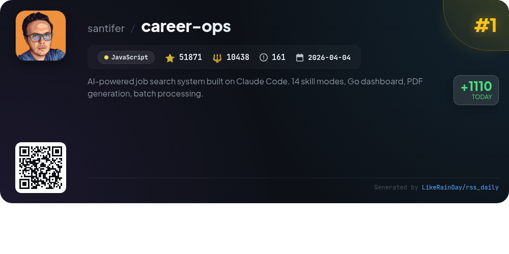
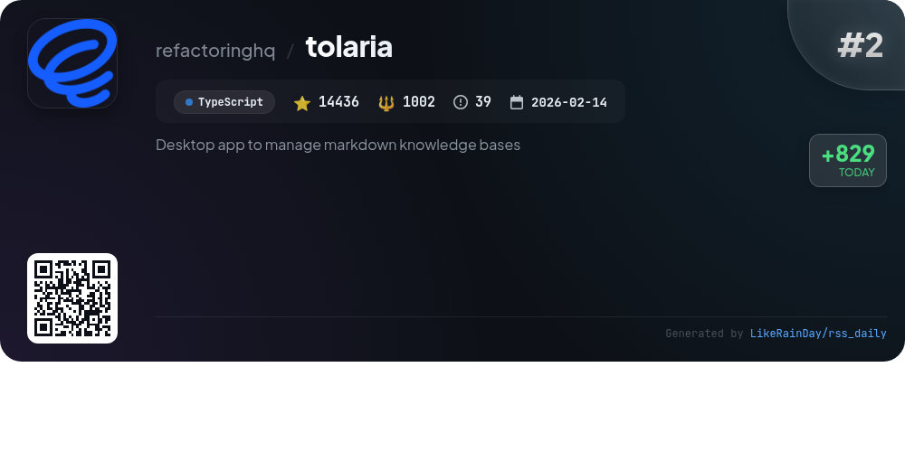
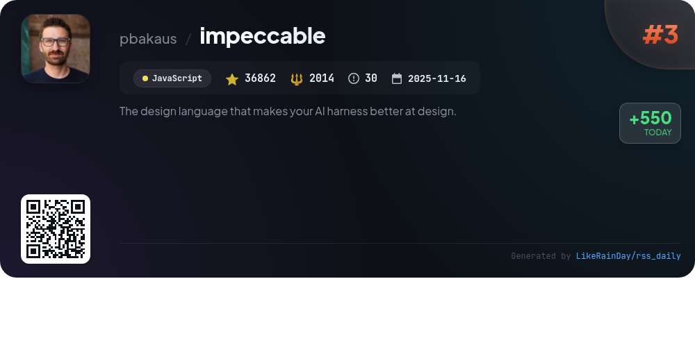
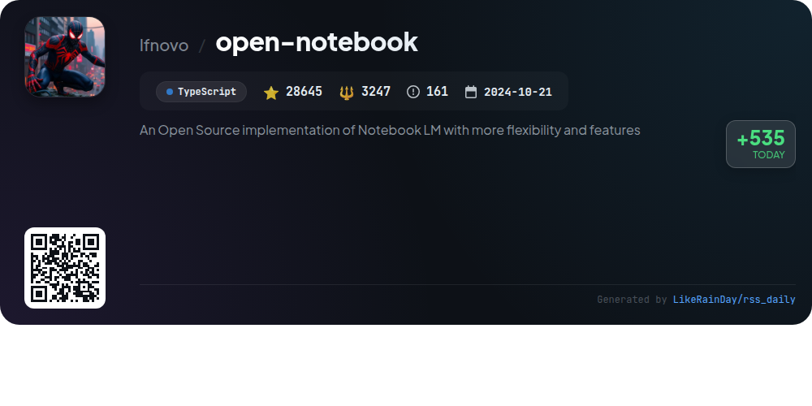
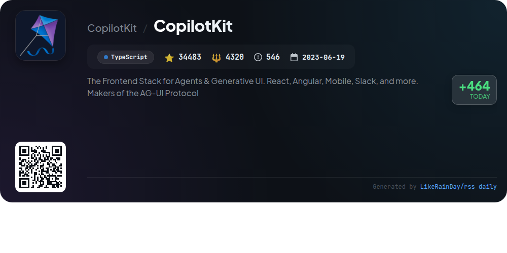
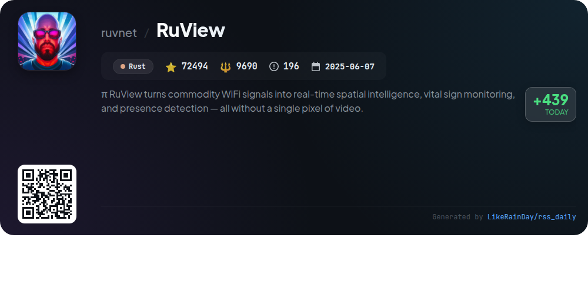
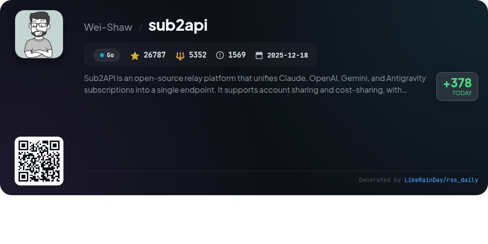
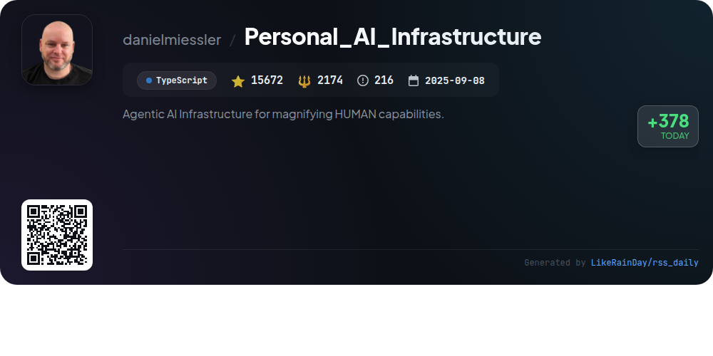

# 📊 🌟 GitHub Trending Daily - 2026-06-10

> > 📅 每日精选 GitHub 热门仓库 | 基于智能算法推荐

## 📋 Overview

**10** 个项目 | **349886** ⭐ | **46370** 🍴

**热门语言:** `TypeScript` (5) · `Rust` (2) · `JavaScript` (2)

**更新时间:** 2026-06-10 04:20 UTC

**分类分布:**

- 🌟 每日 Top 10 精选 (10 项)

---

## 🌟 每日 Top 10 精选

### 1. [career-ops](https://github.com/santifer/career-ops)

> 🤖 **推荐理由**  
> *Career-Ops is an AI-powered job search platform designed to streamline the application process. Key features include a structured A-F scoring system for job evaluations, tailored ATS-optimized PDF CV generation, and batch processing of multiple job offers. It integrates with over 45 job portals for automatic scanning and provides a terminal dashboard for pipeline management. The system emphasizes personalized assistance, ensuring candidates can effectively filter opportunities and enhance their job search strategy. With over 51,000 stars on GitHub, it is a valuable tool for job seekers.*

- ⭐ 51871 stars
- 💻 JavaScript
- 📅 Updated: 2026-06-10

### 2. [tolaria](https://github.com/refactoringhq/tolaria)

> 🤖 **推荐理由**  
> *Tolaria is a powerful open-source desktop application for managing markdown knowledge bases on macOS, Windows, and Linux. With over 14,000 stars on GitHub, it emphasizes a files-first and Git-first approach, ensuring users retain full control over their data. Key features include offline functionality, a keyboard-first interface, and AI integration, allowing seamless interaction with AI agents. Users can easily organize personal notes, company documentation, and more without vendor lock-in. Tolaria is designed for efficiency, addressing real user needs with a focus on portability and accessibility.*

- ⭐ 14436 stars
- 💻 TypeScript
- 📅 Updated: 2026-06-10

### 3. [impeccable](https://github.com/pbakaus/impeccable)

> 🤖 **推荐理由**  
> *Impeccable is a design language tool for AI coding agents, offering 23 commands and 41 deterministic detector rules to enhance frontend design quality. Key features include a streamlined setup with `/impeccable init`, a shared design vocabulary for collaborative commands, and live browser iteration for visual refinement. It supports multiple AI coding tools like Claude, Cursor, and Codex. The CLI also enables standalone design audits and anti-pattern detection, ensuring adherence to best practices. Visit impeccable.style for documentation and case studies.*

- ⭐ 36862 stars
- 💻 JavaScript
- 📅 Updated: 2026-06-10

### 4. [open-notebook](https://github.com/lfnovo/open-notebook)

> 🤖 **推荐理由**  
> *Open Notebook is an open-source, privacy-focused alternative to Google's Notebook LM, empowering users to manage their research with enhanced flexibility. Key features include support for 18+ AI models (OpenAI, Anthropic, etc.), multi-modal content organization (PDFs, videos, etc.), advanced podcast generation, intelligent full-text and vector search, and context-aware AI chat. With a self-hosted architecture, users retain data control while benefiting from customizable REST API access and multi-language support. Join the community for support and feature suggestions.*

- ⭐ 28645 stars
- 💻 TypeScript
- 📅 Updated: 2026-06-10

### 5. [goose](https://github.com/aaif-goose/goose)

> 🤖 **推荐理由**  
> *goose is an open-source AI agent designed for diverse tasks beyond code suggestions, including research, writing, and data analysis. Available as a native desktop app for macOS, Linux, and Windows, it features a CLI for terminal workflows and an API for integration. Built in Rust, goose supports over 15 providers like OpenAI and Google and connects with 70+ extensions via the Model Context Protocol. Now under the Agentic AI Foundation at the Linux Foundation, goose emphasizes performance, extensibility, and community engagement through resources like tutorials and a Discord channel.*

- ⭐ 48557 stars
- 💻 Rust
- 📅 Updated: 2026-06-10

### 6. [CopilotKit](https://github.com/CopilotKit/CopilotKit)

> 🤖 **推荐理由**  
> *CopilotKit is a versatile SDK for building agent-native applications across multiple platforms, including React, Angular, Vue, and mobile. It supports Generative UI, shared state, and human-in-the-loop workflows, enabling seamless integration into web apps and chat platforms like Slack and Microsoft Teams. Key features include a customizable chat interface, backend tool rendering, and self-learning agents that improve through user interactions. Backed by the AG-UI Protocol, CopilotKit ensures a unified experience for developers and users alike, facilitating quick deployment and extensive customization.*

- ⭐ 34483 stars
- 💻 TypeScript
- 📅 Updated: 2026-06-10

### 7. [RuView](https://github.com/ruvnet/RuView)

> 🤖 **推荐理由**  
> *RuView is a cutting-edge WiFi sensing platform that transforms commodity WiFi signals into real-time spatial intelligence, enabling vital sign monitoring and presence detection without cameras or wearables. It integrates seamlessly with major smart home ecosystems like Home Assistant, Apple Home, Google Home, and Alexa. Key features include contactless monitoring of breathing and heart rates, activity recognition, and through-wall sensing, all powered by low-cost ESP32 sensors. Built on Rust, RuView operates entirely on edge hardware, ensuring privacy and real-time responsiveness. With a strong focus on adaptability and privacy, RuView opens new avenues for smart home automation and health monitoring.*

- ⭐ 72494 stars
- 💻 Rust
- 📅 Updated: 2026-06-10

### 8. [AiToEarn](https://github.com/yikart/AiToEarn)

> 🤖 **推荐理由**  
> *AiToEarn is an AI-driven content marketing platform designed to help creators, brands, and businesses monetize their content across major global platforms like TikTok, YouTube, and Instagram. With over 20,000 stars on GitHub, it offers features including automated content creation, publishing, and engagement through AI agents. Users can monetize via various payment models, publish to over 10 platforms with a unified scheduling system, and engage with audiences through automated interactions. AiToEarn supports easy access via web, integration with AI assistants, and Docker deployment for private use.*

- ⭐ 20079 stars
- 💻 TypeScript
- 📅 Updated: 2026-06-10

### 9. [sub2api](https://github.com/Wei-Shaw/sub2api)

> 🤖 **推荐理由**  
> *Sub2API is an open-source AI API gateway that consolidates subscriptions from Claude, OpenAI, Gemini, and Antigravity into a single endpoint, supporting account and cost-sharing. Key features include multi-account management, API key distribution, token-level billing, smart scheduling, concurrency control, and built-in payment systems (EasyPay, Alipay, Stripe). It offers an admin dashboard for monitoring and integrates seamlessly with external systems. Built with Go, Vue, PostgreSQL, and Redis, Sub2API provides a robust and scalable solution for managing AI service access efficiently.*

- ⭐ 26787 stars
- 💻 Go
- 📅 Updated: 2026-06-10

### 10. [Personal_AI_Infrastructure](https://github.com/danielmiessler/Personal_AI_Infrastructure)

> 🤖 **推荐理由**  
> *Personal_AI_Infrastructure (PAI) is an innovative Life Operating System designed to enhance human capabilities through a structured AI framework. Key features include a unified **Pulse** daemon for monitoring life goals, a **Digital Assistant** (DA) for personalized interaction, and a robust **Algorithm** for transitioning from current to ideal states. With 45 skills, 171 workflows, and advanced memory systems, PAI prioritizes user context and self-improvement. Its focus on transparency, user-centric design, and AI-driven installation makes it a powerful tool for individuals and teams alike.*

- ⭐ 15672 stars
- 💻 TypeScript
- 📅 Updated: 2026-06-10

---

## 📡 RSS订阅

通过 RSS 订阅，第一时间获取每日精选项目：

- 🔔 [RSS 订阅源] (../../daily-top.xml)
- 🔔 [每日简报] (../../GITHUB_TODAY_CN.md)
- 🔔 [每日 Top 10 精选](../../daily-top.xml)

---

*⚡ Powered by Smart Trending Algorithm | Generated at 2026-06-10 04:20:16 UTC
